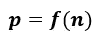

# 利用二项式分布和 Python 优化工作面试次数

> 原文：<https://towardsdatascience.com/optimizing-number-of-your-job-interviews-with-binomial-distribution-and-python-c784cb199254?source=collection_archive---------56----------------------->

## 了解如何通过使用统计方法和一点 Python 语言来优化每月的面试次数，从而最大化获得工作机会的机会。


照片由 [Cytonn 摄影](https://unsplash.com/@cytonn_photography?utm_source=medium&utm_medium=referral)在 [Unsplash](https://unsplash.com?utm_source=medium&utm_medium=referral) 上拍摄

在就业市场上，每个求职者都试图最大化他们成功的机会(获得工作机会)。他们和求职顾问之间最受欢迎的话题之一是每月活跃的申请和面试的推荐数量。时间太短意味着没有给自己足够的成功机会，而约会太多意味着不能为之做好准备。

那么，如何找到一个折中的办法呢？这就是一种特殊的统计方法发挥作用的地方——由于二项分布和一些关于我们自己的假设，我们可以优化每月的面试次数。为了做到这一点，我们必须首先了解什么是二项分布，它是用来做什么的。

它的数学公式写在下面。这里应该注意，它不是一个连续函数，在这种情况下，它被称为概率质量函数(PMF)。


二项式 PMF 公式

在哪里


这里的符号“！”表示阶乘(从 1 到阶乘数的所有整数的乘积，例如 4！表示 1*2*3*4)。这个等式计算出有多少个事件的组合。

k —期望成功的次数

n——试验次数

p —基本事件成功概率

**一般来说，二项式分布告诉你*在 n 次试验中 k 次成功的概率是多少*。**

在我们的例子中，这将是在给定的面试次数(k)后收到的工作邀请数(k)。还有一个参数——单次事件成功的概率(p)。如果在实验中是常数，我们称之为伯努利实验。这种实验最常见的例子是抛一枚公平硬币——p 是常数，等于 50%。

在我们的例子中，基本概率是成功通过每一次面试的可能性。要评估它，在没有任何先验数据的情况下，我们必须对我们的表现和机会做出一些假设。

假设你能准备好 5 次面试，你估计你有 25%的机会。随着面试次数的增加，你的准备程度会降低，机会也会减少。在你可以考虑的最大面试次数，比如说 20 次，你只给自己 5%。使用分段线性函数，我们可以绘制我们的性能曲线。因此我们的基本概率不再是常数，而是 n 的函数:



下面的代码允许我们生成值。

```
n1 = 4
p1 = 0.25
n2 = 20
p2 = 0.05slope = (p2-p1)/(n2-n1)
intercept = p1-slope*n1
kink_point = n1def performance(x):
    'Piece-wise linear performance function'
    if x<kink_point:
        return p1
    else:
        proba = intercept + slope*x
        return proba
```

我们可以把它画在图上。它以一种漂亮的图形形式展示了我们的假设。


现在我们要做的是定义我们期望的成功次数(k)——通常建议最后有不止一个工作邀请——以便在谈判阶段有一个杠杆。

所以让我们假设我们希望在月底至少有**2 个工作机会(k 个)(3 个、4 个或更多更好！).因此，我们想计算概率的总和:**

****

**如果你不加总，你会计算在月底得到 ***确切地说*** 2 份工作机会的概率是多少。**

**现在，已经定义了所有的输入，剩下的就是将这些值插入我们的等式并绘制输出。不要用手算这个！Python 的 NumPy 和 scipy 库允许我们非常方便地用几行代码进行计算。**

**它可以通过两种方式实现:使用 Numpy 库的采样技术或使用 SciPy 库中的 PMF 方法。后者更快更精确，因此我将在这里使用它。**

```
**import numpy as np
from scipy.stats import binomdef binomial_pmf(k,n,p):
    'Binomial Probability Mass function summation'
    result = 0
    for k in np.arange(k,n+1):
        result += binom.pmf(k,n,p)  # summing probabilities
    return resultdef binomial_sampling(k,n,p):
    'Binomial distribution sampling technique'
    sample_size = 100000  # number of samples
    result = sum(np.random.binomial(n,p,sample_size)>=k)/sample_size  
    return resultp_success = []  # probability of success
k = 2  # minimum desired numbers of successesns = np.arange(1,21)  # number of interviews (trials)
ps = [performance(x) for x in ns]  # elementary success probabilityfor i, n in enumerate(ns):
    p_success.append(binomial_pmf(k,n,ps[i]))**
```

**结果图(如下)告诉我们，在月末，当我们有 11 次面试时，获得 2 份工作邀请的可能性最高——大约 55%。然而，请注意，9 次和 11 次面试有相似的概率——仍然超过 50%,你可以腾出一些时间。因此，在这种情况下，你可以争取每个月有 9 到 11 次面试，以最大化你的机会。**

****

**现在，计算方案已经确定，我们可以考虑通过使用 S 形曲线来改进我们的假设，例如，使用逻辑函数代替性能曲线的分段线性函数。逻辑函数的等式是:**

****

**物流功能**

**其中:
L —最大值(饱和水平，上限)
x₀—s 形中点(曲率转换点)
K —逻辑增长率(定义斜率/陡度)**

**由于标准的逻辑函数是一个递增函数，我们希望拟合它的逆函数。此外，我们需要偏移它，这样我们就可以上下移动它来定义我们想要的概率下限——否则默认为 0。将这个函数拟合到一组给定点超出了本文的范围，但是您可以使用它的参数来得到令您满意的结果。最后，我们的等式看起来像:**

****

**偏移为 U 的反向逻辑函数**

**其中 U 是我们需要的偏移值。**

```
**def logistic_perf(x,l,k,x0,offset):
    "inverted logistic performance"
    return l/(1+np.exp(-k*(x-x0)))-offset**
```

**下面是拟合数据的示例性曲线。**

****

**最终结果如下所示。在这种情况下，求职面试的最佳次数是每月 9 次。为了仍有超过 50%的成功，你可以把目标定在每月 8 或 9 次。请注意，在 18 次面试之后，这种可能性再次上升。这是因为您的性能几乎保持不变(较低的饱和度值)，但您有越来越多的尝试。**

****

**现在你可以使用所有的变量和系数，看看哪个数字最适合你。玩得开心，祝你好运！**