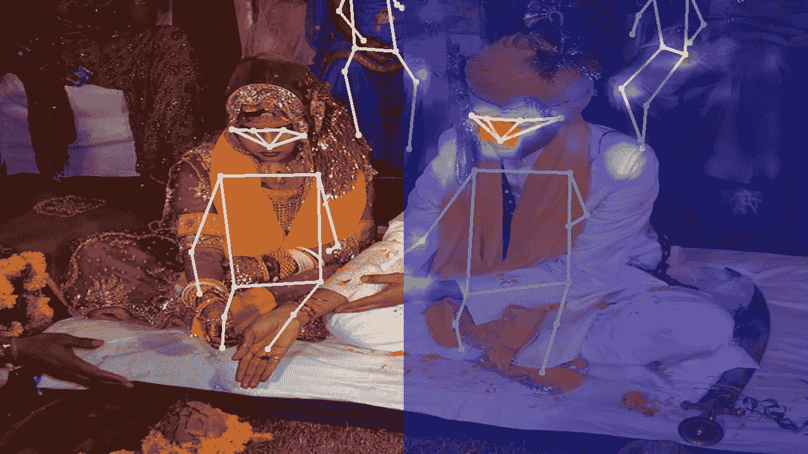
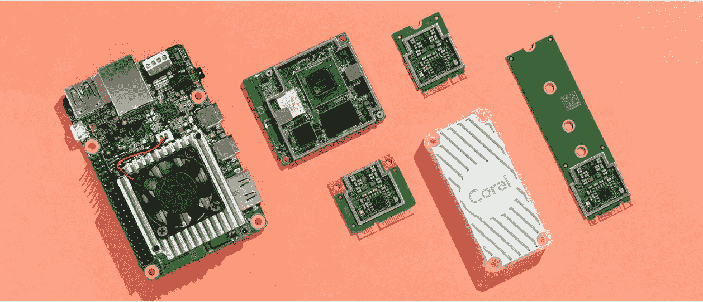
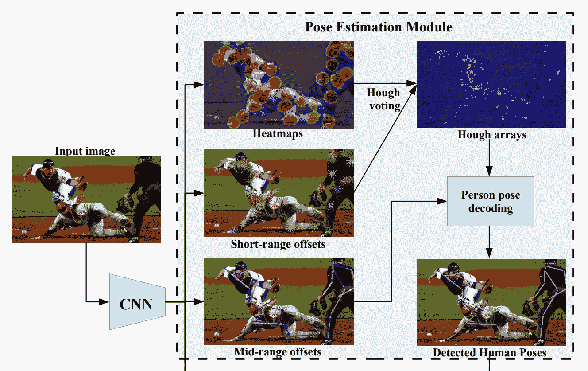
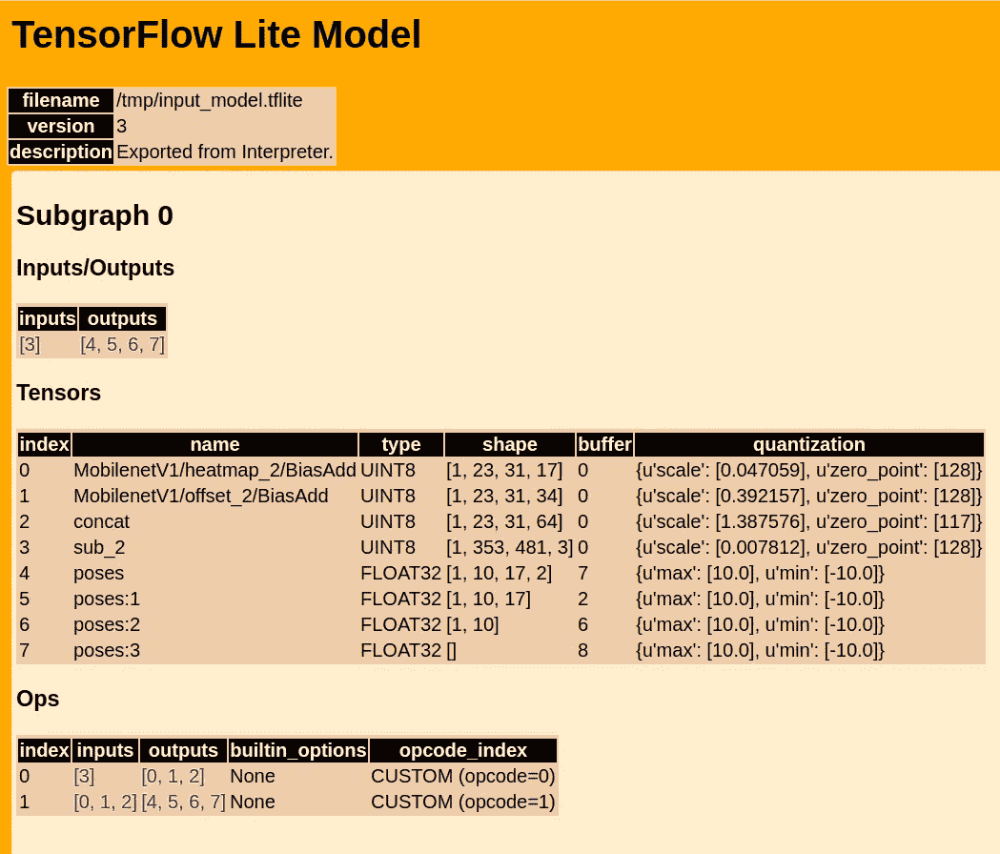
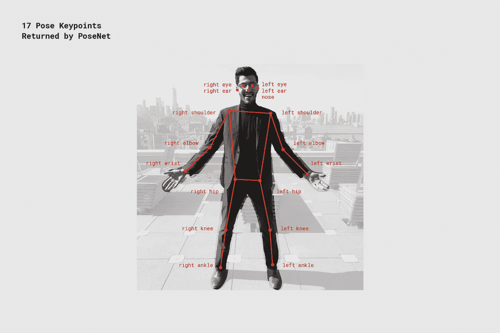
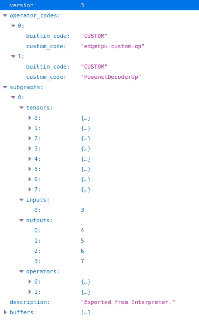
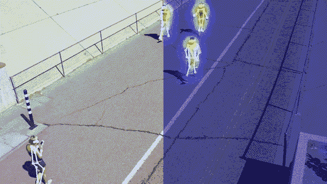

# 优化珊瑚边缘 TPU 的姿态估计

> 原文：<https://towardsdatascience.com/optimizing-pose-estimation-on-the-coral-edge-tpu-d331c63cfed?source=collection_archive---------35----------------------->

## 辅导的

## 如何访问 PoseNet 模型中的低级特征并在边缘 TPU 设备上释放姿态估计的全部潜力

2018 年，谷歌宣布发布 PoseNet 的 TensorFlow，这是一种机器学习模型，能够检测图像中的人，并估计他们身体部位的位置，这种技术被称为**姿势估计**。



由 Coral Edge TPU 加速器上运行的 PoseNet 算法估计的姿态。右侧是在边缘 TPU 模型中通常不可访问的关键点热图的叠加图。原[照片](https://en.wikipedia.org/wiki/Hindu_wedding#/media/File:Hindu_marriage_ceremony_offering.jpg) by [贾辛格拉索尔](https://en.wikipedia.org/wiki/User:Jaisingh_rathore) / [CC BY 2.5](https://creativecommons.org/licenses/by/2.5) 。

PoseNet 检测框架可用于 JavaScript([tensor flow . js](https://github.com/tensorflow/tfjs-models/tree/master/posenet))、Android/iOS 移动设备( [TensorFlow Lite](https://www.tensorflow.org/lite/models/pose_estimation/overview) )和 Edge TPU 加速器( [Google Coral](https://github.com/google-coral/project-posenet) )。

最近，我对该框架的 **Edge TPU 版本**最感兴趣，因为我一直在从事几个涉及“野外”人员检测和跟踪的项目，TPU 的 USB 版本使得在**小型嵌入式设备**上执行**实时姿态估计**成为可能，如[树莓 Pi](https://www.raspberrypi.org/products/raspberry-pi-4-model-b/) 或 [STM32P1](https://www.st.com/en/evaluation-tools/stm32mp157c-dk2.html) 平台。

**针对边缘 TPU 的 PoseNet 的限制**

Coral 工程师在打包代码和模型方面做得很好，使得开发人员可以轻松地使用 PoseNet 框架。然而，为了简化使用，一些模型参数已经被硬编码。例如，可以在图像中检测到的**个人物/姿势被限制为 10 个**。解码算法的其他参数也是硬编码的，虽然我发现默认值在许多情况下都很好，但我认为有机会通过微调一些隐藏的参数来改善姿态估计。如果你对细节感兴趣，请继续读下去。



谷歌珊瑚缘 TPU 产品，来源 [https://coral.ai](https://coral.ai/)

# **背景:波森特建筑**

PoseNet 实现基于两级架构，包括****卷积神经网络(CNN)** 和**解码算法**。**

****卷积网络**被训练生成**热图**，预测图像中所有关键点(即身体部位)的位置。它还生成**短程和中程偏移向量**，有助于在同一幅图像中出现多人时“连接这些点”。**

****解码算法**获取 CNN 生成的热图和偏移向量，并创建身体部位和人物实例之间的关联，试图确保来自同一个人的所有关键点都关联到同一实例。你可以从开发这项技术的谷歌研究团队的两份出版物[ [1](https://arxiv.org/abs/1701.01779) 、 [2](https://arxiv.org/abs/1803.08225) ]中读到所有细节。**

****

**PoseNet-source[【2】](https://arxiv.org/pdf/1803.08225.pdf)中热图、偏移和位移矢量之间的关系**

****解码算法的参数—** 在拥挤的场景中，确保身体部位和人物实例之间的正确关联是一项相当具有挑战性的任务，在拥挤的场景中，许多人可能看起来彼此紧密接触。为了在各种条件下确保最大的准确性，PoseNet 的作者提供了一些参数来控制解码算法的工作方式。**

**在计算最终输出**、**时，影响**速度**和**精度**的一些参数如下:**

*   ****最大姿态检测** —要检测的最大姿态数。**
*   ****姿势置信度阈值** — 0.0 到 1.0。在高层次上，这控制了返回的姿势的最小置信度得分。**
*   ****非最大抑制(NMS)半径** —以像素为单位的数字。在高层次上，这控制返回的姿势之间的最小距离。**

**请参见 TensorFlow 组的[中的帖子](https://medium.com/tensorflow/real-time-human-pose-estimation-in-the-browser-with-tensorflow-js-7dd0bc881cd5)以获得参数的通俗易懂的描述。通过试验实时[多姿态在线演示](https://storage.googleapis.com/tfjs-models/demos/posenet/camera.html)中的参数值，可以获得额外的见解。**

# **边缘 TPU 上的 PoseNet 实现**

**在 JavaScript 和移动实现(Android 和 iOS)中，解码算法都包含在源代码库中，参数可以在运行时更改。然而，对于 EdgeTPU 版本，代码维护人员选择了不同的方法，并决定将**解码算法作为自定义操作符**直接嵌入 TensorFlow Lite 模型中。**

> **[……]请注意，与 [TensorflowJS 版本](https://medium.com/tensorflow/real-time-human-pose-estimation-in-the-browser-with-tensorflow-js-7dd0bc881cd5)不同，我们在 Tensorflow Lite 中创建了一个自定义 OP，并将其附加到网络图本身。[……]优势在于我们不必直接处理热图，当我们通过 Coral Python API 调用该网络时，我们只需从网络中获取一系列关键点。(来源:[https://github.com/google-coral/project-posenet](https://github.com/google-coral/project-posenet))**

**虽然一方面，这种方法使得在边缘 TPU 上启动和运行 PoseNet 更容易，但另一方面，它阻止了我们调整解码参数并在精度和速度之间实现最佳平衡的可能性。例如，在 EdgeTPU 实现中，**姿势的最大数量固定为 10 个**，因此如果我们试图处理超过 10 个人的图像，我们将无法获得预期的结果。此外，如果我们要处理单姿态场景，我们可能会浪费一些 CPU 周期来解码不在图像中的姿态。**

# **访问边缘 TPU 模型中的热图和偏移向量**

**在接下来的部分中，我们将探讨一些可以用来(重新)访问卷积网络输出的步骤，看看如何“手动”解码，同时保留调整算法参数的可能性。我们将首先了解如何检查边缘 TPU 实现中可用的 PoseNet 模型，以及如何修改它们以访问卷积层产生的低级功能。**

## **步骤 1:检查原始 TFLite 模型(可选)**

**PoseNet 的珊瑚 TPU 代码库包含三个基于 MobileNet 架构的模型，并针对三种不同的图像分辨率进行了优化:**

```
1) posenet_mobilenet_v1_075_353_481_quant_decoder_edgetpu.tflite
2) posenet_mobilenet_v1_075_481_641_quant_decoder_edgetpu.tflite
3) posenet_mobilenet_v1_075_721_1281_quant_decoder_edgetpu.tflite
```

**模型以 TFLite 格式保存，可以使用 [TensorFlow 代码库](https://github.com/tensorflow/tensorflow)中包含的`visualize.py`工具检查其内容。**

**我们将把最小的模型( **353 x 481** )转换成 HTML 文件进行检查。注意，由于模型的名称很长，创建一个到它的符号链接更容易。**

```
# Create symlink to original model (353x481)
MODEL=/path/to/posenet_mobilenet_v1_075_353_481_quant_decoder_edgetpu.tflite
ln -s ${MODEL} /tmp/input_model.tflite# Convert file from TFLITE format to HTML
cd ~/tensorflow/tensorflow/lite/tools
python visualize.py /tmp/input_model.tflite /tmp/input_model.html
```

**HTML 文件包含关于模型中存在的输入/输出张量和运算符的所有信息:**

****

**用 theTensorflow 实用程序 **visualize.py** 生成的 TFLITE 模型 posenet _ mobilenet _ v1 _ 075 _ 353 _ 481 _ quant _ decoder _ edge TPU . TFLITE 的 Html 表示**

**从 HTML 文件中我们可以看到有两个操作符 **Ops** (0，1)。第一个， **Ops #0，**将在具有维度[1，353，481，3]的张量 3 内以 RGB 格式存储的原始图像作为输入。第二个操作符 **Ops #2** ，用姿态估计过程的结果产生输出张量:**

```
- Tensor 4, FLOAT32 [1, **10**, **17**, 2]...: **Keypoint coordinates** (y, x)
- Tensor 5, FLOAT32 [1, **10**, **17**]......: **Keypoint scores** - Tensor 6, FLOAT32 [1, **10**]..........: **Poses scores** - Tensor 7, FLOAT32 []...............: **Number of poses**
```

**张量 4、5、6 中的第二维度等于 10 是因为，如前一节所述，姿势的最大数量参数被硬编码为 10。张量 4 和 5 中的第三维值与 PoseNet 当前检测到的 **17 个关键点**相匹配:**

****

**PoseNet - Image source 检测到 17 个姿态关键点 [TensorFlow](https://github.com/google-coral/project-posenet)**

**如果我们想要解码 10 个以上的姿势或改变一些其他输入参数，我们将需要使用存储在以下张量中的第一个操作符 **Ops#0** 的输出:**

```
- Tensor 0, UINT8 [1, 23, 31, 17]....: **Keypoint heatmap** - Tensor 1, UINT8 [1, 23, 31, 34]....: **Keypoint offsets** - Tensor 2, UINT8 [1, 23, 31, 64]....: **Forward and backward displacement vectors (mid-range offsets)**
```

**[【2】](https://arxiv.org/pdf/1803.08225.pdf)中提供了热图、关键点偏移和位移矢量的详细描述。**

**请注意，热图的大小为`[23, 31]`，因为该特定模型使用了`OUTPUT_STRIDE = 16`，图像大小和热图大小之间的关系由以下等式给出:**

```
heatmap_height = 1 + (img_heigth - 1) / OUTPUT_STRIDE
heatmap_width = 1 + (img_width - 1) / OUTPUT_STRIDE
```

## **步骤 2:获取热图、偏移量和位移向量**

**TFLite 模型使用 [Google Flatbuffer](https://github.com/google/flatbuffers) 协议文件格式序列化到磁盘。在大多数情况下，处理这种格式所需的工具链必须从源代码安装(参见本 [StackOverflow 帖子](https://stackoverflow.com/questions/55394537/how-to-install-flatc-and-flatbuffers-on-linux-ubuntu)中的说明作为示例)。安装完成后，您将可以访问`flatc`模式编译器，该编译器支持从 TFLite 格式到 JSON 的转换，反之亦然。转换所需的模式文件可在 tensor flow repo([schema . FBS](https://github.com/tensorflow/tensorflow/blob/master/tensorflow/lite/schema/schema.fbs))中获得，应在具有以下语法的调用中使用:**

```
# Converts from TFLITE to JSON
SCHEMA=~/tensorflow/tensorflow/lite/schema/schema.fbsflatc -t --strict-json --defaults-json -o /tmp ${SCHEMA} -- /tmp/input_model.tflite
```

**下图显示了 JSON 输出中包含的数据的概要，它与我们在 HTML 表示中已经看到的内容相匹配:**

****

**JSON 文件相当大(~25MB)，不容易“手动”编辑。但是我们可以用一些简单的 Python 代码来操作它，如下所示。其思想是移除自定义算子解码算法(Ops #1)、任何未使用的张量，并确保模型输出由张量[0，1，2](热图、偏移和位移向量)给出。**

**用于修改 TFLITE 模型的 Python 脚本**

**最后，我们使用与第一步转换相同的`flatc`实用程序将输出从 JSON 格式转换回 TFLite 格式:**

```
# Converts from TFLITE to JSON
SCHEMA=~/tensorflow/tensorflow/lite/schema/schema.fbsflatc -c -b -o /tmp ${SCHEMA} /tmp/output_model.json
```

**转换的结果现在应该可以在`output_model.tflite`(你可能想给它一个更具体的名字)flatbuffer 文件中找到。我们可以验证当我们从 TensorFlow 加载这个模型时，它会产生三个具有预期大小的输出张量:**

**输出张量的大小与预期尺寸相匹配:**

```
Output #0, UINT8 [1, 23, 31, 17]....: **12121** elements (heatmap)Output #1, UINT8 [1, 23, 31, 34]....: **24242** elements (offsets)Output #2, UINT8 [1, 23, 31, 64]....: **45632** elements (disp. vectors)
```

**到目前为止，一切顺利……:-)**

# **解码热图和偏移向量**

**我们现在准备好了过程的最后一步，包括从模型中获取新的输出(热图、偏移和位移向量)并提取姿态。**

**正如介绍中提到的，PoseNet 的 JavaScript 和 Android/iOS 版本都包含解码算法的实现。谷歌没有发布相同算法的官方 Python 实现，但幸运的是，我们可以依赖 GitHub 上辉煌项目 [**PoseNet-Python**](https://github.com/rwightman/posenet-python) 中可用的非官方端口。**

**从 PoseNet 的 JavaScript 版本移植而来的代码位于文件`[decode_multi.py](https://github.com/rwightman/posenet-python/blob/master/posenet/decode_multi.py)`中，该文件包含一个带有以下签名的函数:**

```
def decode_multiple_poses(
        scores, offsets, displacements_fwd, displacements_bwd,
        output_stride, max_pose_detections=10, score_threshold=0.5,
        nms_radius=20, min_pose_score=0.5):
```

**在上面的函数中，第一个参数`scores`代表关键点热图，而偏移和位移向量(向前和向后)与我们之前讨论的张量相匹配。**

**让这个函数起作用的唯一棘手的部分是正确地预处理热图，并重塑位移向量，以匹配`decode_multiple_pose`函数所期望的格式。下面的代码片段包含函数`extract_outputs`，它负责将修改后的 TFLite 模型的输出转换成可以直接传递给解码函数的格式。**

**演示如何解码修改后的 TFLite 模型的输出的最小工作示例。注意，我们现在可以访问解码算法的所有参数。**

# **结论**

**这篇文章展示了如何检查一个边缘 TPU TFLite 模型，并改变它，以获得在一个 PoseNet 模型卷积层的输出。它还显示了如何利用解码算法的参数来获取该输出并提取姿态。我打算写一篇后续文章，探索在基于姿态估计的真实世界计算机视觉应用中改变这些参数的影响。如果您有想法或建议，请留下评论或通过 [Stura.io](https://stura.io) 联系我。**

****

**具有重叠关键点热图的姿态检测输出(右半部分)**

# **参考**

**[1] G .帕潘德里欧*等人*。，[野外多人姿态精确估计](https://arxiv.org/abs/1701.01779) (2017)，CVPR 论文集。**

**[2] G .帕潘德里欧*等人*。， [PersonLab:利用自下而上、基于部分的几何嵌入模型进行人物姿态估计和实例分割](https://arxiv.org/abs/1803.08225) (2018)。**