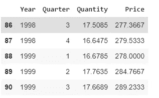
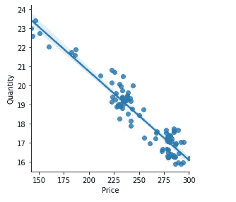
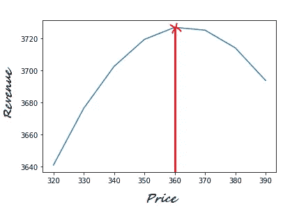
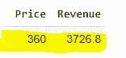

# 使用回归优化产品价格

> 原文：<https://towardsdatascience.com/optimizing-product-price-using-regression-2c17688e65ea?source=collection_archive---------7----------------------->

## 应用数据科学

## 收益最大化价格优化的 Python 实现


照片由 [Maddi Bazzocco](https://unsplash.com/@maddibazzocco?utm_source=medium&utm_medium=referral) 在 [Unsplash](https://unsplash.com?utm_source=medium&utm_medium=referral) 上拍摄

价格和数量是决定每项业务底线的两个基本指标，设定正确的价格是一家公司可以做出的最重要的决定之一。如果消费者愿意多付钱，定价过低会损害公司的收入，另一方面，如果消费者不愿意以更高的价格购买产品，定价过高也会以类似的方式损害公司的收入。

因此，考虑到价格和销售之间的微妙关系，最大化产品销售和赚取最多利润的最佳点——最佳价格——在哪里呢？

本文的目的是通过在 Python 环境中实现经济理论和回归算法的结合来回答这个问题。

# 1.数据

我们是根据历史价格和销量的关系来优化一个未来价格，所以首先需要的是这两个指标的过往数据。在这个练习中，我使用了历史[牛肉销售和相应单价](https://raw.githubusercontent.com/susanli2016/Machine-Learning-with-Python/master/beef.csv)的时间序列数据。

```
# load data
import pandas as pd
beef = pd# view first few rows
beef.tail(5
```



该数据集包含总共 91 个按季度报告的数量-价格对观察值。

数据科学中通常会进行探索性数据分析(EDA)，但我将跳过这一部分，专注于建模。然而，我强烈建议采取这一额外的步骤，以确保您在构建模型之前理解了数据。

# 2.图书馆

我们需要导入库有三个原因:操作数据、构建模型和可视化功能。

我们正在导入用于创建和操作表格的`numpy`和`pandas`，用于可视化的`mtplotlib`和`seaborn`，以及用于构建和运行回归模型的`statsmodels` API。

```
import numpy as np
from pandas import DataFrame
import matplotlib.pyplot as plt
import seaborn as sns
from statsmodels.formula.api import ols
%matplotlib inline
```

# 2.定义利润函数

我们知道收入取决于销售量和产品的单价。

我们也知道利润是通过从收入中扣除成本计算出来的。

将这两者放在一起，我们得到以下等式:

```
# revenue
revenue = quantity * price # eq (1)# profit
profit = revenue - cost # eq (2)
```

我们可以结合 eq 改写利润函数。#1 和# 2 如下:

```
# revised profit function
profit = quantity * price - cost # eq (3)
```

等式 3 告诉我们，我们需要三条信息来计算利润:数量、价格和成本。

# 3.定义需求函数

我们首先需要建立数量和价格之间的关系——需求函数。这个需求函数是根据价格和数量之间的线性关系从“需求曲线”中估算出来的。

```
# demand curve
sns.lmplot(x = "Price", y = "Quantity", 
data = beef, fig_reg = True, size = 4)
```



为了找到需求曲线，我们将拟合一个普通最小二乘(OLS)回归模型。

```
# fit OLS model
model = ols("Quantity ~ Price", data = beef).fit()# print model summary
print(model.summary())
```

以下是回归结果，带有进一步分析所需的必要系数。


# 5.寻找利润最大化的价格

我们正在寻找的系数来自上面的回归模型——截距和价格系数——来测量相应的销售量。我们现在可以将这些值代入等式 3。

```
# plugging regression coefficients
quantity = 30.05 - 0.0465 * price # eq (5)# the profit function in eq (3) becomes
profit = (30.05 - 0.0465 * price) * price - cost # eq (6)
```

下一步是从一系列选项中找到我们想要的价格。下面的代码应该是直观的，但基本上我们在这里做的是计算每一个价格和相应的销售数量的收入。

```
# a range of diffferent prices to find the optimum one
Price = [320, 330, 340, 350, 360, 370, 380, 390]# assuming a fixed cost
cost = 80Revenue = []for i in Price:
   quantity_demanded = 30.05 - 0.0465 * i

   # profit function
   Revenue.append((i-cost) * quantity_demanded)# create data frame of price and revenue
profit = pd.DataFrame({"Price": Price, "Revenue": Revenue})#plot revenue against price
plt.plot(profit["Price"], profit["Revenue"])
```

如果绘制价格和收入，我们可以直观地识别收入的峰值，并找到使收入位于曲线最高点的价格。



因此我们发现，当价格设定为 360 美元时，不同价格水平下的最大收益达到 3726 美元。

```
# price at which revenue is maximum
profit[profit['Revenue'] == profit[['Revenue'].max()]
```



## 总结和结论

本文的目的是演示如何结合使用经济理论和统计建模来找到收入或利润最大化的价格。在最初的步骤中，我们定义了需求和利润函数，然后运行回归来找到需要输入利润/收入函数的参数值。最后，我们检查了不同价格水平下的收入，以获得相应的最大收入价格。