# 优化星巴克应用产品

> 原文：<https://towardsdatascience.com/optimizing-starbucks-app-offers-e9f10689972?source=collection_archive---------25----------------------->

## 利用机器学习创造个性化的客户体验

韦斯利·麦克拉克伦在 [Unsplash](https://unsplash.com/?utm_source=unsplash&utm_medium=referral&utm_content=creditCopyText) 上的照片

# 介绍

除了是[世界上最大的咖啡馆公司](https://knoema.com/infographics/kchdsge/number-of-starbucks-stores-globally-1992-2020#:~:text=(3%20February%202020)%20Today%20Starbucks,Coffee%20with%20nearly%201%2C700%20stores)，星巴克还因其奖励计划而臭名昭著。今年早些时候，他们的会员基础增加了创纪录的 140 万名客户，截至本季度末，美国共有 1890 万名活跃会员，同比增长 16%。随着其技术倡议 [Deep Brew](https://www.qsrmagazine.com/fast-food/why-ai-differentiator-future-starbucks) 的推出，星巴克不断构思和开发一套人工智能工具，以提升他们业务的各个方面。

那么星巴克到底做对了什么？可以实施什么来实现收益最大化？这些是我试图更好地理解的一些问题，将在这篇博客中探讨。通过回答这些问题，星巴克可以瞄准更有可能兑现优惠的客户，这将降低促销成本，并最大限度地提高优惠收入。成功地将优惠瞄准合适的用户还会带来增强的个性化体验，这反过来会提高客户保留率。

# 目标

在本帖中，我们将分析模拟数据，模拟真实顾客在星巴克奖励应用上的购买行为。我们将探究交易、人口统计和报价数据，以揭示消费者行为趋势。这些趋势将被用于建立一个预测报价成功的机器学习模型。目标是向更有可能响应的用户发送促销信息，并且只向他们发送有较高兑现概率的优惠。

# 数据集

由 [Udacity](https://www.udacity.com/course/data-scientist-nanodegree--nd025?utm_source=gsem_brand&utm_medium=ads_n&utm_campaign=2045115106_c&utm_term=77922608608&utm_keyword=udacity%20data%20science%20nanodegree_e&gclid=EAIaIQobChMI_cjDz7q06wIVw9SzCh20og-pEAAYAiAAEgKG3vD_BwE) 提供的星巴克数据集包含来自[星巴克奖励移动应用](https://www.starbucks.com/coffeehouse/mobile-apps)的人口统计、报价和交易数据。同样的数据集可以在 Kaggle 上的[这里](https://www.kaggle.com/blacktile/starbucks-app-customer-reward-program-data)找到。请随意下载这些并跟随！

星巴克每隔几天就会通过手机应用程序向用户发送一次优惠信息。这些优惠可以是广告、折扣或买一送一(BOGO)促销。并非所有用户都收到相同的促销信息，每个用户的优惠频率也各不相同。数据包含在三个文件中，模式如下:

**portfolio.json** —包含报价 id 和关于每个报价的元数据(持续时间、类型等)。)

*   id(字符串)—优惠 id
*   offer_type (string) —优惠的类型，如 BOGO、折扣、信息
*   难度(int) —完成报价所需的最低花费
*   奖励(int) —为完成一项提议而给予的奖励
*   duration(int)-报价开放的时间，以天为单位
*   频道(字符串列表)
*   profile.json —每个客户的人口统计数据
*   transcript.json 记录交易、收到的报价、查看的报价和完成的报价

**profile.json** —每个客户的人口统计数据

*   年龄(整数)—客户的年龄
*   成为会员日期(整数)—客户创建应用程序帐户的日期
*   性别(str) —客户的性别(请注意，有些条目包含“O”代表其他，而不是 M 或 F)
*   id (str) —客户 id
*   收入(浮动)—客户的收入

**transcript.json** —记录交易、收到的报价、查看的报价和完成的报价

*   事件(str) —记录描述(即交易、收到的报价、查看的报价等。)
*   人员(字符串)—客户 id
*   时间(整数)—测试开始后的时间，以小时为单位。数据开始于时间 t=0
*   value —(字符串字典)—报价 id 或交易金额，具体取决于记录

# **挑战**

这些数据中存在几个挑战:

1.  底层模拟器只有一种产品，而星巴克卖几十种。这种简化使我们的分析更容易，但由于缩放限制了现实世界的应用。
2.  交易不能直接链接到已兑现的优惠。客户不会选择他们收到的报价。使用该应用程序的人可能会在没有收到或看到报价的情况下通过该应用程序进行购买。
3.  结果并不代表个人层面的用户行为。用户以不同的频率收到不同的促销，有些人可能几周都收不到优惠。数据集不考虑这种变化。

鉴于数据集的局限性，清理和数据预处理对于揭示消费者行为趋势和建立预测模型至关重要。

# 路标

我们的分析将遵循这个大纲:

1.  数据评估和清理
2.  探索性数据分析
3.  数据可视化
4.  预测建模
5.  总结想法

# 1.数据评估和清理

## 投资组合评估:

让我们从评估投资组合数据集开始。在我们对该数据帧的初步观察中，我们可以看到“通道”可以被分成单独的列，以便更好地进行分析。我们还可以将“id”列重命名为“offer_id”

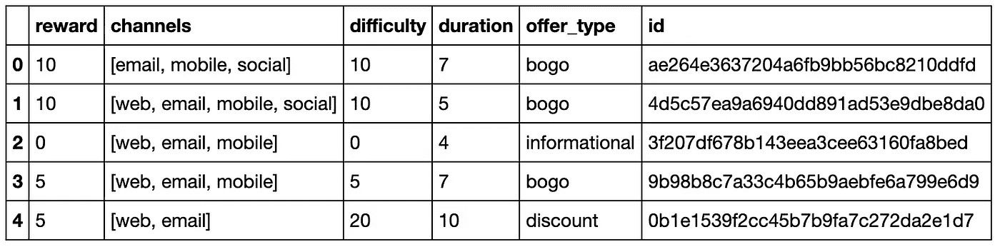

原始投资组合数据框架

## 投资组合清理步骤:

*   将“频道”分成不同的列
*   将“id”列重命名为“offer_id”

干净的数据集应该如下所示:

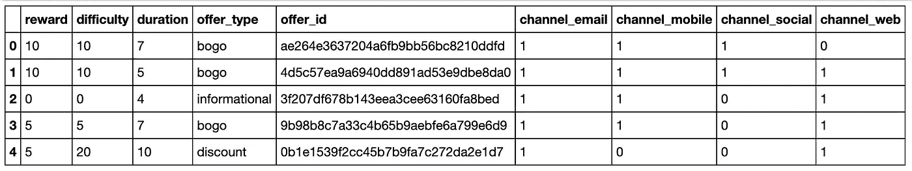

清理的投资组合数据框架

## 简介评估:

转到配置文件数据集，我们再次看到，将“id”列重命名为“customer_id”会更清楚性别也可以转换成数字，或者可以分隔成列。“成为成员日期”应该是可读的日期格式。虽然 118 是一个可能的剖面年龄，但在绘制分布图时，我们可以看到这个值是一个异常值。没有介于 101 岁和 118 岁之间的年龄。基于该分布和该年龄差距，我们可以推断这是用户输入错误，并用 NaN 替换该值。我们也可以删除缺少年龄、性别和收入数据的行。

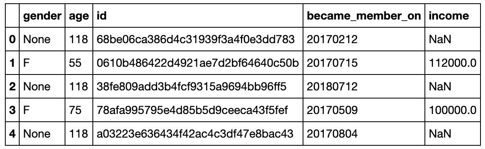

原始轮廓数据集

## 轮廓清洗步骤:

*   删除缺少年龄、性别和收入的行
*   将“年龄”值 118 替换为 NaN
*   将' date '从 int 转换为 datetime dtype
*   将“成为成员”转换为日期时间格式
*   将“id”列重命名为“customer_id”
*   使用虚拟变量创建性别列

清理后的配置文件数据帧应如下所示:

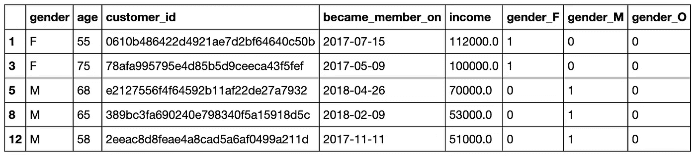

已清理的配置文件数据集

## 成绩单评估:

对于副本数据，我们可以将“person”列重命名为“customer_id”“值”列可以分为 offer_id 和 amount 列。“事件”列也可以按报价类型和交易分成几列。由于我们在清理的配置文件数据帧中有一个“customer_id”列，我们可以删除配置文件数据集中没有的副本客户 id。

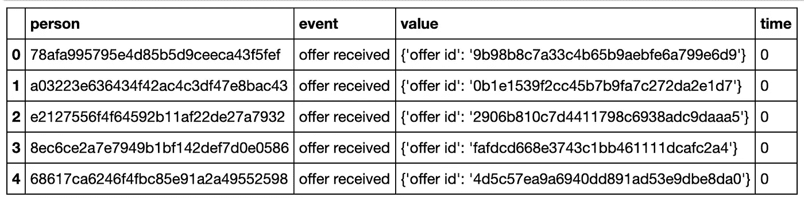

原始转录数据帧

## 抄本清理步骤:

*   将“人员”列重命名为“客户标识”
*   拆分“值”列以创建 offer_id 和金额列
*   拆分“事件”列以根据报价和交易创建列
*   删除配置文件数据集中不存在的 customer_id 值
*   删除重复项

清理后的转录数据集应该如下所示:

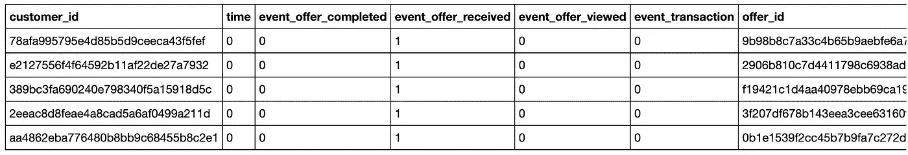

已清理的转录数据帧

## 合并已清理的数据帧以进行探索性数据分析:

在下一节中，我们要探索所有变量，所以让我们合并这些数据帧。在查看优惠 id 时，我们可以看到有 10 种优惠:

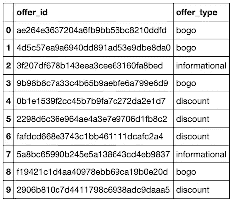

按优惠类型列出的优惠 ID

在这里，我们可以看到 10 个不同的优惠 id 及其相关的优惠类型。让我们把它们重新命名为:' bogo_1 '，' bogo_2 '，' discount_1 '，' info_1 '等等。最后，让我们合并清理过的数据集。合并的数据帧应具有以下品质:

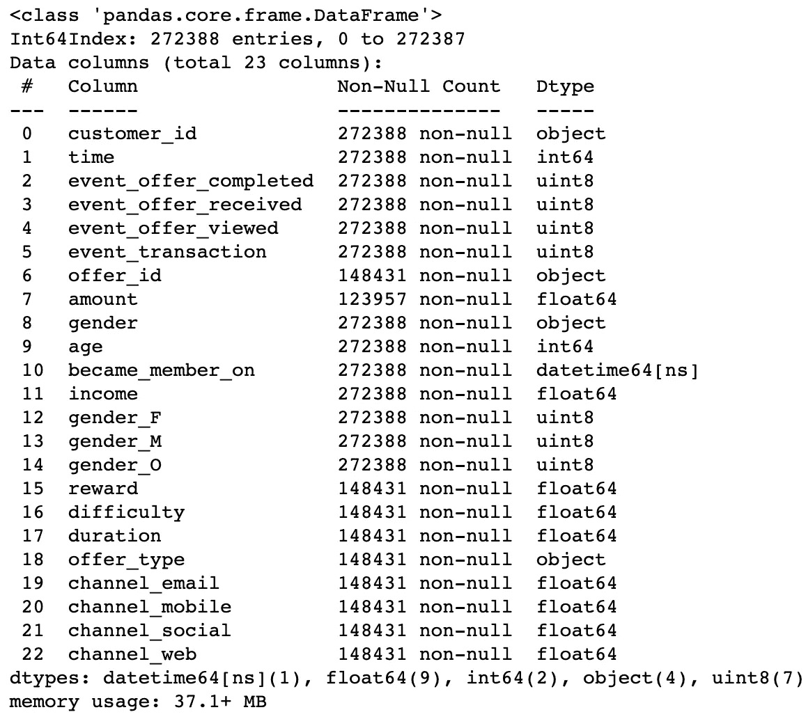

汇总的个人资料、投资组合和交易数据

# 2.探索性数据分析

现在有趣的部分，让我们来看看一些趋势。当查看合并的数据帧中的形状和时间列时，我们可以看出该实验运行了 30 天，收集了 272，388 个事件。

## I .在实验过程中向用户提供分发的类型和 id

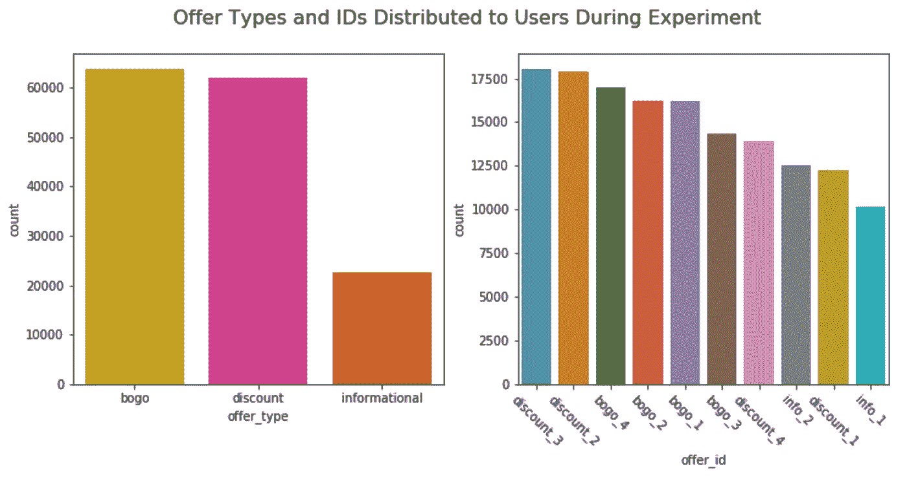

发送给用户的优惠类型和优惠 id

*   BOGO 是分布最广的促销活动，有 63，676 名用户获得了这项特别优惠。折扣促销是第二受欢迎的(62，095)，信息优惠是最不常见的(22，660)。
*   “discount_3”是发送给 18，016 个用户的最常见的优惠，其次是“discount _ 2”(17，881)。分发最少的推广是“info_1”，发送给了 10，144 个用户。

到目前为止，我们已经查看了在这 30 天内发送给用户的报价。让我们构建一个数据框架，通过聚合交易、报价和人口统计数据来分析客户行为。

## 构建客户数据框架的步骤:

1.  获取每个客户的优惠类型数据
2.  获取每个客户的优惠 id 数据
3.  分组年龄和收入，以便更好地显示(年龄四舍五入到第 10 位的第 5 位，收入四舍五入到较低的第 10000 位)
4.  通过合并提取的变量、人口统计数据、报价和交易数据来构建数据框架(merged_cust)

生成的 merged_cust 数据帧应具有以下品质:

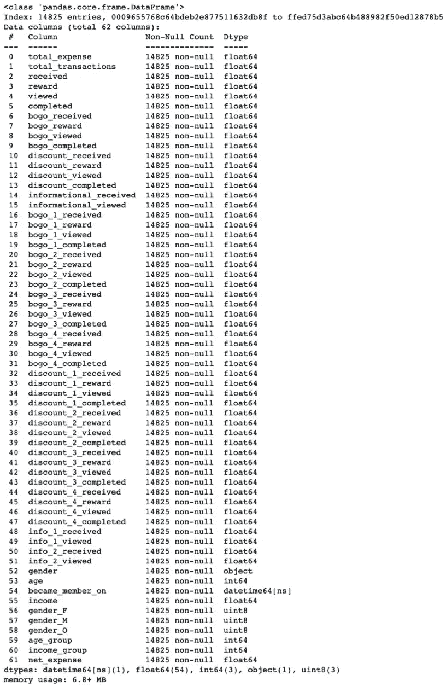

客户数据框架模式

## 二。按性别、年龄和收入分布划分的平均客户支出

从这里开始，我们可以使用客户数据框架来绘制以下变量:

1.  性别计数和平均支出
2.  年龄分布和平均支出
3.  收入分配和平均支出

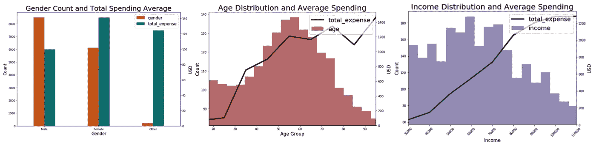

按性别、年龄和收入分布划分的平均客户支出

*   从这些图中，我们可以看到数据集包含 8，484 名男性、6，129 名女性和 212 名其他性别的用户。虽然大多数用户是男性，但女性花费更多，平均支出总额为 140.91 美元。其他性别的平均总支出为 124.32 美元，男性为 99.59 美元。
*   大多数用户在 50-70 岁年龄组。随着年龄的增长，用户花费更多。
*   55，000-78，000 美元的工资范围在用户中最常见。收入越高的人花费越多。

# 3.数据可视化

## I .按优惠类型和人口统计数据分列的消费模式

我们的探索性发现揭示了人口消费趋势和优惠类型。让我们从客户数据框架中按报价提取客户行为，并完成以下步骤:

1.  获取已收到但未查看优惠、已查看但未完成优惠以及已查看并完成优惠的用户的数据，按“已收到”、“已查看”和“已完成”分组
2.  获取已收到但未查看优惠、已查看但未完成优惠以及已查看并完成优惠的客户的平均费用，按列分组
3.  按已收到、查看并完成报价的客户绘制平均交易价值图(对所有三种报价类型都这样做)

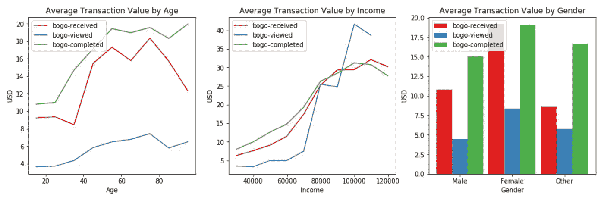

BOGO 提供的人口统计支出趋势

*   随着年龄的增长，BOGO 的报价以更高的交易价格完成
*   收入较高的用户在兑换 BOGO 优惠时会花更多的钱
*   女性在 BOGO 提供的每笔交易中花费最多

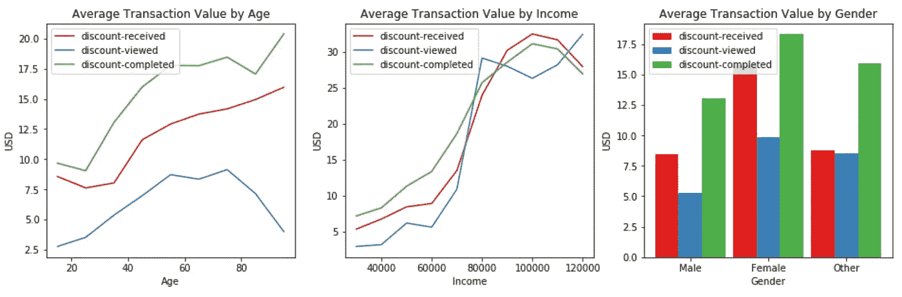

按折扣优惠划分的人口统计支出趋势

*   70 岁以上的用户不经常查看折扣
*   已查看和已完成折扣的平均交易价值随着年龄的增长而增加
*   折扣优惠的交易额随着收入的增加而增加
*   女性在每次交易中为折扣优惠花费最多

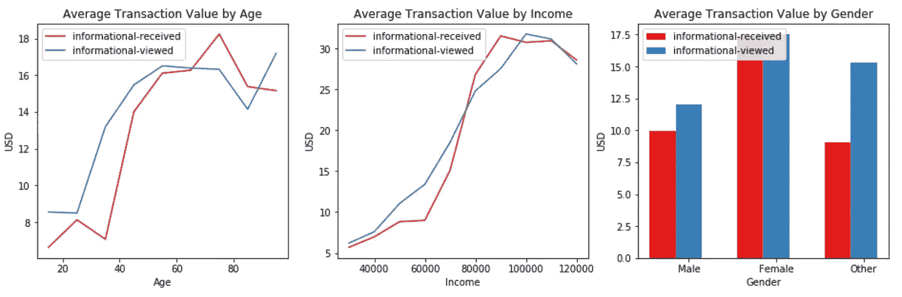

按信息提供的人口统计支出趋势

*   信息要约的平均交易价值从 35-75 岁开始增加，在 75-80 岁之间下降，然后略有增加
*   交易价值随着薪水的增加而增加，超过 90，000 美元后开始下降
*   女性在每笔交易中花费的钱比男性和其他性别的人都多

## 二。10 大优惠

在我们对合并数据框架的初步评估中，我们发现了 10 个不同的报价 id。让我们按照以下步骤来看看他们在收入方面的排名:

1.  获取已查看并完成报价的客户的净费用
2.  根据导致最高净费用的出价对出价进行排序

打印结果显示以下报价排名:

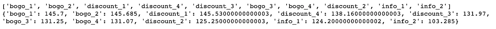

从最高收入到最低收入排列的最高报价

*   “bogo_1”报价返回的最大值为每位客户平均收入 145.70 美元。“bogo _ 2”(145.69 美元)和“discount _ 1”(145.53 美元)的报价分别位居第二和第三。“info_2”报价带来的收入最少，平均每位客户 103.29 美元。

## 三。按出价列出的成功百分比

我们可以通过定义一个按 ID 聚合已完成要约的函数来评估每个要约的成功百分比。让我们继续编写这个函数。

现在，我们可以按报价类型绘制成功率。让我们也画出要约类型计数，看看计数和成功率之间是否有任何关联。

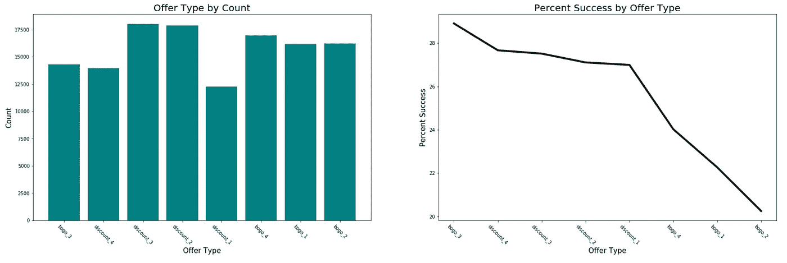

优惠类型计数和成功百分比

*   从这些图中，我们可以看到“bogo_3”报价的成功率最高，为 28.91%，其次是“discount _ 4”(27.67%)和“discount _ 3”(27.51%)。成功率最低的报价是“bogo_2 ”,成功率为 20.25%。
*   结果并没有暗示要约计数和成功率之间的关联。我们看到‘bogo _ 4’、‘bogo _ 1’和‘bogo _ 2’的数量急剧下降，尽管数量保持相对稳定。

# 4.预测建模

现在，我们将使用我们分析中确定的客户消费趋势来建立一个模型，预测用户是否会对优惠做出反应。向用户发送促销信息的过程需要人工，并且是组织的一项成本。如果星巴克实现了预测模型，他们可以缓解这些资源，同时确保促销活动发送给历史上与优惠互动的客户，并且只有高成功率的优惠才会发送给他们。兑换优惠数量的增加和内部资源使用的减少将使星巴克的收益最大化。

## 一.数据预处理

虽然最初的清理对于我们的分析来说已经足够了，但是需要将数据转换成用于培训的有用且高效的格式。我们还将删除与我们的模型不相关的功能。每个数据集的预处理步骤概述如下:

**投资组合 _ 建模**

*   复制 portfolio_clean 并重命名为 portfolio_modeling
*   独热编码通道
*   一次性编码 offer_type 列

**简介 _ 造型**

*   复制 profile_clean 并重命名为 profile_modeling
*   转换成数值
*   标准化同质性

**交易 _ 建模**

*   从抄本中提取交易 _clean

**报价 _ 建模**

*   从抄本 _clean 中提取聘用相关数据
*   一键编码提供事件

**建模 _df**

*   将所有数据集合并到单个建模 _df 中
*   这将用于训练和建立模型
*   删除“时间”、“客户标识”、“电子邮件”、“信息”、“已接收”、“已查看”和“已完成”列

最终的数据帧应该如下所示:

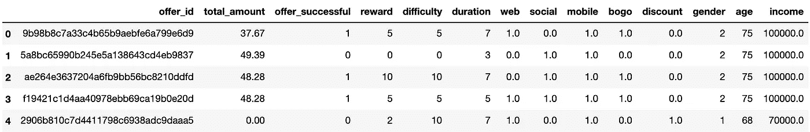

**分成训练和测试数据集**

现在，让我们将数据分为训练和测试数据集，并通过评估测试数据性能指标来确保模型不会过度拟合数据。

## **评估朴素预测器性能:**

朴素分类器假设所有报价都是成功的，并作为基础模型。我们可以使用朴素预测器性能来比较我们将构建的机器学习算法。让我们看看性能指标:

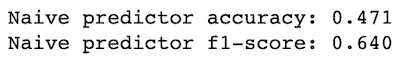

朴素预测器性能指标

天真的分类器显示有 64%的成功机会。

## 二。逻辑回归模型

[逻辑回归模型](https://ml-cheatsheet.readthedocs.io/en/latest/logistic_regression.html)构建一个线性决策边界来区分成功和不成功的报价。让我们使用 liblinear clf 作为 RandomizedSearchCV 中的估计器来构建这个模型，以拟合训练数据。

现在让我们定义模型性能评估函数:

## 评估逻辑回归模型性能:

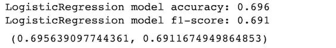

逻辑回归性能指标

模型性能评估表明，逻辑回归模型的准确性和 f1 值优于朴素预测。

## 精确度:

*   朴素预测值:0.471
*   逻辑回归:0.696

## F1 分数:

*   朴素预测值:0.640
*   逻辑回归:0.691

逻辑回归模型构建了一个线性决策边界，区分成功和不成功的提议。然而，对用户人口统计和报价类型的探索性分析表明，决策边界是非线性的。为此，集合方法[随机森林和梯度推进](https://medium.com/@aravanshad/gradient-boosting-versus-random-forest-cfa3fa8f0d80)将在接下来建立和测试。

## 三。随机森林分类器模型

随机森林使用多个决策树，并使用数据的随机样本独立训练每棵树。让我们构建一个随机森林模型，它使用 n_estimators、max_features、max_depth、min_samples_split 和 min_samples_leaf 作为调整参数，并使用 RandomizedSearchCV 进行拟合:

## 评估随机森林模型性能:

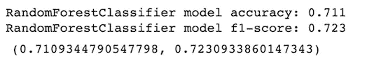

随机森林分类器性能度量

结果表明，随机森林模型的准确性和 f1 值优于朴素预测模型

## 精确度:

*   朴素预测值:0.471
*   随机森林:0.711

## F1 分数:

*   朴素预测值:0.640
*   随机森林:0.723

## 四。估计特征重要性

特征重要性指的是描述特征对构建最大化其评估度量的模型的贡献的数值。随机森林分类器是在训练期间估计特征重要性的模型。让我们使用 scikit-learn 中实现的要素重要性算法来检索每个输入要素的相关重要性分数:

现在，让我们根据随机森林来绘制估计的要素重要性:

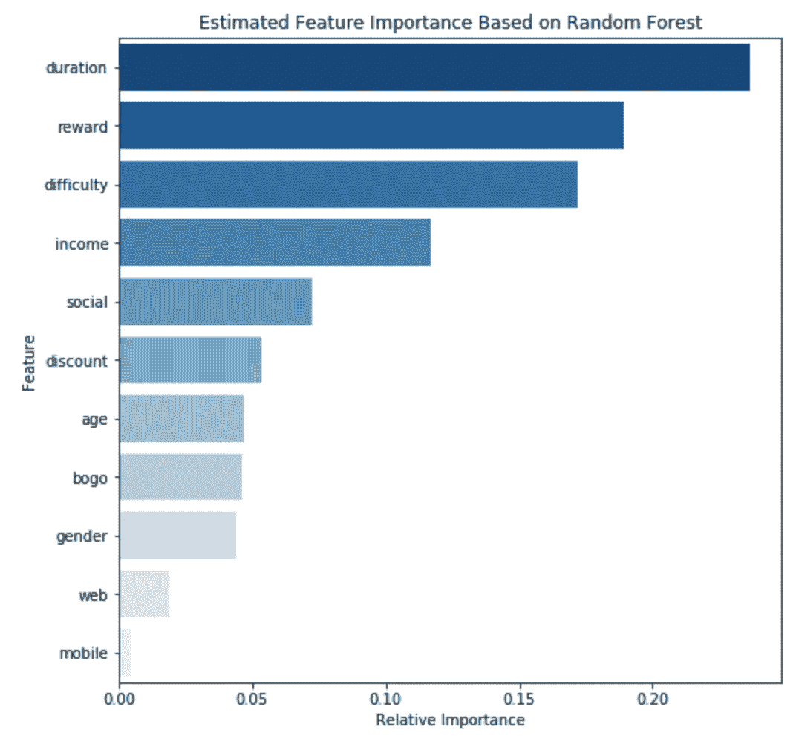

通过随机森林估计特征重要性

客户报价有效性培训数据表明，基于重要性的前五大特征是:

1.  持续时间(优惠在到期前运行多长时间)
2.  奖励(兑换优惠时客户获得的星级)
3.  难度(兑换优惠所需的最低消费)
4.  收入
5.  社交(社交媒体上的广告)

我们可以使用该特征重要性排序，通过选择具有最高分数的特征并移除具有最低分数的特征来改进我们的预测模型。

## 动词 （verb 的缩写）梯度推进分类器

梯度增强一次构建一棵树，其中每个新树都有助于纠正先前训练的树所犯的错误。让我们使用随机网格和 loss、learning_rate、n_estimators、min_samples_leaf 和 min_samples_split 参数来构建这个模型，以便使用 RandomizedSearchCV:

## 评估梯度推进模型性能:

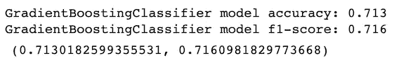

梯度提升分类器性能度量

结果表明，梯度推进模型的准确性和 F1 值优于朴素预测

## 准确(性)

*   朴素预测值:0.471
*   梯度推进:0.713

## f1-分数

*   朴素预测值:0.640
*   梯度推进:0.716

## 不及物动词选择最佳模型

## **基于训练数据准确度的模型排名**

1.  GradientBoostingClassifier 模型精度:0.713
2.  RandomForestClassifier 模型精度:0.711
3.  逻辑回归模型精度:0.696
4.  朴素预测准确度:0.471

## **基于训练数据 f1-得分的模型排名**

1.  随机森林分类模型 f1-得分:0.723
2.  梯度增强分类器模型 f1-得分:0.716
3.  物流回归模型 f1-得分:0.691
4.  原始预测值 f1-得分:0.640

结果表明，梯度推进模型具有最好的精度，随机森林模型具有最好的 f1 值。

## **准确度&f1-得分**

在理想的情况下，最好的模型应该具有最高的[准确度和 f1 值](https://blog.exsilio.com/all/accuracy-precision-recall-f1-score-interpretation-of-performance-measures/)。既然事实并非如此，让我们评估两个性能指标，以确定最佳的调优和优化模型:

*   准确度是正确预测的观测值与总观测值的比率。高精度不一定表示最好的模型。在评估误报和漏报值几乎相同的对称数据集时，精确度最高。评估最佳模型需要额外的参数。对于我们的梯度推进模型，精度是 0.713，这意味着该模型大约 71.3%准确。
*   F1-score 是精度(正确预测的正面观察值/预测的正面观察值+总预测的正面观察值)和召回率(正确预测的正面观察值/所有观察值+总假阴性观察值)的加权平均值。由于 f1 分数同时考虑了假阳性和假阴性，因此通常更准确。如果假阳性和假阴性具有相似的成本，则准确性最好。如果假阳性和假阴性的成本非常不同，那么最好看看 f1 值，因为它包含了精确度和召回率。

## **梯度推进与随机森林分类**

## **优势**

***渐变增强:***

*   高性能的
*   可用于解决几乎所有的目标函数，包括排序和泊松回归，这在随机森林分类中很难实现

***随机森林:***

*   更容易调整，因为通常有两个参数(树的数量和每个节点上要选择的特征的数量)
*   不太可能过度拟合模型

## **弱点**

***渐变增强:***

*   对过度拟合更敏感，尤其是在有噪声数据的情况下
*   因为树是按顺序建立的，所以训练需要更长的时间
*   比随机森林更难调整，因为通常有三个参数(树的数量、树的深度和学习率)

***随机森林:***

*   由于大量的树，实时预测缓慢
*   对于包含分类变量的数据不可靠(偏向于具有更多级别的属性)
*   对于包含相关要素组的数据不可靠(算法倾向于较小的组而不是较大的组)

由于此分析中的用户数据是不对称的，f1 分数将用于确定最佳模型。给定最佳 f1 分数，随机森林模型将用作此分析剩余部分的最佳模型。这种模型也最有意义，因为随机森林通常会产生训练速度很快的高质量模型。随机森林可以高效地处理大量训练数据，因此它非常适合未来在星巴克 1890 万活跃用户的大数据下处理多类问题。

## 七。调整超参数

让我们首先构建一个根据性能对所有模型进行排序的数据框架，来调整我们的随机森林模型。从这个数据集，让我们打印模型的最佳超参数。

输出:

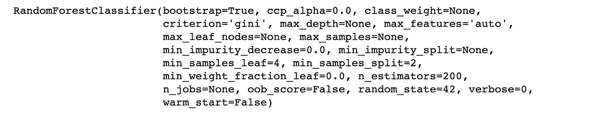

最佳模型的超参数

有了这些信息，我们可以使用“最佳”超参数改进我们的模型:

让我们来看看优化的随机森林模型的超参数:

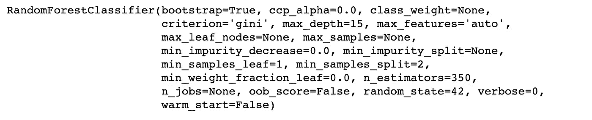

精细随机森林超参数

最后，我们应该评估测试数据的性能，以确保随机森林模型数据不会过度拟合训练数据:

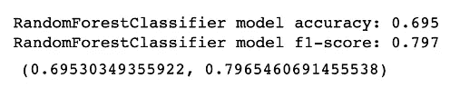

随机森林测试数据性能指标

0.695 的测试数据准确度和 0.797 的 f1 分数表明所构建的随机森林模型没有过度拟合训练数据。

# 5.总结想法

## 一.结果

## **星巴克用户统计:**

*   57%的用户为男性，41%为女性，1.4%为其他性别。虽然大多数用户是男性，但女性花费更多，平均支出总额为 140.91 美元。其他性别和男性的平均总支出分别为 124.32 美元和 99.59 美元。
*   该数据集中的大多数用户年龄在 50-70 岁之间。随着年龄的增长，用户花费更多。
*   55，000-78，000 美元的工资范围在数据集中的用户中最常见。收入越高的顾客花费越多。

## **星巴克优惠表现:**

*   BOGO 促销活动带来了最大的利润，平均每位顾客 138.43 美元。折扣促销的平均回报为 135.23 美元，信息优惠的平均回报为每位顾客 113.74 美元。
*   训练数据表明，基于重要性的前五个特征是:

1.  持续时间(优惠在到期前运行多长时间)
2.  奖励(兑换优惠时客户获得的星级)
3.  难度(兑换优惠所需的最低消费)
4.  收入
5.  社交(社交媒体上的广告)

## **基于人口统计的客户行为:**

*   在所有报价类别中，女性的每次交易花费最多
*   在所有促销类别中，平均交易价值随着年龄的增长而增加，在过去 75 年中有所下降
*   在所有三种优惠类型中，收入较高的客户每次交易花费更多

## **机器学习模型:**

*   在所建立的模型(逻辑回归、随机森林和梯度增强)中，随机森林分类被选为最佳，其依据是性能指标、高质量输出和快速训练该模型的能力。随机森林可以有效地处理大量的训练数据，因此它非常适合未来用于处理星巴克 1890 万活跃用户的多类问题。然后使用来自网格搜索的超参数来改进随机森林分类器模型。得到的模型具有 0.824 的训练数据准确度和 0.881 的 f1 分数。0.695 的测试数据准确度和 0.797 的 f1 分数表明所构建的随机森林模型没有过度拟合训练数据。

## 二。推荐

1.  星巴克应该继续经营折扣和 BOGO 促销，因为它们被所有人口统计的顾客所兑换，有很大的成功率，回报也很高。在考虑收入、成功率和功能重要性时，信息性报价排在最后。也没有办法跟踪信息优惠是否兑现(只能看到用户是否收到或打开信息优惠)。基于这些结果，我建议星巴克只继续 BOGO 和折扣优惠。信息性报价应被视为一种广告，因为没有可测量的属性来跟踪可与 BOGO 和折扣报价相比的收益。
2.  为了使平均交易收入最大化，星巴克应该瞄准女性、40 岁及以上的年龄组，以及年薪 60k 及以上的用户。
3.  星巴克应该使用随机森林分类模型来预测顾客是否会对报价做出反应。这将最大限度地减少发起要约所涉及的资源和费用的使用，并增加最大回报的可能性。

## 三。继续探索

## **客户数据:**

随着年龄和收入的增长，消费者的支出也越来越大。星巴克是否应该根据年龄和薪水增加促销频率，这或许值得探讨。由于女性比所有其他性别花费更多，探究这些更高数字背后的原因也将是有趣的。

*   例如，女性会购买价格更高的商品吗？他们购买的频率更高了吗？他们会购买更多商品吗？有没有暗示他们在为一群人采购？

## **随机森林模型:**

由于前三个特征与客户报价相关联，因此可以通过创建将报价成功率描述为报价持续时间、难度和报酬的函数的特征来改进该模型。这些特性的添加应该构建一个更好的决策边界，将成功和不成功的客户报价分开，返回一个具有更可靠的性能指标的模型。

## 四。结束语

像星巴克这样的公司专注于建立世界级的人工智能和人工智能能力是有原因的。在这种特殊情况下，用于分发个性化促销的机器学习模型增加了报价转换的几率，并降低了劳动力成本，从而使利润最大化。[星巴克对人工智能](https://www.qsrmagazine.com/fast-food/why-ai-differentiator-future-starbucks)的实施日益增强了他们的个性化引擎，优化了商店劳动力分配，并推动了库存管理。星巴克不断实施变革，正如他们最近的[忠诚度计划更新](https://stories.starbucks.com/press/2020/starbucks-to-update-loyalty-program-and-app-this-fall-to-offer-more-ways-to-pay-and-earn-stars/)所示，它提供了更多支付和赚取奖励的方式，使顾客更容易获得他们的[下一杯免费咖啡](https://thepointsguy.com/guide/starbucks-rewards-stars/)。

无论你是忠实的星巴克消费者还是无法理解 PSL 在时代精神中 17 年地位的咖啡爱好者，想想是什么促使你在下一次拜访时购买这家咖啡巨头的产品。