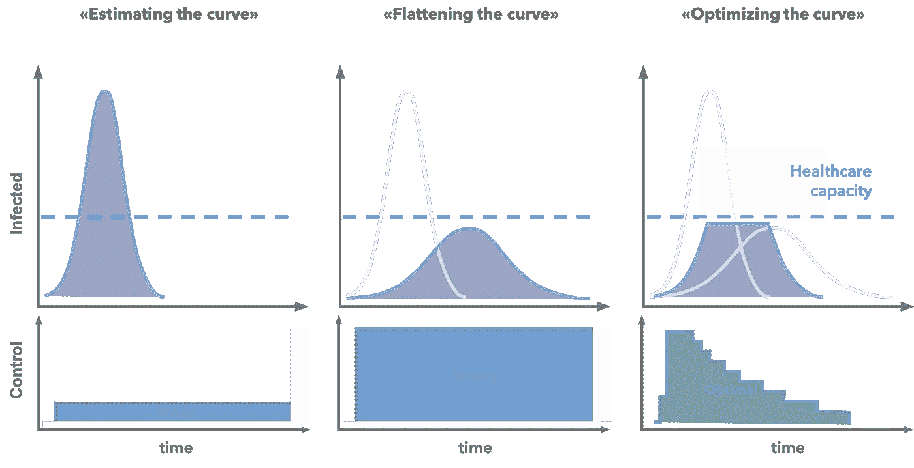
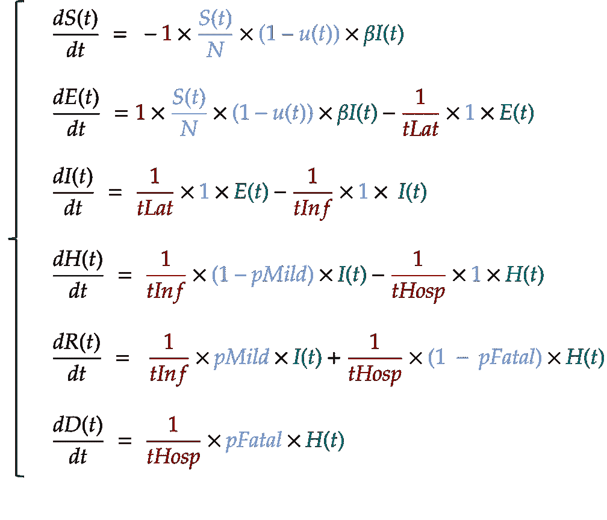
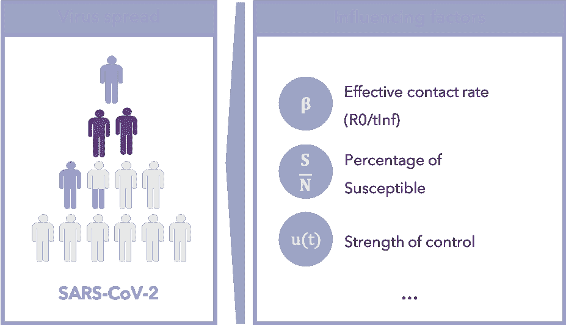
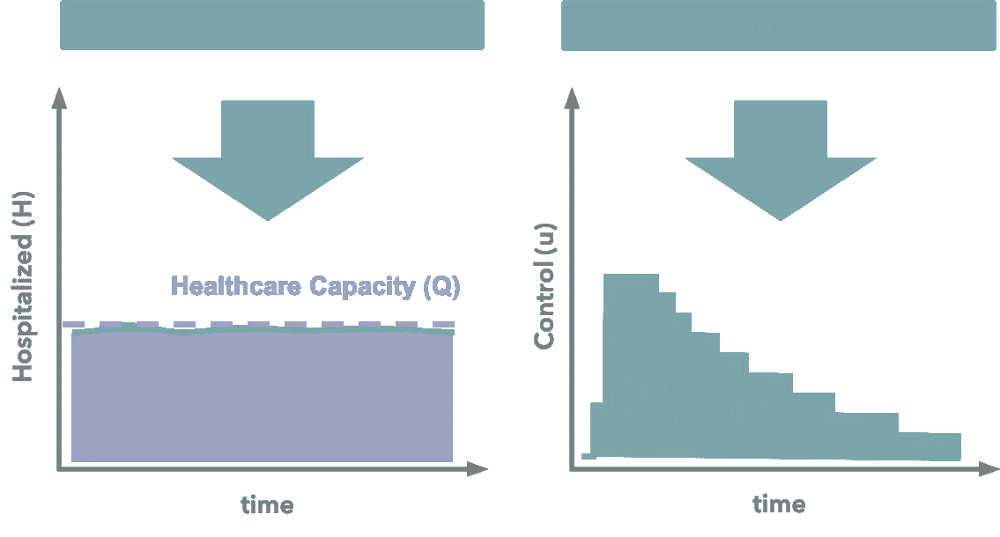
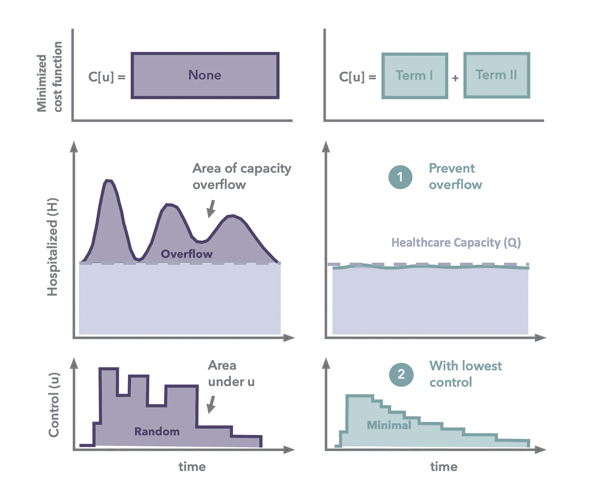
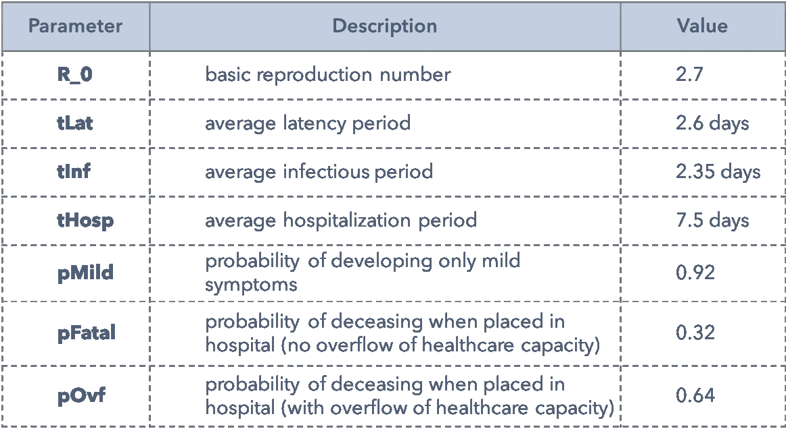
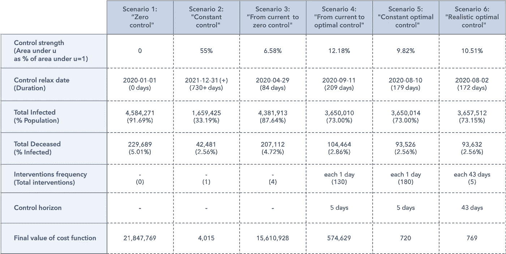
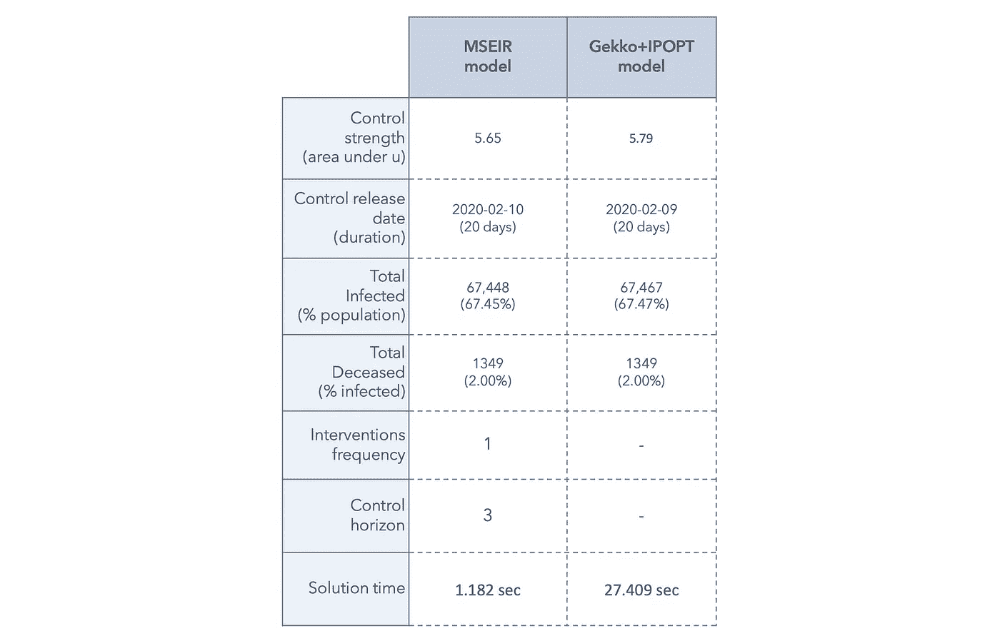

# 优化曲线！模拟新冠肺炎的最佳封锁出口

> 原文：<https://towardsdatascience.com/optimizing-the-curve-modelling-optimal-lockdown-exit-for-covid-19-dfc81f2fb0c1?source=collection_archive---------32----------------------->

## 具有最优控制的扩展 SEIR 模型旨在“拉平曲线”而不会“拉平经济”太多。

***编者按:*** [*走向数据科学*](http://towardsdatascience.com/) *是一份以数据科学和机器学习研究为主的中型刊物。我们不是健康专家或流行病学家，本文的观点不应被解释为专业建议。想了解更多关于疫情冠状病毒的信息，可以点击* [*这里*](https://www.who.int/emergencies/diseases/novel-coronavirus-2019/situation-reports) *。*

# 介绍

绝大多数新冠肺炎预测模型预测有多少人可能被感染(*“估计曲线】*)。大量模型还估计了控制措施(如封锁)对受感染曲线的影响(“使曲线变平”)。然而，很少有模型试图回答这个关键问题——如何以最佳方式引入和放松控制措施？(《优化曲线》)。因为，事实上，强有力的控制措施，比如封锁，会对社会和经济产生巨大的负面影响。

在这篇文章中，我将提供一个简化的模型，其中将包括最佳控制措施的估计。它将回答**如何最佳地进入然后退出封锁**或放松任何其他控制措施的问题。我不会深究优化背后的复杂数学，并将尽可能提供直观的例子。正如您将看到的，生成的模型将使用不到 100 行 Python 代码(不包括交互式绘图部分),并将使用众所周知的库——NumPy 和 SciPy 来计算解决方案。

正如我之前提到的，很少有模型和研究将最优控制应用于新冠肺炎建模。你可以在这里找到其中的几个。它们包括许多复杂的数学。在文章中，我特意省略了它，以便用更容易理解的方式解释这些概念。因此，这里提供的模型将被简化，并应被视为主要是教育。它既不应被视为现实的预测模型，也不应作为任何决策的基础。

本文将包含以下几个部分:

*   背景:所选模型和控制方法背后的理论。
*   **编码:**一个关于如何用 Python 编码模型的分步指南。
*   **用例:**估计*应对新型冠状病毒病毒在一个假想城市传播的控制措施的 6 种不同情景*。
*   **比较:**开发的模型与另一个具有更先进求解技术的模型进行比较。
*   **结论:**总结与成果。

这里是模型、场景和比较的完整代码。

正如英国著名统计学家乔治·博克斯所说:

> “所有的模型都是错的，但有些是有用的”。

考虑到这一点，我希望这里提供的模型可以作为所有现有观点的补充，并作为构建更高级和更现实的模型的基础。

让我们开始创建模型吧！

# 背景—模型

选择正确的建模方法至关重要。我们希望估计受感染个体的数量以及控制措施如何影响它(包括*‘估计曲线’*和*‘使曲线变平’*部分)。只有利用**和**这两个估计值，我们才能够预测最佳控制策略。在这种情况下，最常用的方法是估计****房室流行病学模型，**如******易感-感染-去除(SIR)模型或其任何扩展。在本文中，我们不会深入探究基于 SIR 的模型背后的概念，因为它们已经在许多其他资料中广泛涉及(例如[这里](/infectious-disease-modelling-beyond-the-basic-sir-model-216369c584c4)，或者[这里](https://www.youtube.com/watch?v=jmfsSmHAQ2o))。********

******我们将使用一个**扩展的易感-感染-移除模型**。这将导致新型冠状病毒出现相当长的*潜伏期*，也将反映哪些受感染的个体*住院*并影响医疗系统的能力，以及哪些个体*康复*以及哪些*因病毒而死亡*。我们还将在模型中添加一个参数 u(t ),它将反映控制措施的*强度(社交距离政策、锁定等)。与非药物干预相关的一切)。此外，我们的模型将有*变化的死亡率*，这将取决于医疗保健能力是否不堪重负。*******

****从这个意义上说，我们的模型中有 6 个区间:****

*   ******易感者:**有被感染风险的个体。****
*   ******暴露(E):** 已经感染，但尚未将病毒传播给他人的个体(这个额外的间隔反映了潜伏期)。****
*   ******已感染(I):** 轻度感染并可将病毒传播给他人的个体。****
*   ******住院(H):** 严重感染并需要医疗护理、医院床位或 ICU(这种额外的隔间影响医疗保健系统的容量)的个人。****
*   ******恢复(R):** 恢复并假定对病毒免疫的个体。****
*   ******死者(D):** 因病毒而去世的个体。****

****在房室模型中，个体根据时间和一些参数在房室之间转换。这些参数可以在*“比率-概率-人口”*流程图中进行描述，如[本文](/infectious-disease-modelling-beyond-the-basic-sir-model-216369c584c4):“比率描述过渡需要多长时间，人口是该过渡适用的一组个体，概率是个体发生过渡的概率”。****

********

****流程图形式的模型****

****从数学的角度来看，我们的模型是一个由 6 个常微分方程(ODE)组成的系统，每个方程代表给定固定的时间(t)变化时一个房室值的变化。****

********

****颂歌形式的模型****

****其中，对于流程图和 ODE 表示:****

*   ******S(t):** 时间 t 时易感人数****
*   ******E(t):**t 时刻的暴露数(E)****
*   ******I(t):** 在时间 t 感染的数量(I)****
*   ******H(t):**t 时刻住院人数(H)****
*   ******R(t):** 在时间 t 恢复的数量(R)****
*   ******D(t):** 在时间 t 死亡人数(D)****
*   ****人口总数。N = S + E + I + H + R + D 在每个时间 t。****
*   ****tInf (传染期):受感染个体可能将病毒传染给他人的时间段。****
*   *******β****(*有效接触率):单位时间内个体之间导致感染的接触次数。也是病毒的基本繁殖数 R0(总易感人群中一个感染个体平均感染多少个体)除以 tInf。( *beta* 决定病毒传播的“速度”)。****
*   ******u(t)** :控制措施的强度，直接降低*β*(注意:0 < = u(t) < = 1)。控制措施可能包括强化卫生协议、社交距离、封锁等。有[苹果移动趋势](https://www.apple.com/covid19/mobility)或者[谷歌社区移动报告](https://www.google.com/covid19/mobility/)，可以作为逼近 u(t)的第一步。****
*   ******tLat** (潜伏期):个体只暴露于病毒，但不传染给他人的时间段。****
*   ******那些影响医疗系统能力的人住院的时间。******
*   ******p mild:****感染时仅出现轻微症状的概率。******
*   ********p 死亡:****住院时死亡的概率。当医疗保健能力不堪重负，没有更多的病床或 ICU 可用时，该参数被认为具有相当高的值。在我们的模型中，它将是 **H(t)** (当前住院人数)和 **Q** (卫生保健系统能力)的函数。********

****让我们提供一个**直观的例子**来更清楚地解释这个模型是如何工作的。假设一个群体，其中有 99 个易感个体和 1 个受感染个体。这个人在时间 t=1 时，立即将其他人暴露于病毒(立即，因为这里的比率=1)。还有多少人——取决于*β*和种群中剩余易感个体的比例(S/N ),以及控制强度 u(t)。所有暴露的个体，在潜伏期(tLat)后，也受到感染(所有，因为这里的概率= 1)，除了开始时的那个个体。反过来，他们开始将其他人暴露给病毒，导致病毒快速传播。****

********

****在他们的感染期(tInf)过去后，他们中的一些人会过渡到康复期，一些人会出现更严重的症状并过渡到住院治疗(这取决于只出现轻微症状的概率——p mild)。从那里，在时间 tHosp 之后，他们可以以概率 pFatal 过渡到死亡间隔，或者以概率(1-pFatal)过渡到恢复间隔。如果在某个时间点发生医疗容量溢出，pFatal 会显著增加，因为它是我们模型中的一个功能参数。****

# ****背景—控件****

# ****什么是最优？****

****我们定义了一个模型，它反映了*【估计曲线】**【拉平曲线】*部分，但它仍然缺乏最优控制。让我们假设，如果以下两个条件都满足，则控制强度 u(t)在时间 t 是最优的:****

*   ******条件 1。** **无医疗容量溢出。**住院人数(H)应始终低于医疗能力(Q)。否则，如我们的模型中所定义的，pFatal 参数增加，导致更多的致命病例。****
*   ******条件二。控制强度 u(t)最小。**尽可能小，防止容量溢出。由于对经济和社会的不利影响，我们不想保持严格的控制太久。****

********

*   ******重要提示**:疫情发生后，当人群获得足够程度的自然免疫(群体免疫)或足够数量的人群接种疫苗时，控制 u(t)可能达到最小值，因此不存在第二波疫情的风险，因此不需要采取控制措施。然而，这里我们不考虑疫苗的发展，只考虑自然群体免疫，它被认为在发展后保持不变。****

****因此，如果 u(t)最小化**容量溢出和控制措施**，则 u(t)可被认为是最优的。在数学上，如果 u(t)最小化以下**成本函数** **C(u)** ，则 u(t)在我们的模型中被认为是最优的:****

********

****其中:****

*   ******T** :时间段总数****
*   ******H(t)**:t 期间住院人数(通过求解 ODE 系统得出)****
*   ******Q(t)** :医疗保健系统在 t 时期的能力(在我们的模型中，假设它是常数)****

****下面的图表也说明了公式背后的想法。****

********

****在成本函数**的等式中，第一项**占容量溢出曲线下的*区域，第二项**占控制措施***曲线下的*区域。通过最小化这些项的组合，我们确保定义的条件 1 和 2 都得到满足。但问题是——使用什么技术来最小化如此复杂的成本函数？*****

# ****如何优化？****

****我们说过，我们需要为每个时间段 **t** 选择这样的 **u(t)** ，使得 **C(u)** (“我们控制的成本 **u** ”)最小。当我们想要对一个 2 年的时间段建模时，其中 T = 730 天，我们需要选择 730 个不同 u(t)的组合，这将最有效地最小化 C(u)！这种类型的问题可能需要**为大规模非线性动态优化定制的高级求解算法**，这些算法本质上是复杂的，并且需要大量计算资源来找到精确的最优解。****

****然而，在本文中，我们将开发一种更简单的方法**，它将在几秒钟内引导我们找到一个*非常近似的最优解*，消耗更少的资源并使用众所周知的 Python 库，如 SciPy 和 Numpy。我们还将**在“比较”部分将**我们的解决方案与使用高级求解算法获得的更精确的解决方案进行比较。******

****因此，我们不是一次为整个 **T** 找到几十个不同的 **u(t)** 的正确组合，而是:****

1.  ****将时间段 **T** 分割成相等的时间范围( **h** )。****
2.  ****用固定的 **u** 在单个层位上运行我们的模型，并测量我们的成本函数 **C(u)** 的值。****
3.  ****基于测量—借助相对简单的最小化算法，调整我们的固定 u，使 **C(u)** 最小化。****
4.  ****找到最小固定 **u** 后，继续下一个层位，重复步骤 2 和 3。同样的逻辑适用于所有的地平线。****

****这种方法，当我们在模型运行期间根据它自己的测量结果调整我们的模型时，被称为简单**模型预测控制** (MPC)。在[这里](https://www.youtube.com/watch?v=BTLZu-1IMcE)的一系列视频中，可以很好地解释模型预测控制如何应用于新冠肺炎模型。****

****我们的方法也可以说明如下。****

********

****在这里，我们将我们的时间段分为 4 个时间段。在第一个地平线 t(h1)期间，我们看到，没有容量压倒的唯一 **u** 是“强的”,因此应用它。在 t(h2)处我们看到不再需要“强”控制 **u** ，唯一同时满足条件 1 和条件 2 的 **u、**为“中”，于是我们将 **u** 调整为“中”。类似地，在 t(h3)处，我们看到,“弱” **u** 是唯一最优的，并将我们的 **u** 调整到它。在 t(h4)处，控制措施可以最终放松。****

****这种方法相对简单，给了我们额外的灵活性。我们可以声明，我们将每周(h=7 天)或每月等调整我们的 **u** 。，这是一个*更现实的*控制策略。然而，这种简单性和灵活性是有代价的。为了得到一个近似的最优解，我们必须*仔细选择*我们控制干预的频率(f)和正确的控制范围(h)。****

# ****编码——模型****

****让我们创建一个简单的 Python 类，它将存储模型所需的一切。我们类的 **init** 方法:****

*   ****接受每个需要的参数，如 R_0、tInf、tLat 等。****
*   ****有一个可选参数 *dt* (求解我们的 ODE 系统所需的步长)。例如，如果 *dt* = 0.1 并且 *n_periods* =730 天，我们将有 730/0.1 = 7300 个时间段，这在求解 ODE 时给了我们更好的精度。****
*   ****有可选参数: *rInf* —每天新感染个体的真实数据， *rU* —控制强度的真实数据(u)。rInf 数据可以允许我们将我们的模型的预测与真实数据进行比较，而 rU 也允许我们在已经应用了某种控制之后对最优控制进行建模。****

****MSEIR 类接受我们的所有参数，并执行一些需要立即执行的基本转换:****

*   ****它根据 dt 变换 rInf 和 tU****
*   ****它计算参数*β*(作为 r0/tInf)****
*   ****它基于 n_periods 和 dt 定义了我们的总体建模周期 **t，**。****

****现在，让我们定义 ODE 系统，我们将在我们的模型中解决:****

1.  ****我们首先定义一个方法 **_ovf** 。它将计算我们的功能参数 **pFatal** ，假设该参数具有某个更高的值 **— pOvf，**，以防医疗容量溢出。****
2.  ****然后，我们在方法 **_ode** 中定义我们的 ODE 系统。它接受 cU(这是我们当前的控制措施强度 u(t))和我们人口的初始条件数——易感、暴露、感染等个体的初始数量。隔间。****

******_ode** 方法根据当前的给定值以及我们之前定义的所有参数和规则，计算下一个时间段我们的区间中的值。在数学方面， **_ode** 使用的技术是求解 ode 的简单数值欧拉法。可能有更复杂的技术，可以提供更高的精度，我们将**在“比较”部分将**我们的解决方案与它们进行比较。****

****从逻辑上讲，下一步是创建一个方法，该方法将为每个时间步长运行 **_ode** ，以获得所有区间的预测值。这是通过方法**求解**完成的。****

****在这个方法中，我们首先用区间的初始值创建一个列表 C 的列表，稍后用下一个值填充它。我们还定义了 **y** 和 **Uf** 变量，负责识别 U 是固定的还是有一些关于控制措施的真实数据。此外，U 根据模型中使用的步长 dt 进行变换。****

****关键的解决技术在于循环的*。对于每个时间点 t，我们选择必要的控制 cU，并使用列表 C 中的最后值作为隔间的初始值，运行 **_ode** 方法。我们将 **_ode** 的结果存储在变量 **nVal** 中，并将其追加到 C 表中，所以它们成为最后的值。在*循环的*结束后，我们得到最终解。*****

****该模型的完整代码如下所示。****

****正如您所注意到的，我们当前的模型只有不到 50 行代码。请随意尝试！****

# ****编码—控制****

****目前，该模型包括“估计曲线”和“平坦曲线”两部分。但是最优控制呢？要对它进行编码，我们需要 SciPy，这是 Python 中科学计算的事实上的标准库。我们需要 *simps* 方法来计算成本函数中的积分，以及 *minimize* 方法来应用函数最小化算法。让我们将**成本函数**添加到我们的类中。****

****Method _ **costf，**类似于求解方法，得到我们的 ODE 系统的解。但是它不是返回解决方案，而是基于该解决方案计算成本函数，并返回成本函数的值。它接受控制 u(t)(作为 x)和类似于 **_ode** 方法的初始条件。这样的设计需要使用 *scipy.minimize* 在上面。****

****有了成本函数，让我们根据我们的简单模型预测控制框架修改我们的**求解**方法。****

****关键的修改在于 for 循环——U 的优化仅在以下情况下开始:****

*   ****优化参数被设置为*真。*****
*   ****在真实数据 rInf 中，当前时间 **t** 超过 **t** (如果我们向我们的模型提供真实数据，并且想要在之后对最优控制进行建模)。****
*   ******t** 与频率参数(freq)相匹配，因此如果我们将控制干预的频率设置为 7 天，则在 t=7、t=14 时将满足该条件，依此类推…****

****优化开始时-当前隔离专区值和优化时间范围(hor)存储在 args 变量中。Args 和 **_costf** 被提供给 SciPy 的*最小化*方法，该方法使用选定的最小化算法来寻找在给定控制范围(hor)期间 **_costf** 在什么 cU 下具有最小值。我们还为 cU 设置了一些界限，因为我们的控制强度是一个值，总是在 0 和 1 之间。SciPy 中适合我们的**有界极小化问题**的极小化算法有:**‘L-BFGS-B’，‘TNC’，‘SLSQP’**和**‘trust-const’**。在本文中，我们不会深究它们背后的数学原理，它们在这里[有记录](https://docs.scipy.org/doc/scipy/reference/generated/scipy.optimize.minimize.html#scipy.optimize.minimize)。注意，对于我们的问题，**‘SLSQP’**似乎在收敛、精度和时间方面工作得更好，所以它被设置为默认值。****

****此外，为了方便起见，我们的 **solve** 方法将最终解决方案转换为 Pandas DataFrame，并向其中添加一些附加数据:时间段、U 和 Q 值、rInf 数据和 mInf 数据，后者是模型预测的每日新感染个体的数据。它简单地计算为每个时间段易感人群的减少。****

****我们的模型现在已经完全投入使用了。只是为了最终确定它，让我们添加一个产生代表性情节的方法。我们将使用一个 **plotly** 库来产生可视化效果。为了方便起见，我们的 **plot** 方法也将我们的时标 t 转换为从 *sdate* 参数开始的真实日期。此外，您可以在 size 参数中指定绘图的大小，并在 comps 参数中指定要显示的隔离舱。****

****这是我们的最佳控制和绘图模型的完整代码。****

****这是你可能得到的结果的例子。****

****第一个支线剧情，在顶部，是我们的控制措施强度 u(t)，第二个支线剧情是我们的车厢值。这里，我们选择仅绘制感染、住院和死亡(I、H、D)以及医疗保健能力(Q)。最后一个子图显示了我们的模型(mInf)预测的以及输入真实数据(rInf)中陈述的每天的新感染病例，如果向模型提供了一个输入真实数据的话。****

# ****使用案例****

****假设有一个*城市 X* ，拥有 *5 00 万居民*的人口和*1 万张病床和 ICU 的医疗保健能力*。2020 年 1 月 1 日，第一个人似乎感染了具有新型冠状病毒特征的病毒(导致新冠肺炎)。所有的特征都在[这篇](https://arxiv.org/pdf/2004.09471.pdf)文章中作为一个整体:****

********

****不幸的是，流行病的爆发无法在一开始就被抑制，也没有疫苗。幸运的是，我们现在有了一个模型，它允许我们基于非药物干预(社交距离、面具、封锁等)来估计*不同的场景*和*最优控制策略*。).我们想为未来两年的可能结果建模。让我们用我们将在模型中使用的所有参数创建一个 Python 字典。****

****现在，让我们使用我们的模型，估计第一个非常简单的场景。****

******场景 1。【零点控制】******

****在这种“无所事事”的情况下，**我们没有任何控制权**，因此没有与之相关的经济或社会成本。但在疫情结束时，我们有 **229，689 人死亡**，超过所有感染者的 5%(死亡率为 5.01%)。****

****让我们看看，如果我们的目标是*使用恒定控制策略来“拉平曲线”，会发生什么。*****

*****场景二。【恒控制】*****

*****这里，应用的控制措施是 **~ 0.55 恒定**(在最小水平以防止容量溢出)。我们看到，**死亡人数** **大幅下降至 42481**(死亡率 2.56%)。然而，有两个问题。首先，控制持续时间是无限的，因此**封锁或任何其他措施可能永远不会放松**。其次，这是这里唯一的场景，在最后没有获得**群体免疫(最后易感/总种群**>**1/基本繁殖数，通过[这篇](https://arxiv.org/pdf/2004.09471.pdf)文章中的公式)。因此，放松控制措施会引起新一轮的感染。*******

***现在，让我们假设**更现实的场景**，在疫情爆发的前 120 天里，该市官员已经在*出台了一些控制措施*。让我们看看如果控制被立即移除会发生什么。***

*****场景 3:“从电流到零控制”*****

***所引入的控制措施起初是成功的，但随后在 3 月 18 日发生了容量溢出，不得不将它们增加到 0.8 个点。经过大约 23 天的严格控制，它开始被删除。这个场景展示了从第一个被感染的个体开始 120 天后，如果它下降到零会发生什么。在这里，控制在 2020 年 4 月 29 日结束。我们看到，在一次控制结束后不久，第二波感染发生，导致医疗能力严重过剩。最终，这一政策导致**207112 例死亡(4.72%病死率)**，确实更接近‘完全零控制’情景 1。***

***如果 120 天后官员突然透露如何最佳控制疫情会怎样？让我们考虑下一个场景。***

*****场景 4:“从当前到最佳控制”(最佳锁定出口)*****

***这里，在 120 天之后，在我们的模型中，控制趋向于尽可能的最优——每天发生**最小控制干预**，以便**防止容量溢出**。在这样一个封锁出口的完美案例中，与之前的场景(104，464 对 207，112 个人)相比，死亡人数几乎减少了两倍。尽管**总体控制比**严格 85%(就 u 项下的面积而言，889 比 480)，并且持续到 2020 年 9 月 11 日，与之前的场景相比，延长了 125 天。***

***就目前而言，我们考虑了两种情况，即官员们在疫情爆发的前 120 天采取了一些控制措施。但是如果官员们从一开始就有一个最优的控制政策呢？***

*****场景 5:“恒定最优控制”*****

***这里从一开始就考虑完美最优控制的情况。每天审查控制力度，并引入最低要求的措施。在这种情况下，控制在 2020 年 8 月 10 日结束，死亡人数**为 93，526 人** **，死亡率**为 2.56%。这里的关键点是**致死率与持续控制的场景 2** 相同，但是控制的**有限持续时间为 179 天**，并且严格程度要低得多。此外，除了第二种情况，这种情况意味着死亡人数最少。***

***事实上，由于日常的精确干预，这种控制政策在实践中很难实施。如果官员们试图通过每个月左右的干预来实施最优控制政策**会怎样？*****

*****场景 6:“现实最优控制”*****

***这最后一个场景与之前的相似，但更现实的干预频率为 43 天。控制稍微严格一些(769 比 717，根据 u 下的面积)，并提前一周结束，在 2020-08-02。**死亡总人数为 93632 人**，与**相同，死亡率为 2.56%**。***

*****场景总结*****

***总共考虑了 6 种情况。***

***让我们提供一个表格，总结每个场景的关键指标。***

******

***很明显，最优控制方案比其他方案有优势。通过最佳控制，与零控制(从 229，689 人减少到 93，526 人)相比，有可能**在疫情结束时将死亡人数减少近 60%** 。最优控制策略也具有与恒定无限控制相同的死亡率，但是它持续有限的时间，即 179 天，之后控制为零(T21)。此外，研究表明，每 43 天干预一次，而不是每 1 天干预一次，可以使最优控制策略**更加实用**，而且效果基本相同。***

# ***比较***

***如前所述，对于常微分方程和大规模动态优化问题，都有更先进的求解算法。这里的文章[就是一个很好的例子。那里的模型构建使用了 Python 库 Gekko，它提供了一组用于大规模非线性动态优化的工具。该模型使用**内点求解方法**进行 ODE 和动态优化，其中显著的 **IPOPT** 解算器在引擎盖下。](https://apmonitor.com/do/index.php/Main/COVID-19Response)***

***我们将使用该模型作为基准，但将通过添加住院和死亡区间对其进行修改，因此它将与我们当前的修改后的 SEIR (MSEIR)模型具有完全相同的区间。这里是[的完整代码进行比较。](https://github.com/aaasher/MSEIR)***

***让我们对两个模型使用相同的一组参数，并比较结果。***

***下面是对比结果的图表。蓝线表示 Gekko+IPOPT 模型的解。***

***以及两种解决方案的主要结果的摘要表。***

******

*****两个模型的 U(t)曲线**与**相似**，而 Gekko+IPOPT 模型产生的形状曲线更类似于[这篇](https://arxiv.org/pdf/2004.09471.pdf)文章，在这里计算出精确解。已故的最终值是两个模型之间的**等于**。此外，Gekko 模型的求解时间，如其打印输出所示，等于 **27.409 秒**，而 MSEIR 模型需要 **1.182 秒**的挂钟时间来找到解。***

# ***结论***

***在本文中，我们估计了流行病模型，该模型包括最优控制措施，并回答了如何在考虑经济和社会成本的情况下**“拉平曲线”**以及如何以最优方式进入和退出封锁或任何其他控制措施的问题。我们考虑了一个城市的情况，在那里具有新型冠状病毒特征的病毒已经传播，并且没有预期的疫苗。***

***我们展示了最佳控制措施如何以最小的控制强度降低与疾病相关的死亡率。**在 179 天的控制时间**内，与“什么都不做”的情况**相比，我们的最优控制策略产生的死亡病例减少了 60%**,此后，与恒定控制情况下的无限时间和无群体免疫相比，在群体中获得了群体免疫。我们还将最优控制调整为**更实用的政策**，大约每月执行一次控制干预，而不是完美最优控制场景中的每日干预。***

***我们用来估计最优控制的模型，虽然很简单，但它导致了一个**很好的近似最优解**，如比较部分所见。它的简单性也增加了好处:*对于这种大规模的动态优化问题，计算时间*惊人地快，以及*巨大的灵活性*，因为我们可以定义任何干预频率和控制范围，定制成本函数并添加变化的参数，如死亡率。***

*****该模型仍然充满了与确定性 SIR 框架和我们的简单模型预测控制方法相关的假设**。我希望它能成为更先进的模型的起点，这些模型可以应用于真实的病例，并为现有流行病学模型的控制应用提供更多的信息。***

***这里是模型、场景和比较的完整代码。***

# ***参考***

***[1] M. Kantner，T. Koprucki，超越仅仅“使曲线变平”:用纯粹的非药物干预对流行病的最佳控制(2020 年)，网址:[https://arxiv.org/pdf/2004.09471.pdf](https://arxiv.org/pdf/2004.09471.pdf)***

***[2] APMonitor，新冠肺炎最优控制响应(2020)，网址:【https://apmonitor.com/do/index.php/Main/COVID-19Response ***

***[3] S .布伦顿，控制理论和新冠肺炎(2020)，网址:【https://www.youtube.com/watch?v=BTLZu-1IMcE ***

***[4] H. Froese，传染病建模:超越基本 SIR 模型(2020)，网址:[https://towardsdatascience . com/Infectious-Disease-modeling-Beyond-the-Basic-SIR-Model-216369 c584c 4](/infectious-disease-modelling-beyond-the-basic-sir-model-216369c584c4)***