# 优化…目标变量(？)交易机器学习模型的例子

> 原文：<https://towardsdatascience.com/optimizing-the-target-variable-an-example-for-trading-machine-learning-models-48a1587d7b9a?source=collection_archive---------23----------------------->

## 我们的目标是静态的吗？

Clem Onojeghuo 在 [Unsplash](https://unsplash.com?utm_source=medium&utm_medium=referral) 拍摄的照片

# 0.a)动机和…飞镖(？)

是的，你没看错，*优化目标变量*。你可能会想，“但是，那就像欺骗”或者“你能改变过去吗？”。别担心了！我既不是一个骗子，也不是一个试图改变过去只是为了改善他的机器学习模型的时间旅行者(利用这种能力还有很多更令人兴奋的事情要做)。

如果你去找你的第一个数据集，学习关于[泰坦尼克号](https://www.kaggle.com/c/titanic)，在那里你尝试一切来预测乘客是否幸存，或者 [MNIST](https://www.kaggle.com/c/digit-recognizer) 数据库，那里有你甚至不能识别的数字，你可能会有点困惑。“如果有乘客幸存，这个人能优化吗”或者“他选择 9 是 4 来提高他们的准确性吗？”

显而易见的答案是否定的。但是正如你将看到的，有时目标变量不是事实(可能是事实，但不是事实-事实)。所以今天，我们要谈论我们最喜欢的朋友，当它是关于监督学习！

我想把这个问题比作飞镖比赛(如果我们谈论目标，你能想出更好的例子吗？).典型的职业比赛分为几段，在这几段比赛中，选手们试图准确地达到 501 分，条件是在最后一次投掷中，飞镖必须进入“双程”，这意味着，到达外环上的任何区域或“公牛”(50)，将结束这一段比赛。每个玩家每回合有三次飞镖。

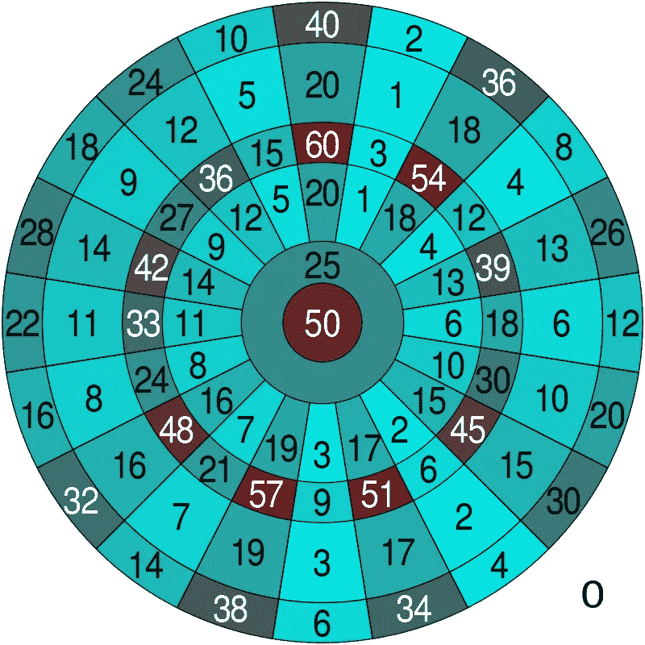

摘自[维基百科](https://en.wikipedia.org/wiki/Darts#/media/File:Dartboard_heatmap.svg)

从数字上看，很明显每个玩家都会试图在第一轮中获得尽可能多的分数。在实际比赛中是这样的:他们开始主要瞄准 60 岁。

当他们必须完成游戏时，有趣的部分出现了。想象你有 441 分的最后一个转弯(还剩 60 分)。你必须打出“双杀”，所以瞄准 60 是不可能的。稍加思考后，你扔出祈祷 50，奇迹般地你得到了它！。

你现在还有 10 分，所以你可以直接扔向外 10 分区域来结束游戏。你扔了，你甚至没有接近，你打了一个 8。在你最后的机会里，你瞄准外围 2 区。整个球场都在等待，你的对手在咽口水，你有了最后的想法“我什么时候成了飞镖职业选手？”，但你忘了那一秒，深呼吸，最后抛…胜负？你成功了！这条腿是给你的。

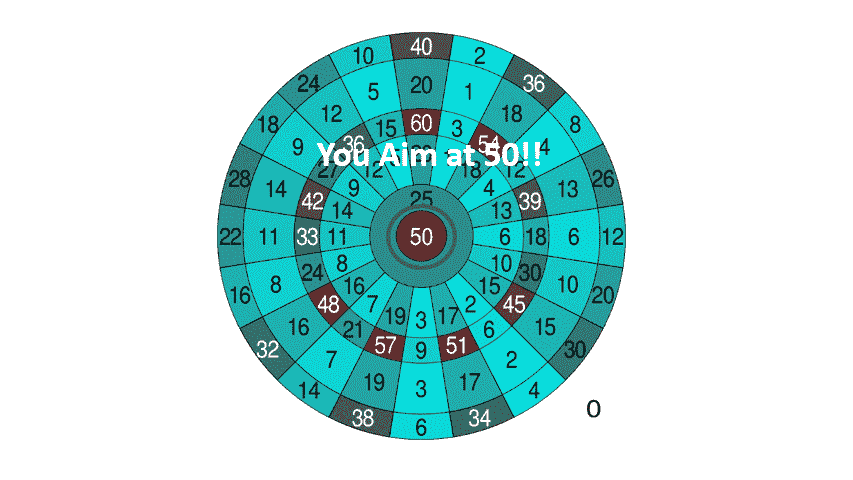

摘自[维基百科](https://en.wikipedia.org/wiki/Darts#/media/File:Dartboard_heatmap.svg)和来自[这里的飞镖](https://www.pngitem.com/middle/iibmbTi_dart-png-transparent-background-dart-png-png-download/)

有数百种组合可以得到 60 分，所以每次投掷后，你必须灵活并检查你站在哪里(在这样做的时候，我看到了很棒的比赛，首先是[这个](https://www.youtube.com/watch?v=pWgdh-m6EzU)和复仇[这里](https://www.youtube.com/watch?v=zEG_xUcGHwg)，稍后感谢我)。不可思议，你可以向你的朋友炫耀你的飞镖知识，但我们能从中获得什么？

嗯，现实生活中发生的问题与飞镖游戏中发生的问题是一样的:你的目标是赢得比赛，但你可以扔向不同的区域来实现这个目标！镖靶是静态的，但你的目标可能会不断变化！。

好吧，但是你怎么把它和真正的问题联系起来呢？。别急，我先给你讲讲背景。

当你想训练一个机器学习模型进行交易的时候，有无数种方法可以做到。您可以训练自回归模型并跟踪预测的运动。此外，您可以创建解释变量来预测积极或消极的目标，定义战略要点中的信号，如果讨论这是本文的目标，我认为我们可以讨论您的想法几个小时。

我们的目标与标题相关，因此，我不会详细阐述，因为定义一种方法来面对这个问题是一个独立的世界。相反，我将向您简要介绍一种具体的可能方法。如果你觉得你想知道更多，我建议你从以下几点开始:

 [## 交易的概率机器学习方法+ MACD 商业理解

### 在文章的最后，你会知道如何用概率的方式构造一个交易问题。此外，您将…

towardsdatascience.com](/probabilistic-machine-learning-approach-to-trading-macd-business-understanding-6b81f465aef6) 

这也是一个很好的第一步，如果在读完接下来的内容后，你对一些概念感到不知所措，想要清楚地理解它们。它还有一些关于模型构造的重要细节。技术方面的问题将在这里浅尝辄止。但是，不要担心，如果你对优化目标变量的想法更感兴趣，我为你准备了一个温和的介绍。

> 事实上，我们将使用股票价格来阐述所有的想法，并不意味着你需要知道任何关于交易留在这里。交易问题将只是一个工具！。
> 
> 此外，我们将在问题表述和模型的结果解释方面做出巨大努力，将它们与商业价值联系起来，这不仅仅是为了准确性而奋斗！

所以留在这里！这完全值得，因为我属于方型的人，让我们从时间表开始吧！

# 0.b)议程

1.  快速概述分配给问题的结构及其与 darts 的联系(也是对流失问题的认可)。
2.  我们将描述为什么这是一个提高我们[预期回报](https://www.investopedia.com/terms/e/expectedreturn.asp)的机会，展示从币安收集的 ETH-USDT 配对数据的见解。
3.  我们将考虑优化目标变量的想法，在我们的头脑中，在你的屏幕上阐述问题，引导我们思考如何解决这个问题。
4.  是时候应用我们将学到的一切了！我们将训练不同的随机森林，以检查我们的目标变量的哪个组合使我们的回报最大化。
5.  最后回顾一下我们的主要成就和对这一想法的进一步改进。

# 1)问题概述，还有更多飞镖！

考虑一下交易问题，假设我们有一些解释变量，它们都是基于股票交易量和价格创建的。我们还开发了一种方法来确定先发生什么:在接下来的 N 个周期中 I%增加或 D%减少。

我们的目标是根据我们的变量(监督学习)来预测这两种结果中哪一种更有可能发生。).这可以看作是一个二元分类问题。当第一个收盘价上涨时，我们用 1 标记，否则用 0 标记。我们都准备好了！

等等……是吗？但是，I%和 D%呢？我们如何选择这些数字？最后，我们需要开始的问题！

如你所见，我们的目标会有所不同，这取决于我们选择哪些数字来决定成功或失败。如果我们首先达到 I%，我们就称之为我们的 [T/P，](https://www.investopedia.com/terms/t/take-profitorder.asp)否则，我们就称之为 [S/L](https://www.investopedia.com/terms/s/stop-lossorder.asp) 。

为了更好地理解这一点，我为你准备了一个简单的图示。让我们用我们未来公司“概率 ML 贸易公司”的股票价格来分析一下，1 只股票的价值在第一天将是 100 美元，在随后的 12 天里，这些值将分别是 96，110，104，91，84，93，107，118，111，101，91，80。

在下面的图表中，将有四种情况，每个人将代表相同的股票价格。你会看到 T/P 和 S/L 点是绿色和红色的水平线。每个散射颜色将是一个增加-减少(I-D)的组合。顺序如下:

*   第一种情况，黄色散射:10%I-10%D。
*   第二种情况，青色散射:15%I-15%D
*   第三种情况，蓝色散射:15%I-20%D
*   第四种情况，洋红色散射:20%I-20%D

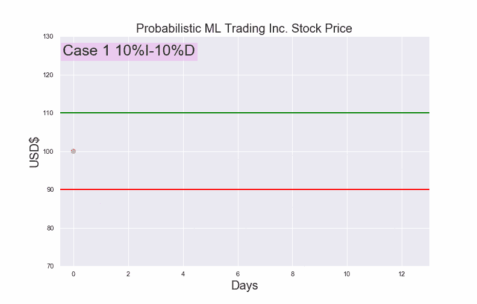

同一数据集上的不同目标变量。

尽管我们公司最终崩溃了，但理解正在发生的事情是一个很好的视觉化。

正如你所看到的，当价格超出预定线时，我们就到达了终点。第一种情况和第三种情况的目标变量是相同的。但是对于第二个和第四个，情况恰恰相反。基于相同变量训练的模型可能认为价格会上涨，而另一个模型可以肯定价格会下跌。有趣吧！。

这就是我告诉你我们的目标变量是一个事实，但不是事实-事实的意思。这是一个事实，因为我们无法改变收盘价——以我们的飞镖为例，我们无法改变镖靶——然而，这不是一个事实——事实，因为根据我们为结果设定的条件，我们的目标可能会有所不同——**——我们的目标可能是“双倍”——**。

我相信这可以应用于不同类型的问题，所以如果你开始考虑你的目标变量，而不是一个静态的建筑，而是一个乐高积木，我相信你可以为自己和你的公司获得很多价值！。

# 1.1)少量流失参考

举个简单的例子，当你定义客户何时离开时，让我们考虑一下**流失问题**。需要做出一些决定。设想一个月订阅，当你在设计问题时，当客户要离开时，你必须选择**。如果你选择两个或三个月，而不是定义他在下个月“翻腾”，会怎么样？**

Alex Holyoake 在 [Unsplash](https://unsplash.com?utm_source=medium&utm_medium=referral) 上拍摄的照片

这可以让你找到不同的模式！想象一下，当客户不打算流失时，但当他们只是在思考时，保留策略会有更好的结果。也许使用更长的时间段会导致更高的保留率！独立于模型，你的商业目标可能会有更好的结果。因此，我们需要根据问题的业务属性来定义我们的度量标准。

这 1.1 节，只是让你看看这个想法的应用的另一个例子，但是我知道你仍然对我们将如何在我们的交易实际问题上测试这些概念感到有点好奇，所以和我呆在一起吧！我并没有在第一部分做出如此荒谬的努力，以至于忽略了核心内容。事实上，这个介绍只是一个工具，激励你去阅读接下来的内容。

# 2)机会

好吧，为什么这是一个机会？为了解释这一点，我们有必要(重新)回顾一下预期收益的概念。简而言之，它只是一个场景的回报和它的概率之间的乘积之和([此处](https://en.wikipedia.org/wiki/Expected_return)了解更多细节)。

**我们的目标是最大化预期收益**，除了模型的准确性，你还应该考虑将解决最大价值的公式。

在特定的交易问题中，我们需要把 I%和 D%和这个表达式联系起来。做一个简单的开始，让我们想象一下，我们甚至不会训练一个模型。我们想随机进入市场。我们会选择不同的 I%和 D%的组合，我会在图表和等式中向你们展示发生了什么。同样，假设我们将持有[多头头寸](https://www.investopedia.com/terms/l/long.asp)。

> 技术说明:我们今天工作的数据将从币安检索，选择 ETH-USDT 对的最后 550 天，间隔 5 分钟。有 157.912 个数据点。
> 
> 我们将使用 N=200，每 5 分钟一次，大约 17 个小时的结果。如果价格从未越过障碍，将被标记为“没有结果”。从币安收集数据的代码在这里[有更详细的解释](/probabilistic-machine-learning-approach-to-trading-macd-business-understanding-6b81f465aef6)。

让我们看看如何用重要的特性来检索数据。

在这种情况下，我们将假设，如果我们“没有结果”，我们将失去的只是费用(如果您激活您的币安档案，您将获得 0.075%的接受者和 0.075%的与 BNB 支付[费用的制造者)。我们将每次购买 100 USDT ETH。这是定义结果的方法。](https://www.binance.com/en/support/articles/115000583311)

接下来，您将看到我们将训练不同的模型，因此代码是在牢记这一点的情况下创建的。矩阵里有所有的组合。这是我们保存每个场景的方式:

首先，我们将看到两种不同的情况(I=3%，D=-1.5%)和(I=1.5%，D=-1.5%)。我们能从这两个人身上期待什么？如果你的第一个想法是我们可以在第一个案例中预见到更多的“减少”和“没有结果”的案例，我们可能开始相互理解了！。我们来对比一下！。

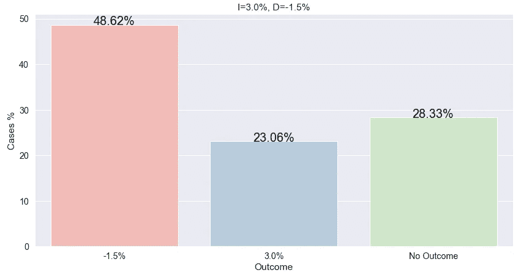

基于 I=3.0%和 D=-1.5%的病例结果百分比

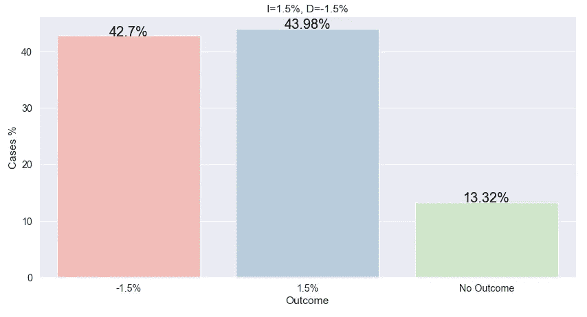

基于 I=1.5%和 D=-1.5%的病例结果百分比

发生这种情况是因为 D%的值越高，价格越难达到该点。

但是，他们的预期回报是什么呢？好了，我在这里给你留下了通用的公式(0。)，然后是两种情况的计算。该值将假设 100 个条目，每个条目 100 个 USDT(如果您只想要单个实例的预期回报，只需将预期回报除以 100)。

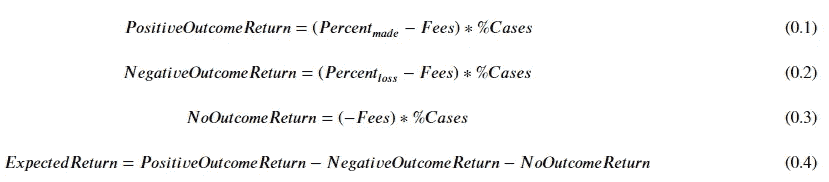

随机进入市场的预期收益

对于第一种情况(I=3%，D=-1.5%):

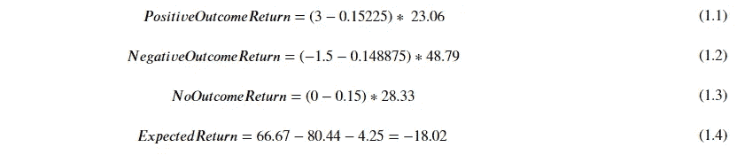

基于 I=3.0%和 D=-1.5%随机进入市场的预期回报

对于第二种情况(I=1.5%，D=-1.5%):

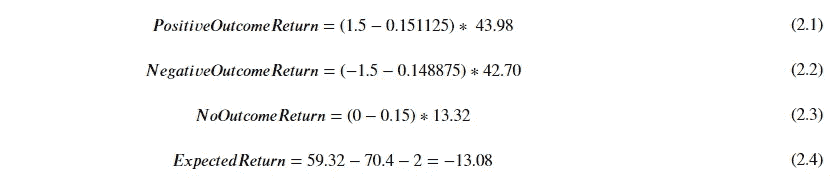

基于 I=1.5%和 D=-1.5%随机进入市场的预期收益

好吧，这些公式可能很烦人，但它们是开始构建我们将要做的事情的极好基础。我不仅仅是在两个案例中这样做的。事实上，我为《黑客帝国》中的每一种组合都做了一个网格。

因为我知道你在等着看一些东西，我创建了这个 3d 散点图，y 轴是积极的结果障碍，x 轴是消极的，z 轴将代表一个条目的预期回报。

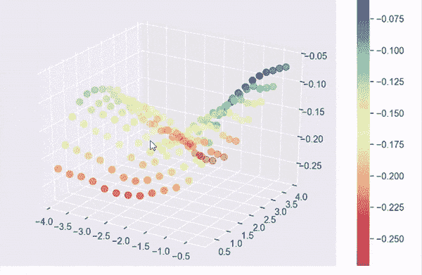

我使用了一些我们将在下一节看到的结果，所以为了避免误解，这里是[要点](https://gist.github.com/MauricioLetelier/1d856a86d9f1b21d43a022babdd85ec1)

如你所见，我们不能用随机进场来战胜市场。但是，通过选择在[2，-0.3]区域附近，我们得到接近 0 的值，尽管有费用和随机性！。因此，根据 I%和 D%的组合，我们进入市场可能处于更好或更坏的位置，**只要仔细定义我们的目标变量。**

但是正如你所知道的，我们需要训练一个模型，所以程序并不像这样直接。但那是下一节的事情，这一节的任务，只是向你们介绍，我们的目标变量的不同组合如何影响我们的预期收益，取决于它的行为。

# 3)我们能解决这个问题吗？

思考一个提议的解决方案时，我们需要稍微停顿一下，给我们的创造力发挥的机会。此外，我们不会在这一部分编写任何代码。我想引用爱因斯坦关于解决问题过程的陈词滥调，或者亚伯拉罕·林肯关于 T2 斧头的陈词滥调。但正如你将在嵌入的文字中看到的，没有证据表明他们说过这些话。不管怎样…我知道你明白了。

照片由[乌古尔·皮克](https://unsplash.com/@ugurpeker?utm_source=medium&utm_medium=referral)在 [Unsplash](https://unsplash.com?utm_source=medium&utm_medium=referral) 上拍摄

我们路线图上的第一件事应该是:什么实际上代表了更高或更低的 I%或 D%？。您是否注意到，在我们的场景图表中，它们的值越高，等待时间越长的可能性就越大？好吧，让我们详细解释一下为什么会这样。

第一个原因似乎是显而易见的:考虑到某个特定时间段的增加或减少并不是那么高，我们需要等待更多的时间段才能达到该值。如果我们有一个趋势，价值需要以自己的速度前进的时候到了。

因此，我们可以注意到，数据粒度(时间间隔)和预期的 I%或 D%之间必须有一定的比例。如果我们想预测股票在未来一年的价值，看过去 8 小时是没有任何意义的。正因为如此，我们应该在一个合理的邻域中寻找这些值。

第二个原因更重要:想象一下，我们在上涨趋势前买入，在价格突破这个阈值几个小时后，我们希望价格上涨 5%。我们想“为什么我们现在必须离开？…正在上升”。我们等了一会儿，发现价格开始下降。可能会有逆转！我们可以误导我们的模型！

照片由[杰米街](https://unsplash.com/@jamie452?utm_source=medium&utm_medium=referral)在 [Unsplash](https://unsplash.com?utm_source=medium&utm_medium=referral) 上拍摄

为什么反转如此重要？因为当我们进去的时候，信号显示市场正在上涨，而且确实发生了！但当出现逆转时，迹象可能恰恰相反。我们看到的信号只在某一点上有效！所以如果 a 在周期 T 上有一个信号，那个信号每秒钟都会开始失去值！。

当 I%或 D%的值太小时，情况完全相同:价格的轻微波动可能会产生与信号相反的结果，因为我们为股票移动定义了一个超级短的空间。

那么，从这里我们能学到什么呢？这些信号在 I%和 D%上有一个阈值，它们不再与结果相关，导致模型显示出比它们应该显示的更多的随机性。

# 3.1)我们的方法

好了，现在我们有了一些原则，可以开始考虑解决方案了。我们如何选择我们的 D%和 I%？为此，我们应该重新思考我们的目标是什么:**最大化预期收益**！我不会停止重复它！但我们如何做到这一点，我们不能构建一个公式，并根据检查约束的目标函数进行优化，因为我们需要首先训练模型。

> 为了继续，我们需要定义这个特定案例的一些东西。
> 我们将假设我们已经完成了所有的特征工程过程，并选择训练一个随机森林。

那么…我们将如何评估模型性能？我们可以选择一些数据，并将其分成测试集和训练集。测试数据将代表一个我们不知道的场景，它可以被看作是我们将使用的策略的模拟。为了避免误解，我们将随机但均衡地选择数据。

# 3.1.1)我们不会做什么

你可以匆忙采用这个解决方案:

该模型将为我们提供进入市场的可能性。如果我们可以相信 predict_proba 方法(它决定了一个特定案件的结果的几率，从此将成为我们的主角)，我们就知道如果我们进去，成功的概率是多少(我们将称之为 P(p))。此外，如果我们将 P(p)乘以场景的回报，我们甚至可以在训练模型之前就知道我们的最佳选择是什么。

> 值得一提的是，如果我们有两个结果(P(n)是一个负结果的概率)，P(p)+P(n)=1，predict_proba 方法知道这一点。

例如，我们评估一种情况，我们选择 I=1.5%，D=-1%。如果我们不考虑费用，我们只需要 0.4 或更高的 P(p)值(计算如下)。但是，如果不看模型和它的结果，似乎很难优化我们的目标变量的组合:我们如何知道有多少情况将满足该条件？。

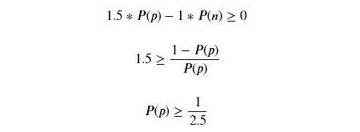

示例公式

另一个问题是，一般来说，模型不是完美校准的，predict_proba 可以告诉我们 0.4，但在测试集中，它可能做得更好或更差。这里的关键是我们不能避免训练模型。

# 3.1.2)在这个解决方案中，我们信任！

我们的解决方案需要评估我们训练的每个模型，并检查每个 P(p)的回报，这可能会给我们带来正的金额。为了做到这一点，你将在下一节看到关于我们将如何创建返回场景的图表，但现在，我将解释这个想法。

我们将训练我们的模型，并利用测试数据，在 P(p)应该高于特定值的条件下，我们将计算每个数据点的正面结果(P(p))的概率。我们将评估每一个概率高于某个数字的案例，我们将检查其中有多少实际上成功了。

我们可以假设我们将在每笔交易中投入相同数量的资金:100 USDT。由于我们的最终金额的简单性，这就是在百分比上做这件事的重要性所在。我们可以计算真实的回报，只需要稍微改变一下我们原来的公式。

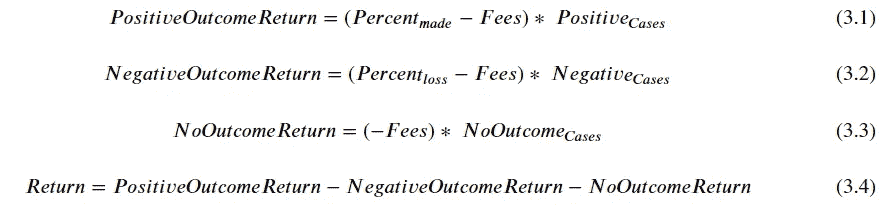

返回选择市场条目。

你注意到不同了吗？它只是将“% Cases”更改为相应的“Cases”例如，如果我们训练一个模型，其中 I%=1.5，D=-1%，其中 1000 个数据点的概率 I>0.5。我们会看到其中有多少是准确的。在这种情况下，我们会说 450 有积极的结果，50 没有结果。我们可以这样翻译:

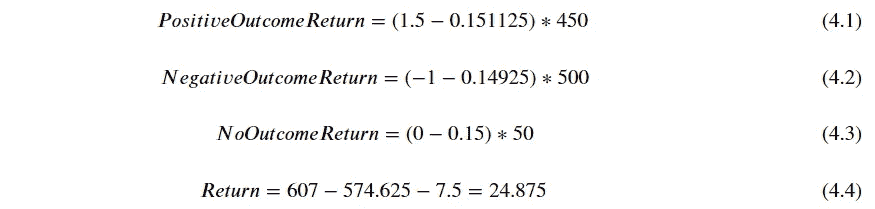

回报计算示例

在这种特殊情况下，我们将在期末获得 24.875 USDT 的利润。

您可以注意到，返回的值取决于案例的数量和条目的质量。在模型的情况下，如果我们要求更高的概率，我们将有更少的情况。**这是我们的主要权衡！许多“常规条目”可能比少数“好条目”更差或更好**

> 所以会有两个优化过程！首先，给定每个模型的 P(p ),我们将最大化回报。之后，我们将评估所有组合的每个模型的最佳回报！

这将类似于网格搜索，但在我们的情况下，我们不会校准参数，我们将比较他们的回报！正如我所承诺的，我们将改变我们的目标变量，而不是改变参数！

似乎是个好计划？如果您同意，让我们看看我们刚刚构建的解决方案的结果！

# 4)真相时刻！

所有的精心制作过程可能有点苛刻，但它即将得到回报！

> 技术说明:我取了 20%的平衡数据用于下面的评估，另一部分用于训练模型。假设我们使用了 550 天，我们可能会说在 110 个随机的日子里预期会有回报。我更喜欢这种方法，而不是在上升趋势或下降趋势中进行评估，因为我认为这更可靠。
> 
> 此外，本节我只补充模型训练和模型评估的要点。图表代码会在 gists 和 jupyter 笔记本中，我会在这个 [repo](https://github.com/MauricioLetelier/Optimizing-the-target-variable) 中留给你。我刚刚上传了结果，因为模型太重了。

遵循我们在第 3 节中设定的原则，如果我们有 18 个小时来观察结果，那么设置 0.3 个隔离屏障是合理的。还有，事实上我们无法知道什么时候是太多或太少的信号来误导我们的模型，我们应该尝试很多组合！。

在本节中，我们将训练许多随机森林，每一个都基于 I%和 D%的不同组合(“矩阵”)。这将引导我们找到确切的概率，我们应该要求的模型，以确定我们是否可以进入市场，最大化我们的回报。

这里是模型的代码，我保存它们是因为每个模型的训练需要大约 5 分钟，而对于 169，你可以自己计算一下，了解一下仅仅训练它们就需要一个晚上:

在第 **4.1** 节中，我们将通过一个组合**来了解每次**我们测试一个新的组合时会发生什么。在第 **4.2 节**中，我们都在期待什么:最终的**目标变量优化** …!

# 4.1)我们的第一个完整场景

正如我之前告诉你的，这里，会有更多的图表！我将从展示一个开始，这样我们可以巩固我们在上一节中所做的内容。第一个柱状图包含 I%=1.5 和 D=-1.5 组合的模型结果。此外，每个条形顶部的病例数。

X 轴表示 P(p)>X 输出(所有满足此条件的案例)的筛选器，我们将使用它来选择模型预测为市场进入的案例。条形图的高度代表成功率，散点图的点可以看作是特定点的回报。

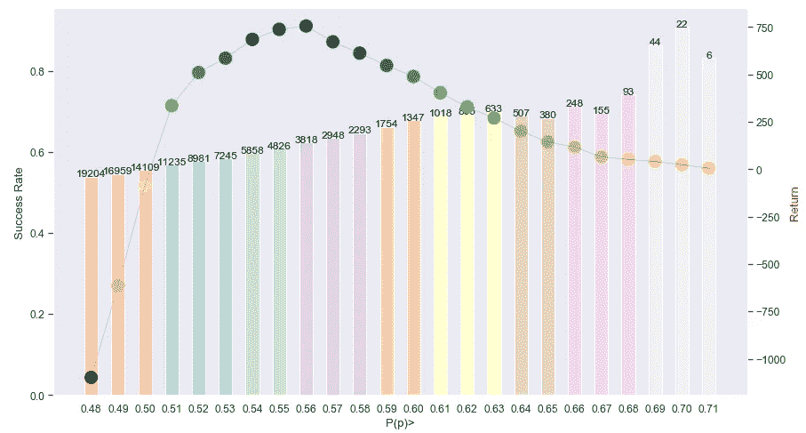

不要觉得不知所措！这里有很多信息，但是如果你停下来理解它，你会发现没有什么可怕的。在这一节结束的时候，你可以重温这个图表，我发誓！这完全说得通。我将把这个分析分成两部分:第一部分，我们将讨论 predict_proba 给我们的信息，第二部分，我们将分析回报。

# 4.1.1)预测概率重要性

你可能已经注意到 predict_proba 方法是这篇博文的亮点，现在我将向你解释为什么。数据科学过程的这一部分至关重要，因为这是我们理解模型给我们的信心的时候。

对于这个组合，我将根据概率将它们分成三份，并解释这个数字在我们的情况下代表什么。请注意，我用的是 0.5，因为 I%与 D%相同:

*   P(p) <<0.5: What’s the difference between going into the market randomly and filtering these cases? Well, the model is telling us that he (I’m talking about him as a person, I know) has some clarity and thinks that the outcome will be negative. For our situation, this means that if we avoid those cases, we are not sure if we will have a good outcome, but at least we will leave behind those that are bad-looking.
*   P(p)~0.5: If we choose the cases around 0.5, we will be hitting the most uncertainty scenarios. The model is practically saying you ‘flip a coin’. For cases like this, we should avoid using the confusion matrix, these cases are meant to be less accurate!
*   P(p)> >0.5:这是我们最好的猜测。模特在说，“如果可以选择，就挑这些！”。这就是为什么它们很重要。我们的目标不是预测所有的情况，我们只想对其中的一部分有信心。

现在回到图表，您可以注意到每个条形都是基于 x 轴数字过滤的特定置信范围。成功率越来越高。这是因为另一个右边的每一个条形都比左边的条形更挑剔。。

这也意味着，当我们向右走的时候，我们的情况更少，正如在第三节中讨论的，随着情况的减少，我们的回报达到了一个不能再攀升的点。但那是 4.1.2 节的事。

我强调 P(p)过滤器只是为了提醒您，选择的阈值应该与问题中的商业价值相联系，使用 AUC-ROC 曲线可能是不够的。你需要把模型的结果和你的目标函数联系起来！。

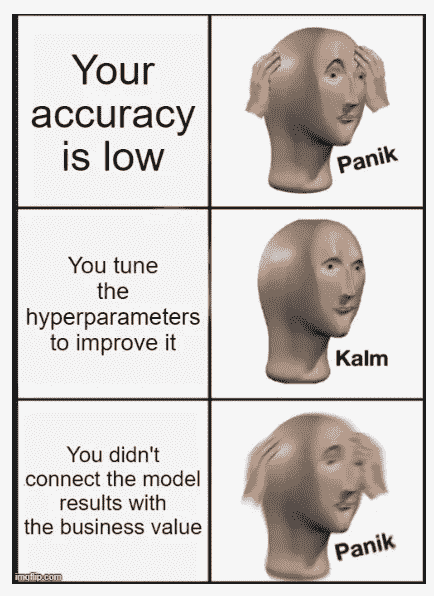

来自 [imgflip](https://imgflip.com/memegenerator/Panik-Kalm-Panik)

# 4.1.2)返回时间！

回报是用我们在上一节中构建的公式计算的。我只是根据 S/L 和 T/P 点，对“无结果案例”给他们一点惩罚或奖励。例如，如果我们有[-3.6，0.3]，该值很可能超过 0，因此该效果被包含在内(代码中有详细说明)。

如果你认为我们每笔交易都有 100 USDT，不要因为图表显示的 110 天回报率是 750%而惊慌失措。回报没有那么高，因为你可能有很多同时交易等待达到阈值。所以你需要超过 100 个 USDT 来应用这些策略。

因此，回报是我们将寻求优化的价值。现在分析散点图点会更容易。在这种特殊情况下，你可以清楚地看到，回报找到一个点(大约在 0.485)，在那里它有 0 回报，并继续上升，直到 0.55，在那里它达到最高回报。之后不出所料，往下走，因为太挑剔涉及机会少。

> 看到这一点给了我们一个很好的洞察力:仅仅通过选择一个正确的 P(p)阈值就可以决定是否达到我们的业务目标。

# 4.2)优化目标变量！

但是，如你所知，我们不会就此止步。我们的主要目标是优化目标变量，定义最佳的 I%和 D%组合。现在是时候来评价这些车型了！下面的代码可以避免重复前面几节的整个过程，但我还是会向您展示它。这是由于模型和数据的保存和加载过程。它可以通过一个更快的选项来避免。

我们加载数据和具有各自特征的模型，重新创建训练过的环境。在代码的后半部分，我们使用 P(p)过滤器来保存成功率的所有概率，以便在将来进行分析。

对其中的每一个，我们将重复本节第一部分的程序，以获得局部最佳回报。之后，我们会比较每个组合的最佳回报。在这里你将看到我们最佳的五款车型回归！

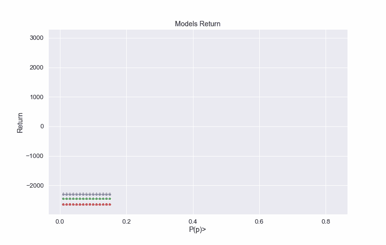

我们最好的 5 个模型的 P(p)与回报。动画[的要点在这里](https://gist.github.com/MauricioLetelier/81aa8b69f7a12d0ec34e89564613d1cc)。

我们注意到的第一件事是，第一个 P(p)滤波器的回波是相同的。这是因为模型不会给我们低于 0.25 的概率，所以回报和随机进入市场是一样的。另一件重要的事情是，在所有的模型中，回报率回到 0，因为没有足够的案例达到 P(p)值。

正如你所看到的，在这五种情况下，当 P(p)高于一个概率可以处理 I%和 D%之间的差异的值时，模型越过 0 返回障碍。比如模型[2.4，-3.6]比其他几个持续的时间稍微长一点达到顶峰，因为你需要更多的正面案例来中和负面的。

> 我们的赢家[3.9，-3.6]，能够达到超过 3000 USDT 的回报！这令人难以置信，因为如果我们只使用第 4.1 节的标准——只评估一个组合——我们最终只会得到 750 USDT 的回报。

优化目标变量的价值是惊人的！现在，您已经了解了理解我们在本节开始时看到的图表所需的所有重要内容，我现在可以添加相同的图表，但针对的是我们的最佳情况。

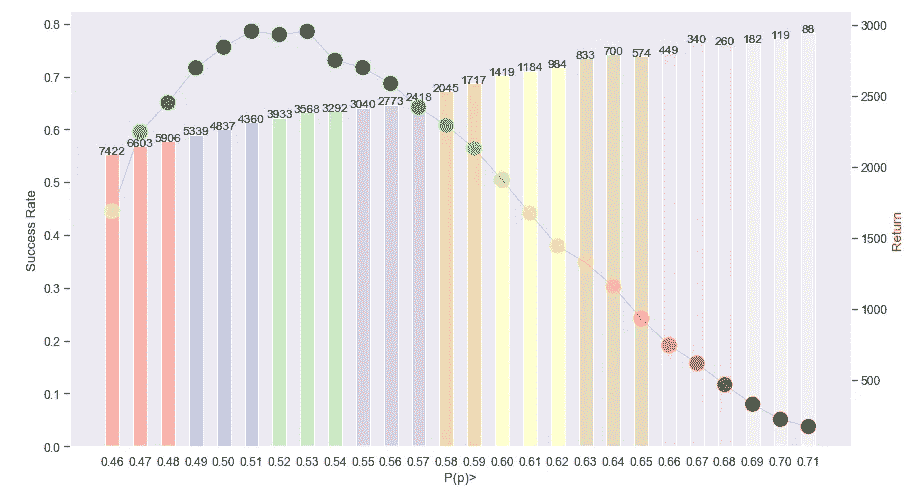

我们的最优案例，比较 P(p)与成功率，回报与案例数之和。[要诀](https://gist.github.com/MauricioLetelier/08e18dbc47869181b0098d7c88bb6a37)。

最佳情况是寻找-3.6%的 S/L 和 3.9%的 T/P，并且我们应该进入 P(p)>0.53 的每种情况的市场。看到这里，我们可以带着自负的微笑结束这一节。每笔交易的预期回报大约是 0.85 USDT，包括费用！

# 5)简单回顾一下，回头见！

我在这里想要做的是将我们的注意力集中在可以给我们模型的商业价值上。我们动态地改变概率过滤器和结果定义来提高我们策略的回报。

进一步的改进可以通过交叉验证的方式进行分析。此外，回报的衡量还可以做很多事情，例如，它可以除以同时平均交易的次数，以标准化每一美元的投资，但我认为这对今天来说已经足够了。

我希望您可以看到，除了模型准确性之外，还有其他可以评估的东西。如果你读过我以前的一篇文章，你就知道接下来会发生什么。我们的主要收获:

*   我们现在是飞镖专家。
*   我们知道我们的目标变量可以根据问题陈述而改变。
*   我们看到了在概率模型上定义不同阈值以最大化我们的业务目标的重要性。
*   我们制作了一个应用案例，以便更好地理解如何在实际环境中应用这一点。

各位，今天就到这里。如果你到了这一步，我希望这二十多分钟是值得的。

如果我感受到你的热情支持——就像我对上一个一样——我可以给你带来新的东西！请在下面留下你的评论和想法！读懂你的想法对我来说超级重要。

> 这是强制性的，你不能用这个策略投资或交易，因为这篇文章的主要目的是讨论目标变量。交易的理念:它只是一个获取真实问题和真实数据的工具。如果你遵循这个未经证实的系统，你很容易失去你的存款！。

如果你喜欢，就在 [Medium](https://medium.com/@maletelier) 和 [Linkedin](http://www.linkedin.com/in/maletelier) 上关注我。如果你想给我写信，我最近在[推特](https://twitter.com/maletelier)上。我很乐意与你交谈！

***来自《走向数据科学》编辑的提示:*** *虽然我们允许独立作者根据我们的* [*规则和指南*](/questions-96667b06af5) *发表文章，但我们并不认可每个作者的贡献。你不应该在没有寻求专业建议的情况下依赖一个作者的作品。详见我们的* [*读者术语*](/readers-terms-b5d780a700a4) *。*