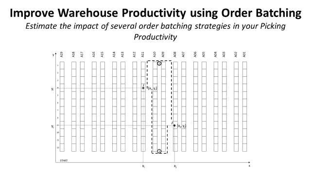
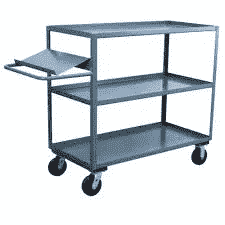
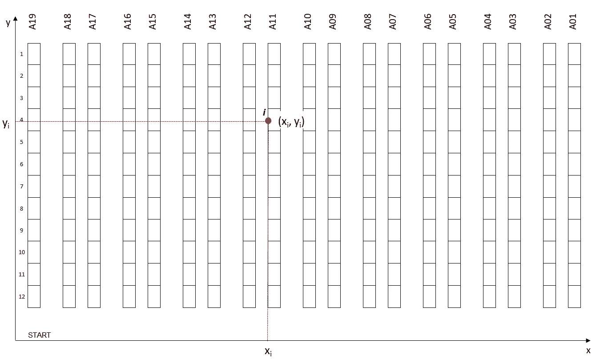
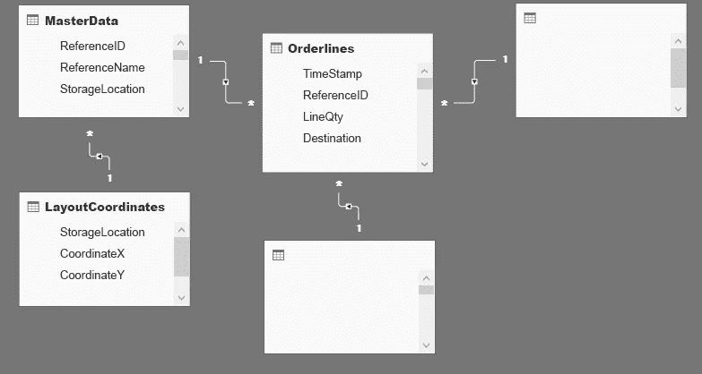
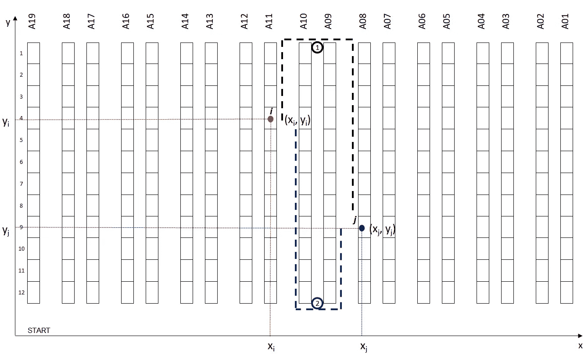
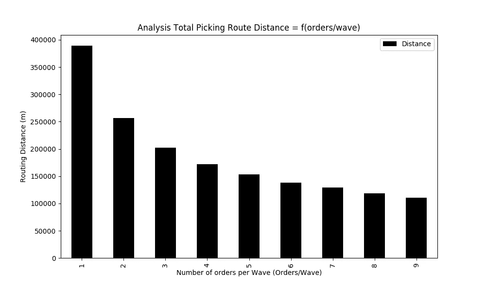

# 使用 Python 的订单批处理提高仓库生产率

> 原文：<https://towardsdatascience.com/optimizing-warehouse-operations-with-python-part-1-83d02d001845?source=collection_archive---------7----------------------->

## 设计一个模拟模型来评估几种单一提货人路线问题策略对您的提货生产率的影响

使用 Python 的订单批处理提高仓库生产率—(图片由作者提供)

在**配送中心(DC)，在[拣货路线](https://www.youtube.com/watch?v=6swvr-J_bJE)中从一个地点到另一个地点的**步行时间可占操作员工作时间的 *60%到 70%* 。

减少步行时间是提高你 DC 总体效率的最有效方法。

(1)场景 1: 每波拣货 1 单的拣货路线—(图片由作者提供)

本系列文章旨在确定如何设计一个模型来模拟几种拣货流程和路径选择方法的影响，通过使用二维仓库模型(x 轴，y 轴)的**单拣货员路径选择问题(SPRP)** 来寻找最优订单拣货。

**SPRP** 是一般**旅行商问题的具体应用**回答问题:

> *“给定存储位置列表和每对位置之间的距离，访问每个存储位置并返回仓库的最短可能路线是什么？”*

SPRP 用于确定提货流程中准备一个或多个订单的最短路线。

💌新文章直接免费放入你的收件箱:[时事通讯](https://www.samirsaci.com/#/portal/signup)

# 一、什么是挑波？

在这项研究中，我们将使用*电子商务类型* DC 的例子，其中商品存储在 4 层货架上。这些货架分为多行(第 1 … n 行)和多条通道(第 1 … A_n 通道)。

## *假设*

(2)仓库提货车—(图片由作者提供)

1.  **物品尺寸:**小而轻尺寸物品
2.  **拣货车:**轻型拣货车，可装载 10 个订单
3.  **拣货路线:**拣货路线在同一地点开始和结束

场景 1 在生产率方面最差，但可以很容易地优化，因为

*   **地点:**订单#1 和订单#2 有共同的提货地点
*   **区域:**订单在一个公共区域中有提货地点
*   **单行订单:**items _ picked/walking _ distance 效率很低

(3)场景 2:应用于场景 1 的波拾取—(图片由作者提供)

优化这一流程的第一个直观方法是将这三个订单组合在一条提货路线中，这一策略通常被称为**波式提货**。

**了解更多关于拣选效率的信息**

我们将建立一个模型来**模拟几波** [**的影响，为制定拣货策略**](https://www.youtube.com/watch?v=XejgbF2m_8g) **中的总行走距离**做好准备。

# 二。测试几种优化算法

## 1.带有存储位置映射的仓库布局

(5)带有 2D 坐标的仓库布局—(图片由作者提供)

基于实际的仓库布局，存储位置用 2-D (x，y)坐标绘制，该坐标将用于测量步行距离。

使用 [**主数据**](https://youtu.be/StIshGrxuMc) **将每个存储位置链接到一个参考。(** *比如参考#123129 位于坐标(，易))。*

然后，您可以将每个订单行链接到一个地理位置进行提货。

## 2.仓库管理系统(WMS)中的订单行

(6)数据库模式—(图片由作者提供)

订单行可以从您的[**【WMS】数据库**](https://www.youtube.com/shorts/MW1QRJs3iuE) 中提取，该表应与[主数据表](https://youtu.be/StIshGrxuMc)相结合，将每个订单行链接到一个存储位置及其在您仓库中的(x，y)坐标。

可以添加额外的表格，以便在您的模型中包含更多的参数，如(目的地、交货提前期、特殊包装、..).

## 3.用于计算领料路线距离的函数

**功能 1:** 计算两个拣货位置之间的距离

(5)仓库中两个存储位置之间的不同路线—(图片由作者提供)

此函数将用于计算从点 **i (xi，易)**和 **j (xj，yj)** 的步行距离。

**目标:**返回从 I 点到 j 点两条潜在路线之间的最短步行距离。

因素

*y_low:你巷子的最低点(y 轴)
y_high:你巷子的最高点(y 轴)*

> 你可以在我的 GitHub 资源库中找到完整的代码:[链接](https://github.com/samirsaci/picking-route)
> 我的作品集与其他项目: [Samir Saci](https://samirsaci.com/)

**代码**

**功能 2:** 下一个最近的位置

(6)下一个存储位置场景—(图片由作者提供)

该功能将用于在几个候选中选择**的下一个位置，以继续您的提货路线。**

**目标:**返回最近的位置作为最佳候选

*(**)我们稍后将会看到，这一选择将会影响整体生产力。*

**代码**

**功能 3:** 创建您的提货路线并计算总步行距离

此功能将用于从一组要准备的订单中创建您的提货路线。

*   **输入:**基于该路线要提货的物品的(x，y)位置列表
*   **输出:**覆盖位置和总步行距离的有序序列

**代码**

## 4.用于创建订单波的函数

**功能 1:** 创建一批 **n 个**订单同时拣货

*   **输入:**订单行数据帧 *(df_orderlines)* ，每波订单数 *(orders_number)*
*   **输出:**映射了波数的数据帧(列: *WaveID* )，总波数 *(waves_number)*

**代码**

**功能 2:** 列出 wave_ID 提货路线的提货地点

*   **输入:**订单行数据帧 *(df_orderlines)* 和波号 *(waveID)*
*   **输出:**您提货路线中包含的地点 I(，易)列表

**代码**

 [## 萨米尔 Samir 供应链组合的数据科学

### 🏭使用高级数学概念的供应链网络优化👨‍🏭仓储的持续改进…

samirsaci.com](http://samirsaci.com) 

# 三。结果和后续步骤

## 1.结果

在设置了衡量提货距离的所有必要功能后，我们现在可以用提货订单行测试我们的提货路线策略。

在这里，我们首先决定从一个非常简单的方法开始

*   **订单波:**订单按收到 OMS 的时间顺序*(时间戳)*分组
*   **拣货路线:**拣货路线策略遵循**下一个最近位置**逻辑

为了评估分批拣货策略对您生产率的影响，我们将针对每批订单的渐进数量进行多次模拟:

1.  **测量总步行距离:**每条路线的订单数增加时，步行距离减少多少？
2.  **记录每波提货路线:**记录每条路线的位置顺序，以便进一步分析

**代码**

(8)5000 条订单行的结果，每条路线的订单比例从 1 到 9—(图片由作者提供)

## 2.后续步骤

*关注我，了解更多与供应链数据科学相关的见解。*

这个解决方案远非最佳

*   订单可以按照提货地点的**地理集群**进行分组，以减少提货人的步行距离

 [## 通过 Python 使用空间聚类提高仓库生产率

### 物流持续改进通过使用拣货功能将订单分批分组，提高仓库拣货生产率

www.samirsaci.com](https://www.samirsaci.com/improve-warehouse-productivity-using-spatial-clustering-with-python/) 

*   **下一个最近位置**策略有其局限性，可通过选择路线记录轻松指出

 [## 使用 Python 的寻路算法提高仓库生产率

### 物流持续改进实现基于旅行商问题的寻路算法

www.samirsaci.com](https://www.samirsaci.com/improve-warehouse-productivity-using-pathfinding-algorithm-with-python/) 

在下一部分，我们将对第一种解决方案进行详细分析，以了解其局限性以及如何改进。

# 关于我

让我们在 [Linkedin](https://www.linkedin.com/in/samir-saci/) 和 [Twitter](https://twitter.com/Samir_Saci_) 上连线，我是一名供应链工程师，使用数据分析来改善物流运营和降低成本。

如果你对数据分析和供应链感兴趣，可以看看我的网站

 [## Samir Saci |数据科学与生产力

### 专注于数据科学、个人生产力、自动化、运筹学和可持续发展的技术博客

samirsaci.com](https://samirsaci.com)