# 通过 Python 使用空间聚类提高仓库生产率

> 原文：<https://towardsdatascience.com/optimizing-warehouse-operations-with-python-part-2-clustering-with-scipy-for-waves-creation-9b7c7dd49a84?source=collection_archive---------22----------------------->

## 通过使用拣货位置空间聚类对订单进行分批分组，提高仓库拣货效率

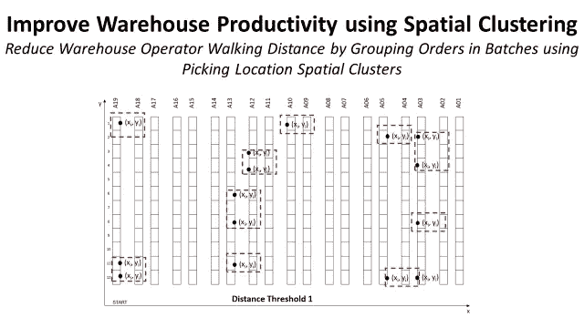

使用 Python Scipy 的空间聚类提高仓库生产率—(图片由作者提供)

本文是关于使用 Python 优化仓库操作的系列文章的一部分。( [*第一部分*](https://medium.com/@s.saci95/optimizing-warehouse-operations-with-python-part-1-83d02d001845) *)*

💌新文章直接免费放入您的收件箱:[时事通讯](https://www.samirsaci.com/#/portal/signup)

# 一.优化的两个杠杆

在第一篇文章中，我们使用以下公式建立了估算一组订单的总提货路线行走距离的基础:

*   **仓库映射:**将每个订单行与仓库中相关的提货地点坐标(x，y)相链接
*   **距离计算:**计算从两个拣货位置的步行距离的功能

我们还决定采用一种简单的方法

*   **拣货路线设计:**给定几个拣货位置的选择，仓库拣货员将总是选择去最近的(下一个最近的位置策略)
*   **订单波动:**订单按照从 OMS 接收时间(时间戳)进行波动排序和分组

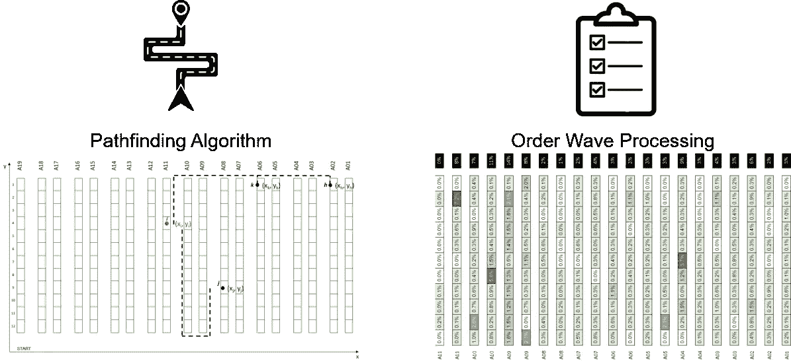

提高我们解决方案性能的两个杠杆—(图片由作者提供)

在研究复杂的算法之前，我们可以尝试用简单的解决方案找到优化算法的方法。

> 你可以在我的 GitHub 资源库中找到完整的代码:[链接](https://github.com/samirsaci/picking-route)

为了帮助操作员找到他们的路，您的操作可以使用语音拾取

# 二。使用提货地点聚类的订单波

单行订单具有位于单一存储位置的优势；通过聚类将几个单行订单分组可以确保我们的提货人停留在划定的区域。

单行订单位于何处？

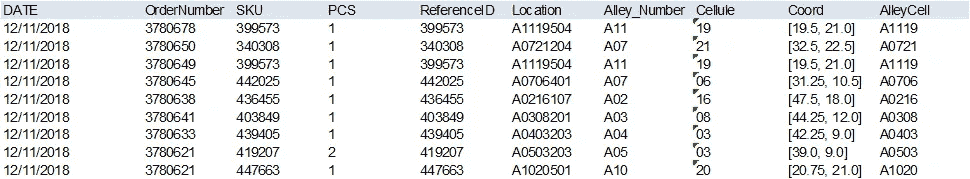

(2)订单行数据框架—(图片由作者提供)

**功能:**计算每个货位单行订单数(%)

**代码**

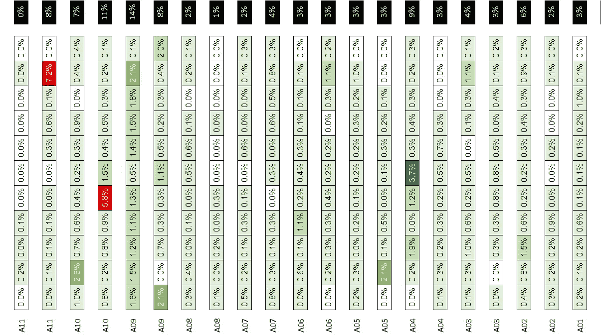

(1)每个存储位置的单行订单行分布— 5，000 个订单行(%)

见识:让我们以上面的分配为例

*   **范围:**23 个通道的 5000 个订单行
*   **单线订单:** **49%的订单位于**A11、A10、A09 胡同

## 1.使用 Scipy 进行提货地点聚类

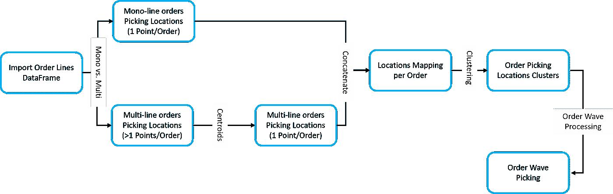

(3)订单行处理，用于使用按提货位置聚类的订单波提货—(图片由作者提供)

**创意:提货地点集群** 通过集群对提货地点进行分组，以减少每条提货路线的步行距离。*(例如:两个地点之间的最大步行距离为< 15 米)*

空间聚类的任务是将一组点组合在一起，使同一聚类中的对象之间的相似性高于其他聚类中的对象。

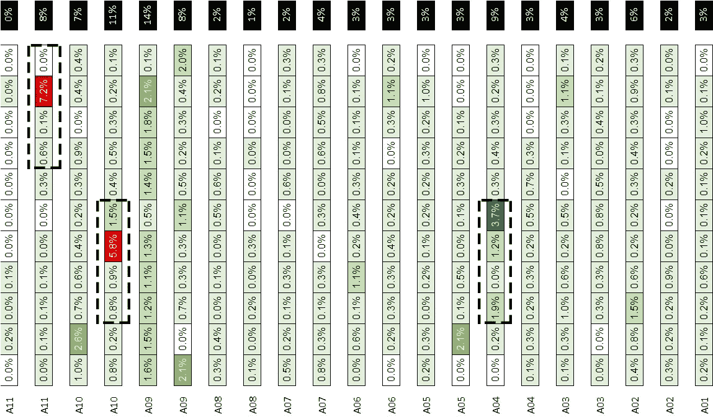

(4)三个提货地点聚类的示例—(图片由作者提供)

这里，*相似性度量*将是从一个位置到另一个位置的步行距离。

*例如，我希望对地点进行分组，确保两个地点之间的最大步行距离为* ***10 米*** *。*

**1|挑战 1:** 欧几里得距离与步行距离

对于我们的特定模型，我们不能使用使用欧几里德距离的传统聚类方法。的确，步行距离(使用 distance_picking 函数)不同于欧几里得距离。

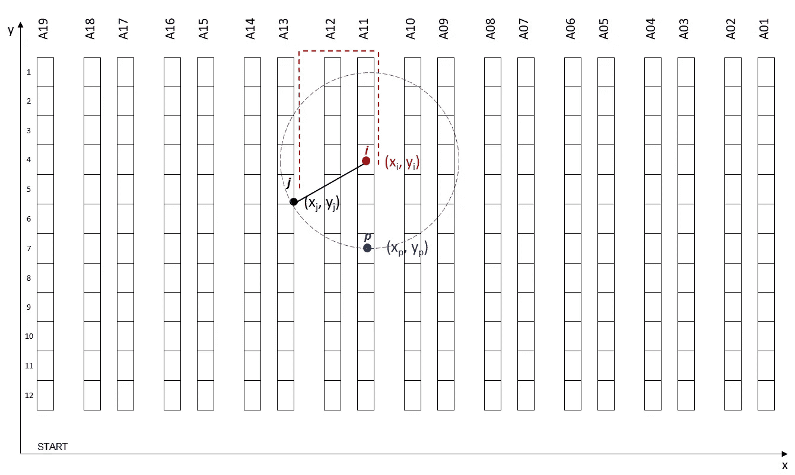

(5)欧几里得与自定义距离示例—(图片由作者提供)

对于这个特定的例子，i (xi，Yi)和两点 p (x_p，y_p)和 j (x_j，y_j)之间的欧几里德距离是相等的。但是，如果我们比较采摘者步行距离，p (x_p，y_p)更接近。

对于此模型，*提货人行走距离*是我们想要减少的具体指标。因此，聚类算法应该使用我们定制的 distance_walking 函数来获得更好的性能。

**示例:**25 米距离内的位置聚类(5000 个订单行)

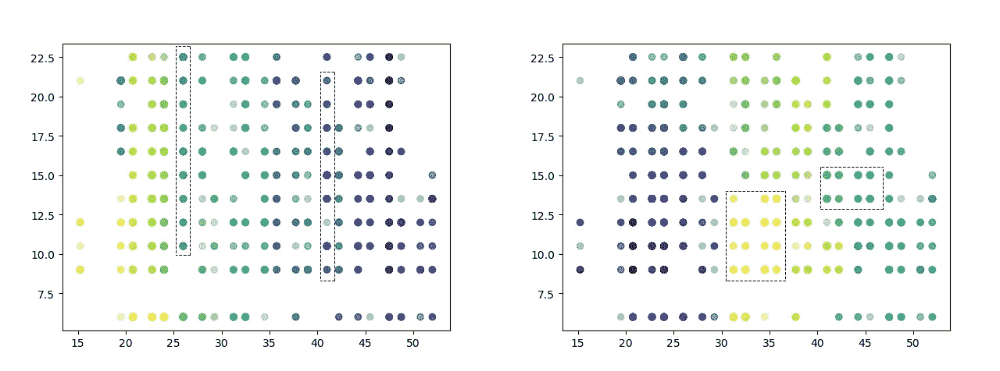

(6)左[使用步行距离聚类] /右[使用欧几里德距离聚类]——(图片由作者提供)

左边使用步行距离的示例是将同一通道内的位置分组，以减少提货路线距离；而正确的示例可以对覆盖几个通道的位置进行分组。

**2 |功能:**聚类为单行订单使用步行距离

对于一组订单，lines 提取单行 *(df_orderlines)* 订单，并使用自定义距离函数 *(dist_method)在距离 *(dist_method)* 内创建存储位置集群。*

下面的 Python 代码使用 **Scipy's ward 和 fcluster** 函数，使用 *distance_func* 度量(步行距离)创建拣选位置的聚类。

**代码**

**3|函数:**使用 ClusterID 映射单行订单

对于一组订单，行提取单行 *(df)* 订单、集群 id 和订单编号该函数将数据帧与集群 ID 进行映射，以创建波形。

**代码**

## 2.多行订单的领料库位聚类

**1 |功能:每个多行订单的质心**

与单行订单不同，多行订单可以涵盖多个领料库位。然而，我们可以将同样的方法应用于存储位置的质心。

**示例:**订单有 3 行，涵盖 3 个不同的提货地点

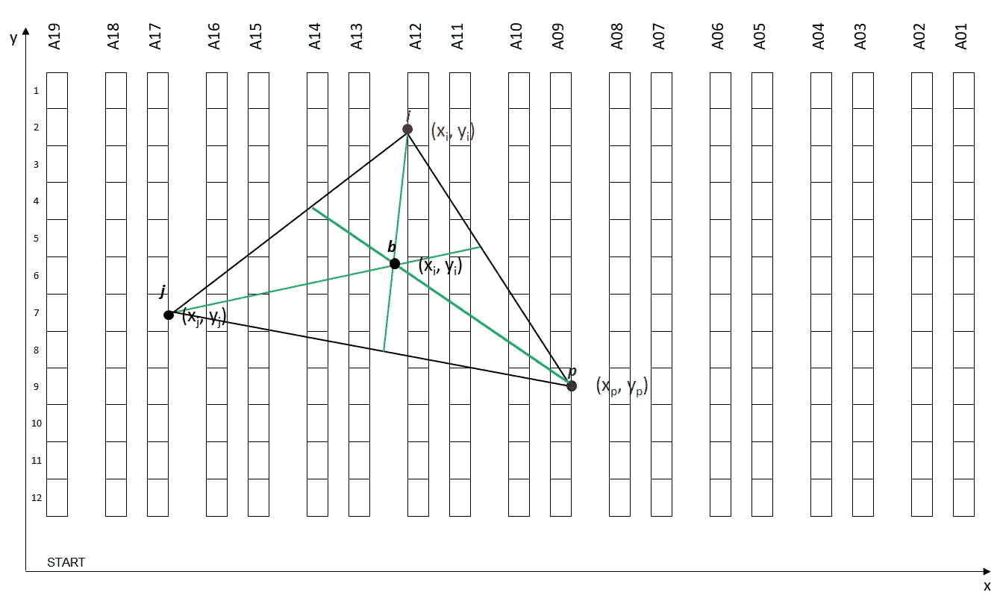

(7)三个采摘地点的质心—(图片由作者提供)

**代号**

使用这个函数后，我们回到单行订单的情况，每个订单有一个点(x，y)。

然后，我们可以对这些点进行聚类，尝试根据最大距离条件对每个地理区域的订单进行分组。

 [## 萨米尔·萨奇

### 数据科学博客，专注于仓储，运输，数据可视化和机器人流程自动化…

samirsaci.com](http://samirsaci.com) 

# 二。模型模拟

综上所述，我们的模型构建，见下图，我们在拾取路线创建之前有几个步骤使用 Wave 处理。

在每一步，我们都有一组可以调整以提高性能的参数:

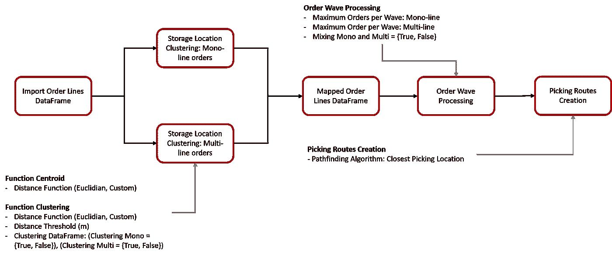

(8)带参数的模型构建—(图片由作者提供)

**1 |比较 3 种波形处理方法**

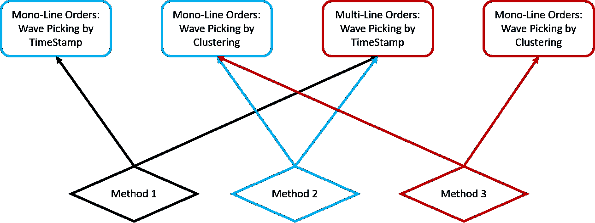

(9)波形处理的三种方法—(图片由作者提供)

首先，我们将评估提货地点集群对订单波处理的影响。

我们将测试三种不同的方法。

*   **方法 1:** 我们不应用聚类(即初始场景)
*   **方法 2:** 我们仅对单行订单应用聚类
*   **方法 3:** 我们对单行订单和多行订单的质心应用聚类。

**模拟场景**

*   **订单行:** 20，000 行
*   **距离阈值:**两个领料位置之间的最大距离(距离阈值= 35 米)
*   **每波订单:**订单 _ 数量在[1，9]

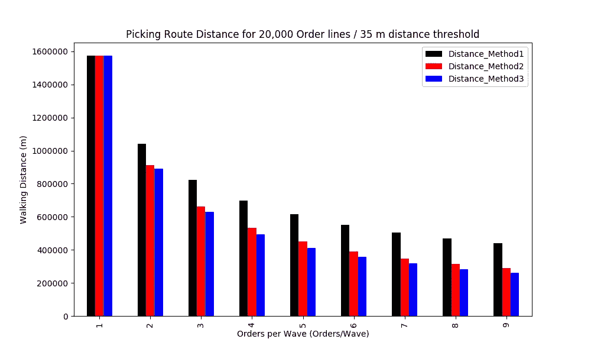

(10)测试 1: 20，000 个订单行/ 35 米距离阈值—(图片由作者提供)

结果

*   **最佳性能:方法 3** 为 **9 个命令/波**带 **83%** 减少行走距离
*   **方法 2 与方法 1:** 单行订单的聚类将步行距离减少了 **34%**
*   **方法 3 与方法 2:** 单行订单聚类将步行距离减少 **10%**

**2 |聚类的调谐距离阈值**

现在，我们已经验证了第一个假设，即方法 3 最适合我们的特定场景 *(20，000 个订单行，35 米距离阈值)*。

让我们看看距离阈值对总步行距离的影响。

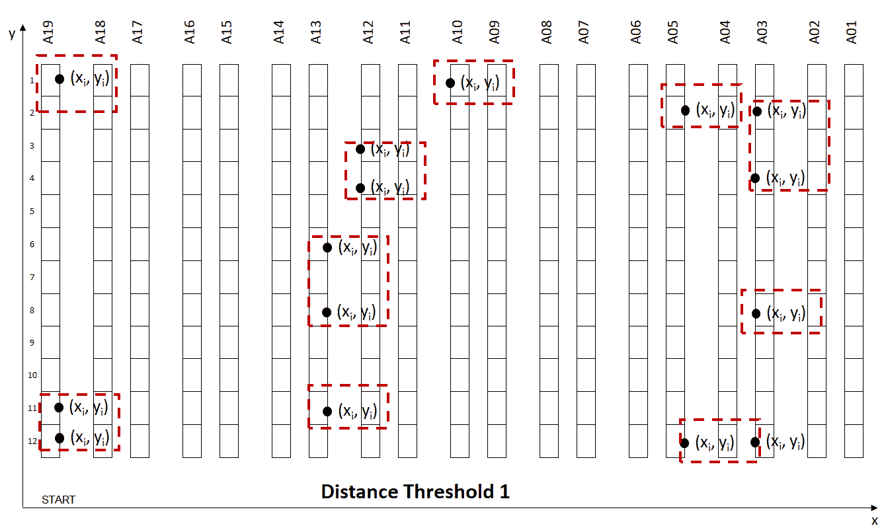

(10)提货地点聚类的不同距离阈值—(图片由作者提供)

两个位置之间的步行距离和波浪大小之间的权衡:

*   **距离短:两个地点之间的步行**距离短，但是每波*(更多波)*的订单更少
*   **距离远:两个地点之间的步行**距离更远，但是每波订单更多*(波数更少)*

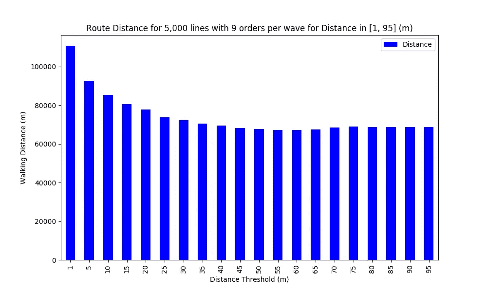

(11)将 5，000 条线分组为 9 阶波，距离阈值为[1，95](米)的结果(图片由作者提供)

我们可以找到一个局部最小值，对于 **Distance_Threshold = 60 m** ，其中距离减少了**39%**vs .**Distance _ Threshold = 1m**。

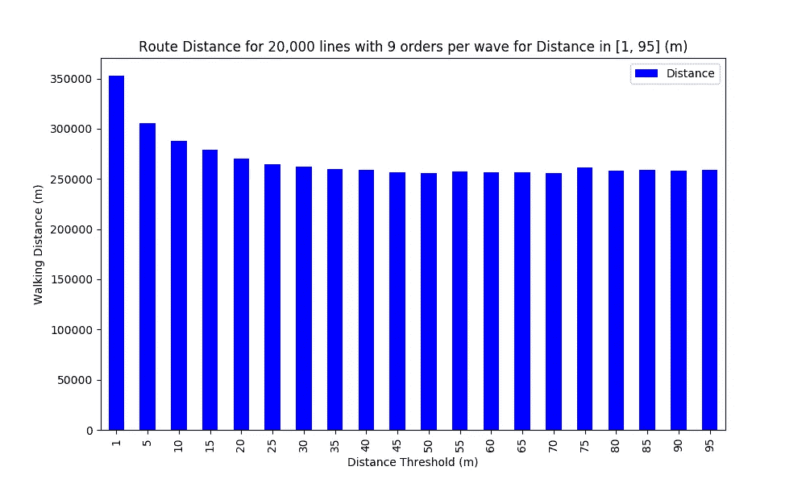

(11)将 20，000 条线分组为 9 阶波的结果，距离阈值为[1，95](米)——(图片由作者提供)

我们可以找到一个局部最小值，对于**距离 _ 阈值= 50 米**，其中距离相对于**距离 _ 阈值= 1 米**减少了 ***27%*** 。

# 四。下一步

*关注我的 medium，了解更多与供应链数据科学相关的见解。*

根据这一反馈，下一步将是:

*   **提货路线创建:**关于提货地点列表，我们如何找到步行距离最短的最佳路线？

 [## 使用 Python 的寻路算法提高仓库生产率

### 物流持续改进实现基于旅行商问题的寻路算法

www.samirsaci.com](https://www.samirsaci.com/improve-warehouse-productivity-using-pathfinding-algorithm-with-python/) 

# 关于我

让我们在 [Linkedin](https://www.linkedin.com/in/samir-saci/) 和 [Twitter](https://twitter.com/Samir_Saci_) 上连线，我是一名供应链工程师，正在使用数据分析来改善物流运营并降低成本。

如果你对数据分析和供应链感兴趣，可以看看我的网站

 [## Samir Saci |数据科学与生产力

### 专注于数据科学、个人生产力、自动化、运筹学和可持续发展的技术博客

samirsaci.com](https://samirsaci.com) 

# 参考

[1] [Samir Saci](https://medium.com/u/bb0f26d52754?source=post_page-----308c258cb66f--------------------------------) ，使用 Python 的订单批处理提高仓库生产率，[链接](https://s-saci95.medium.com/optimizing-warehouse-operations-with-python-part-1-83d02d001845)