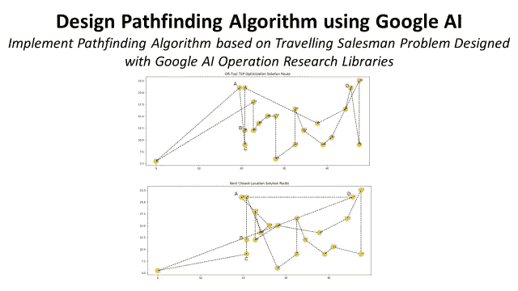
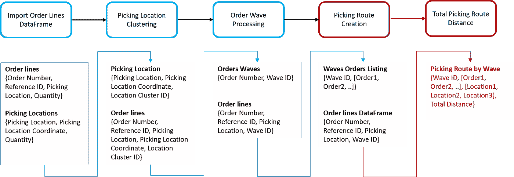
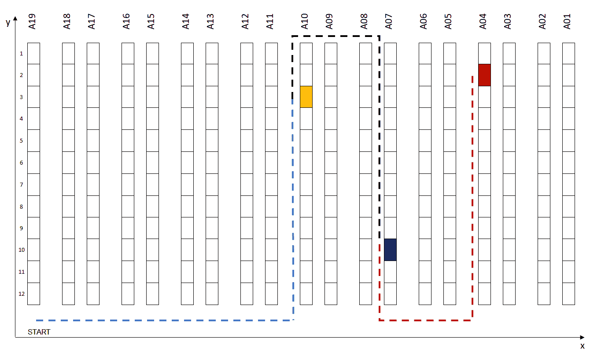
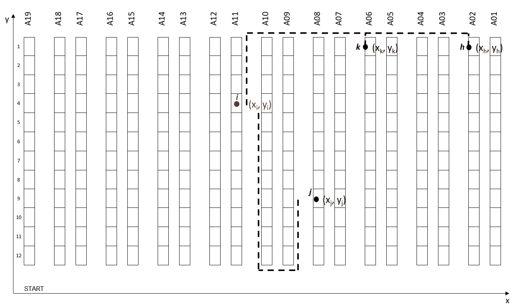
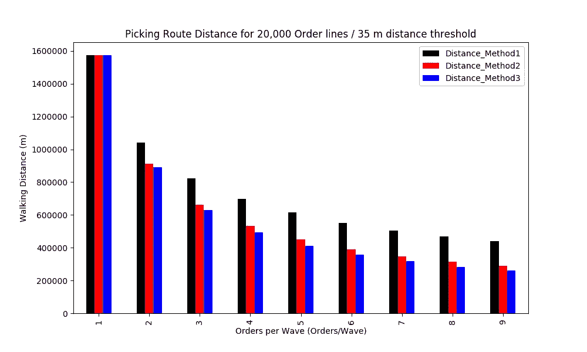
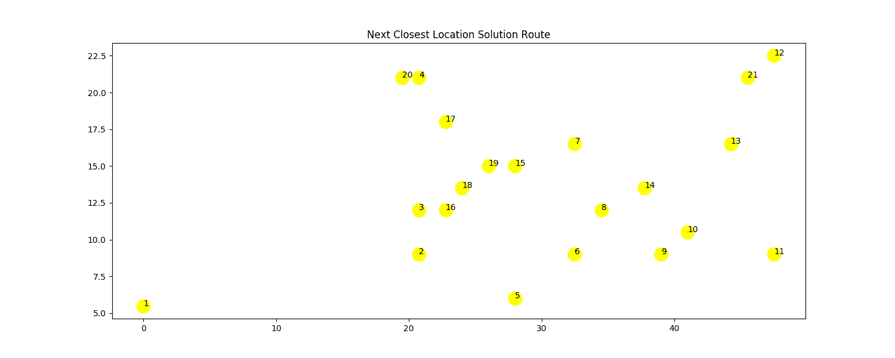
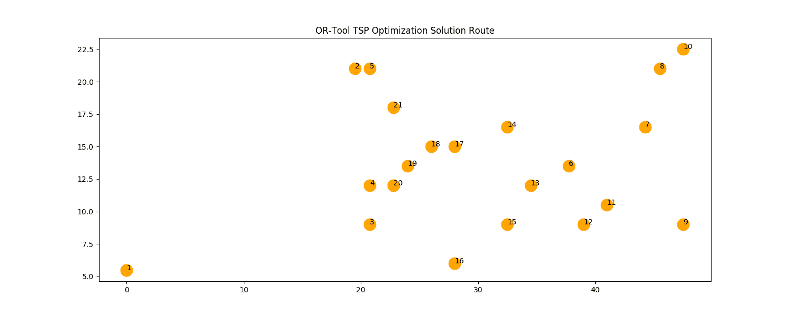
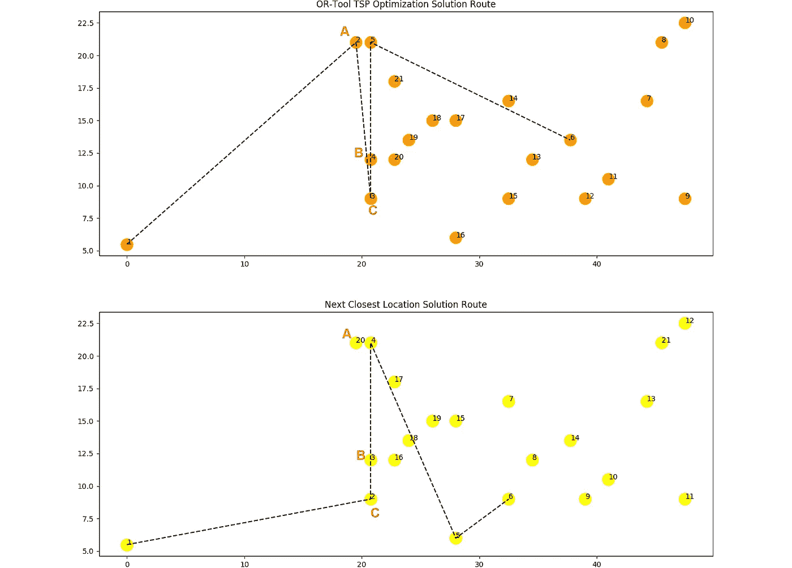
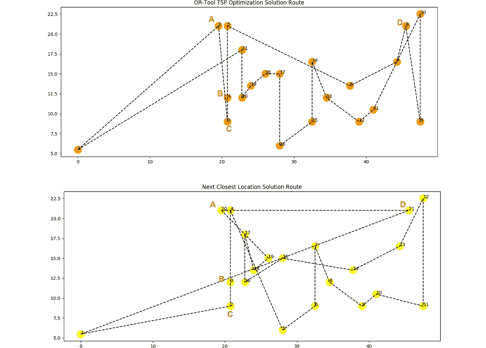

# 使用 Python 的寻路算法提高仓库生产率

> 原文：<https://towardsdatascience.com/optimizing-warehouse-operations-with-python-part-3-google-ai-for-sprp-308c258cb66f?source=collection_archive---------14----------------------->

## 用 Google AI 运筹学库设计的旅行商问题实现寻路算法

使用谷歌人工智能设计寻路算法以提高仓库生产率—(图片由作者提供)

本文是关于使用 Python 优化仓库操作的系列文章的一部分。( [*第一部分*](https://medium.com/@s.saci95/optimizing-warehouse-operations-with-python-part-1-83d02d001845) *，* [*第二部分*](https://medium.com/@s.saci95/optimizing-warehouse-operations-with-python-part-2-clustering-with-scipy-for-waves-creation-9b7c7dd49a84) *)*

💌新文章直接免费放入你的收件箱:[时事通讯](https://www.samirsaci.com/#/portal/signup)

# I .用于拣选路径创建的寻路算法

在第一篇文章中，我们建立了一个模型来测试订单波创建的几种策略，以减少提货的步行距离

*   **仓库映射:**将每个订单行与仓库中相关的提货地点坐标(x，y)相链接
*   **距离计算:**计算从两个提货地点步行距离的功能
*   **提货地点聚类:**功能使用地理(x，y)聚类按波对订单进行分组，以减少同一提货路线上两个地点之间的最大距离

(0)提货路线计算流程图—(图片由作者提供)

在这个阶段，我们有按 wave 分组的订单要一起挑选。对于每一波，我们都有一个仓库提货人需要覆盖的提货地点列表。

下一个目标是设计一个函数来查找一系列位置，使步行距离最小化。

(1)覆盖 3 个提货地点的波浪的潜在路线—(图片由作者提供)

**初始解决方案:**下一个最近位置策略

在第一篇文章中，我们提出了一个使用**次最近位置策略**的初始解决方案。

(2)下一个存储位置场景—(图片由作者提供)

这个简单的策略不需要大量的计算工作。

从位置 **j (xj，yj)** 开始，该函数将把潜在的下一个位置的列表 **[(xj，yj)，(xk，yk)，(xh，yh)]** 作为输入。

使用自定义步行距离函数，输出将是最近的位置，作为要覆盖的下一个位置的最佳候选位置。

> **问题:**是否为拣货路线创建的最优解？

 [## 萨米尔·萨奇

### 数据科学博客，专注于仓储，运输，数据可视化和机器人流程自动化…

samirsaci.com](http://samirsaci.com) 

# 二。旅行商问题在仓库拣货路线设计中的应用

目的:使用**单拣货员路径问题(SPRP)** 为二维仓库寻找拣货路径创建的最优算法。

**是一般**旅行商问题(TSP)** 的具体应用，回答问题:
“给定一个*存储位置*的列表和每对位置之间的*距离，访问每个存储位置并返回仓库的最短可能路线是什么？”***

## ****使用谷歌人工智能的 OR 工具建立旅行推销员模型****

****OR-Tools** 是用于*组合优化的开源工具集。*从大量可能的解决方案中，我们的目标是找到最佳解决方案。**

****

**或者——Google AI 解决方案的工具部分——(来源:Google AI Logo，[链接](https://ai.google/))**

**这里，我们将把他们的旅行推销员问题用例用于我们的具体问题。**

1.  ****改编谷歌-OR 模型****

**我们唯一需要做的调整**

**输入数据**

*   **提货地点坐标列表:
    **List_Coord = [(xi，易)，(x2，y2)，……，(x_n，y_n)]****
*   **步行距离函数
    **f: ((x_i，y_i)，(x_j，y_j)) - >距离(I，j)****

> **你可以在我的 GitHub 资源库中找到完整的代码:[链接](https://github.com/samirsaci/picking-route)
> 我的作品集与其他项目: [Samir Saci](https://samirsaci.com/)**

****代码****

**在 Google OR 的例子中，字典是通过以下方式创建的:**

*   **距离矩阵:**【距离(I，j)为 i in [1，n]为 j in [1，n]】****
*   **车辆数量:**我们场景的 1 辆车****
*   ***货栈=* 起点和*终点*的位置:start = end =**List _ Coord[0]****

****2。模拟:OR-刀具解决方案与最近的下一个位置****

**目标是评估如果我们使用谷歌的 **TSP 优化解决方案或**与我们最初的**最近的下一个位置解决方案**相比，对总步行距离的影响。**

**我们将使用第 2 部分的方法来模拟场景**

*   ****订单行:** 20，000 行**
*   ****距离阈值:**每组中两个提货地点之间的最大距离(距离阈值= 35 米)**
*   ****每波订单:**订单 _ 数量在[1，9]**
*   ****3 种聚类方法**
    方法 1: 不应用聚类
    方法 2:只对单行订单应用聚类；
    方法三:对单行订单和多行订单的质心进行聚类；**

****

**(10)第二条:20，000 订单行/ 35 米距离阈值—(图片由作者提供)**

****最佳性能
方法 3** 为 **9 个订单/波**与 **83%** 减少步行距离**

****问题** 通过应用谷歌的 **TSP 优化解决方案**或在此基础上，我们能减少多少步行距离？**

****代码****

****3。OR-工具解决方案与最近的下一个位置****

**使用这三种方法运行 Waves 后，我们使用以下方法估计提货路线:**

*   ****下一个最近的位置:**距离 _ 初始**
*   ****Google-OR 的 TSP 优化解决方案:** distance_or**
*   ****距离缩减(%):** 100 *(距离初始化-距离初始化)/距离初始化**

**很少见识**

*   ****每波订单:**当每波订单数或-工具更有影响力时**
*   ****方法:**增加波形处理聚类或-工具影响较低时**

****最佳场景结果** 方法 3(所有订单聚类)影响为总行走距离的 **-1.23 %** 。**

****了解有关实施该解决方案的语音拾音系统的更多信息****

** [## 萨米尔·萨奇

### 数据科学博客，专注于仓储，运输，数据可视化和机器人流程自动化…

samirsaci.com](http://samirsaci.com)** 

# **三。了解 TSP 解决方案**

**对于方法 3(对所有订单进行聚类)或工具 TSP 解决方案，将总行走距离减少 **1.23 %** —让我们看一个具体的例子来理解。**

## **最高差距:21 个提货点 60 米**

**一个具体的例子，一个提货波覆盖 21 个地点:**

*   ****或-工具 TSP:** 距离= 384 米**
*   ****下一个最近的位置:**距离= 444 米**
*   ****距离缩减:** 60 米**

****

**(11)21 个位置的下一个最近位置解决方案路线(距离:444 米)——(图片由作者提供)**

****

**(12)21 个地点的 OR-Tool TSP 优化解决方案路线(距离:384 米)——(图片由作者提供)**

## ****次最近位置(NCL)算法的限制****

****TSP 点 2(点 A)**
在这个具体的例子中，我们可以看到 TSP 优化解决方案对于第二点(19.5，21)的好处**

****

**(13)NCL vs TSP 的具体例子—(图片由作者提供)**

**从点 1 开始，三个最近的点是{A，B，C}**

1.  **离点 1 最近的点是 A**
2.  **NCL 点直达 C，TSP 从 A 出发**
3.  **TSP 一次覆盖{A、B、C}，而 NCL 只覆盖{B、C}，让 A 稍后覆盖**

****

**(14)NCL vs TSP 的具体例子—(图片由作者提供)**

****NCL 点 21****

**在上例中，在点 20(点 A)之后，仓库提货人仍然需要在到达仓库(点 1)之前到达点 21(点 D)。这个额外的距离极大地影响了这一波的 NCL 效率。**

# **四。结论**

***关注我，了解更多与供应链数据科学相关的见解。***

**将旅行商问题解决方案应用于拣选路径的创建，可以减少总行走距离，提高整体生产率。**

**结合智能订单波处理，它可以通过找到覆盖最大数量位置的最短路径来优化要覆盖的大量提货位置的波的提货顺序。**

# **关于我**

**让我们在 [Linkedin](https://www.linkedin.com/in/samir-saci/) 和 [Twitter](https://twitter.com/Samir_Saci_) 上连线，我是一名供应链工程师，正在使用数据分析来改善物流运作和降低成本。**

**如果你对数据分析和供应链感兴趣，可以看看我的网站**

** [## Samir Saci |数据科学与生产力

### 专注于数据科学、个人生产力、自动化、运筹学和可持续发展的技术博客

samirsaci.com](https://samirsaci.com) 

# 参考

[1] Google OR-Tools，用 OR-Tools 求解 TSP，[链接](https://developers.google.com/optimization/routing/tsp)

[2] [Samir Saci](https://medium.com/u/bb0f26d52754?source=post_page-----308c258cb66f--------------------------------) ，使用 Python 的订单批处理提高仓库生产率，[链接](https://s-saci95.medium.com/optimizing-warehouse-operations-with-python-part-1-83d02d001845)

[3] [Samir Saci](https://medium.com/u/bb0f26d52754?source=post_page-----308c258cb66f--------------------------------) ，使用 Python Scipy 的订单批处理空间聚类提高仓库生产率，[链接](https://s-saci95.medium.com/optimizing-warehouse-operations-with-python-part-2-clustering-with-scipy-for-waves-creation-9b7c7dd49a84)**