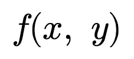
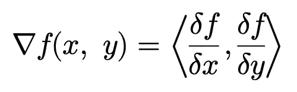
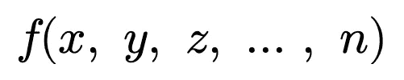
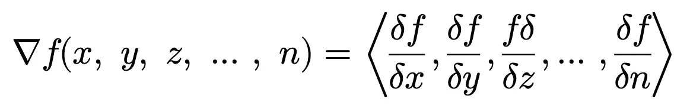

# Python 中的希腊选项

> 原文：<https://towardsdatascience.com/option-greeks-in-python-97980df3ab0b?source=collection_archive---------26----------------------->

## 自动偏微分 JAX


来自[佩克斯](https://www.pexels.com/photo/human-statue-under-clear-sky-1251720/?utm_content=attributionCopyText&utm_medium=referral&utm_source=pexels)的[安德里亚·切](https://www.pexels.com/@andreea-ch-371539?utm_content=attributionCopyText&utm_medium=referral&utm_source=pexels)的照片

T4 期权对每个期权交易者来说都是必不可少的。但是，希腊人到底是什么？希腊人是布莱克-斯科尔斯方程关于每个变量的偏导数…

**希腊人**

*   δ—δ—基础资产的一阶偏导数
*   γ—γ—关于基础资产的二阶偏导数
*   Vega — *v* —关于波动率的偏导数
*   θ—θ—呼气前时间的偏导数
*   ρ—ρ—相对于给定利率的偏导数

用简单的英语来说，希腊人告诉我们，当只有那个参数变化时(所有其他参数保持不变)，期权的价格是如何变化的。交易平台通常会自动计算每份合约的希腊价格。然而，当将市场数据流式传输到 Python 时，或者使用您自己的定价模型时，您将需要自己计算这些值。尽管布莱克-斯科尔斯希腊方程有闭合形式的解(这大大加快了他们的计算速度)。然而，我认为这将是对 Python 库 JAX 的一个很酷的介绍，它可以用来自动计算任何函数的梯度。

源自 JAX 的希腊模型的美妙之处在于，它可以用于任何定价模型，而不仅仅是 Black-Scholes 模型，让对冲外来风险变得不那么痛苦。

## 什么是梯度向量？

梯度向量，或简称为*梯度*，是任何给定多变量函数的偏导数的集合。

给定以下功能 *f* …



梯度-∇-如下…



这一概念适用于所有函数，不管维度如何…



关于渐变的更多信息，请查看[渐变矢量](/the-gradient-vector-66ad563ab55a)。

## 使用 JAX 的布莱克-斯科尔斯梯度

你会注意到这两个概念的交集在于偏导数。希腊人(γ除外)是布莱克-斯科尔斯方程对每个变量的一阶偏导数。如果我们能从布莱克-斯科尔斯方程推导出梯度，我们将有一个函数能产生 5 个希腊人中的 4 个！

JAX 是由谷歌开发和维护的库，主要用于机器学习，提供了一种自动计算梯度函数的简单方法。

不幸的是，在撰写本文时，JAX 仅在 IOS 上受支持。

在我们开始之前，重要的是要注意，为了使用 JAX，我们将需要通过 JAX 本身引用任何线性代数(numpy)或统计分布(scipy)

我已经为欧式调用建立了类，并放入了结构正确的 Python 以用于 JAX…

通常，如果变量的类型不是浮点型，JAX 会返回错误，因为有多种近似技术用于求解导数。你会发现在上面的所有课程中都提到了*。因为这个原因*。**

让我们实现 JAX 的 grad 函数来自动计算希腊人…

在上面的代码中，在计算每个期权价格后，我添加了一个调用 JAX 函数的字段。grad 函数既接受函数，也接受关于梯度中包含哪些参数的元组。在计算完 gradient_func 之后，我用它分别给 delta，vega，theta，rho 赋值。您还会注意到，我们需要做一些调整，因为 vega 和 rho 是以百分比表示的，而 theta 是按年计算的。

现在让我们使用这个类来计算希腊人的一个示例选项…

为了实现这些类，我们按照以下顺序创建了一个选项参数的 JAX-numpy 数组…

*   资产价格
*   波动性
*   执行价格
*   到期时间(年化)
*   无风险利率

然后我们创建一个欧式期权类的实例，并使用*填充 JAX-numpy 数组。astype('float')* 避免计算梯度时出现错误。最后，我们打印使用梯度函数导出的希腊人的值…

```
0.6300359 3.1931925 -1.3295598 1.3750976[Finished in 1.253s]
```