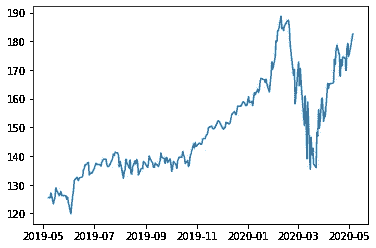
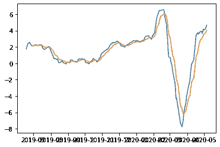
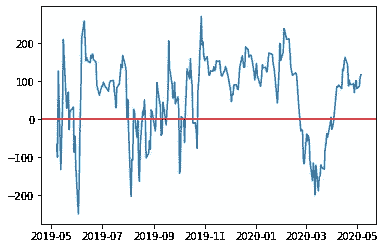
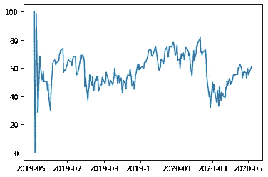

# 使用 Python 进行期权交易技术分析

> 原文：<https://towardsdatascience.com/options-trading-technical-analysis-using-python-f403ec2985b4?source=collection_archive---------16----------------------->

照片由[马克·芬恩](https://unsplash.com/@mrkfn?utm_source=medium&utm_medium=referral)在 [Unsplash](https://unsplash.com?utm_source=medium&utm_medium=referral) 上拍摄

我最近发现了今年内的期权交易。这是一次有趣的经历，每次我钻研金融交易领域的其他话题时，我都会学到一些新东西。

最近偶然看到 Option Alpha 的一个视频叫[技术分析——新手期权交易](https://www.youtube.com/watch?v=fsNQr3poE3g&t=626s)。他提到了三个技术分析指标，非常适合我这样的新手。这些指标是 [MACD](https://www.investopedia.com/terms/m/macd.asp) 、 [CCI](https://www.investopedia.com/terms/c/commoditychannelindex.asp) 和 [RSI](https://www.investopedia.com/terms/r/rsi.asp) 。我决定将它们编程到 Python 中，以进一步理解这些指标是如何工作的。他提到，这三者应该结合使用，才能看出股票的走向。

## 概述

完整代码访问[此处](https://colab.research.google.com/drive/18ONBzVzPG3ijGkCVcuNQIy9gW-EGD0ri?usp=sharing)。

因此，我喜欢在开始编码之前，先草拟出我需要的东西。我发现我需要一年的股票数据。因此，我只需要从当前日期开始一年的数据，为此我将使用`datetime`和`pandas_datareader`。我还将继续使用一个技术分析库，它将为我做所有的计算，名为`[ta](https://technical-analysis-library-in-python.readthedocs.io/en/latest/)`。然后作为加分项，我也会用`matplotlib`把这些数据全部可视化。

让我们先从我们的进口货开始吧。

我知道很乱，但我们继续吧。我将使用微软作为这个代码的例子。股票代码是`MSFT`让我们把它设置为一个变量。然后我将使用`datetime`，以便检查当前日期，然后输出该日期作为我们数据的起点。我们将使用`pandas_datareader`从雅虎获取股票数据。然后，我们将它放入一个数据帧中，并使用来自`ta.utils`的`dropna`删除所有空值。

代码应该是这样的，我们的数据帧应该是这样的。

我们现在可以使用`plt.plot(df[‘Close’])`绘制图表。根据你设定的日期和股票，我看到的可能与你的不同。

现在有趣的是技术指标，我不是财务顾问，所以我对每个指标的设置都没有经过验证。所以请注意，我在经济上不对你负责。

## MACD

所以 MACD 是一个很好的指标，它会告诉你何时买入或卖出。你要寻找的主要东西是当这些线互相交叉的时候。对于这个例子，如果蓝线跌破橙线，我们想卖出我们的头寸。如果蓝线高于橙线，我们就买入。下面是代码和下面的情节。

## CCI

CCI 也是一个类似的指标。除了我们想关注它在哪里达到零。如果它是正的，触及零，我们想卖，如果它是负的，触及零，我们想买。我还加了一行零是为了更好的形象化情节。下面提供了代码和图像。

## RSI

下一个指标与其他两个有点不同，因为它不是趋势指标。这是一个动量指标，意味着它衡量股价的涨跌。这些的标准是看它是高于 70 还是低于 30。意思是当价格上涨时卖出，当价格下跌时卖出，这是一个很好的买入指标。

## 结论

现在我们有了这些指标，我个人的下一步是创建一些 if else 语句，它将告诉我是否购买，如果所有这些指标都是绿色的，可以使用。如果他们也处于买入的有利位置，否则我也会创建一些声明，告诉我持有或保持关注。

***来自《走向数据科学》编辑的提示:*** *虽然我们允许独立作者根据我们的* [*规则和指南*](/questions-96667b06af5) *发表文章，但我们并不认可每个作者的贡献。你不应该在没有寻求专业建议的情况下依赖一个作者的作品。详见我们的* [*读者术语*](/readers-terms-b5d780a700a4) *。*

如果您喜欢这篇文章，请随意查看我的其他 Python 文章，这些文章也深入研究了金融交易领域:

 [## 使用 Python 和 Robinhood 创建一个简单的低买高卖交易机器人

### 所以我最近一直在折腾 Robinhood，一直在努力理解股票。我不是财务顾问或…

towardsdatascience.com](/using-python-and-robinhood-to-create-a-simple-buy-low-sell-high-trading-bot-13f94fe93960)  [## 使用 Python 和 Robinhood 构建一个钢铁秃鹰期权交易机器人

### 所以我最近发现了期权交易的潜在收益。

towardsdatascience.com](/using-python-and-robinhood-to-build-an-iron-condor-options-trading-bot-4a16e29649b0)  [## 使用 Python 将股票数据可视化为蜡烛图

### 烛台数据是一个非常重要的方式来显示数据在股票市场如何移动。

towardsdatascience.com](/using-python-to-visualize-stock-data-to-candlestick-charts-e1a5b08c8e9c)