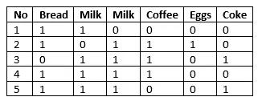
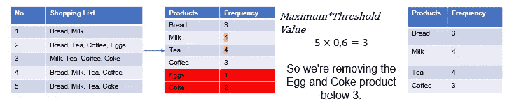
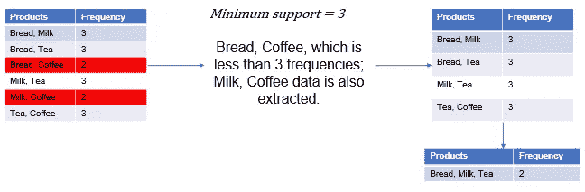

# Orange 数据挖掘工具和关联规则

> 原文：<https://towardsdatascience.com/orange-data-mining-tool-and-association-rules-caa3c728613d?source=collection_archive---------32----------------------->

奥列格·马尼通过[像素](https://www.pexels.com/photo/grocery-cart-with-item-1005638/)拍摄的照片

在本文中，将使用 Orange 数据挖掘工具来研究关联分析。Apriori 算法将用于创建关联规则。算法步骤将显示在一小组市场购物数据上。

# 关联规则

关联分析是试图揭示隐藏在数据集中的 if-else 规则的研究。分类数据通常会产生良好的结果。关联分析最常见的例子是购物篮分析。此外，它还具有生物信息学、疾病诊断、web 挖掘和文本挖掘等广泛的用途。

# 篮子分析

在购物篮分析中，我们将购物者购买的产品保存在一个列表中，并想知道哪些产品在一起销售得更多。

# 数据

假设我们有一个数据，包含市场中的 5 笔交易，比如:
1 面包、牛奶
2 面包、茶、咖啡、鸡蛋
3 牛奶、茶、咖啡、可乐
4 面包、牛奶、茶、咖啡
5 面包、牛奶、茶、可乐

我们可以看到，在数据集中，大多数购买茶的购物者也会购买咖啡。现在，让我们使用一键编码来显示数据集。数据集可以从[这里](https://drive.google.com/file/d/1HLU03icAaOgwVkhTt-3_C1P4dFz8-np_/view?usp=sharing)下载。

一键编码

# 关联规则的一些定义

**产品列表:**篮子中所有产品的列表，即{面包、牛奶、鸡蛋}。

**支持计数(σ):** 购买时传递的商品数量，即σ({牛奶、茶、咖啡}) = 2

**支持率:**产品列表在交易所中的比例，即 s({牛奶、茶、咖啡}) = 2/5

**产品列表频率:**特定值以上产品的支持率列表。

这里有更多关于关联规则的信息。在这篇博客中，我将展示如何使用 Orange 工具利用关联规则。

# Apriori 算法

Apriori 算法是购物篮分析中最常用的算法。该算法从指定阈值开始。例如，我们将最低支持阈值设为 60%。

**第一步:**按频率输入产品列表，找出出现频率最高的产品。将产品数量乘以阈值，并删除低于您找到的值的产品。

**步骤 2:** 将产品数量乘以阈值，并移除低于您找到的值的产品。

第二步

**第三步:**为二元乘积集创建频率表。

第三步

**第四步:**为三元乘积集创建频率表。

# 橙色数据挖掘工具

图片来自[橘子](https://orange.biolab.si/)

[Orange](https://orange.biolab.si/) 是和开源机器学习和数据可视化。

一些重要特征；

*   免费、开源
*   机器学习和数据可视化工具
*   简单的图形界面和附加支持
*   也可以开发 Python 代码。

# 关联规则与橙色工具

安装 Orange 后，选择选项> >附加组件并安装 [Associate](https://pypi.python.org/pypi/Orange3-Associate) ！我们正在设置附加组件。您可以下载数据集(。csv)我们在篮子分析中使用[这个地址](https://drive.google.com/file/d/1HLU03icAaOgwVkhTt-3_C1P4dFz8-np_/view?usp=sharing)。打开数据集后，我们可以显示对频繁项集支持最少的规则。最后，我们可以用关联规则来展示关联规则。

就这样，现在可以使用自己的数据集来查找隐藏在数据中的 if-else 规则了。

我也在我的[个人网站](http://canererden.com/2020/05/06/birliktelik-analizi-kurallari/)分享这个土耳其语的博客。

# 参考

*   穆罕默德·坎塔尔季奇。概念、模型、方法和算法。约翰威利父子公司，2011 年。
*   苏马蒂，赛，西瓦纳丹。数据挖掘及其应用介绍。C. 29。斯普林格，2006 年。
*   谭，彭宁，迈克尔施泰因巴赫，维平库马尔。数据挖掘简介。培生教育印度，2016。
*   走向数据科学。《走向数据科学》。Eriş im 29 Mart 2020。[https://towardsdatascience.com/.](/.)
*   范德普拉斯，杰克。Python 数据科学手册。奥雷利传媒。Inc，2017。
*   [https://medium . com/@ ek rem . hatipoglu/machine-learning-association-rule-mining-birliktelik-kural-% C3 % A7 % C4 % B1kar % C4 % B1m % C4 % B1-apriori-algorithm-4326 b8 f224 C3](https://medium.com/@ekrem.hatipoglu/machine-learning-association-rule-mining-birliktelik-kural-%C3%A7%C4%B1kar%C4%B1m%C4%B1-apriori-algorithm-4326b8f224c3)
*   [https://towards data science . com/association-rules-2-aa9a 77241654](/association-rules-2-aa9a77241654)