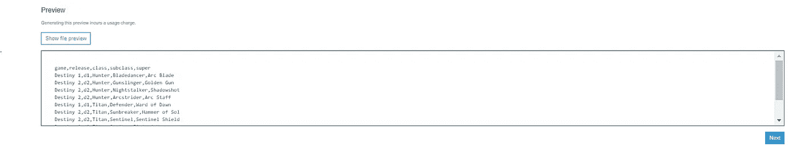
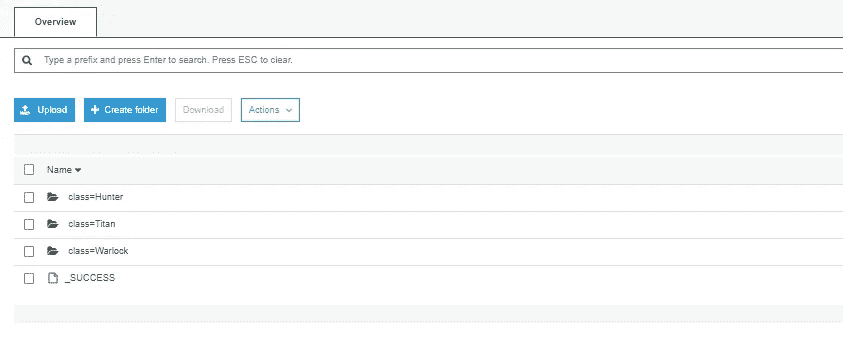
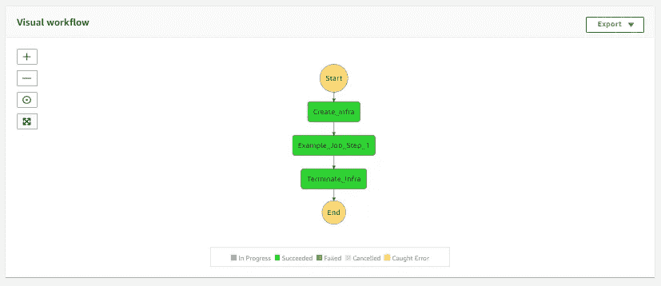
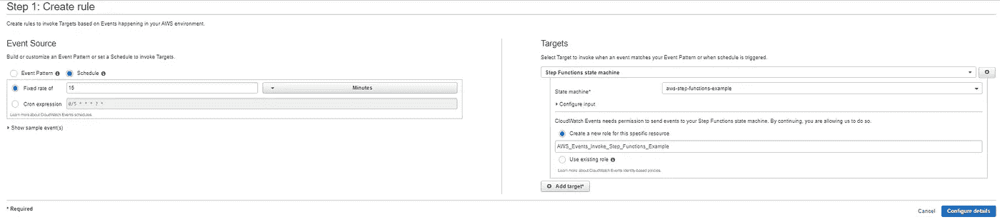
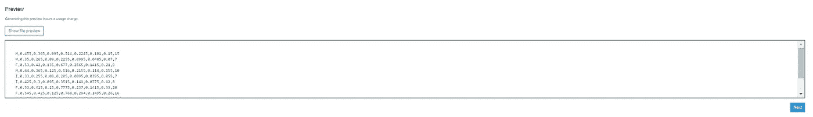
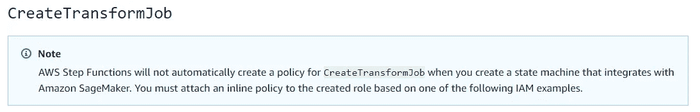
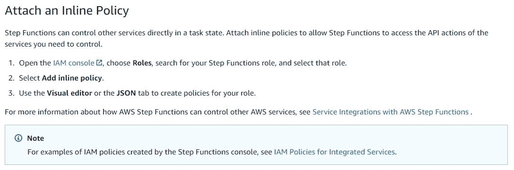
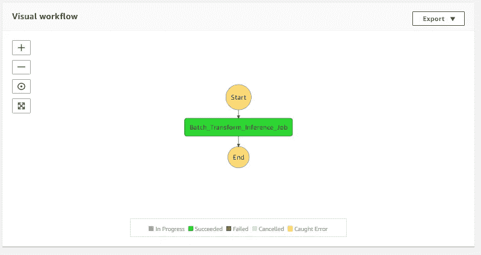
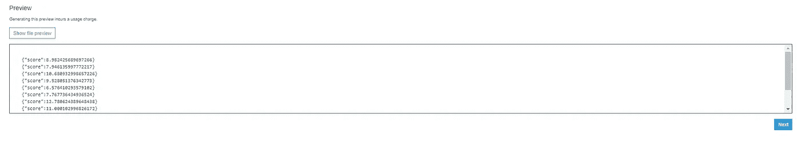

# 通过 AWS 步骤功能编排瞬态数据分析和 ML 工作流

> 原文：<https://towardsdatascience.com/orchestrating-transient-data-analytics-workflows-via-aws-step-functions-c9e8309f63bf?source=collection_archive---------31----------------------->

## AWS 自动化提示和技巧

[郭锦恩](https://unsplash.com/@spacexuan?utm_source=medium&utm_medium=referral)在 [Unsplash](https://unsplash.com?utm_source=medium&utm_medium=referral) 上拍照

# 介绍

***AWS 步骤功能*** 是一个完全托管的服务，旨在协调和链接一系列步骤，为自动化任务创建一个称为状态机的东西。它支持可视化工作流，状态机通过 ***亚马逊状态语言*** ( *ASL* )定义为 JSON 结构。此外，状态机可以通过***Amazon cloud watch***作为事件规则 cron 表达式进行调度。

在这篇博客中，我将带你经历 1。)如何通过 ***亚马逊 EMR*** 和 2 来编排数据处理作业。)如何通过 ***亚马逊 SageMaker*** 在一个训练好的机器学习模型上应用 batch transform 来编写预测。*步骤功能*可以与多种 ***AWS*** 服务集成，包括: *AWS Lambda* ， *AWS Fargate* ， *AWS Batch* ， *AWS Glue* ，*亚马逊 ECS* ，*亚马逊 SQS* ，*亚马逊 SNS* ，*亚马逊 DynamoDB*

# 示例 1:通过 Amazon EMR 编排数据处理作业

1a。)让我们在*亚马逊 S3* 中查看我们的输入样本数据集(来自我最喜欢的视频游戏的虚拟数据)。

作者图片

1b。)接下来，我将创建一个状态机，它通过 *ASL* 启动一个 *EMR* 集群(一组 *EC2* 实例)。

1c。)现在，我们可以通过向集群提交一个作业并在完成后通过 *ASL* 终止基础架构来执行一些数据处理(简单的按列分区)。让我们也在 *S3* 中检查我们的输出数据。

作者图片

1d。)这里是完整的 JSON *ASL* 结构和正在进行的可视化工作流截图。

作者图片

1e。)最后，让我们通过 *CloudWatch* 调度每 15 分钟执行一次，作为一个简单的 cron 表达式(0 */15 *？* *).

作者图片

总之，对于这个例子，您可以利用*步骤函数*来自动化和调度您的数据处理作业。复杂程度通常取决于数据量，可以是单台 *EC2* 机器上的几个简单步骤，也可以是在同一个集群上并行分配多个作业，或者跨多个集群使用不同的实例类型。我建议在 JSON *ASL* 中为选定的软件(即 YARN、Spark、Hive、Sqoop)包含额外的 *EMR* 调优配置，以优化工作性能。此外，明智地选择 *EC2* 实例类型的数量和种类，以节省成本和执行时间。您的决定应该主要取决于需要处理的总数据量和作业类型(CPU 或内存受限)。

到下一个例子…

# 示例 2:通过 Amazon SageMaker，使用经过训练的 ML 模型对数据进行批量转换以进行推理

2a。)为了便于理解数据，让我们查看原始的带标签的(因变量是最后一列名为*环*的)训练数据集(来自 *UCI 机器学习库*的鲍鱼)在 *S3* 中。经过训练的模型通过物理测量来预测鲍鱼(一种贝类)的年龄。

[https://archive.ics.uci.edu/ml/datasets/abalone](https://archive.ics.uci.edu/ml/datasets/abalone)

作者图片

2b。)接下来，让我们创建 *ASL* 结构，该结构触发原始未标记(无*环*列)批处理数据集上的批处理转换作业，该数据集需要通过存储在 *S3* 中的训练模型进行推理。 ***请注意，目前您必须将内联策略附加到为状态机*** 选择的角色。

图片来自[亚马逊网络服务](https://docs.aws.amazon.com/step-functions/latest/dg/sagemaker-iam.html#sagemaker-iam-createtrainingjob)

图片来自[亚马逊网络服务](https://docs.aws.amazon.com/step-functions/latest/dg/procedure-create-iam-role.html)

2c。)最后，我们可以查看*步骤功能*可视化工作流程以及添加了预测分数栏的作业输出结果。注意，该模型是一个流水线模型，包括预处理(一个热编码、缩放等。)数据，然后将其发送到监督学习算法。

作者图片

作者图片

总之，对于本例，您可以利用*步骤功能*来自动化和调度您的机器学习作业(预处理、训练、调优、模型托管、自助服务&批量推理)。*步骤函数*和 *SageMaker* 集成支持以下 API:`CreateEndpoint`、`CreateEndpointConfig`、`CreateHyperParameterTuningJob`、`CreateLabelingJob`、`CreateModel`、`CreateTrainingJob`、`CreateTransformJob`。

# 结论

这两个例子涵盖了 ***AWS*** 服务能够扩展数据工程和机器学习工作流的一小部分。感谢你阅读这篇博客。