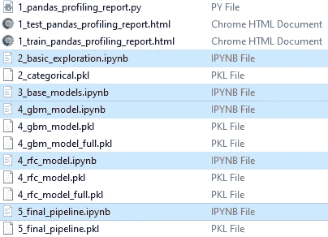
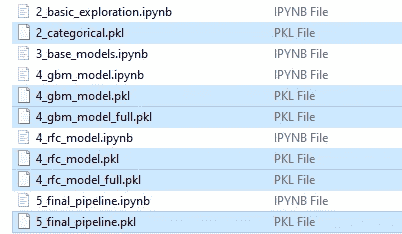
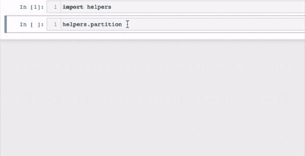
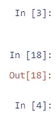

# 根据以下建议整理你的 Jupyter 笔记本

> 原文：<https://towardsdatascience.com/organise-your-jupyter-notebook-with-these-tips-d164d5dcd51f?source=collection_archive---------2----------------------->

## 整理数据科学工作流程的实用技巧

数据科学家做大量的探索和实验。Jupyter Notebook(从这里开始的笔记本)是一个探索和实验的好工具。然而，当使用笔记本电脑时，事情会很快变得杂乱无章。保持你的工作流程干净、有条理和易于理解是一项重要的技能，它将在你的职业生涯中很好地为你服务。在这篇文章中，我将分享一些关于如何让你的笔记本和工作流程更有条理的小技巧。


[阿里·叶海亚](https://unsplash.com/@ayahya09?utm_source=medium&utm_medium=referral)在 [Unsplash](https://unsplash.com?utm_source=medium&utm_medium=referral) 上的照片

# 📍提示 1。对每个主要任务使用单独的笔记本

不要把从探索性数据分析到建模的工作流程放在一个巨大的笔记本里，最好把它们分成几个逻辑部分，并描述性地给每个笔记本命名。让我们看一个例子:



看看这个例子，我们有几个笔记本。从名字就能看出笔记本的顺序。例如，我们可以猜测 *3_base_models.ipynb* 在 *4_gbm_model.ipynb* 之前，而 *4_gbm_model.ipynb* 和 *4_rfc_model.ipynb* 可能正在并行探索两个选项。如果我们将这两个重命名为 *4A_gbm_model.ipynb* 和 *4B_rfc_model.ipynb* ，那么我们也可以用稍微不同的方式在名称中暗示顺序。

您可以拥有比示例更多或更少的笔记本。也就是说，笔记本的确切数量并不重要。这里的关键思想是让逻辑上的主要任务(这取决于你如何定义它)分散开来，这样就更容易看到整个工作流和找到东西。例如，当编写用于部署的生产就绪代码时，我们只需参考*5 _ final _ pipeline . ipynb .*

# 📍技巧二。为表达性文档使用标记

与代码注释相比，Notebook 中的 Markdown 单元格使我们在记录工作流时更具表现力。我们可以使用不同字体大小的标题、有序或无序的项目列表、表格、数学公式、复选框、超链接、图像等等。下面是对 Markdown 常用语法的一分钟介绍:

```
#### Headers
# Header 1 
## Header 2

#### Styles
*Italic*, **bold**, _underscore_, ~~strikethrough~~

#### Hyperlink
[hyperlink](https://www.markdownguide.org/)

#### Table
| Default | Left-aligned | Center-aligned | Right-aligned |
|---------|:-------------|:--------------:|--------------:|
| Default | Left | Center | Right |

#### Others
* Bulleted item 1
    * Bulleted subitem 1
* Bulleted item 2

***
1\. Ordered item 1  
    1.1\. Ordered subitem 1  
2\. Ordered item 2

***
- [ ] Unchecked box
- [x] Checked box
```

下面是上述语法的输出结果:

你可以从[这里](https://guides.github.com/features/mastering-markdown/)和[这里](https://github.com/fefong/markdown_readme)了解更多关于降价的信息。

# 📍技巧三。用泡菜

Pickles 不仅美味，而且当在 Python 的上下文中使用时，它允许我们将对象保存为。 *pkl* 文件。保存对象的过程称为酸洗。

酸洗在数据科学中的一个流行用途是将训练好的模型或机器学习管道保存到*。pkl* 文件。在下面的例子中，我们可以看到 pickle 中保存了几个模型:



例如，这将允许我们将训练好的模型或管道加载到不同的笔记本中，以便对预测进行扩展分析。

pickles 的另一个好的用途是保存列表、字典之类的对象。例如，如果我们将分类特征的手动选择分配给一个笔记本中的列表，并计划在另一个笔记本中使用它，我们可以将该列表写入 pickle 文件并将其加载到其他笔记本中。这样，如果我们手动更改列表，那么我们只需要在一个地方做。这里有一个编写或加载 pickle 文件的示例代码，该文件名为*categorial . pkl*，其中*categorial*引用 Python 中的一个对象(例如 list)。

如果你想了解更多关于泡菜的知识，请查阅[这篇文档](https://docs.python.org/2/library/pickle.html)。

# 📍技巧四。创建用户定义的函数并将其保存在模块中

你可能听说过干原则:不要重复自己。如果你以前没有听说过这个软件工程原则，它是关于“不要在一个系统内复制一个知识”。我对数据科学中这一原则的解释之一是创建函数来抽象出重复出现的任务，以减少复制粘贴。如果对您的情况有意义，您甚至可以使用类。

以下是这个技巧的建议步骤:

1.  创建一个函数
2.  确保函数有一个直观的名称
3.  用 docstring 记录函数
4.  (理想的)单元测试功能
5.  将函数保存在. py 文件中(。py 文件被称为模块)
6.  在笔记本中导入模块以访问该功能
7.  使用笔记本中的功能

让我们试着用例子来描述这些步骤:

这里有一个简单的方法来评估一个函数是否有一个直观的名字:如果你认为一个以前没有见过这个函数的同事仅仅通过看它的名字就能大致猜出这个函数是做什么的，那么你就对了。在记录这些函数时，我采用了一些对我来说更有意义的不同风格。虽然这些示例可作为数据科学的工作示例功能，但我强烈建议您查看以下官方指南，以了解命名和文档约定、样式指南和类型提示方面的最佳实践:

*   样式指南的 [PEP 8](https://www.python.org/dev/peps/pep-0008/)
*   [PEP257](https://www.python.org/dev/peps/pep-0257/) 用于文档字符串约定
*   用于类型提示的 [PEP484](https://www.python.org/dev/peps/pep-0484/)
*   [示例 Numpy 风格的 Python 文档串](https://sphinxcontrib-napoleon.readthedocs.io/en/latest/example_numpy.html)
*   [示例谷歌风格的 Python 文档字符串](https://sphinxcontrib-napoleon.readthedocs.io/en/latest/example_google.html)

你甚至可以浏览成熟软件包的 Github 库中的模块来获得灵感。

如果您将这些函数保存在一个 *helpers.py* 文件中，并导入了 *helpers* 模块(顺便说一下，Python 模块只是指一个*)。py* file)在我们带`import helpers`的笔记本里，你可以通过写函数名后跟 Shift + Tab 来访问文档:



如果你有很多功能，你甚至可以把它们分类放在不同的模块里。如果您采用这种方法，您甚至可能想要创建一个包含所有模块的文件夹。虽然将稳定的代码放入一个模块是有意义的，但我认为将实验性的功能放在笔记本中是没问题的。

如果你实现了这个建议，你很快就会发现你的笔记本看起来不那么杂乱，更有条理了。此外，使用函数会使你不容易犯愚蠢的复制粘贴错误。

*单元测试没有在这篇文章中讨论，因为它应该有自己的章节。如果您想了解数据科学的单元测试，这个*[*PyData talk*](https://www.youtube.com/watch?v=Da-FL_1i6ps)*可能是一个很好的起点。*

# 📍技巧五。确保笔记本电脑自上而下运行

做实验时，在笔记本的任何地方调整部分代码并不罕见。然而，一旦你完成实验，清理它，重新启动内核，并确保你的笔记本中的细胞自上而下运行一次，这样你就不会有这样的无序细胞:



Voila❕:这些是我整理你的 Jupyter 笔记本工作流程的建议。✨

*您想访问更多这样的内容吗？媒体会员可以无限制地访问媒体上的任何文章。如果你使用* [*我的推荐链接*](https://zluvsand.medium.com/membership) ，*成为会员，你的一部分会费会直接去支持我。*

谢谢你看我的帖子。我希望你能利用这些技巧来建立一个更有条理的工作流程。如果你感兴趣，这里有我的一些帖子的链接:

◼️[python 中的简单数据可视化，你会发现有用的](/simple-data-visualisations-in-python-that-you-will-find-useful-5e42c92df51e)
◼️ [在 seaborn(python)](/6-simple-tips-for-prettier-and-customised-plots-in-seaborn-python-22f02ecc2393)
◼️[python 中的探索性文本分析](/exploratory-text-analysis-in-python-8cf42b758d9e)
◼️️ [给 pandas 用户的 5 个提示](/5-tips-for-pandas-users-e73681d16d17)
◼️️[pandas 中数据聚合的 5 个提示](/writing-5-common-sql-queries-in-pandas-90b52f17ad76)
◼️️ [在 pandas 中编写 5 个常见的 SQL 查询](/writing-5-common-sql-queries-in-pandas-90b52f17ad76)
◼️️ [在 pandas 中编写高级 SQL 查询](/writing-advanced-sql-queries-in-pandas-1dc494a17afe)

再见🏃💨