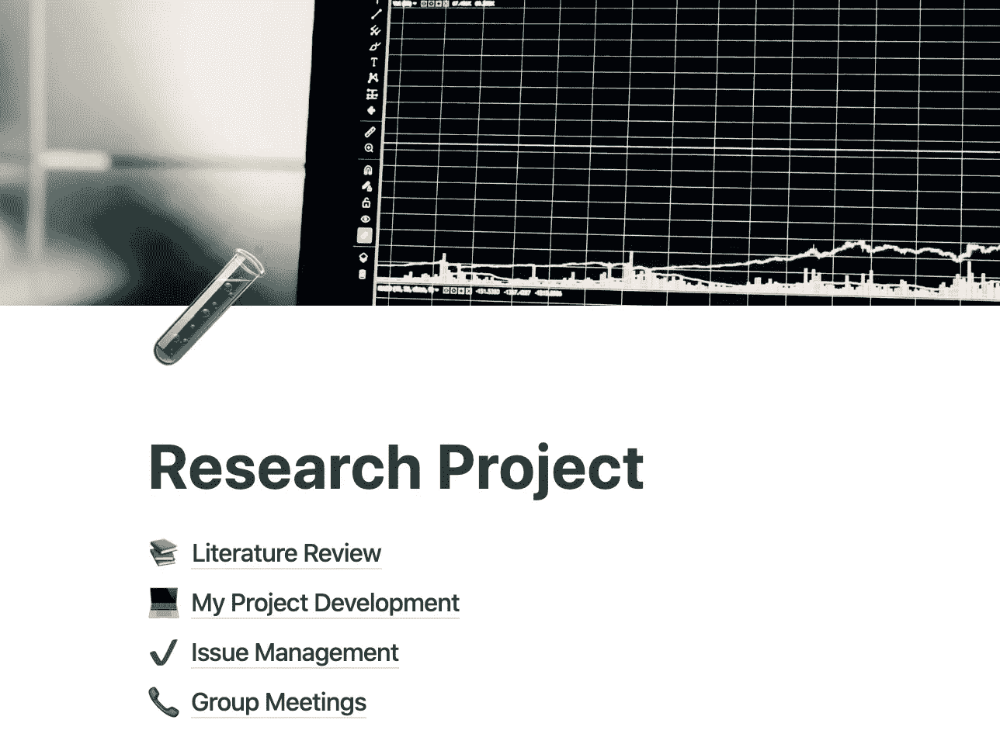
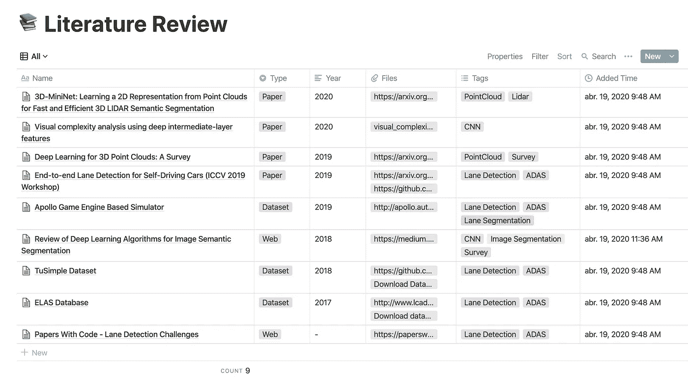
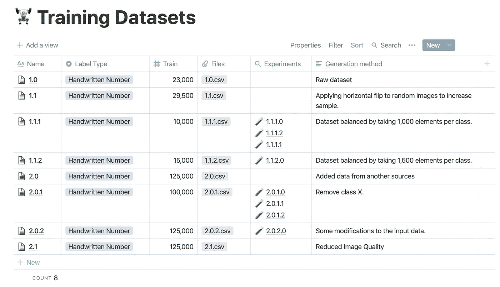
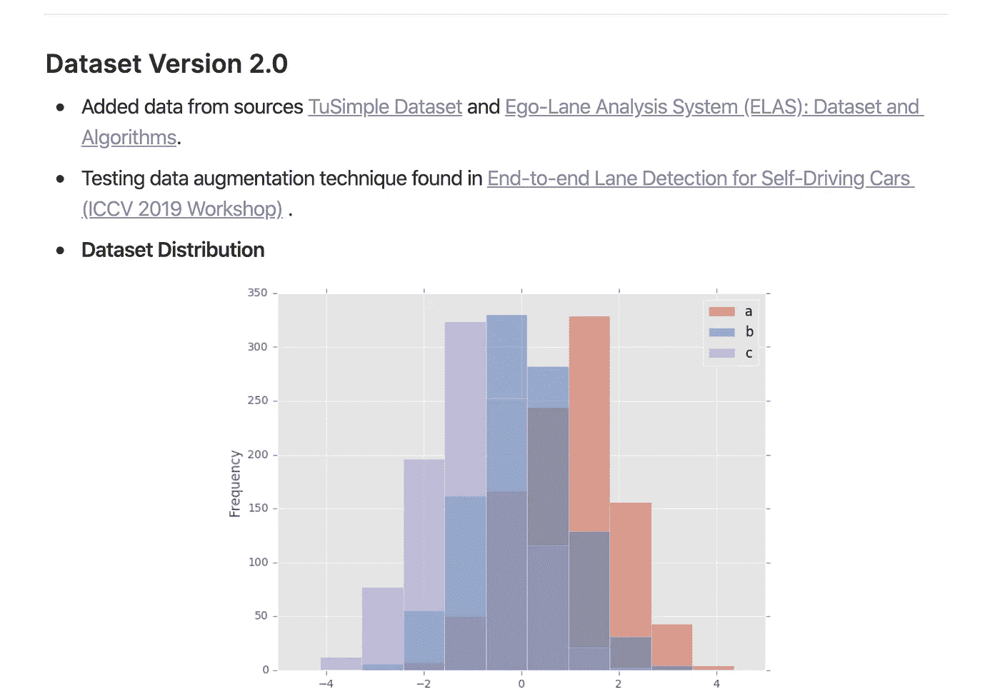
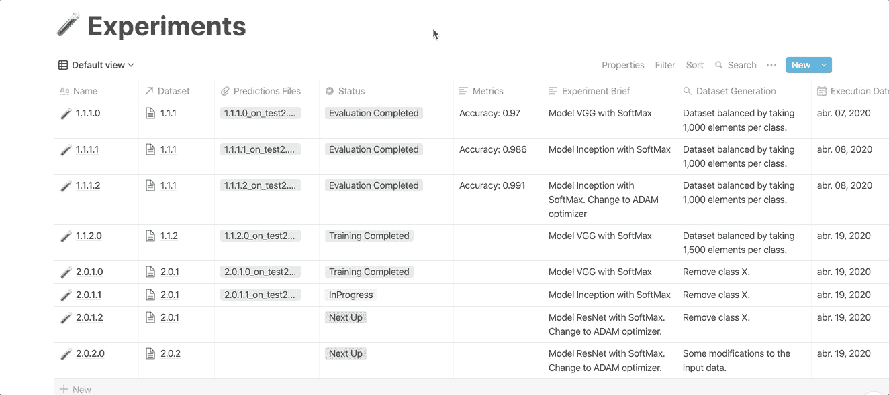
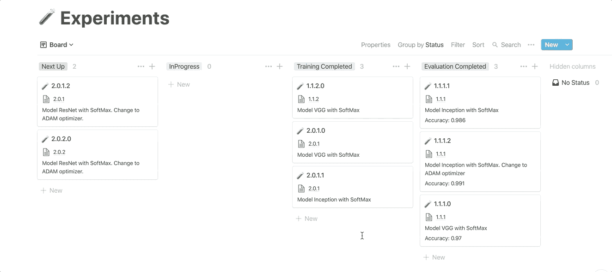
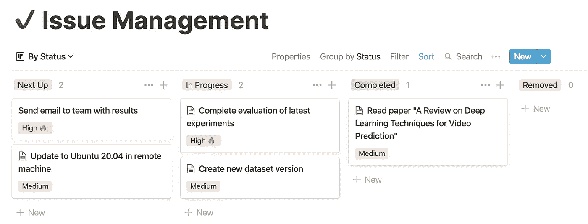
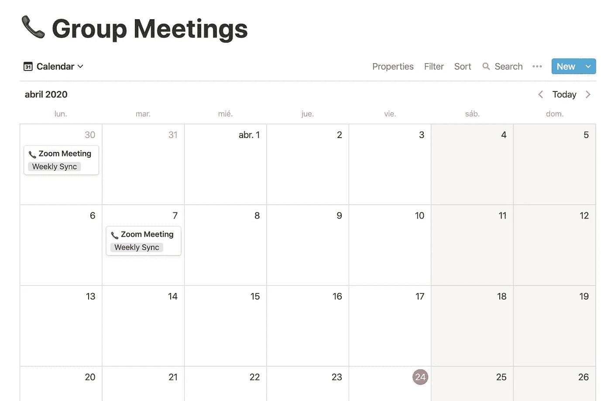

# 用概念组织和记录你的机器学习(或任何)研究项目

> 原文：<https://towardsdatascience.com/organize-and-document-your-machine-learning-or-any-research-project-with-notion-623d52fae972?source=collection_archive---------22----------------------->

## 由于缺乏组织和文档，研究可能会很困难。

费伦茨·霍瓦特在 [Unsplash](https://unsplash.com?utm_source=medium&utm_medium=referral) 上的照片

每个机器学习研究人员最终面临的主要问题之一是他们必须管理的大量数据:论文、网络链接、数据集、模型、问题、想法、实验结果...把它们都放在同一个数字空间不是很好吗？而且井井有条？试试这个概念设置。

这篇文章分享了一个概念设置，通过将所有项目资源保存在同一个地方，并在它们之间建立关系，来帮助研究人员组织和记录他们的过程。它主要集中在一个样本机器学习项目上，因为这是我有经验的领域，但一些工具可能对任何其他研究领域都有用。

概念是一个一体化的工作空间，你可以在其中添加多种类型的块来创建待办任务、笔记、文档页面或数据库。

> 概念在几个方面不同于其他软件。一旦你掌握了这些基础知识，你就可以建造任何你想要的东西
> 
> — [概念文档](https://www.notion.so/Start-here-6c279d3e7e92400d93672bbdd7da1f8a)

设置主页的屏幕截图。封面图片由 [@chrisliverani](https://unsplash.com/@chrisliverani) 在 [Unsplash](https://unsplash.com/) 上拍摄。

本文分为三个部分，涵盖了普通研究过程所需的大部分工作，以及如何使用应用程序提供的工具来正确地记录和组织它们:*文献综述*、*我的项目开发*和*问题管理&小组会议*。

# 1.文献评论

研究项目的一个关键部分是相关工作的文献综述。它提供了一个起点，并使其他作者的想法回忆起来。参考文献收集和管理的工具有很多，比如论文或者门德利。这些比本节中介绍的工作流更强大，但是使用它们会导致只有这个任务有一个不同的位置。我想强调的是，这种设置的目的是将一个研究项目的所有资源放在一个工作空间中。然而，这些参考资料收集工具可以作为一种补充。

对于这个任务，我有一个概念数据库，在那里我保存了所有对我的项目有用或感兴趣的资源，主要有三种类型:论文、数据集和网页。数据库是高度可定制和非常强大的，因为它们允许你过滤，标签，排序，当然:搜索，所有必要的行动时，管理大量的保存项目。但是我最喜欢概念数据库的一点是创建多个视图的可能性，因此可能性是无限的:在每个视图中，您可以决定要查看什么(应用过滤器)以及如何查看(视图类型和要显示的属性选择)。此外，数据库中的每一项都有自己的页面，因此您可以向其中添加任何额外的信息。

文献综述表视图:论文、数据集和网络。

在我的设置中，我有一个包含所有已保存资源的通用表格视图，以及三个针对每个类别的附加表格视图。我使用标签对来自相同研究领域的出版物进行分组，并上传(如果有的话)相应论文的 PDF 文件作为 Files 属性中的附件。

# 2.我的项目开发

这一部分旨在组织构成你的研究项目开发的不同资源。根据我的经验，机器学习项目本质上由训练数据集、测试集和实验的版本组成。显然，代码库或 Jupyter 笔记本也是项目的一部分，但这将不可避免地出现在另一个工作空间中。

这种概念设置可以帮助建立数据集版本化系统和所进行的不同实验的记录(具有实际的实验-数据集关系)。如果您需要在一个地方安排项目特定的细节，如数据集分布、实验指标或混淆矩阵，这也很有用。

## 训练数据集和测试集

在训练/测试数据集部分，我再次使用了一个数据库表，它显示了代表特定数据集版本的所有字段。

用于训练数据集版本控制的概念数据库示例

该表有一个“*文件和媒体*属性，我将。培训和测试流程所需的 csv 文件。还有一些其他属性，如项目和类的数量。我在这里添加的重要信息是生成方法，一个“*文本*”属性让我可以轻松地识别版本，例如:*数据集通过每个类取 X 个项目*来平衡，或者是否使用了预训练数据扩充技术。

正如您在图中所看到的，假设存在一个实际的实验-数据集关系，可以创建一个 *Lookup* 属性，自动列出使用该版本进行的所有实验。我们将在实验部分看到如何在数据库之间创建这种关系。

在一个条目的页面上，我添加了一些在任何时候都可能有用的附加信息，比如类分布直方图、文件或者关于这个特定版本的任何注释。

数据集版本页面示例

## 实验

虽然数据集版本系统很重要，但实验过程是对我帮助最大的地方。从组织和记录的角度来看，这是一项艰巨的任务，因为在某些情况下，有一组巨大的参数定义了一个实验。我知道一些研究人员使用保存参数配置的电子表格。我过去一直在使用它，虽然它有一些优点，但我发现这个应用程序更适合，原因如下:

*   为同一个数据库创建多个视图的可能性。对于这个任务，我发现 Board 视图非常有用，它会神奇地将您的表项目转换为看板卡，这样您就可以直观地表示您不同实验的生命周期，并在各个列中移动它们。

从表格视图转换到纸板视图

*   对于数据库中的每一项，你都有一整页来保存与实验相关的任何东西:评估结果、代码块、数学方程、与文献综述数据库中某篇论文的关系，或者你发现了一些有趣的实验内容的网页。任何事。

实验页面详细信息

*   正如我之前提到的，您可以向*训练数据集*数据库添加一个“*关系*”属性，这将实际上链接一个实验到所使用的版本。这允许您*将*属性从另一个表导入到实验表中，因此您可以通过数据集版本的属性来过滤实验。

# 3.问题管理和小组会议

这一部分是我个人整理与项目相关的东西的一组页面。

*   问题管理是一种简单的待办事项方法，我发送任务，比如“*向 X* 发送电子邮件”或“*在系统 X* 中安装这个依赖项”。与这个领域中其他更强大的工具相比，这个工具有一个优点:您可以在其他数据库中的任务和元素之间建立关系。例如，您可以创建一个任务*“Read paper<link _ to _ paper _ X>”*，该链接会将您带到该项目，您可以在其中阅读其 pdf 或您之前所做的注释。

*   最后，我在这里使用了一个稍微修改过的模板，它是由 idea 提供的，用于记录您的小组会议。它允许我在会议开始前计划我想与我的研究团队分享的东西。在会议期间，我通常会记下一些重要的事情。对于这个数据库，我发现日历视图很有用，它使浏览会议更容易。

小组会议的日历视图示例

这个装置实现了一个基础研究项目，我希望它能帮助研究人员组织他们的研究过程。即使您使用不同的工具，也不要犹豫分享您对类似项目的想法或工作流程。每一个想法都欢迎改进。

我想祝贺[理念](https://medium.com/u/efd97a1c507b?source=post_page-----623d52fae972--------------------------------)团队的出色工作。

你可以在这里找到模板的链接。你可以点击*复制:*将其添加到你的工作区

 [## 研究计划

### 由@Sergio Ruiz 创作。@serchu。

www . opinion . so](https://www.notion.so/Research-Project-a3601a544f2f4de18bc123a2c1322b90)