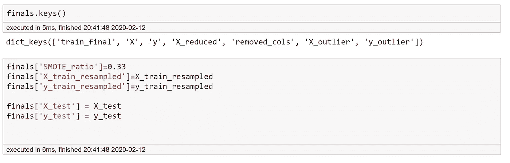
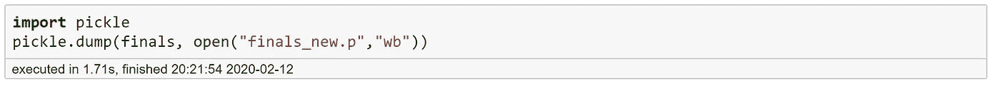
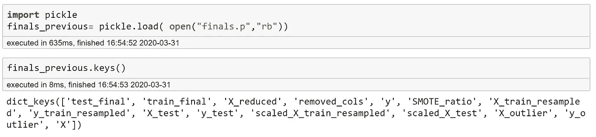
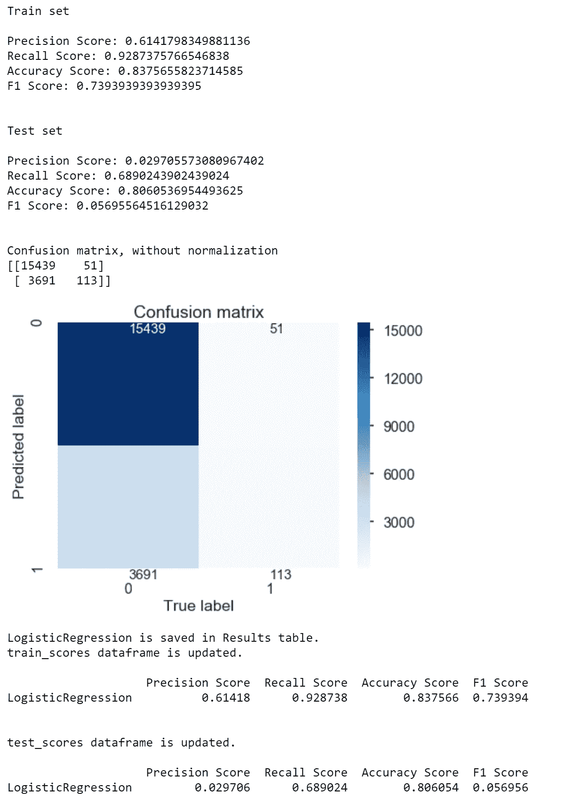
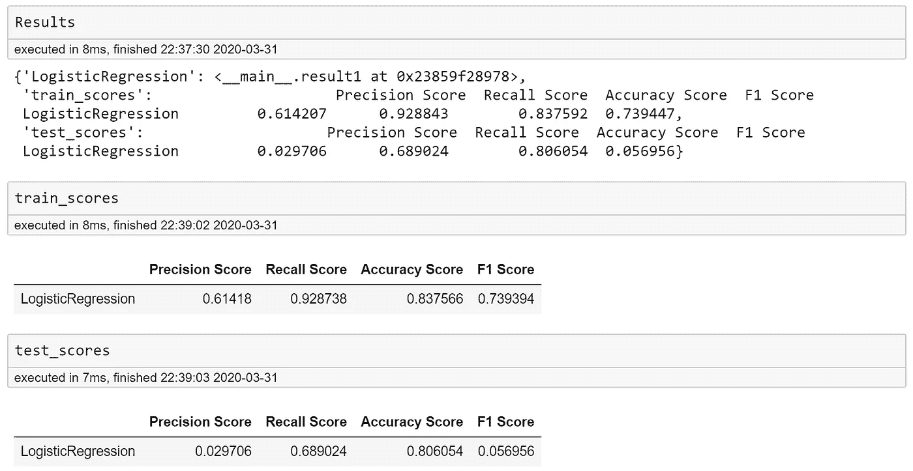
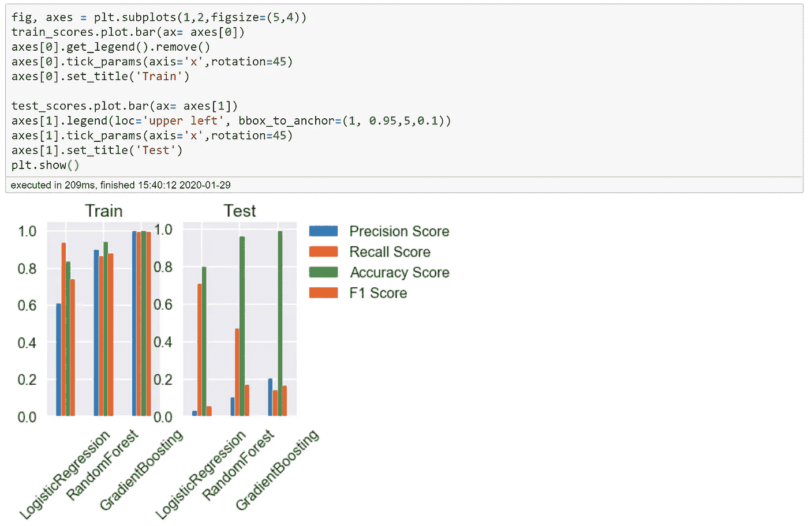
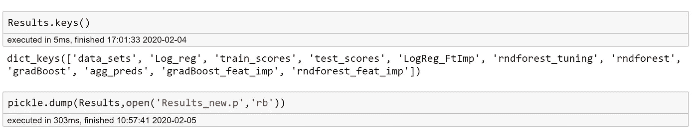

# 使用面向对象编程和 Pickle 组织您的数据和模型

> 原文：<https://towardsdatascience.com/organize-your-data-and-models-using-the-object-oriented-programming-and-pickle-876a6654494?source=collection_archive---------28----------------------->

来自[GIPHY.com](https://giphy.com/gifs/Friends-episode-15-friends-tv-the-one-where-estelle-dies-W3a0zO282fuBpsqqyD/links)

## 为了未来的自己和他人

我喜欢创建一个做笔记的系统。当我记起某个地方写下了什么东西，但又不能马上认出来时，我会非常激动。因此，当我在一个数据科学项目中处理多个模型时，我需要它们在一个地方，当我稍后回来引用它们时。另外，我讨厌为了回到之前的位置而重新运行代码。是的，你总是可以用 python 处理几乎每一种类型的东西，但是我想要一个 pickle 文件，把所有的东西都组织好。所以今天我想分享我是如何使用 pickles 和创建类来组织数据和建模结果的。这篇文章可以帮助你在数据科学项目中实践你的面向对象编程技能。

## 使用字典来组织创建 pickle 文件的项目。

例如，在我的前一篇文章的[中所写的项目中，我创建了一个名为`finals`的字典，并在数据准备的每一步转换时保存处理过的数据。](/are-you-using-enough-coupons-d18c2d18dd5f)

在数据准备的每个步骤中保存参数和数据

创建一个与字典同名的 pickle 文件

我将关键字作为代码中使用的变量名，这样当我以后加载 pickle 文件时，我可以直接加载字典、分配变量和使用代码，而不用从头开始运行。

当您需要时，这非常有用:

回到探索性数据分析步骤；

使用尚未准备好放入模型的数据(如未缩放、创建虚拟变量之前的数据)创建用于准备演示或撰写报告的可视化效果。；

使用单独的 Jupyter 笔记本进行数据处理和建模，并加载数据。

加载 pickle 文件并创建变量，变量的名称引用字典中的键。

## 创建一个类来保存不同的建模结果

注意，在`__init__`方法中，没有必需的参数。我这样做是为了让它可以更灵活地用于不同类型的事物，并且更容易创建对象实例。但是我创建了我希望对象拥有的属性。

为了利用这一点，我创建了以下内容:

1.两个`Pandas.DataFrames`用于保存和绘制评估指标，一个字典`Result`用于保存`result`对象。

2.向`result`对象的属性输入信息并显示模型结果的功能。请注意，我已经将`X_train`、`X_test`、`y_train`、`y_test`作为全局变量，但是您可以修改它们作为输入。注意，步骤 1 中创建的`DataFrames`也保存在`Results`字典中

那么这是如何工作的呢？

让我用一个简单的逻辑回归模型来演示一下。

现在，你可能会问，当我已经有空间保存评估分数时，我在哪里使用这些数据帧。一旦我收集了不同型号的分数，就很容易创造一个情节来比较他们的表现。

最后，一旦我在字典中添加了我创建的所有内容，下次我需要它时，它就会被腌起来。

我希望你觉得这是有用的。此外，如果你有更好的方法来保存你的结果和数据，请在下面留下评论，让我知道。你可以在这里看到我在本文[中使用的示例代码。](https://github.com/YeonjooSmith/Blog_OOP_Pickle)

感谢您的阅读。