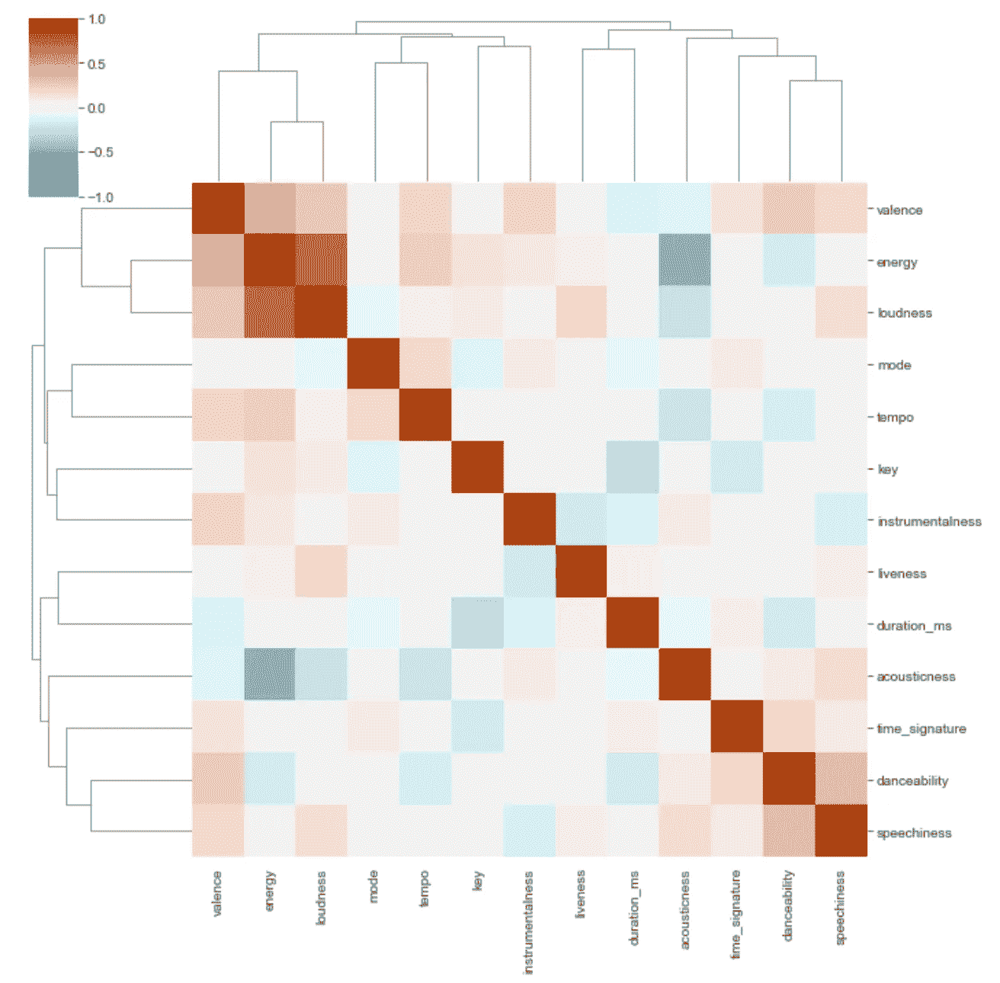
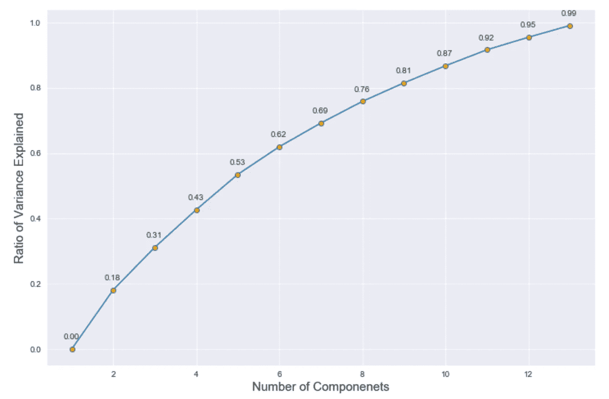
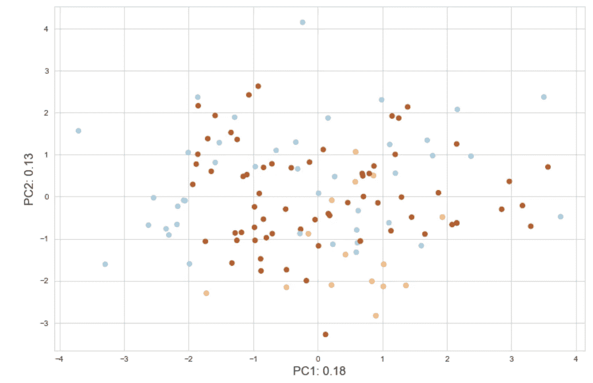
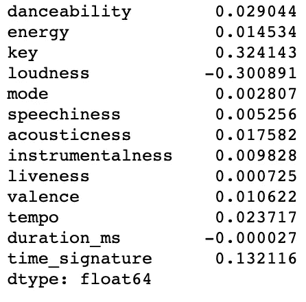

# 用数据科学整理我的 Spotify 播放列表

> 原文：<https://towardsdatascience.com/organizing-my-spotify-playlists-with-data-science-9a528110319?source=collection_archive---------43----------------------->

## 使用 K-means 聚类来组织我的 Spotify 播放列表

安库什·巴拉德瓦伊


照片由[晨酿](https://unsplash.com/@morningbrew?utm_source=medium&utm_medium=referral)在 [Unsplash](https://unsplash.com?utm_source=medium&utm_medium=referral) 拍摄

# 介绍

我们大多数人都有一个有点大的 Spotify 播放列表。这个播放列表可能是作为一个精心策划的 R&B 氛围开始的，其轻快的人声和催眠的节拍为你早上的一杯咖啡提供了完美的配乐。然而，随着时间的推移，你不断变化的情绪和 Spotify 的推荐将这个播放列表变成了一个不同歌曲和流派的滚动 bumrush，无法提供一致的收听体验。

因此，我试图用这个项目回答以下问题:

> 给定一个包含太多歌曲的 Spotify 播放列表，我如何使用数据科学将这个大的播放列表分成包含相似歌曲的较小播放列表？

# 获取播放列表曲目和音频功能

该过程的第一步是访问我的播放列表中的曲目列表，以及它们的音频功能。为此，我使用 Python 库 Spotipy 来访问 Spotify 的 Web API。

首先，我在[Spotify for Developers Dashboard](https://developer.spotify.com/dashboard/)上登录我的 Spotify 帐户，然后选择“创建应用程序”来创建一个新的应用程序。只要你的 app 是“非商业”的，相信你在这个过程中应该不会遇到什么问题。在我创建了我的应用程序之后，我找到了我的客户端 ID 和客户端秘密，并将它们存储在 client_id 和 client_secret 变量中。这些变量随后被用于验证对 Spotify Web API 的访问:

```
import spotipy
from spotipy.oauth2 import SpotifyClientCredentialsclient_id = 'client_id'
client_secret = 'client_secret'client_credentials_manager = SpotifyClientCredentials(client_id, client_secret)
sp = spotipy.Spotify(client_credentials_manager = client_credentials_manager)
```

从这里，我访问了音轨和它们的音频特征:

```
sp.user_playlist_tracks('username', 'playlist_id') 
sp.audio_features('song_id') #'username' of individual who created playlist
#'playlist_id' of playlist
#'song_id' of song 
```

使用这些请求，我用播放列表中每首歌曲的曲目名称、曲目艺术家和曲目音频特性填充了一个 Pandas 数据帧。Spotify 为每首歌曲提供了许多音频功能，这些音频功能的详细信息可以在[这里](https://developer.spotify.com/documentation/web-api/reference/tracks/get-audio-features/)找到。此外，我参考了这篇[文章](https://morioh.com/p/31b8a607b2b0)和来自 Spotipy 网站[的示例](https://spotipy.readthedocs.io/en/2.13.0/)来访问我的播放列表中的曲目及其音频功能。如果你对 Spotipy 和 Spotify 的 Web API 感到好奇，可以查看 Spotipy 的文档页面和 [Spotify 的 Web API](https://developer.spotify.com/documentation/web-api/) 。

# 探索数据

为了开始研究我的数据，我使用 Seaborn 的热图和聚类图可视化了音频特征的相关性和层次聚类。

```
import matplotlib.pyplot as plt
import seaborn as sns
%matplotlib inlinesns.heatmap(df.corr())
sns.clustermap(df.corr()) 
#make sure that your dataframe df for both of the above calls have all categorical columns removed
```



聚类图

在浏览了聚类图之后，很明显，除了能量和响度之外，大多数音频特征彼此之间没有强相关性(在这种情况下，强正相关性完全有意义)。对我对数据的理解有些不满意，我决定进行主成分分析。

主成分分析(PCA)是一种降维方法，即当一个包含许多变量的数据集被压缩成几个成分时，这些成分可以解释原始数据集中的大部分*，但不是全部*。更多信息可以在杰克·范德普拉斯的 *Python 数据科学手册*的[摘录](https://jakevdp.github.io/PythonDataScienceHandbook/05.09-principal-component-analysis.html)中找到。

主成分分析的每个额外分量解释了数据集中的额外方差，我想绘制出当你增加 *n* 时，分量的数量 *n* 解释了多少方差。这样做将有助于我找到解释数据的组件的理想数量，方法是在该图中寻找“肘部”，即 *n* 的增加导致解释方差的增加减少，在图上呈现为一个尖点。然而，对于这个数据集，我的图看起来像:



成分数与解释方差的比率

那是粗糙的。尽管每个附加成分解释的方差比率在下降，但我需要 8 个成分来解释数据中 76%的方差，这似乎没什么帮助。

然而，我的研究结果表明，我的数据没有表现出多重共线性，这表明预测变量之间没有高度的线性相关性，如果我想使用线性模型，这是很有用的。

# k-均值聚类和我的新播放列表

是时候将我的歌曲组合成新的播放列表了！我使用了 K-means 聚类，这是一种将你的数据分成 K 个聚类的聚类算法。如果你想了解更多关于算法的知识，Ben Alex Keen 的这篇文章非常好。

```
from sklearn.cluster import KMeans
kmeans = KMeans(n_clusters = 4)
kmeans.fit(df)
#once again, make sure df has no categorical variables
```

第一次运行 K-means 时，我将我的曲目分为四个簇，因为这似乎是一个很好的播放列表数量(在大多数其他情况下，[“肘方法”](https://www.geeksforgeeks.org/elbow-method-for-optimal-value-of-k-in-kmeans/)用于确定使用多少个簇)。然而，一个集群只有七首曲目，这不是我经常听的播放列表。因此，我转而用三个集群运行 K-means。

我现在想看看这些集群之间是否有清晰可见的区别。由于原始数据集有许多变量，我返回到我的 PCA 并将数据集分解为两个分量，希望这两个分量会显示出一些聚类之间的视觉分离。



PC1 与 PC2 上的集群

每个点表示一个轨迹，颜色表示该轨迹的簇。不幸的是，没有一个好的图表可以直观地根据主成分来区分聚类。

相反，为了理解每个聚类之间的差异，我构建了一个 Pandas 数据框架来比较每个聚类中每个音频特征的平均值，其中指数代表聚类:


每个聚类中音频特征的平均值

# 逻辑回归

我仍然很想知道一个音轨的音频特征是如何影响它的聚类的。知道数据没有多重共线性，我决定使用线性模型来探索这个问题。具体来说，我首先用 K-means 聚类法将我的数据分成两个聚类，然后使用逻辑回归来预测一个音轨的聚类。

```
X = df['feature_variables']
y = df['track_cluster']from sklearn.model_selection import train_test_split
X_train, X_test, y_train, y_test = train_test_split(X, y, test_size = .3)from sklearn.linear_model import LogisticRegression
log = LogisticRegression()
log.fit(X_train, y_train)
y_pred = log.predict(X_test)log_coeff = pd.Series(log.coef_[0], index = feature_column_names)
```

在最后一步中，我创建了一个名为 log_coeff 的 Pandas 系列，它显示了模型用来确定音轨类别的每个音频特征的系数。与较大幅度的系数配对的音频特征对于模型对音轨的分类更重要。



每个音频特征的系数

我还检查了我的 logistic 模型的分类报告和混淆矩阵，以确保模型足够准确。这两个函数都可以在 sklearn.metrics 中找到，实现如下:

```
from sklearn.metrics import confusion_matrix, classification_report
print(confusion_matrix(y_test, y_pred))
print(classification_report(y_test, y_pred))
```

# 结论

总之，通过这个项目，我把我的播放列表分成三个小的播放列表。在这个过程中，我使用了主成分分析，K-均值聚类和逻辑回归。

用于这个项目的完整代码可以在[这里](https://github.com/ankushbharadwaj/reorganize-my-spotify-playlist)找到。