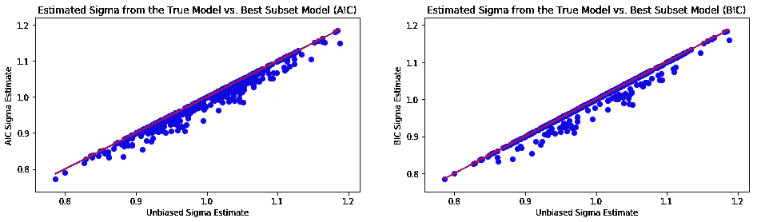
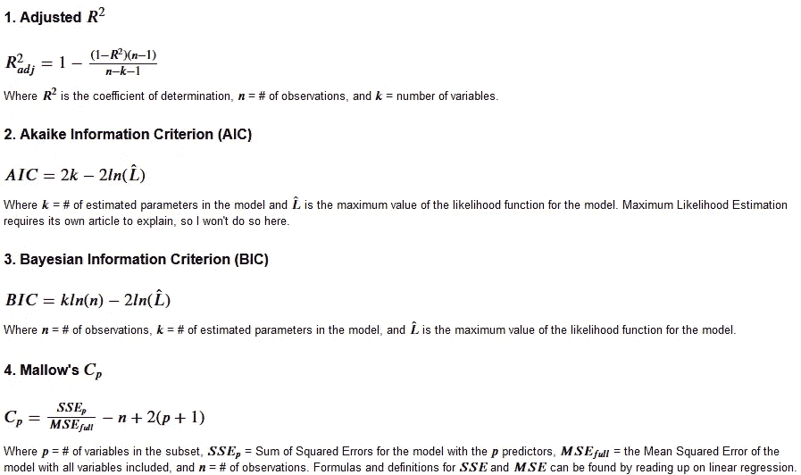
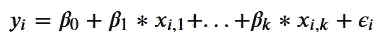
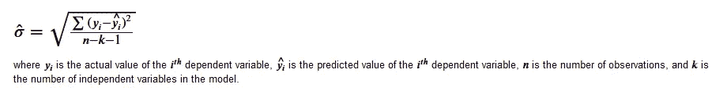
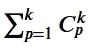
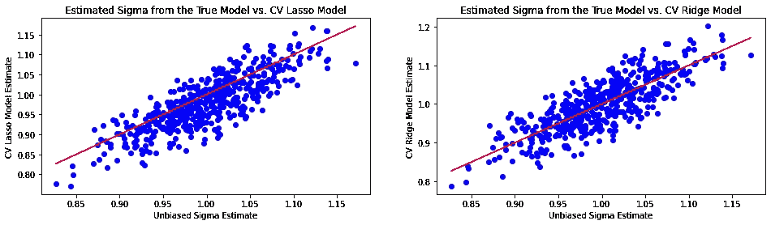
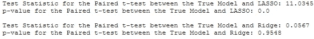

# AutoML 的起源:最佳子集选择

> 原文：<https://towardsdatascience.com/origins-of-automl-best-subset-selection-1c40144d86df?source=collection_archive---------43----------------------->

所有图片均由作者生成

## 以及选择后推理的危险

由于有很多关于 [AutoML](https://en.wikipedia.org/wiki/Automated_machine_learning) 的传言，我决定写一下最初的 AutoML；逐步回归和最佳子集选择。然后，我决定忽略逐步回归，因为它是[坏](https://www.stata.com/support/faqs/statistics/stepwise-regression-problems/)，可能应该停止教授。这就留下了最佳子集选择来讨论。

最佳子集选择背后的想法是选择变量的“最佳”子集以包括在模型中，一起查看变量组，而不是一次比较一个变量的逐步回归。我们通过评估哪个子模型最符合数据来确定哪组变量是“最佳”的，同时对模型中的独立变量的数量进行惩罚以避免过度拟合。评估模型拟合程度的指标有多种:调整后的𝑅-squared、阿凯克信息标准(AIC)、贝叶斯信息标准(BIC)和马洛的 **𝐶𝑝** 可能是最著名的。

每一个的公式如下。

对于校正后的 R 平方，您希望找到具有最大校正后 R 平方的模型，因为它解释了因变量中的最大方差，从而降低了模型的复杂性。对于其他模型，您希望找到具有最小信息标准的模型，因为它是因变量中具有最小未解释方差的模型，这会降低模型的复杂性。它们是同一个概念，即最大化好的东西与最小化坏的东西。

AIC 和 Mallow 的 **𝐶𝑝** 都倾向于给出更好的预测模型，而 BIC 则倾向于给出自变量更少的模型，因为它对复杂模型的惩罚比其他两个更重。

像生活中的大多数事情一样，自动化模型选择是有代价的。如果你用你的数据选择一个线性模型，所选变量的系数将*偏离零！每个系数的单个 **t 检验**和整体模型显著性的 **F 检验**的零假设都基于每个系数的均值为 0 的正态分布假设。由于我们在系数中引入了偏差，这些测试的**I 型**误差水平会增加！如果您只需要一个预测模型，这可能不是一个问题，但是它会使使用所选模型做出的任何统计推断完全无效。AutoML 可能能够生成体面的预测模型，但推理仍然需要一个人仔细思考问题，并遵循科学的方法。*

# *证明最佳子集选择的偏差*

*我进行了一项模拟研究来证明由最佳子集选择引起的偏差。我们不看系数中的偏差，而是看模型中误差项的估计标准差中的偏差*

**

*其中误差项是同分布且独立分布的***【𝑁(0,𝜎】***随机变量。*

*在每一轮模拟中，从相同的分布中产生 100 个观察值的样本。真实模型，它只包含真正重要的变量，以及 AIC 和 BIC 选择的最佳子集模型也被估计。从每个模型中，我用公式估算了**的误差项***

******

***这被执行 500 次。***

***我模拟的具体参数如下:**= 100，#个自变量= 6，*= 1，有效自变量个数为 2。截距也很重要，所以 3 个系数是非零的。使用***【𝑁(5,1】***随机数来选择非零系数，因为我懒得定义固定的数字，但它们在所有轮次的模拟中都保持固定。******

**我首先定义了自己的函数，使用 AIC 或 BIC，通过查看变量的每个组合，使用一种简单的方法来执行最佳子集选择。它只对少量变量有效，因为它必须考虑的模型数量随着变量数量的增加而增加。考虑的模型数量为**

****

**但是最佳子集选择的更聪明的实现使用树搜索来减少考虑的模型数量。**

**感兴趣的图形位于最佳子集选择函数和模拟代码块的下方。**

**红线是 y 轴等于 x 轴的线，是真实模型对 ***𝜎*** 的无偏估计。正如你在下面的图表中看到的，𝜎*的估计值偏离了 best AIC 和 BIC 选择的模型。事实上它们将永远小于或等于来自真实模型的*的无偏估计。这说明了为什么通过最佳子集选择选择的模型对于推理是无效的。****

******

# ***奖励部分:调查 LASSO 和岭回归中误差项的估计标准差的偏差***

***在进行上述模拟研究时，我对正则化方法在线性模型中估计误差项的标准偏差时的潜在偏差产生了兴趣，尽管人们不会使用正则化模型来估计参数以进行推断。众所周知，LASSO 和岭回归有意地将估计系数偏向零，以减少模型中的方差(来自同一总体的样本之间估计系数的变化量)。套索可以设置系数等于零，执行变量选择。岭回归使系数偏向零，但不会将它们设置为零，因此它不是像最佳子集选择或套索那样的可变选择工具。***

***我使用与之前相同的设置，但是将样本大小从 100 增加到 200，自变量的数量从 6 增加到 100，重要自变量的数量从 2 增加到 50。使用三重交叉验证在 0.01、0.1、1.0 和 10.0 之间选择套索和脊模型中的收缩参数。为了计算*𝜎̂，我计算了 LASSO 模型中非零系数的数量，并使用了所有 100 个系数，加上 1 个用于岭模型的截距，因为它将系数偏向于零，但没有将它们设置为零。****

***显然，正则化的线性模型对于推断的目的是无效的，因为它们使系数的估计有偏差。我仍然认为，调查误差项的估计标准差中的任何偏差都值得编写一点代码。***

***这些图位于这个代码块的下方，用于模拟。***

***通过目测，*在 LASSO 模型中出现向下的无偏估计，但是无偏估计并不像在最好的 AIC 和 BIC 模型中那样形成一个上界。岭模型在估计这个参数时没有表现出明显的偏差。让我们用配对 t 检验来研究一下，因为估计值是在每次迭代中从同一个样本中得到的。我使用标准的 p 值截止值 0.05，因为我懒得决定我想要的测试功效。****

************

***正如目测所猜测的，没有足够的证据表明来自真模型和岭模型的*的估计值之间存在均值差异。然而，在 0.05 的显著性水平上有足够的证据可以得出结论，LASSO 模型倾向于对*做出向下有偏的估计。这是否是一个普遍的事实还不知道。做出结论需要正式的证据。*****

***谢谢你坚持到最后。虽然使用数据选择模型会使经典的推断假设失效，但是[选择后的推断](http://statweb.stanford.edu/~tibs/ftp/nips2015.pdf)是统计研究的一个热门领域。也许几年后我们会谈到自体感染。***

***我这个项目的所有代码都可以在这里找到。***