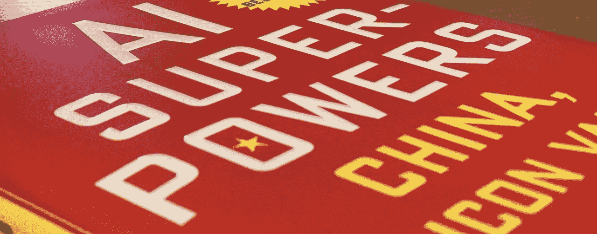
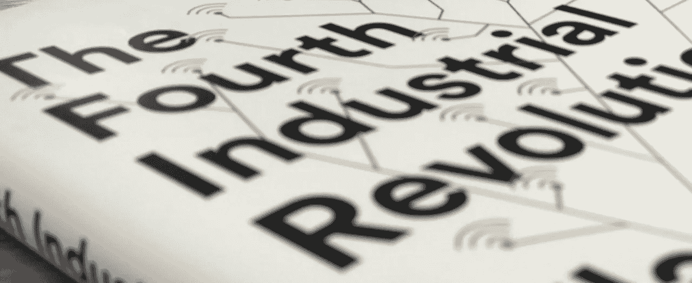
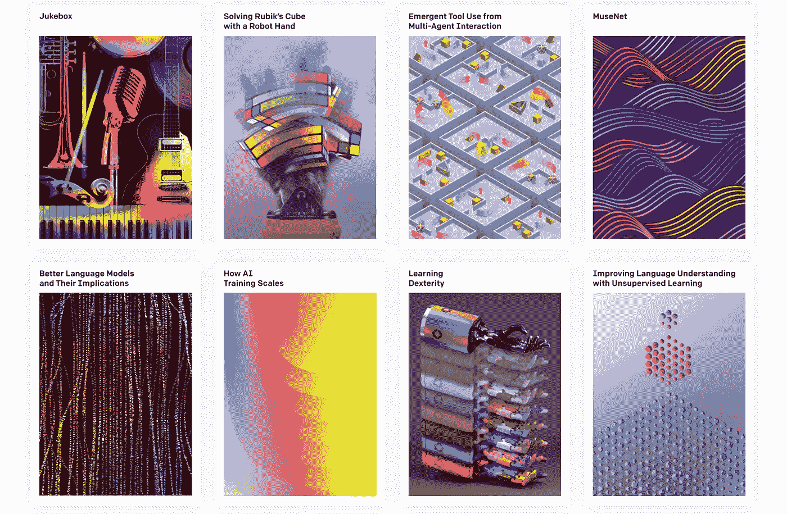

# 我们的人工智能未来

> 原文：<https://towardsdatascience.com/our-ai-future-473245c11438?source=collection_archive---------75----------------------->

## 跟上新的硅基适者生存

安迪·凯利在 [Unsplash](https://unsplash.com?utm_source=medium&utm_medium=referral) 上的照片

没有人喜欢浪费时间。他们为什么要这么做？这是我们拥有的最宝贵的资源。每天我们有 86400 秒，不多也不少。无论你多么富有或强大，我们都无法让时光倒流。时间是终极资源，我们都平等地获得它。

我们如何使用这种资源是我们的选择。现在，你正在阅读这篇文章来发展你自己。明天变得比今天更好。为了变得更好，我们必须学习。随着世界以越来越快的速度前进，我们必须迅速适应这个新世界。

碳基进化通过适者生存决定了成功。这很快被新的硅基进化所取代。成功取决于我们的适应能力。为了适应，我们必须学习。

然而，有时我们会错过趋势。我们今天学到一些东西，明天就不再相关了。我们今天选择忽略某事，因为它明天会成为下一件大事。

幸运的是，我们有太多的专家了。技术前沿的智库、行业领袖和研究人员。

我们可以也应该从中吸取教训。他们有很多话要说。

# 李开复

李开复，第一个能够识别不同声音的语音识别系统的创造者。他曾在苹果、微软和谷歌担任高管职位。

在苹果公司时，李开复领导了 R&D 多语言人工智能系统部。其中之一是卡斯帕，他与李和苹果公司首席执行官约翰·斯考利一起出现在《早安美国》节目中。这是在 1992 年，距离 Siri 发布整整 19 年。

1998 年，李开复在北京建立了微软亚洲研究院的前身。

> "这在各个方面都是一种现象。"—比尔·盖茨在北京实验室

在硅谷占据绝对主导地位的时代。建立这样一个实验室绝非易事。2004 年，微软亚洲研究院迅速成为世界上最热门的计算机实验室。

在这一点上，李休息一下，享受并陶醉于他超人的成就可能是有意义的。

相反，他去了谷歌中国，在该地区建立了公司，并监督他们在这个竞争异常激烈的市场中的发展。

2009 年，李开复从谷歌中国辞职。他这样做是为了进入他的下一个，可能是迄今为止最雄心勃勃的项目。现在被称为 Sinovation Ventures，这是李氏的风险投资基金。

该基金培育中国的科技初创企业，通过它，李开复为中国的大部分科技市场铺平了道路。据李开复和世界各地的许多其他专家称，中国现在将取代硅谷，成为新的全球科技超级大国。

## 人工智能超能力

李开复是我们应该听的人。他的书《人工智能的超能力》是关于人工智能主题以及我们可以期待它带我们去哪里的最好的书之一。

Lee 专注于人工智能在全球范围内迅速变化的地理优势。他指出，在某些领域，中国已经在人工智能至上的竞赛中超过了美国。他认为，用不了多久，中国就会在人工智能领域获得完全或接近完全的主导地位。

# 人工智能播客

麻省理工学院的人工智能研究员 Lex Fridman，尽管是一个非常有才华的研究员。找到了另一个利基，并迅速成为跟上人工智能世界的世界级资源。

[人工智能播客](https://www.youtube.com/playlist?list=PLrAXtmErZgOdP_8GztsuKi9nrraNbKKp4)挖掘顶级研究人员和行业领袖的思想——从 [Yann Lecun](https://www.youtube.com/watch?v=SGSOCuByo24&list=PLrAXtmErZgOdP_8GztsuKi9nrraNbKKp4&index=62) 和 [Yoshua Bengio](https://www.youtube.com/watch?v=azOmzumh0vQ&list=PLrAXtmErZgOdP_8GztsuKi9nrraNbKKp4&index=85) ，到 [Elon Musk](https://www.youtube.com/watch?v=smK9dgdTl40&list=PLrAXtmErZgOdP_8GztsuKi9nrraNbKKp4&index=34) 和我们自己的[李开复](https://www.youtube.com/watch?v=cQ48rP_Rs4g&list=PLrAXtmErZgOdP_8GztsuKi9nrraNbKKp4&index=69)。

Lex 不仅设法在这个播客上收集了绝对最好的想法，而且这些采访的深度简直是惊人的。

莱克斯本人就是专家。他建立了这个播客，作为尖端人工智能研究的象牙塔和我们普通人生活的世界之间的桥梁。

这些播客可以通过 [YouTube](https://www.youtube.com/playlist?list=PLrAXtmErZgOdP_8GztsuKi9nrraNbKKp4) 和[苹果播客](https://podcasts.apple.com/us/podcast/artificial-intelligence-ai-podcast-with-lex/id1434243584)访问。

# 第四次工业革命

世界经济论坛创始人兼执行主席克劳斯·施瓦布的这本书是对工业未来的极好总结。

施瓦布不仅专注于人工智能，还关注物联网、生物技术和先进材料等其他技术。让我们对未来的科技有更广阔的视野。

这很重要，因为人工智能本身并不是未来。相反，我们将有一个来自不同领域的多学科合并。

我们可以在中国的感知人工智能中看到这种技术合并，它严重依赖其他技术，如嵌入式系统(IoT)。

## 模糊界限

感知人工智能是溢出到物理世界的东西。由于传感器和物联网设备的快速增长，感知人工智能正在模糊数字世界和物理世界之间的界限。

中国备受争议的社会信用体系就是一个最好的例子。忽略伦理(这不应该被忽略)，它确实是西方世界无与伦比的奇迹。

将中国的大规模监控系统与人工智能相结合，公民会被自动排名。积极支持献血、志愿工作或慈善捐赠等行为。

另一方面，在公共交通工具上吃东西、多占座位、或制造噪音[2]，或没有正确分类个人垃圾[3]都会降低你的分数。

像这样一个系统的规模是难以置信的巨大。这是一个工程奇迹——有点奥威尔式的意味。

# OpenAI 博客

OpenAI 是世界上最前沿的人工智能研究机构之一。自然，他们会产生绝对迷人的研究。

研究论文对于保持最新信息非常重要，但有时更容易看到写得好的、信息丰富的文章。这正是我们在他们的博客上发现的。

截图来自 [OpenAI 网站](https://openai.com/progress/)，展示了他们最近的几篇突破性文章。

这让我们对人工智能研究的绝对前沿有了惊人的了解。

OpenAI 在可视化他们的研究成果方面做得非常好。阅读他们关于[从多主体互动中使用紧急工具](https://openai.com/blog/emergent-tool-use/)的文章，我们得到了一个连续的演示正在讨论的行为的视觉流。

除此之外，对于更多的技术人员来说。OpenAI 总是包含相关的研究论文和每篇文章的代码。涵盖了我们在试图理解这些突破的含义和用途时所希望的一切。

# 结论

我们正在迅速进入一个新时代。成功在很大程度上取决于我们的学习和适应能力。

通过建设未来的个人和团队的眼睛，一瞥未来的风景。我们可以更好地理解我们要去哪里。希望我们能从这迷人的旅程中获得最大的收获。

当然，在了解我们共同的未来时，这不是一个完全全面的清单，但这是一个开始。我很想听听你推荐的文章、书籍、播客和其他资源。

我希望你喜欢这篇文章并从中受益。一如既往的感谢阅读！

# 参考

[1] G .黄，[世界上最热的计算机实验室](https://www.technologyreview.com/2004/06/01/232827/the-worlds-hottest-computer-lab/) (2004)，麻省理工学院技术评论

[2] B .于，【北京市轨道交通客运管理规定】 (2019)，人民网

[3] E .黄，[中国垃圾分类违规者现在面临被垃圾信用评级处罚的风险](https://qz.com/1173975/garbage-sorting-violators-in-china-risk-getting-a-junk-credit-rating/) (2018)，石英

这些令人着迷的人工智能技术之一是生成对抗网络(GANs)。

我最近处理了这些架构的开发，并写了一些我们可能犯的错误和误解，这些错误和误解破坏了我们开发工作模型的机会。如果你对此感兴趣，你可以在这里阅读:

 [## 打甘游戏

### 开发“自切片面包以来最酷的东西”的技巧

towardsdatascience.com](/beating-the-gan-game-afbcce0a20be)