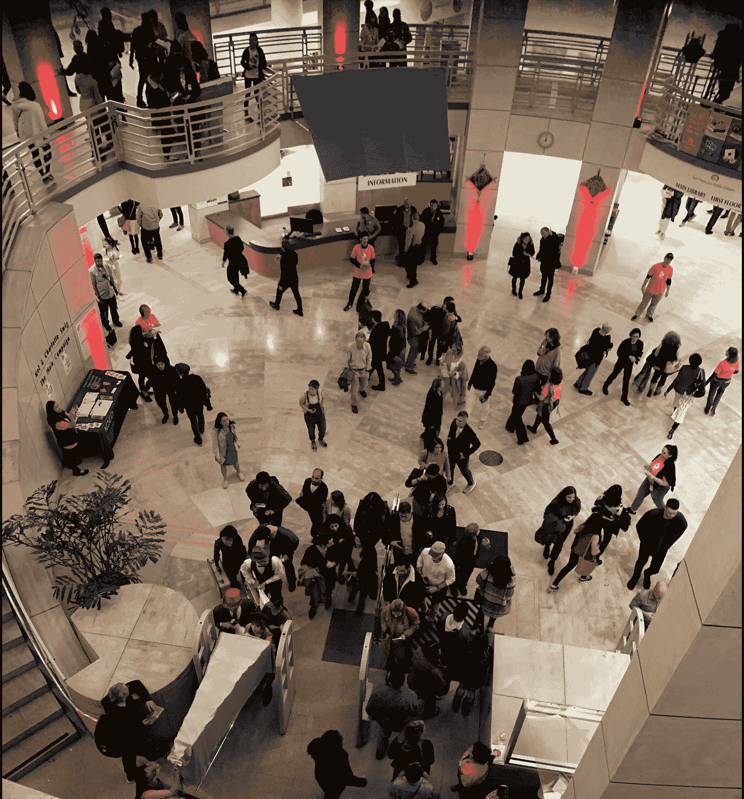
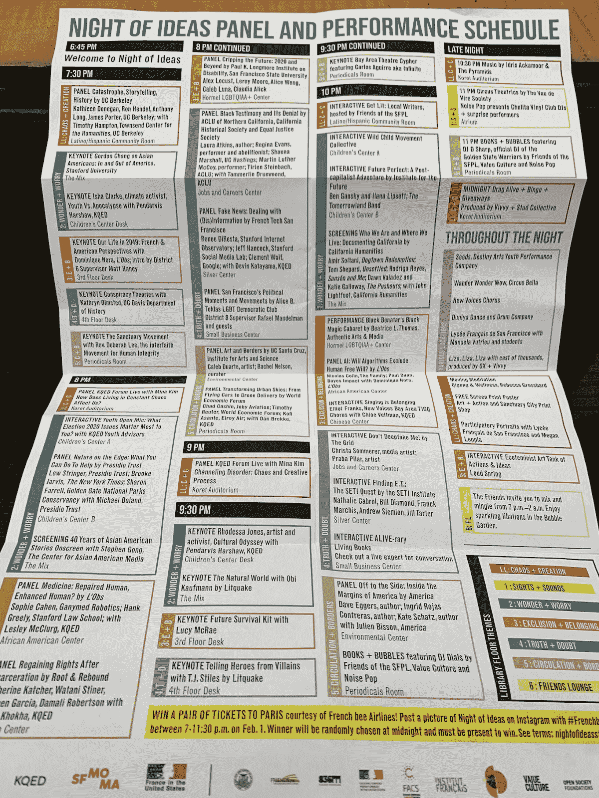

# 我们在 2049 年的生活

> 原文：<https://towardsdatascience.com/our-life-in-2049-8396a0e2a123?source=collection_archive---------37----------------------->

## 迫切需要改变硅谷“快速移动和打破常规”的思维模式，因为我们今天正在建立的技术，如人工智能、区块链和基因组学，将对人类社会产生更广泛和更深刻的影响。

在 [Unsplash](https://unsplash.com?utm_source=medium&utm_medium=referral) 上 [Lucrezia Carnelos](https://unsplash.com/@ciabattespugnose?utm_source=medium&utm_medium=referral) 拍摄的照片

上周末，我参加了旧金山的“第二个创意之夜”,这是一个 6 年前在巴黎发起的活动，后来已经传播到全世界。这是在旧金山公共图书馆举行的长达七小时的马拉松式辩论、小组讨论、表演和互动体验。

从一个会议走到另一个会议，你可以听到来自大楼其他角落的音乐和声音。你可以看到人们四处走动，寻找他们感兴趣的话题。感觉就像我们在蜂窝里。所有这些辩论、讨论和经历会激发更多的思考和创造力，而不是蜂蜜和蜡。

创意之夜 SF 2020 项目时间表

今年的主题是“生活在边缘”,每一层都有一个主题，包括混乱+创造，奇迹+担忧，排斥+归属，真实+怀疑，流通+边界，以及景象+声音。

听到如此不同的声音和观点是很有趣的，尤其是对我们这些生活在旧金山泡沫中的人来说。特别是，我发现欧洲和美国的思想流派之间的对比非常有趣。

**增强 vs 增强**

在一个医疗保健小组中，法国初创公司 Ganymed Robotics 的联合创始人兼首席执行官索菲·卡亨(Sophie Cahen)描述了美国和欧洲之间的巨大差异。

从她的角度来看，美国公司，尤其是硅谷的公司，一直在寻找增强人类能力的方法，就好像我们只是复杂的机器一样。另一方面，欧洲人更保守。他们乐于修复或增强，而不是增强人类。

她补充说，如果你考虑咖啡和鞋子的强化，强化人类可以追溯到几千年前。最古老的外科手术大约在 7000 年前实施。这是几年前在法国发现的一种截肢术。乳腺癌最古老的证据是在一具 4200 年前的埃及骨骼中发现的。

增强和治疗对我们来说都不再陌生。它们存在了几千年。然而，这次不同的是，我们不满足于仅仅增强或修复人体，我们想通过生物黑客和基因工程重写代码。

**AI 的所有权**

关于人工智能(AI)和大数据的另一个有趣的观点是在题为“2049 年我们的生活”的主题演讲中提出的在美国，人工智能大多是由私人组织开发的，以获取利润。人们似乎并不过度关注这一点。

人们普遍认为，资本主义、竞争和对利润的追求创造或加速了创新。如果人工智能是在公共部门开发的，那么这项技术真正起飞需要更长的时间。

然而，如果人工智能真的像吴恩达所说的那样是新的电力，难道不应该像其他公共产品一样受到更严格的监管，以确保每个人都可以使用它吗？难道我们不应该开发更多易于使用的工具，以便 AI 不仅仅掌握在少数公司手中吗？

我们知道[ML 模型的性能随着用更多的数据进行训练而提高](/designing-the-user-experience-of-ml-products-8aef5afb510b)。越来越多的初创公司开始出售训练数据集或标签服务，如 Scale AI 和 Lionbridge。

> 为什么我们要免费赠送我们的个人数据？

为什么我们要让科技巨头利用我们的大量个人数据积累巨额利润？另一方面，欧洲人似乎更关心大公司拥有大部分数据的事实。这反映在 GDPR，欧盟法律中关于数据保护和隐私的规定。

谷歌已经阅读了你所有的电子邮件，知道你去了哪里。现在它甚至[可以追踪你的心跳](https://investor.fitbit.com/press/press-releases/press-release-details/2019/Fitbit-to-Be-Acquired-by-Google/)，并且[可以访问数百万份医疗记录](https://www.wsj.com/articles/paging-dr-google-how-the-tech-giant-is-laying-claim-to-health-data-11578719700)。卡亨说:“入侵我们每一个人，而不仅仅是我们的笔记本电脑，越来越容易了。”。

她警告说，生物学、算法和大数据的这种融合使得人体越来越容易被黑客攻击。如果有一天算法确定你有很高的患癌风险，而你却感觉完全健康，怎么办？如果这些数据被泄露或分享给你的雇主怎么办？

 [## 设计 ML 产品的用户体验

### 三个原则:期望、错误和信任！

towardsdatascience.com](/designing-the-user-experience-of-ml-products-8aef5afb510b)  [## 为什么我们明明应该信任机器，却不信任它？

### 为什么人类必须留在自动化循环中？如何才能创造人机关系的美好未来？

towardsdatascience.com](/why-dont-we-trust-machines-when-we-obviously-should-dede847dde73) 

**结论**

这不是全新的信息，但我们并没有太关注它。我们中的大多数人，包括我自己，仍然享受着科技巨头提供的方便和免费的服务，而没有过多地考虑其潜在的影响或潜在的副作用。

知道至少另一个大陆上的一些人对技术和未来生活有不同的看法，多少让人感到欣慰。因此，希望我们能够避免在任何一个方向走得太远。

各国如何在全球范围内就这些重大问题达成一致？幸运的是，我们已经看到美国人近年来稍微倾向于更多的政府监管，并将人工智能或数据视为公共产品。欧洲人也变得更有企业家精神。

迫切需要改变硅谷“快速行动，打破常规”的思维模式因为我们今天正在构建的技术，如人工智能、区块链和基因组学，将比移动应用程序对人类社会产生更广泛和更深刻的影响。

# 我们连线吧！如果你喜欢读这篇文章，请在这里订阅我的个人博客！

*Bastiane Huang 是 OSARO 的产品经理，OSARO 是一家总部位于旧金山的初创公司，致力于开发软件定义的机器人。她曾在亚马逊的 Alexa 小组和哈佛商业评论以及该大学的未来工作倡议中工作。* [*她写的是关于 ML、机器人和产品管理的文章。跟着她到这里*](https://bastiane.substack.com/) 。