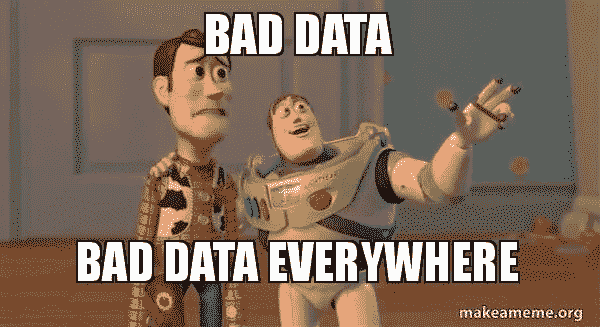
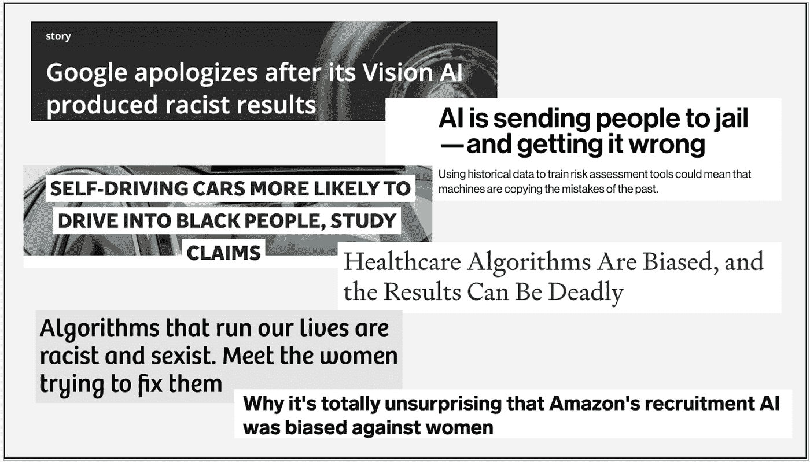
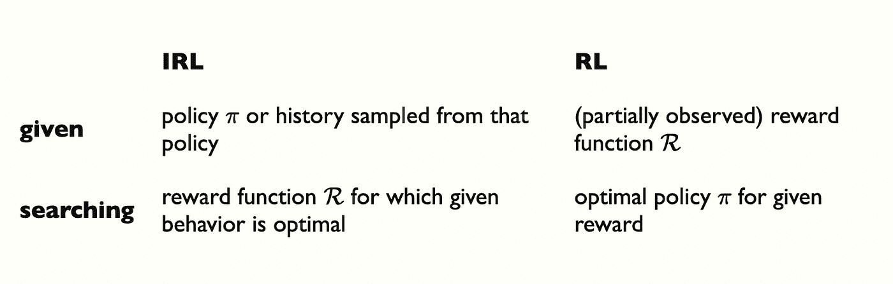
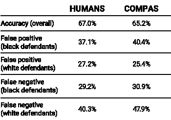
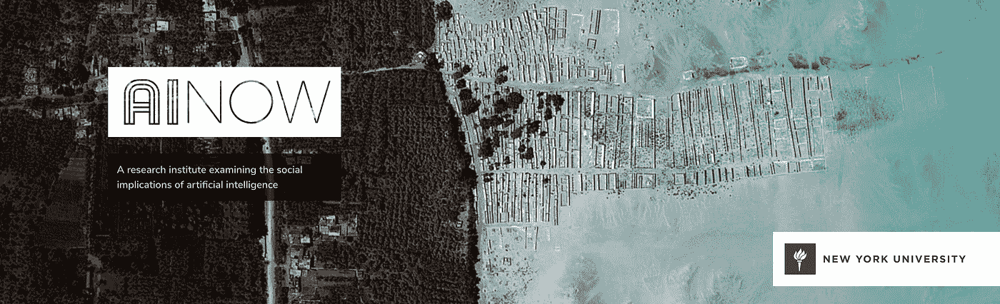

# 我们的机器学习算法正在放大偏见，并使社会差距永久化

> 原文：<https://towardsdatascience.com/our-machine-learning-algorithms-are-magnifying-bias-and-perpetuating-social-disparities-6beb6a03c939?source=collection_archive---------46----------------------->

## 人工智能伦理和考虑

## *对于机器学习工程师，雇用他们的公司，以及受他们调整的算法影响的用户:*

[凯文·Ku 在 Unsplash 上拍摄的照片](https://unsplash.com/photos/w7ZyuGYNpRQ)

在我开始学习机器学习课程后不久，我意识到媒体对人工智能的状况有一种荒谬的夸大。许多人的印象是，人工智能是研究开发有意识的机器人实体，很快就会接管地球。每当有人质疑我的研究时，我通常会打起精神，因为我的回答经常过早地遭遇惊恐的喘息或愤怒的对抗。可以理解。

## **有意识的机器人实体即将接管？**

然而，现实是，机器学习不是危险的魔法精灵，也不是任何形式的有意识实体。为了简单起见，我通常说人工智能的本质是数学。有人说这只是“美化的统计数据”。或者正如凯尔·加拉丁(Kyle Gallatin)所言，“机器学习只是 y=mx+b 的破解。'

当然，这是一种简化，因为[机器学习来自许多学科](/no-machine-learning-is-not-just-glorified-statistics-26d3952234e3)，如计算机科学、神经科学、数学、科学方法等。但问题是，媒体充斥着各种措辞，让人感觉我们正处于被人工智能生物接管的直接危险之中。

事实是，我们不是。但是，在机器学习的产生过程中，还有许多其他经常被忽视的潜在问题。fast.ai 的联合创始人雷切尔·托马斯(Rachel Thomas)提到，她和其他机器学习专家都认为，“关于人工智能意识的炒作被夸大了”，但[“其他(社会)危害没有得到足够的重视”](https://medium.com/@racheltho/im-an-ai-researcher-and-here-is-what-scares-me-about-ai-909a406e4a71)。今天，我想详细阐述雷切尔提出的这些社会危害之一:“人工智能编码并放大了偏见”。

## **机器学习的真正危害:垃圾进垃圾出**

这其中最令人不安的方面——人工智能放大偏见的想法——是机器学习在社会过程自动化中的承诺是保持最高程度的中立。众所周知，医生在医疗诊断中可能持有偏见，陪审团在刑事司法判决中可能持有偏见。机器学习应该理想地综合记录中的大量变量，并提供中立的评估。

> “但事实是，机器学习程序在很大程度上延续了我们的偏见。所以不是法官对非裔美国人有偏见，而是一个机器人。”——[*布莱恩·雷斯尼克*](https://www.vox.com/science-and-health/2019/1/23/18194717/alexandria-ocasio-cortez-ai-bias)

我们期望模型是客观公正的；正是这种幻灭的客观立场，使得整个磨难感觉阴险，尤其令人失望。

那么这是怎么发生的呢？

图一.[(来源)](https://makeameme.org/meme/bad-data-bad)

“垃圾输入垃圾输出”是一个众所周知的计算机科学公理，这意味着低质量的输入产生低质量的输出。通常，“非垃圾”输入是指干净、准确、标记良好的训练输入。然而，我们现在可以看到，我们的垃圾输入很可能是我们社会过去行为的完美、准确的表现。机器学习的真正危险与机器人意识实体关系不大，而与另一种类型的意识实体——人类——关系更大。当有社会偏见的数据被用来训练机器学习模型时，潜在的结果是一个歧视性的机器学习模型，它预测了我们旨在消除的社会偏见。

## **精度更高！=更好的社会成果**

这个问题从预测进一步延伸到永久化；我们创造了一种强化循环。

例如，假设一个企业主想要预测他们的哪些客户可能会购买某些产品，这样他们就可以提供一个特殊的捆绑包。他们继续要求数据科学家建立一个预测算法，并使用它向特定群体做广告。在这一点上，该模型不仅仅是预测哪些客户会购买，而是在强化它。

虽然在这个例子中是无害的，但这可能导致对社会进程有害的结果。这正是导致这些意想不到的标题:

图二。作者照片。文末引文。

同样，如果我们的应用是针对医疗保健的，目的是基于先前的数据来预测哪一组应该得到更多的关注，我们不仅仅是为了优化而预测，我们现在正在积极地放大和延续先前的差异。

## 那么，我们废除机器学习是因为我们知道它会导致世界毁灭吗？

简而言之，没有。但也许我们应该重新想象我们练习机器学习的方式。如前所述，当我刚开始练习机器学习时，对人工智能发展意识的过度夸张的司空见惯的恐惧开始有点迁就我。我认为可能发生的最糟糕的事情是像我们拥有的任何工具一样被滥用，尽管滥用可能在物理工具上比在数字工具上更明显。

然而，YouTube 上 Alter 的短片“[屠宰场机器人”](https://www.youtube.com/watch?v=9fa9lVwHHqg)引发了许多关于伦理和自主人工智能可能存在的危险的思考。“生命未来研究所”创作这部电影的主要原因是为了传达以下思想: [*“因为自主武器不需要人类的单独监督，它们是潜在的可扩展大规模杀伤性武器——少数人可以发射无限数量的武器。”*](https://spectrum.ieee.org/automaton/robotics/artificial-intelligence/why-you-should-fear-slaughterbots-a-response)

在这部短片的背景下，无人机被用于伤害。然而，使用人工智能系统会产生灾难性的意外后果吗？如果我们在没有任何监督预防措施的情况下创建 AI 来优化一个松散定义的目标和松散定义的约束，并意识到它超出了我们的预期，会发生什么？如果我们创建了一个系统，其初衷是用于社会公益，但结果却是灾难性的、不可逆转的损害，那该怎么办？意识的缺失变得无关紧要，但并没有最小化潜在的伤害。

然后，我开始偶然发现挑战当前人工智能标准模型的相关资源，并解决这些问题，这最终导致了这篇博文的合成。

## **逆向强化学习**

第一个是斯图尔特·罗素的“人类兼容”，这表明人工智能的标准模型是有问题的，因为缺乏干预。在当前的标准模型中，我们专注于优化我们最初设置的指标，而没有任何人在回路中的监督。Russell 用一种假设的情况来挑战这一点，即我们在一段时间后意识到我们最初目标的结果并不完全是我们想要的。

相反，斯图尔特提出，与其使用我们的人工智能系统来优化一个固定的目标，不如我们灵活地创建它们，以适应我们潜在的摇摆不定的目标。这意味着在算法的不确定性水平上编程，它不能完全确定它知道我们的目标，所以它会故意问它是否需要重定向或关闭。这被称为“逆向强化学习”

下面你可以看到普通强化学习目标和逆向强化学习目标之间的区别:

图三。强化学习 vs 逆向强化学习([来源](https://thinkingwires.com/posts/2018-02-13-irl-tutorial-1.html)

传统的强化学习的目标是在给定的情况下找到最佳的行为或行动来最大化回报。例如，在自动驾驶汽车领域，模型保持在道路中心的每一个时刻都会收到一个小奖励，如果它闯红灯，则会收到一个负奖励。该模型在环境中移动，试图找到最佳的行动路线，以获得最大的回报。因此，强化学习模型被输入奖励函数，并试图找到最佳行为。

但是，有时候奖励作用并不明显。为了说明这一点，反向强化学习被输入一组行为，并试图找到最佳的奖励函数。鉴于这些行为，*人类真正想要的是什么？*IRL 的最初目标是在给定行为是最有利行为的假设下揭示奖励函数。然而，我们知道情况并非总是如此。按照这一逻辑，这一过程可能有助于我们揭示人类存在偏见的方式，这反过来将允许我们通过意识来纠正未来的错误。

## **有偏比较算法**

另一个相关和及时的资源是线性离题的插曲“种族主义，刑事司法系统和数据科学”。在这一集中，凯蒂和本机智地讨论了 COMPAS，这是一种代表替代制裁的矫正罪犯管理概况的算法。在美国一些州，法官在量刑时使用这种算法来预测被告再次犯罪的可能性是合法的。

图四。J. *Dressel 等人，科学进展，EAAO55850，2018* ( [来源](https://www.sciencemag.org/news/2018/01/united-states-computers-help-decide-who-goes-jail-their-judgment-may-be-no-better-ours))

然而，各种研究挑战了算法的准确性，发现*种族歧视的结果*尽管缺乏种族作为输入。线性离题探讨了种族偏见结果出现的潜在原因，并以一系列挥之不去的强大的，发人深省的伦理问题结束:

> 一个算法的合理输入是什么？当你考虑整体背景时，如果一个算法引入了不公平，那么它是否公平？投入来自哪里？输出将在什么环境中部署？当将算法插入到已经复杂且具有挑战性的流程中时，我们是否花费了足够的时间来检查上下文？我们试图自动化什么，我们真的想自动化它吗？

凯蒂在这一集的结尾巧妙地提出的最后一串问题是非常紧迫的问题，给人留下了持久的印象，因为我是机器学习对社会有益的巨大支持者。我确信，这些考虑将成为我打算用算法解决的每个复杂的、数据驱动的社会问题的一个组成部分。

## **最后的想法和反思**

这些模型在很大程度上伤害了许多人，同时提供了一种虚假的安全感和中立感，但也许我们可以从中获得的是承认我们的数据中不可否认的代表性不足。当算法显然不适用于某些少数群体时，这些群体的数据缺乏是很明显的。

偏见是我们的责任，至少要认识到，这样我们才能推动减少偏见的举措。

此外，在[“我们该如何应对人工智能中的偏见”](https://hbr.org/2019/10/what-do-we-do-about-the-biases-in-ai)中，James Manyika、Jake Silberg 和 Brittany Presten 提出了管理团队最大限度提高人工智能公平性的六种方式:

1.  保持对人工智能和伦理的最新研究。
2.  建立一个在部署人工智能时可以减少偏差的流程
3.  围绕潜在的人类偏见进行基于事实的对话
4.  探索人类和机器可以整合起来对抗偏见的方法
5.  在偏见研究方面投入更多努力，以推动该领域的发展
6.  通过教育和指导投资于人工智能领域的多样化

总的来说，我对机器学习帮助人类决策的能力感到非常鼓舞。既然我们意识到了数据中的偏差，我们就有责任采取措施来减轻这些偏差，这样我们的算法才能真正提供一个中立的评估。

鉴于这些不幸的事件，我希望在未来几年，会有更多关于人工智能监管的对话。已经有一些很棒的组织，如 [AI Now、](https://ainowinstitute.org/)等，致力于围绕理解人工智能的社会影响进行研究。现在，我们有责任继续这一对话，走向一个更加透明和公正的社会。

图五、AI Now 首页([来源](https://ainowinstitute.org/))

**用于图二的物品:**

1.  [人工智能把人送进监狱——而且做错了](https://www.technologyreview.com/2019/01/21/137783/algorithms-criminal-justice-ai/)
2.  运行我们生活的算法是种族主义和性别歧视的。见见试图修理她们的女人
3.  [谷歌在其视觉人工智能产生种族主义结果后道歉](https://algorithmwatch.org/en/story/google-vision-racism/)
4.  [医疗保健算法存在偏差，结果可能是致命的](https://medium.com/pcmag-access/healthcare-algorithms-are-biased-and-the-results-can-be-deadly-da11801fed5e)
5.  [自动驾驶汽车更容易撞上黑人](https://www.independent.co.uk/life-style/gadgets-and-tech/news/self-driving-car-crash-racial-bias-black-people-study-a8810031.html)
6.  [为什么亚马逊的招聘人工智能对女性有偏见一点也不奇怪](https://www.businessinsider.com/amazon-ai-biased-against-women-no-surprise-sandra-wachter-2018-10)