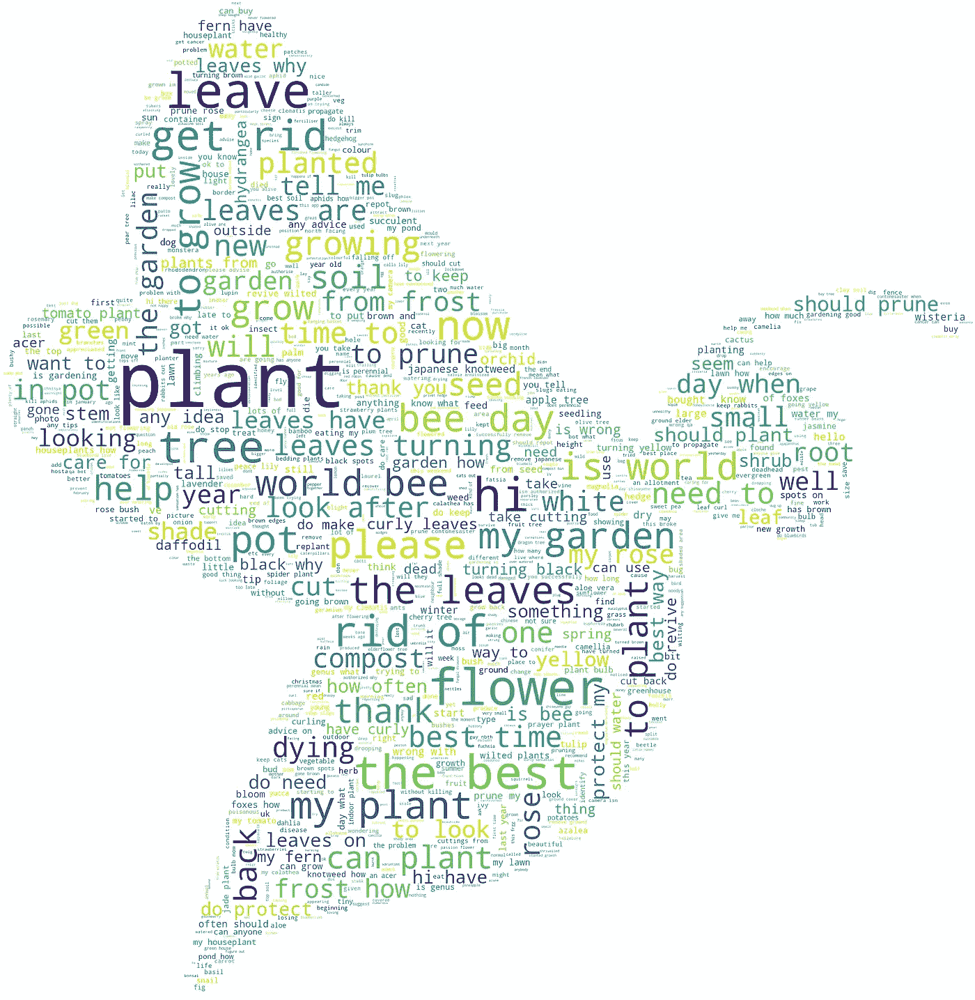
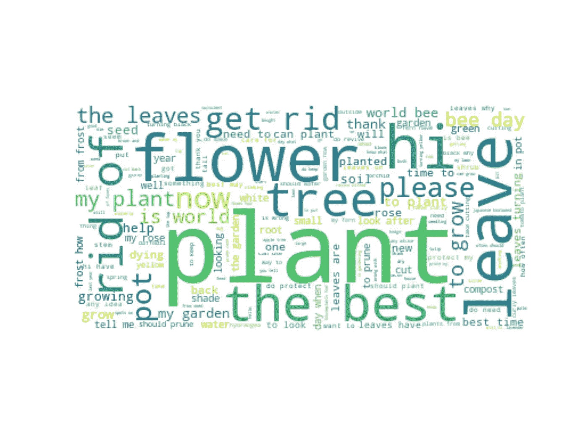
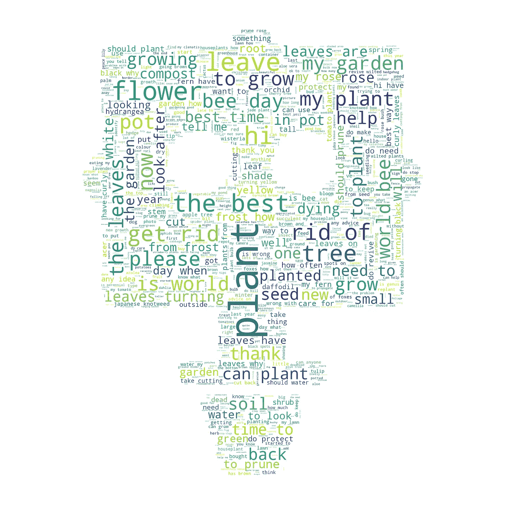

# 我们的问答机器人& Python 语言的 WordCloud

> 原文：<https://towardsdatascience.com/our-q-a-bot-wordcloud-in-python-c8e7593a3256?source=collection_archive---------66----------------------->

## 创建首个个性化单词云的 whistlestop 指南



Candide 是一个植物爱好者社区。我们的用户经常会来到我们的 feed，询问关于他们的植物的问题。

上个月，我们推出了问答机器人(Q&A Bot ):这是一个试图回答用户提出的任何问题的系统，利用我们文章中的智慧和应用程序中更广泛的内容。

我对我们收到的问题的内容进行了分析，并使用 Python 的 WordCloud 包创建了一个可视化的单词云。我不会详细说明代码是如何工作的，但是如果你想看这个，请在下面评论，我很乐意写一个关于这个主题的教程。

因此，准备好大约 2500 个问题，由 1000 多名 Candide 用户通过问答机器人提交给我们，让我们开始吧！

首先，我们导入将要使用的库:`numpy`、`pandas`、`wordcloud`和`matplotlib.pyplot`。

```
import numpy as np
import pandas as pd
from wordcloud import WordCloud, STOPWORDS

import matplotlib.pyplot as plt
```

然后，我们将数据加载到熊猫数据框架中。

```
# Dataframe
df = pd.read_csv("questions.csv", index_col=0)
```

接下来，我们将所有提交的问题合并到一个文本中，并确保全部是小写字母，如下所示:

```
# Combine all questions into one text
text = " ".join(question for question in df.text)
# Make sure all words are lower case
text = text.lower()
```

我们现在准备使用`cloudword`和`matplotlib`来生成和绘制我们的单词云，如下所示:

```
# Generate a wordcloud
stopwords = STOPWORDS
wordcloud = WordCloud(background_color="white", max_words=1000, stopwords=stopwords)
wordcloud.generate(text)

# Plot
plt.figure(figsize=[20, 10])
plt.imshow(wordcloud, interpolation='bilinear')
plt.axis("off")
plt.show()
```

瞧啊！结果看起来像这样:



Word Cloud，使用提交给我们问答机器人的问题

热门词汇是:植物、花和叶子🌱。没什么好惊讶的🙂！

现在，如果我们想要个性化输出，我们可能想要让这个单词云有一个特定的形状。为此，我们将使用以下机器人植物的剪影，由我的设计师同事好心提供， [Kat](https://medium.com/@kat.jones_38546) (这毕竟是一个关于植物问题的 Q & A Bot！)


使用上面的图像和下面的代码:

```
# Personalised cloud of words
path = "/Users/amine/code/HackDayMay2020/robot-plant.png"
mask = np.array(Image.open(path))
wordcloud = WordCloud(background_color="white", max_words=1000, mask=mask, stopwords=stopwords)
wordcloud.generate(text)

# Plot
plt.figure(figsize=[20, 10])
plt.imshow(wordcloud, interpolation='bilinear')
plt.axis("off")
plt.show()
```

我们得到了一个最终的结果，一堆单词组成了我们的机器人工厂的形状！



机器人工厂！

最后，我们不应该忘记将我们的图像保存到文件中，代码如下:

```
# Save to file
wordcloud.to_file("robot-plant-word-cloud.png")
```

在下一篇教程中，我将分析用户的问题是如何随着时间和季节变化的。如果你想让我制作一个更深入的教程来解释 wordcloud 是如何工作的，请在评论中告诉我！

## 参考资料和资源

1.  *WordCloud for Python 文档*[https://github.com/amueller/word_cloud](https://github.com/amueller/word_cloud)
2.  *word cloud 项目的 Github 代码*[https://github.com/amueller/word_cloud](https://github.com/amueller/word_cloud)
3.  *用 Python 生成 word cloud*作者 Duong Vu[https://www . data camp . com/community/tutorials/word cloud-Python](https://www.datacamp.com/community/tutorials/wordcloud-python)
4.  *用 Python 生成单词云*由 SumedhKadam[https://www.geeksforgeeks.org/generating-word-cloud-python/](https://www.geeksforgeeks.org/generating-word-cloud-python/)