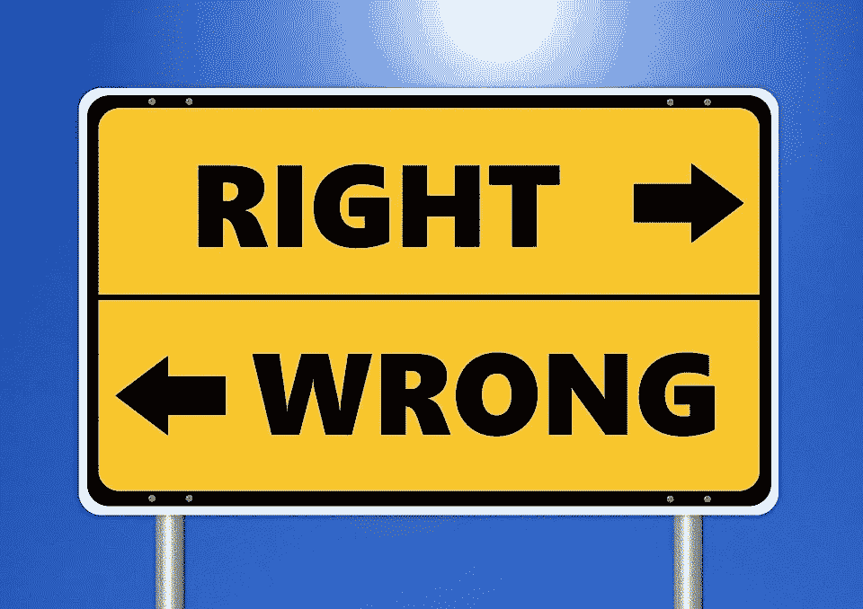

# 为什么“目的证明手段是正当的？”是个错误的问题

> 原文：<https://towardsdatascience.com/outcome-bias-versus-moral-philosophy-cb82f42c4437?source=collection_archive---------22----------------------->

## 结果偏差与道德哲学

在最近的一篇文章中，我写了关于结果偏差和决策分析的核心原则:

> 决策的质量应该仅使用决策者在做出决策时可用的信息来评估。

如果你是这个话题的新手，我推荐你看看我的[温柔介绍](https://bit.ly/quaesita_outcomebias)。这篇文章是我的书呆子同伴的脚注。

# 道德哲学的三个主要视角

*   *结果主义:考虑后果！*
*   义务论:尽你的责任！
*   *德性伦理:要有德性！*

# 道德宣传还是决策情报？

不要把 [***结果偏差***](http://bit.ly/quaesita_outcomes) 误解为反对*结果主义者* *道德观*的宣传。

如果你一直被结果偏差的平淡解释所困扰，这种解释反复无常地使用*“意图”*和*“结果”，那么你会认为这是有道理的*

事实上，结果偏差的心理学现象并不偏爱现代道德哲学的主题，也没有对美德伦理学或功利主义等领域做出陈述。

那么，为什么会有误解呢？

图片:[来源](https://pixabay.com/photos/ethics-right-wrong-ethical-moral-2991600/)

# 混乱的根源

1.  认为道德哲学的核心问题是“结果证明了手段的正当性吗？”这是错误的
2.  认为*“决定和结果”*是*“意图和结果”的同义词是错误的。*

如果你同时犯了这两个错误，你可能会形成这样的印象:一个毫无争议的决策建议(*[*避免结果偏差*](http://bit.ly/quaesita_outcomes)*)侵犯了哲学中的公开问题。**

## **"目的证明手段是正当的吗？"**

**啊，语言；好困惑！尤其是对于老式的精粹短语。原来“目的”有多重含义，包括“结果”和“目标”如果你习惯于将“结果”理解为“结果”，那么你可能会发现在那里添加一个额外的单词是有帮助的...**

## **现代结果主义与结果无关**

**结果主义的哲学观点不是通过一个行为的实际后果(结果)来判断其道德性，而是通过做出决定时的*可能的/可预见的/预期的*(取决于你最喜欢的口味)结果来判断，比如在*中，“预期的结果证明了手段的正当性。”***

**结果偏差理论不是对结果主义的批评。**

****技术细节:**哲学为了完整保留了一个动物园，里面有各种各样的*-主义*，包括多种[结果主义](https://bit.ly/consequentialisms)(其中最著名的是古典功利主义)。哲学家们普遍批评为荒谬的是一种叫做“实际结果主义”的东西科学家们会对这一特殊品种提出异议，但幸运的是我们不必这样做:哲学家们代表我们认为这是荒谬的。如果我们把这个亚种从我们的可行主义列表中移除，那么现代结果主义者可以从中选择的口味还有很多。我这里指的就是这个系列。**

## **现代意向性也不是关于结果的**

**一个意向性的哲学观点(例如各种各样的[美德伦理学](https://bit.ly/virtueethicses)或[义务论](https://bit.ly/deontologies)中的一种)从与美德或责任等概念的一致性来判断一个决定的道德性，例如，*“手段比预期的结果更重要。”***

**结果偏差理论不是对意向性的批判。**

## **转移注意力的例子:偷窃是错的吗？**

**“如果你在试图偷一个溺水的人的手表时不小心救了他，这是道德行为吗？”**

**我看到这个例子流传开来，博客上说结果主义者会说*是*，而意向主义者会说*不*。就我的理解，那是一种误解。**

**结果主义者不会宽恕那种快乐的意外作为一种道德行为。(也没有什么迫使他们一起分析这两个问题来判断道德。营救溺水者可以被视为与盗窃完全不同的道德问题。)大多数结果主义的信徒会谴责这种行为，如果小偷想通过偷窃使世界其他地方变得更糟的话。**

**但是，如果小偷想救一个饥饿的孩子，而这个孩子除了典当手表之外，没有别的办法养活，那该怎么办呢？那些有意向主义倾向的人可能会回答说*“偷窃行为在道德上总是错误的，无论如何”*而那些有结果主义倾向的人可能不同意。当你遇到由谁*来设定预期的问题时，事情就变得棘手了:如果小偷找不到任何其他方式来实现更好的预期结果，但社会可能会不敢苟同呢？社会是根据 T4 当时知道的来判断，还是根据小偷知道的来判断？被告知是一种责任吗？抓住一个朋友，开始辩论吧！开放式问题的开放是有原因的。***

## **掌握好时态**

**如果你总结了可行的现代 *-isms* 和 *-ologies* ，一定要掌握好时态。所有这些都是关于现在时态的道德评价——只使用决策/行动时已知的东西——这正是决策科学喜欢的方式。**

*   ***结果主义:我行动的结果会是什么？***
*   **义务论:我的行为符合我的职责吗？**
*   ***美德伦理:我的行为是由美德驱动的吗？***

**一旦你用适当的时态思考，如何正确对待道德决策在哲学上是一个未解决的问题，我不会去解决它。(不过，你所在国家的法律通常会代表你做出选择。)**

> **道德哲学:“预期的结果证明了手段的正当性吗？”**

## **决策科学说什么**

**只要你不谴责决策者没有使用水晶球，决策科学就不会从技术上反对你的道德观点。**

**无论你选择哪种思想流派(或它们的混合)，决策科学家都会鼓励你根据当时已知的情况来分析情况。例如，如果你最喜欢道义论，那么如果你根据一个人目前的职责而不是他们在行动时的职责进行评估，我们会感到惊讶。**

> **决策科学:“不要谴责决策者没有使用水晶球。”**

**当我们告诉你[避免结果偏差](http://bit.ly/quaesita_outcomebias)时，我们指的是判断[决策者的能力](http://bit.ly/quaesita_di)并形成有效的决策策略。我们不争论道德，因为那是不同学科的范围。**

# **现在是完全不同的东西…**

**感谢阅读！如果你在这里玩得开心，并且对人工智能感兴趣，这里有一个初学者友好的介绍供你娱乐:**

**在这里欣赏整个课程播放列表:[bit.ly/machinefriend](http://bit.ly/machinefriend)**

# **与凯西·科兹尔科夫联系**

**让我们做朋友吧！你可以在 [Twitter](https://twitter.com/quaesita) 、 [YouTube](https://www.youtube.com/channel/UCbOX--VOebPe-MMRkatFRxw) 和 [LinkedIn](https://www.linkedin.com/in/kozyrkov/) 上找到我。有兴趣让我在你的活动上发言吗？用[这个表格](http://bit.ly/makecassietalk)联系。**