# 异常值检测——理论、可视化和代码

> 原文：<https://towardsdatascience.com/outlier-detection-theory-visualizations-and-code-a4fd39de540c?source=collection_archive---------18----------------------->

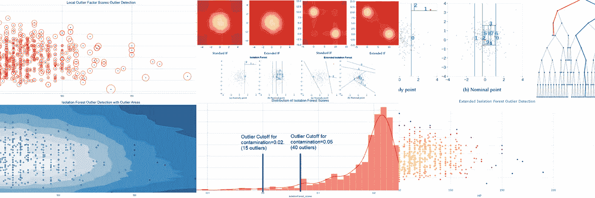

# 什么是离群点检测？

离群点检测也称为异常检测、噪声检测、偏差检测或异常挖掘。没有普遍接受的定义。(Grubbs，1969)的早期定义是:异常值，是指明显偏离样本中其他成员的值。(Barnett 和 Lewis，1994)最近的定义是:

> 似乎与该组数据的其余部分不一致的观察结果。

# 原因

直接从[这篇](/a-brief-overview-of-outlier-detection-techniques-1e0b2c19e561)优秀的文章来看，离群值最常见的原因有:

*   **人为错误** —数据录入错误
*   **仪器误差** —测量误差
*   **实验错误** —数据提取或实验计划/执行错误
*   **故意的** —为测试检测方法而制造的虚拟异常值
*   **数据处理错误** —数据操作或数据集意外突变
*   **采样错误** —从错误的或各种来源提取或混合数据
*   **自然** —不是错误，数据中的新奇

# 应用程序

根据(Hodge，V.J .和 Austin，j .，2014)利用异常值检测的应用程序列表如下:

*   **欺诈检测** —检测信用卡欺诈申请，
    陈述利益或检测信用卡或手机的欺诈使用。
*   **贷款申请处理** —检测欺诈申请或
    潜在的问题客户。
*   **入侵检测** —检测计算机
    网络中的未授权访问。
*   **活动监控** —通过监控
    电话活动或股票市场中的可疑交易来检测手机欺诈。
*   **网络性能** —监控计算机
    网络的性能，例如，检测网络瓶颈。
*   **故障诊断** —监测过程，以检测
    航天飞机上的电机、
    发电机、管道或航天仪器的故障。
*   **结构缺陷检测** —监控生产线以
    检测有缺陷的生产运行，例如有裂缝的横梁。
*   **卫星图像分析**——识别新颖特征或误分类特征
    。
*   **检测图像中的新奇事物** —用于机器人或监视
    系统。
*   **运动分割** —检测独立于背景运动的图像特征。
*   **时序监控** —监控安全关键应用
    ，如钻孔或高速铣削。
*   **医疗状况监测** —如心率监测器。
*   **药物研究** —识别新的分子结构。
*   **检测文本中的新颖性** —检测新闻故事的开始，用于
    话题检测和跟踪，或用于交易者确定股票、商品、外汇交易故事，表现优于或劣于
    商品。
*   **检测数据库中的意外条目**—用于数据挖掘，以
    检测错误、欺诈或有效但意外的条目。
*   **在训练数据集中检测标签错误的数据**。

# 方法

有 3 种异常值检测方法:

1.在没有数据先验知识的情况下确定异常值。这类似于**无监督**聚类。
2。模拟正常和异常。这类似于**监督**分类，需要标记数据。
3。只模拟常态。这被称为新颖性检测，类似于**半监督**识别。它需要属于正常类的标记数据。

我会先处理**接近**。这是最常见的情况。大多数数据集没有关于异常值的标记数据。

# 分类学

根据 Ben-Gal I .(2005)离群点检测方法可分为**单变量**方法和**多变量**方法。离群点检测方法的另一个基本分类是在**参数**(统计)方法和**非参数**方法之间，参数(统计)方法假设观察值的已知基本分布，非参数**方法是无模型的，如基于距离的方法和聚类技术。**

# 资料组

我将使用 [Pokemon](https://www.kaggle.com/abcsds/pokemon) 数据集，并对 2 列 **['HP '，' Speed']** 执行异常值检测。这是一个有趣的数据集，它的观察值很少，计算速度很快，很多人都很熟悉它。仅选择两列仅用于**可视化**目的(二维)。观察散点图中的结果。这些方法可以在**多维**中缩放。

# 离群点检测算法

将遵循的算法是:

*   **隔离林**
*   **扩展隔离林**
*   **局部异常因素**
*   **数据库扫描**
*   **一班 SVM**
*   **以上的合奏**

# 代码和可视化

这篇文章的代码在我的 [GitHub](https://github.com/Deffro/Data-Science-Portfolio/blob/master/Notebooks/Outlier%20Detection/Outlier%20Detection%20-%20Theory%2C%20Visualizations%20and%20Code.ipynb) 上。为了保持简洁，我不会在文章中包含代码。

读取数据后，前五行是这样的:

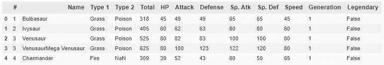

# 隔离森林

*   隔离森林和任何树集合方法一样，是建立在决策树的基础上的。在这些树中，通过首先随机选择一个特征，然后在所选特征的最小值和最大值之间选择一个随机分割值来创建分区。
*   为了在树中创建分支，首先选择一个随机特征。然后，为该特征选择一个随机分割值(在最小值和最大值之间)。如果给定的观察值具有该特征的较低值，则所选的观察值遵循左分支，否则遵循右分支。这个过程一直持续到孤立一个点或达到指定的最大深度。
*   原则上，异常值比常规观测值更少出现，并且在值方面与常规观测值不同(在特征空间中，它们离常规观测值更远)。这就是为什么通过使用这种随机划分，它们应该被识别为更靠近树的根(更短的平均路径长度，即，观察在树中从根到终端节点必须经过的边的数量)，需要更少的分裂。

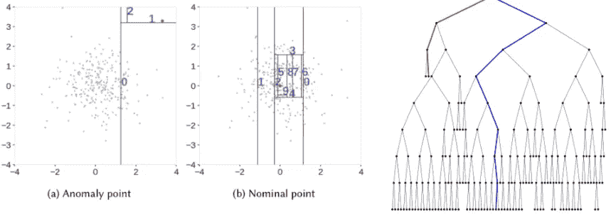

关于隔离林的更多信息:

*   [隔离林—论文](https://cs.nju.edu.cn/zhouzh/zhouzh.files/publication/icdm08b.pdf?q=isolation-forest)
*   [使用隔离森林进行离群点检测](/outlier-detection-with-isolation-forest-3d190448d45e)

我将使用 sklearn 库中的 *IsolationForest* 。在定义算法时，有一个称为*污染*的重要参数。它是算法认为是异常值的观察值的百分比。我设为等于 **2%** 。我们将 X (2 个特征 HP 和速度)拟合到算法中，并使用 *fit_predict* 在 X 上也使用它。这产生了简单的异常值(-1 是异常值，1 是内部值)。我们还可以使用函数 *decision_function* 来获得 Isolation Forest 给每个样本的分数。

运行该算法后，发现了 785 个内点和 15 个外点。

让我们画出结果。

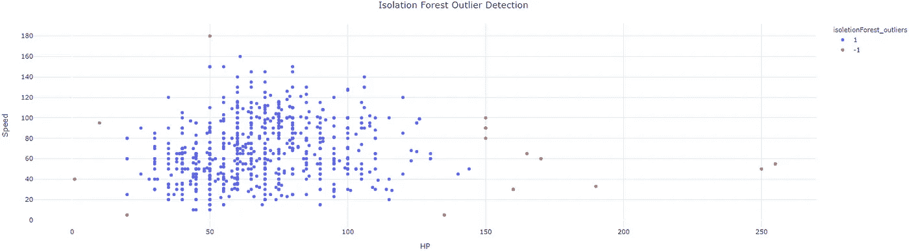

或者，我们可以绘制纯分数，而不仅仅是离群值/内部值。

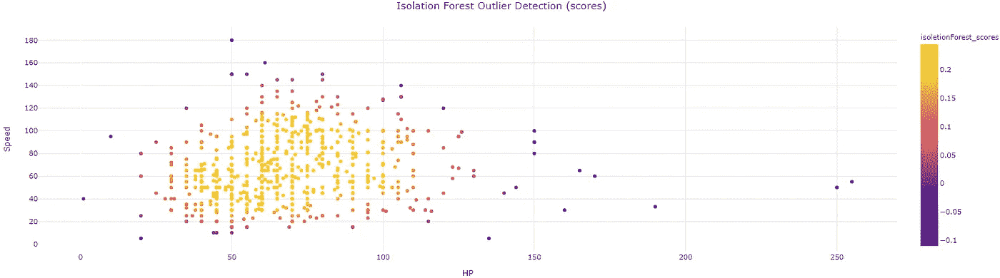

从视觉上看，这 15 个异常值似乎是合法的，并且在数据点的主要斑点之外。

我们可以做一个更高级的可视化，除了内部和外部显示隔离森林的决策边界。

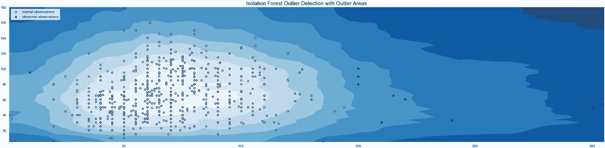

颜色越深，该区域的异常值越大。

最后，我们可以看到分数的分布。

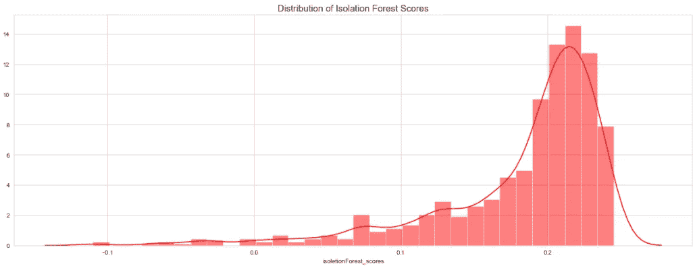

这种分布很重要，有助于我们更好地确定我们案例中正确的*污染*值。如果我们改变污染值，isoletionForest_scores 将改变，但分布将保持不变。该算法将调整分布图中异常值的临界值。

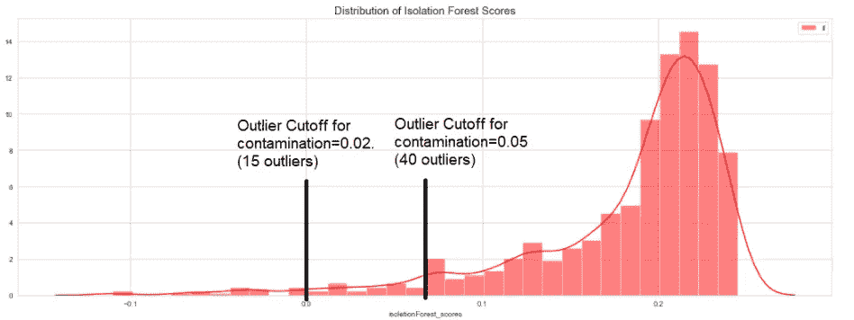

# 扩展隔离林

隔离林有一个缺点:它的决策边界要么是垂直的，要么是水平的。因为线只能平行于轴，所以存在包含许多分支切割和仅一些或单个观察值的区域，这导致一些观察值的不正确异常分数。

扩展隔离林选择 1)分支切割的随机斜率和 2)从训练数据的可用值范围中选择的随机截距。这些项实际上是线性回归线。

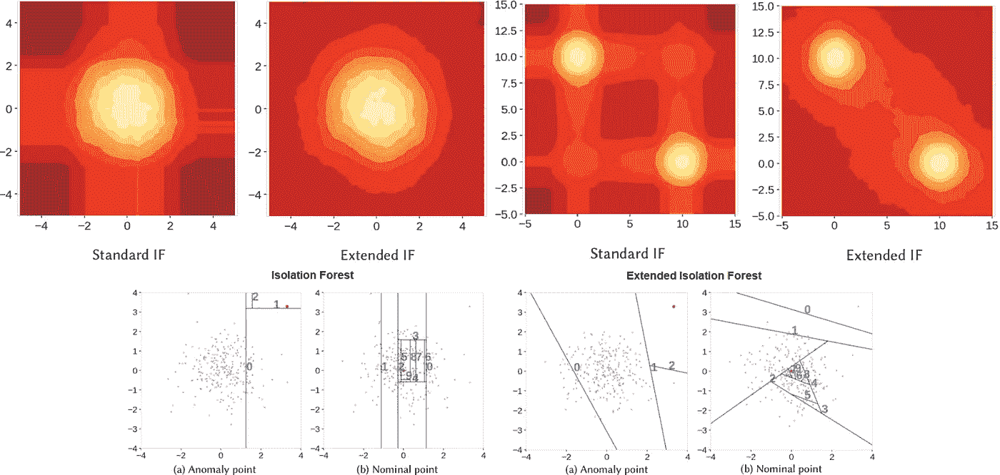

有关扩展隔离林的更多信息:

- [扩展隔离林-论文](https://arxiv.org/abs/1811.02141)
- [扩展隔离林-Github](https://github.com/sahandha/eif)
-[用扩展隔离林检测异常值](/outlier-detection-with-extended-isolation-forest-1e248a3fe97b)

sklearn 中没有实现扩展隔离林，但是在 [Github](https://github.com/sahandha/eif) 上有

我们必须将它的分数乘以-1，以便与其他算法的分数具有相同的形式。

扩展隔离林不提供普通的离群值和内联值(as -1 和 1)。我们只是通过将分数中最低的 2%作为异常值来创建它们。这个算法的分数和基本的隔离林是不一样的。这里所有的分数都是负数。

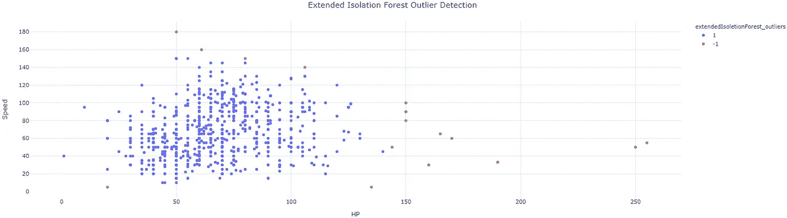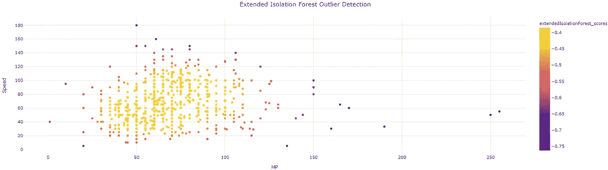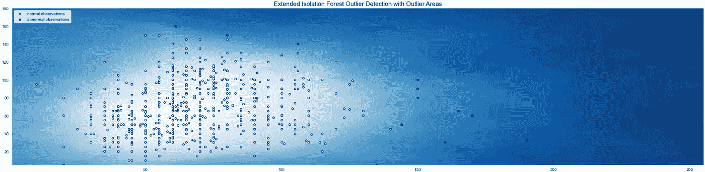

如果你检查代码，你可能会注意到我在这个图中使用了 *cmap=plt.cm.Blues* ，而不是前面的 *cmap=plt.cm.Blues_r* (反向)。我们可以看到不同异常区域之间的过渡更加平滑。

该算法发现了 16 个异常值。

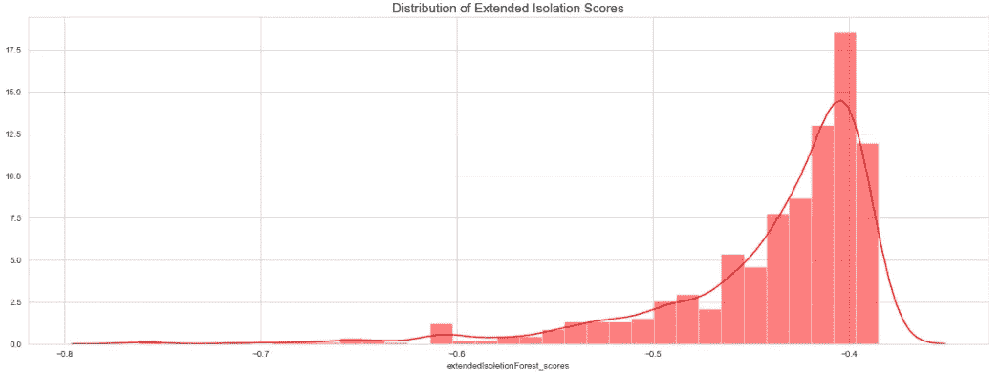

# 局部异常因素

*   LOF 是一种计算方法，通过查看某一点的相邻点来找出其密度，并在稍后将其与其他点的密度进行比较。
*   点的 LOF 表示该点相对于其相邻点的密度。如果一个点的密度远小于其相邻点(≫1 附近)的密度，则该点远离密集区域，因此是异常值。
*   这是有用的，因为如果整个区域不是数据点的全局空间中的外围区域，则并非所有方法都不会识别相对于附近的点簇为异常值的点(局部异常值)。

点 P 的 LOF 会有一个:

*   高值 if → P 远离其邻居且其邻居具有高密度(靠近其邻居)(LOF =(高距离和)x(高密度和)=高值)
*   如果-> P 远离其邻居，但其邻居的密度较低，则值较低(LOF =(高总和)x(低总和)=中间值)
*   如果-> P 靠近其邻居且其邻居的密度较低，则值较低(LOF =(低总和)x(低总和)=低值)

关于局部异常因素的更多信息:

*   [循环:局部异常概率—论文](https://dl.acm.org/doi/pdf/10.1145/1645953.1646195)
*   [用于异常检测的局部异常因子](/local-outlier-factor-for-anomaly-detection-cc0c770d2ebe)

运行 sklearn 库中的代码后，它确定了 21 个局部异常值。

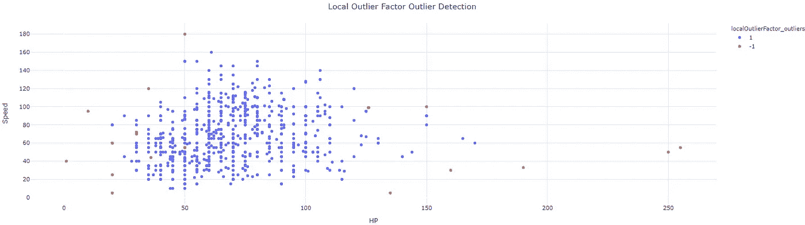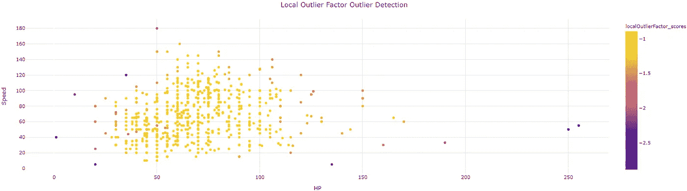

我们可以创建另一个有趣的图，其中局部异常值越大，其周围的圆圈就越大。

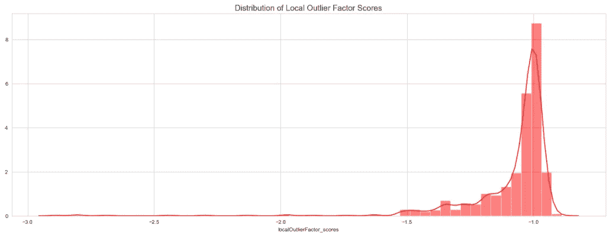

这个算法和之前的有很大不同。它也能发现异常值，但方式不同。它发现局部异常值。你是否注意到在图的主体内有异常值？

# 基于密度的噪声应用空间聚类

一种经典的聚类算法，其工作原理如下:

*   随机选择一个尚未分配给聚类或指定为异常值的点。通过查看在ε距离内其周围是否至少有 min_samples 个点来确定其是否为核心点。
*   创建该核心点及其ε距离内所有点(所有可直接到达的点)的聚类。
*   找到聚类中每个点的ε距离内的所有点，并将它们添加到聚类中。找到所有新添加的点的ε距离内的所有点，并将这些点添加到聚类中。冲洗并重复。(即执行“邻域跳跃”以找到所有密度可达的点并将它们添加到聚类中)。

对于我们的示例，在调整了*ε*参数后，它发现了 13 个异常值。

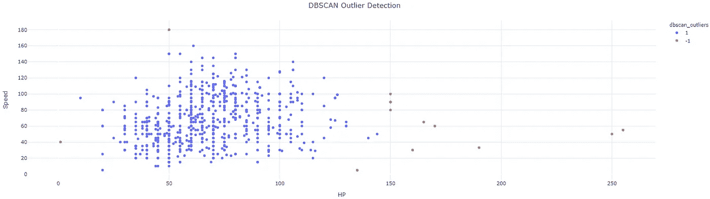

该算法不提供异常值强度的分数。

# 一级 SVM

*   单类分类器适用于仅包含正常类样本的训练数据集，但也可用于所有数据。一旦准备好，该模型被用于将新的例子分类为正常或不正常。
*   与标准 SVM 的主要区别在于，它是以无监督的方式拟合的，并且不像 c 那样提供用于调整余量的正常超参数。相反，它提供了一个超参数“nu ”,该参数控制支持向量的灵敏度，并且应该调整到数据中异常值的近似比率。

更多关于一级 SVM

*   [单类支持向量机的异常检测](/outlier-detection-with-one-class-svms-5403a1a1878c)
*   [不平衡数据集的单类分类算法](https://machinelearningmastery.com/one-class-classification-algorithms/)

运行算法后，我得到以下散点图

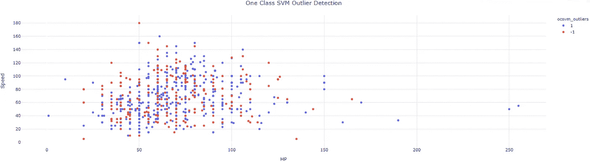

在这个数据里好像行不通。找不到更好的*怒*。对于其他 *nu* 值，离群值比内值多。如果有人有任何想法，请分享，我会更新！

# 全体

最后，让我们将这 5 种算法结合起来，形成一个健壮的算法。我将简单地添加离群列，离群列为-1，内联列为 1。

我不会用一等的 SVM。

将结果相加后，我们得到:

```
data['outliers_sum'].value_counts()value  count 
    4    770
    2     15
   -4      7
   -2      7
    0      1
```

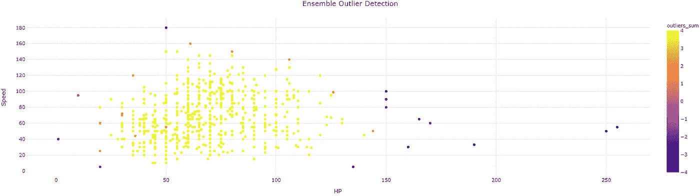

outliers_sum=4 的观察值意味着所有 4 个算法都同意它是一个内点，而对于完全的外点一致性，和是-4。

我们先来看看对于哪 7 个口袋妖怪所有算法都同意离群值。我们也可以将 sum=4 的观察值作为内值，其余的作为界外值。这取决于我们。

```
data.loc[data[‘outliers_sum’]==-4][‘Name’]121              Chansey
155              Snorlax
217            Wobbuffet
261              Blissey
313              Slaking
431    DeoxysSpeed Forme
495             Munchlax
```


个别图片取自 [pokemondb](https://pokemondb.net/) 。

这些是我们在惠普和速度上的异常值！

感谢阅读！