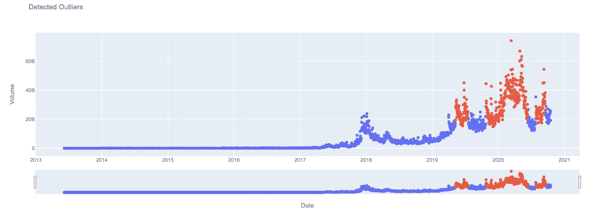

# 用 RNN 自动编码器检测异常值

> 原文：<https://towardsdatascience.com/outlier-detection-with-rnn-autoencoders-b82e2c230ed9?source=collection_archive---------27----------------------->

## 利用重构自动编码器模型检测时间序列数据中的异常。

由作者生成的图像。

***注来自《走向数据科学》的编辑:*** *虽然我们允许独立作者根据我们的* [*规则和指导方针*](/questions-96667b06af5) *发表文章，但我们不认可每个作者的贡献。你不应该在没有寻求专业建议的情况下依赖一个作者的作品。详见我们的* [*读者术语*](/readers-terms-b5d780a700a4) *。*

*TL DR:*[*Historic-Crypto Package*](https://github.com/David-Woroniuk/Historic_Crypto)*[*Code*](https://github.com/David-Woroniuk/Medium-Articles/blob/master/RNN_Time_Series_Outlier_Detection.ipynb)*。**

# ***什么是异常？***

*异常值，通常被称为离群值，是指不符合数据序列总体行为的数据点、数据序列或数据模式。因此，异常检测的任务是检测与更广泛的数据中存在的模式不一致的数据点或序列。*

*异常数据的有效检测和删除可以为许多业务功能提供非常有用的洞察力，例如检测网站中嵌入的断开链接、互联网流量峰值或股票价格的剧烈变化。将这些现象标记为异常值，或制定预先计划的响应可以节省企业的时间和金钱。*

# ***异常的类型？***

*异常数据通常可以分为三个不同的类别，****时间变化*** 或 ***电平移动*** 。**

*****加性异常值*** 表现为数值的突然大幅增加或减少，可由外源或内源因素驱动。附加异常值的例子可能是由于在电视上出现而导致的网站流量的大幅增加(外生)，或者由于强劲的季度表现而导致的股票交易量的短期增加(内生)。**

*****时间变化*** 的特点是序列较短，不符合数据中更广泛的趋势。例如，如果网站服务器崩溃，对于一系列数据点，网站流量将降至零，直到服务器重启，此时正常流量将恢复。**

*****电平转换*** 是大宗商品市场的常见现象，因为对电力的高需求与恶劣的天气条件有着内在联系。因此，由于天气驱动的需求曲线和可再生能源发电曲线的变化，可以观察到夏季和冬季电价之间的“水平变化”。**

# ****什么是自动编码器？****

**自动编码器是设计用来学习给定输入的低维表示的神经网络。自动编码器通常由两个组件组成:一个 ***编码器*** ，它学习将输入数据映射到更低维度的表示；一个 ***解码器*** ，它学习将表示映射回输入数据。**

**由于这种架构，编码器网络迭代地学习有效的数据压缩函数，该函数将数据映射到较低维度的表示。在训练之后，解码器能够成功地重建原始输入数据，因为重建误差(*输入和由解码器*产生的重建输出之间的差)是整个训练过程的目标函数。**

# ****实施****

**现在我们已经理解了自动编码器模型的底层架构，我们可以开始实现这个模型了。**

**第一步是安装我们将使用的库、包和模块:**

**其次，我们需要获得一些数据进行分析。本文使用 [Historic-Crypto](https://github.com/David-Woroniuk/Historic_Crypto) 包获取从`‘2013–06–06’`到现在的历史比特币`(‘BTC’)`数据。下面的代码还生成每日比特币回报和当天价格波动，然后删除任何丢失的数据行并返回数据帧的前 5 行。**

**现在我们已经获得了一些数据，我们应该直观地扫描每个序列，寻找潜在的异常值。下面的`plot_dates_values`函数支持数据框中包含的每个系列的迭代绘图。**

**我们现在可以迭代调用上述函数，为比特币的交易量、收盘价、开盘价、波动率和回报率生成 Plotly 图表。**

**由作者生成的图像。**

**值得注意的是，2020 年交易量出现了大量峰值，调查这些峰值是异常的还是更广泛系列的指示可能是有用的。**

**由作者生成的图像。**

**2018 年收盘价存在明显的飙升，随后暴跌至技术支持水平。然而，积极的趋势广泛存在于所有数据中。**

**由作者生成的图像。**

**每日开盘价遵循与上述收盘价相似的模式。**

**由作者生成的图像。**

**价格波动在 2018 年和 2020 年都出现了一些明显的峰值。因此，我们可以调查这些波动峰值是否被自动编码器模型视为异常。**

**由作者生成的图像。**

**由于回报序列的随机性质，我们选择测试比特币每日交易量中的异常值，如`Volume`所示。**

**因此，我们可以开始自动编码器模型的数据预处理。数据预处理的第一步是确定训练数据和测试数据之间的适当拆分。下面概述的`generate_train_test_split`功能支持按日期拆分培训和测试数据。在调用下面的函数时，生成两个数据帧，即`training_data`和`testing_data`作为全局变量。**

**为了提高模型的准确性，我们可以“标准化”或缩放数据。该函数缩放上面生成的`training_data`数据帧，保存`training_mean`和`training_std`用于以后标准化测试数据。**

*****注:*** *使用相同的尺度对训练和测试数据进行尺度转换是很重要的，否则尺度的差异会产生可解释性问题和模型不一致。***

**正如我们在上面调用的`normalise_training_values`函数，我们现在有一个包含标准化训练数据的 numpy 数组，称为`training_values`，我们已经将`training_mean`和`training_std`存储为用于标准化测试集的全局变量。**

**我们现在可以开始生成一系列可用于训练自动编码器模型的序列。我们定义该模型将被提供 30 个先前的观察值，提供形状的 3D 训练数据(2004，30，1):**

**现在我们已经完成了训练数据处理，我们可以定义自动编码器模型，然后根据训练数据拟合该模型。`define_model`函数利用训练数据形状来定义适当的模型，返回自动编码器模型和自动编码器模型的摘要。**

**随后，`model_fit`函数在内部调用`define_model`函数，然后向模型提供`epochs`、`batch_size`和`validation_loss`参数。然后调用这个函数，开始模型训练过程。**

**一旦对模型进行了训练，绘制训练和验证损失曲线以了解模型是否存在偏差(欠拟合)或方差(过拟合)是很重要的。这可以通过调用下面的`plot_training_validation_loss`函数来观察。**

**由作者生成的图像。**

**值得注意的是，训练和验证损失曲线在整个图表中趋于一致，验证损失仍然略大于训练损失。给定形状和相对误差，我们可以确定自动编码器模型没有欠拟合或过拟合。**

**现在，我们可以定义重建误差，这是自动编码器模型的核心原则之一。重建误差表示为`train_mae_loss`，重建误差阈值确定为`train_mae_loss`的最大值。因此，当计算测试误差时，任何大于最大值`train_mae_loss`的值都可以被认为是异常值。**

**由作者生成的图像。**

**上面，我们将`training_mean`和`training_std`保存为全局变量，以便使用它们来缩放测试数据。我们现在定义`normalise_testing_values`函数来缩放测试数据。**

**随后，在`testing_data`的`Volume`列调用该函数。因此，`test_value`被具体化为一个 numpy 数组。**

**接下来，定义`generate_testing_loss`函数，计算重建数据和测试数据之间的差异。如果任何值大于`train_mae_loss`的最大值，它们被存储在全局异常列表中。**

**此外，还介绍了试验 MAE 损失的分布，以便与训练 MAE 损失进行直接比较。**

**由作者生成的图像。**

**最后，异常值如下图所示。**

**由自动编码器模型表征的异常数据用橙色表示，而符合的数据用蓝色表示。**

**由作者生成的图像。**

**我们可以看到，2020 年很大一部分比特币交易量数据被认为是异常的——可能是由于新冠肺炎推动的零售交易活动增加？**

**尝试 Autoencoder 参数和数据集——看看你能否在比特币收盘价中找到任何异常——或者使用[historical-Crypto](https://github.com/David-Woroniuk/Historic_Crypto)库下载不同的加密货币！**

**编码快乐！**