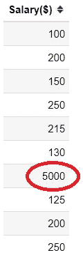
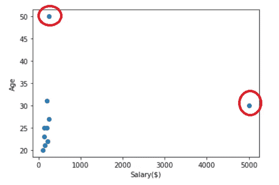
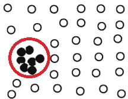
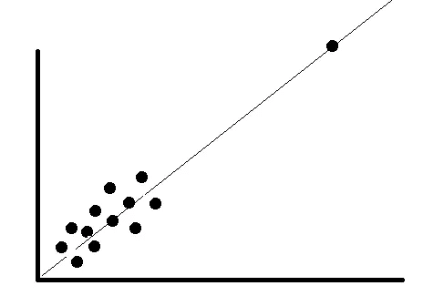
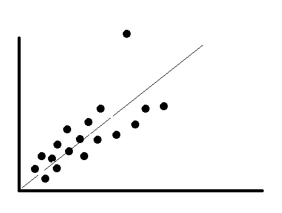
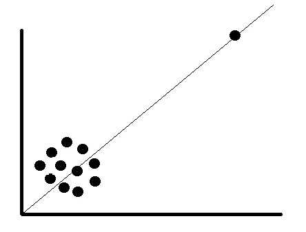

# 离群值——为什么它很重要？

> 原文：<https://towardsdatascience.com/outlier-why-is-it-important-af58adbefecc?source=collection_archive---------16----------------------->

## 极端数据的故事

威尔·梅尔斯在 [Unsplash](https://unsplash.com?utm_source=medium&utm_medium=referral) 上拍照

什么是离群值？根据[维基百科](https://en.wikipedia.org/wiki/Outlier)的说法，离群值是数据集中与其他数据或观察结果**显著不同**的数据点。就看上图，有一系列的瓶子，但是有一个颜色不一样。这个瓶子就是我们所说的异常值。

异常值本质上不同于**噪声**。异常值是与其他数据相比明显不同的数据，而噪声是随机误差或方差。离群值是数据的一部分，但噪声只是一个随机误差(可能被错误标记或出错，甚至丢失数据)。

许多[参数统计](https://en.wikipedia.org/wiki/Parametric_statistics)，如均值、相关性，以及基于这些的每个统计对异常值都很敏感。由于标准统计程序或模型的假设，如线性回归和方差分析也是基于参数统计的，因此异常值会打乱您的分析。

那么，数据集中的离群值呢？我们是如何分类的？我们如何检测它？为什么是必不可少的？如何处理异常值？让我们开始吧。

# 离群分类

通常，离群值可以分为两类:

*   **单变量异常值。**这是一个出现在**单个**变量中的异常值，或者换句话说，是单个列中的异常值。下面一个例子来看看。

在上面的薪金列中，存在一个异常值(5000)。这个异常值只出现在薪金列中，这就是为什么这个异常值被归类为单变量异常值。

*   **多元异常值**。这是发生在两个(双变量)或多个(多变量)变量的**联合组合**中的异常值，与单变量异常值相反。

作者创建的图像

例如，上图是工资和年龄变量之间的散点图。在该图中，两个变量的关联存在两个二元异常值。在单个变量中，数据可能不是异常值，但当它与另一个变量相关联时，可能会出现异常值。这就是我们所说的多元异常值。

多元异常值只存在于 n 维空间中(n 个特征)，其中 n 大于 1。当 n 数大于 3 时，我们可能很难想象或想象它。这就是为什么我们需要训练一个模型来为我们做这件事。

根据环境的不同，异常值也可以分为三种不同的类型:

*   **全局离群值(点离群值)。**这是一个单独的数据点，相对于其他数据而言，被视为异常值。以上多元异常值图中的异常值可视为全局异常值。
*   **语境离群值。**这个异常值不同于另一个异常值，因为我们需要领域知识或上下文理解。我们可以将上下文异常值定义为基于所选上下文显著不同的数据点。例如，你认为加拿大多伦多 12 度的气温会被认为是异常值吗？这取决于季节(冬天或夏天)。可能不会在夏天，但会在冬天。
*   **集体离群**。尽管单个数据可能不是异常值，但相对于整个数据集的数据集合(子集)明显不同，这就是异常值。下面我们来看一个例子。

作者创建的图像

单独的数据可能不是离群值，但作为一个整体，它会成为离群值。这就是我们所说的**集体离群**。

# 检测异常值

一般来说，没有一种方法可以说这种技术是检测异常值的最佳方法。重要的是我们理解**为什么我们想要找到异常值。**因此，检测异常值的上下文比技术本身更重要。此外，你必须有一个清晰的背景来区分噪音和异常值，因为有时人们会把事情搞混。

另一个我们必须要问的问题，是**单变量/多变量离群值**吗？变量分布是否满足**参数/非参数**条件？

在这篇文章中，我将只展示一些经常使用的方法，而没有更深入的理解，因为我在这篇文章中的目的是说明为什么离群值是重要的。

一些重要的技术包括:

*   [通过四分位数范围的数值异常值](https://www.statisticshowto.com/probability-and-statistics/interquartile-range/)
*   [Z-score](https://www.statisticshowto.com/probability-and-statistics/z-score/) 使用[经验法则](https://en.wikipedia.org/wiki/68%E2%80%9395%E2%80%9399.7_rule)
*   [线性回归模型中的残差分析](https://www.jmp.com/en_us/statistics-knowledge-portal/what-is-multiple-regression/mlr-residual-analysis-and-outliers.html)
*   [马哈拉诺比斯距离](https://www.machinelearningplus.com/statistics/mahalanobis-distance/)
*   [隔离林](https://scikit-learn.org/stable/modules/generated/sklearn.ensemble.IsolationForest.html#sklearn.ensemble.IsolationForest)
*   [数据库扫描](https://scikit-learn.org/stable/modules/generated/sklearn.cluster.dbscan.html)

还有很多技术，但就像我之前说的。没有一种技术是检测异常值的最佳技术。我们必须分析结果，而不是依赖技术本身。

# 异常值重要性

我们已经知道异常值是一个极端的数据或与其他数据有显著差异的数据，但为什么它很重要呢？

一个原因正如我上面解释的；许多统计过程都会受到异常值的影响。由于异常值的存在，这些方法的统计功效会降低；因此，结果不可靠。那么，删除异常值是否会更好？如果你**只关心统计结果，**那么移除异常值**可能是一个选择，但是在我们放弃它之前，我们仍然需要问几个问题。**

*   异常值是因为测量错误还是输入错误？—那么它就是一个噪声，应该被丢弃(或者改变，如果你知道数据的真正价值)
*   异常值不会改变结果，但会影响假设吗？在这种情况下，你可以丢弃离群值，也可以不丢弃。看看下面的例子，不管有没有异常值，回归线仍然保持不变。

作者创建的图像

*   异常值会影响统计结果和假设吗？在这种情况下，我们不能仅仅放弃离群值。尝试在有或没有异常值的情况下运行分析，看看结果如何。让我们看看下面的例子；如果我们去掉异常值，回归线就会移动。这个异常值肯定是数据的一部分，需要一个合理的结果来丢弃它。

作者创建的图像

*   离群值是否产生了显著的关联？如果是这样，明智的做法是丢弃异常值。下面我们来看一个例子；数据点之间肯定没有关系。有了离群值，就创建了关联。这意味着回归系数不能真实地描述两个变量之间的关系。

作者创建的图像

很明显，从统计学的角度来看，有一些排除异常值的建议。如果没有，可以选择转换数据以获取高数值或使用不同的模型。

这些“异常值解决方案”的问题是，它们也会导致问题——有偏差的参数估计和权重不足或有效值剔除。

我们需要记住什么；**并非所有的离群值都一样**。有些影响很大，有些则完全没有。有些是有效且重要的数据值。有些仅仅是错误或噪音。

因此，我不会给出任何建议，而是花些时间搞清楚几件事:

1.  为什么要找出离群值？您可能想要查看异常值，因为您对异常感兴趣。想想你的问题是什么。
2.  异常值是否“实际上”导致了结果、影响或假设的任何问题？
3.  离群值从何而来？这可能需要深入的分析和领域专业知识。此外，你不能总是告诉它从哪里来，但尝试考虑不同的可能性，因为它可以帮助告知最佳的前进方式。

# 结论

无论你采取哪种方法，你都需要了解你的数据并做好你的研究。你也可以尝试不同的方法，看看哪种方法更有理论意义，更适合回答你的问题。我的建议是花点时间做离群点研究。

# 如果你喜欢我的内容，并想获得更多关于数据或作为数据科学家的日常生活的深入知识，请考虑在这里订阅我的[时事通讯。](https://cornellius.substack.com/welcome)

> 如果您没有订阅为中型会员，请考虑通过[我的推荐](https://cornelliusyudhawijaya.medium.com/membership)订阅。