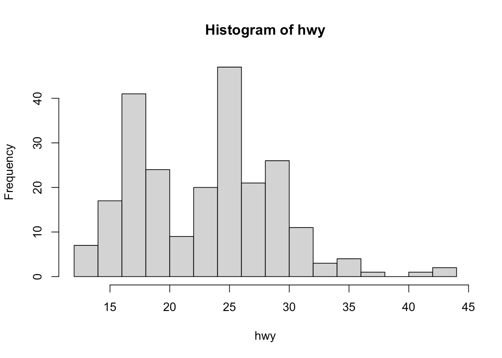
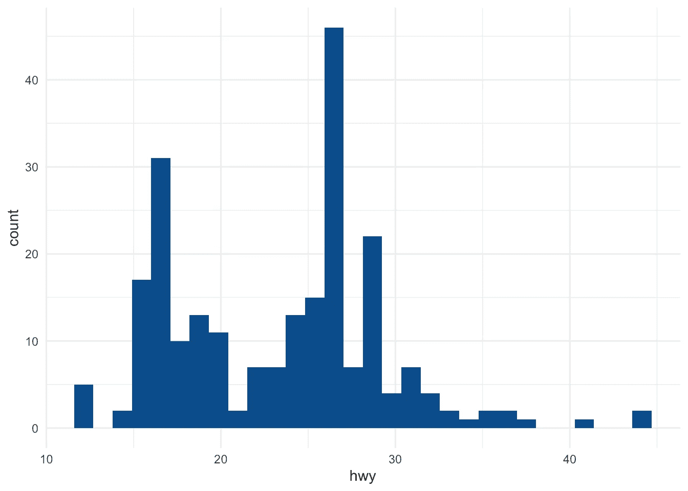
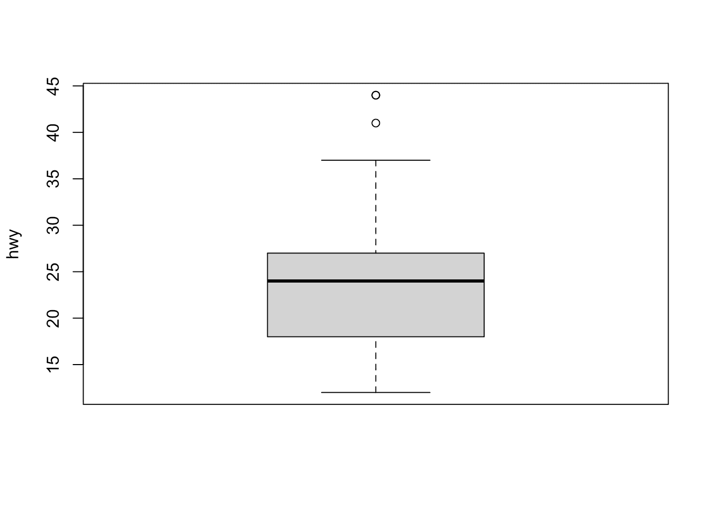
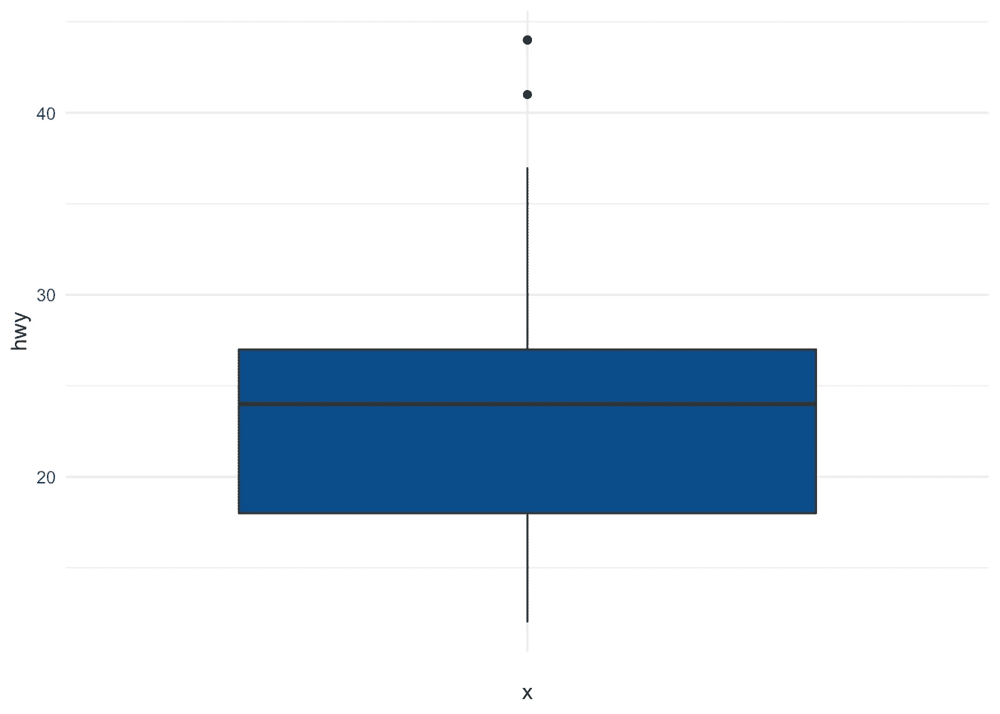
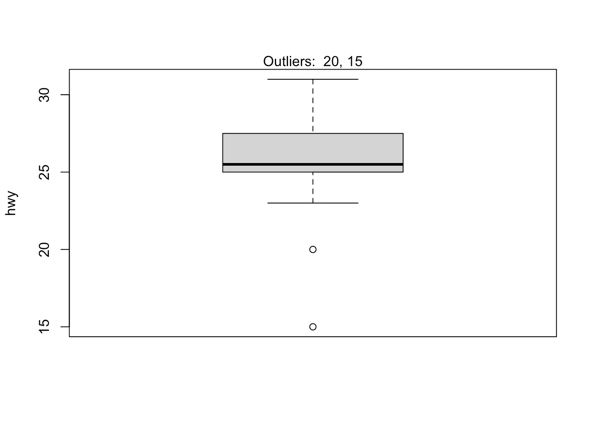
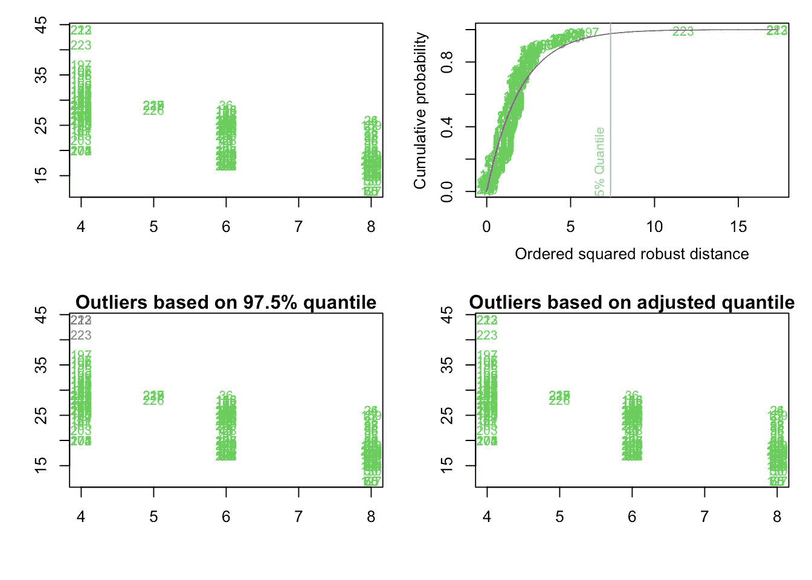

# R 中的异常值检测

> 原文：<https://towardsdatascience.com/outliers-detection-in-r-6c835f14e554?source=collection_archive---------17----------------------->

## 了解如何通过描述性统计、Hampel 过滤器、Grubbs、Dixon 和 Rosner 异常值测试来检测 R 中的异常值


威尔·迈尔斯的照片

# 介绍

一个 **离群值**是一个值或一个**观察值，它远离其他观察值**，也就是说，一个与其他数据点显著不同的数据点。Enderlein (1987)走得更远，因为作者认为异常值是偏离其他观察值如此之多的值，人们可能会假设不同的基本采样机制。

在称之为异常值之前，必须将一个观察值与对同一现象的其他观察值进行比较。事实上，与普通人群相比，身高 200 厘米(美国身高 6 英尺 7 英寸)的人最有可能被视为异常值，但如果我们测量篮球运动员的身高，这个人可能不会被视为异常值。

异常值可能是由于观察到的现象中固有的可变性造成的。例如，在收集工资数据时，经常会出现异常值，因为有些人比其他人赚得更多。离群值也可能是由于实验、测量或编码误差引起的。例如，当对受试者的体重进行编码时，人的体重 786 kg (1733 磅)显然是错误的。她或他的体重很可能是 78.6 公斤(173 磅)或 7.86 公斤(17 磅)，这取决于测量的是成人还是婴儿的体重。

因此，有时正式区分两类异常值是有意义的:(一)极端值和(二)错误。极值在统计学和哲学上更有趣，因为它们是可能的，但不太可能的答案。(感谢 Felix Kluxen 的宝贵建议。)

在本文中，我介绍了几种检测 R 中异常值的方法，从简单的技术如[描述性统计](https://www.statsandr.com/blog/descriptive-statistics-in-r/)(包括最小值、最大值、直方图、箱线图和百分位数)到更正式的技术如 Hampel 过滤器、Grubbs、Dixon 和 Rosner 异常值测试。

虽然在进行统计分析之前，对于是否应该从数据集中移除异常值没有严格或唯一的规则，但至少移除或估算由于实验或测量误差(如人的体重为 786 kg (1733 磅))引起的异常值是很常见的。一些统计测试要求没有异常值，以便得出合理的结论，但是并不建议在所有情况下都删除异常值，必须谨慎操作。

本文不会告诉您是否应该删除异常值(也不会告诉您是否应该用中值、平均值、众数或任何其他值对它们进行估算)，但它会帮助您检测它们，以便作为第一步验证它们。在他们被验证之后，你可以选择在你的分析中排除或包括他们(这通常需要研究者方面深思熟虑的思考)。移除或保留异常值主要取决于三个因素:

1.  你的分析和研究问题的领域/背景。在某些领域中，移除异常值是很常见的，因为它们通常是由于过程故障而出现的。在其他领域，离群值被保留是因为它们包含有价值的信息。还会发生两次分析，一次有异常值，一次没有异常值，以评估它们对结论的影响。如果结果由于一些有影响的值而发生剧烈变化，这应该提醒研究者做出过于雄心勃勃的声明。
2.  您将要应用的测试对于异常值的存在是否稳健。例如，一个简单线性回归的斜率可能随一个异常值而显著变化，而非参数检验，如 [Wilcoxon 检验](https://www.statsandr.com/blog/wilcoxon-test-in-r-how-to-compare-2-groups-under-the-non-normality-assumption/)通常对异常值稳健。
3.  异常值离其他观测值有多远？一些被认为是异常值的观测值(根据下面介绍的技术)与所有其他观测值相比实际上并不极端，而其他潜在的异常值可能与其余观测值相距甚远。

来自`{ggplot2}`包的数据集`mpg`将用于说明 R 中异常值检测的不同方法，特别是我们将关注变量`hwy`(每加仑公路英里数)。

# 描述统计学

# 最小值和最大值

检测 R 中异常值的第一步是从一些[描述性统计](https://www.statsandr.com/blog/descriptive-statistics-in-r/)开始，特别是从[最小值和最大值](https://www.statsandr.com/blog/descriptive-statistics-in-r/#minimum-and-maximum)开始。

在 R 中，这可以通过`summary()`函数轻松完成:

```
dat <- ggplot2::mpg
summary(dat$hwy)##    Min. 1st Qu.  Median    Mean 3rd Qu.    Max. 
##   12.00   18.00   24.00   23.44   27.00   44.00
```

其中最小值和最大值分别是上面输出中的第一个和最后一个值。或者，它们也可以用`min()`和`max()`函数计算:

```
min(dat$hwy)## [1] 12max(dat$hwy)## [1] 44
```

一些明显的编码错误，比如一个人 786 公斤(1733 磅)的体重，已经可以通过这种非常简单的技术很容易地检测出来。

# 柱状图

检测异常值的另一个基本方法是绘制数据的[直方图](https://www.statsandr.com/blog/descriptive-statistics-in-r/#histogram)。

使用 R 基(箱的数量对应于观察数量的平方根，以便比默认选项有更多的箱):

```
hist(dat$hwy,
  xlab = "hwy",
  main = "Histogram of hwy",
  breaks = sqrt(nrow(dat))
) # set number of bins
```



或者使用`ggplot2`(通过`[esquisse](https://www.statsandr.com/blog/rstudio-addins-or-how-to-make-your-coding-life-easier/#esquisse)` [插件](https://www.statsandr.com/blog/rstudio-addins-or-how-to-make-your-coding-life-easier/#esquisse)或通过本[教程](https://www.statsandr.com/blog/graphics-in-r-with-ggplot2/)学习如何用这个包创建绘图):

```
library(ggplot2)ggplot(dat) +
  aes(x = hwy) +
  geom_histogram(bins = 30L, fill = "#0c4c8a") +
  theme_minimal()
```



从直方图来看，似乎有几个观察值高于所有其他观察值(见图右侧的条形)。

# 箱线图

除了直方图，[箱线图](https://www.statsandr.com/blog/descriptive-statistics-in-r/#boxplot)也有助于检测潜在的异常值。

使用 R 碱基:

```
boxplot(dat$hwy,
  ylab = "hwy"
)
```



或者使用`ggplot2`:

```
ggplot(dat) +
  aes(x = "", y = hwy) +
  geom_boxplot(fill = "#0c4c8a") +
  theme_minimal()
```



箱线图通过显示五个常见位置汇总(最小值、中值、第一和第三四分位数以及最大值)以及使用[四分位数间距(IQR)](https://www.statsandr.com/blog/descriptive-statistics-in-r/#interquartile-range) 标准分类为可疑异常值的任何观察值，帮助可视化定量变量。IQR 标准意味着所有高于 q0.75 + 1.5 ⋅ IQR 或低于 q0.25-1.5⋅IQR 的观测值(其中 q 0.25 和 q0.75 分别对应于第一和第三四分位数，iqr 是第三和第一四分位数之间的差值)都被 r 视为潜在异常值。换句话说，以下区间之外的所有观测值都将被视为潜在异常值:

I =[q 0.25-1.5⋅iqr；q0.75 + 1.5 ⋅ IQR]

被 IQR 标准视为潜在异常值的观察值在箱线图中显示为点。基于这一标准，有 2 个潜在的异常值(参见箱线图顶部垂直线上方的 2 个点)。

请记住，并不是因为某个观察值被 IQR 标准认为是潜在的异常值，您就应该删除它。移除或保留异常值取决于(I)您的分析环境，(ii)您将对数据集执行的测试是否对异常值具有鲁棒性，以及(iii)异常值与其他观测值的距离。

借助`boxplot.stats()$out`函数，还可以根据 IQR 标准提取潜在异常值:

```
boxplot.stats(dat$hwy)$out## [1] 44 44 41
```

如您所见，实际上有 3 个点被认为是潜在的异常值:2 个值为 44 的观察值和 1 个值为 41 的观察值。

得益于`which()`功能，可以提取与这些异常值相对应的行号:

```
out <- boxplot.stats(dat$hwy)$out
out_ind <- which(dat$hwy %in% c(out))
out_ind## [1] 213 222 223
```

有了这些信息，您现在可以轻松地返回到数据集中的特定行来验证它们，或者打印这些异常值的所有变量:

```
dat[out_ind, ]## # A tibble: 3 x 11
##   manufacturer model   displ  year   cyl trans   drv     cty   hwy fl    class  
##   <chr>        <chr>   <dbl> <int> <int> <chr>   <chr> <int> <int> <chr> <chr>  
## 1 volkswagen   jetta     1.9  1999     4 manual… f        33    44 d     compact
## 2 volkswagen   new be…   1.9  1999     4 manual… f        35    44 d     subcom…
## 3 volkswagen   new be…   1.9  1999     4 auto(l… f        29    41 d     subcom…
```

也可以使用`mtext()`功能将异常值直接打印在箱线图上:

```
boxplot(dat$hwy,
  ylab = "hwy",
  main = "Boxplot of highway miles per gallon"
)
mtext(paste("Outliers: ", paste(out, collapse = ", ")))
```


# 百分位数

这种异常值检测方法基于[百分位数](https://www.statsandr.com/blog/descriptive-statistics-by-hand/#a-note-on-deciles-and-percentiles)。使用百分位数方法，位于由 2.5 和 97.5 百分位数形成的区间之外的所有观察值将被视为潜在的异常值。也可以考虑其他百分位数，如 1 和 99，或 5 和 95 百分位数来构建区间。

可以使用`quantile()`函数计算下限和上限百分点值(以及区间的下限和上限):

```
lower_bound <- quantile(dat$hwy, 0.025)
lower_bound## 2.5% 
##   14upper_bound <- quantile(dat$hwy, 0.975)
upper_bound##  97.5% 
## 35.175
```

根据这种方法，所有低于 14 和高于 35.175 的观察值都将被视为潜在的异常值。然后可以用`which()`函数提取间隔之外的观察值的行号:

```
outlier_ind <- which(dat$hwy < lower_bound | dat$hwy > upper_bound)
outlier_ind##  [1]  55  60  66  70 106 107 127 197 213 222 223
```

然后可以打印出他们每加仑的公路里程值:

```
dat[outlier_ind, "hwy"]## # A tibble: 11 x 1
##      hwy
##    <int>
##  1    12
##  2    12
##  3    12
##  4    12
##  5    36
##  6    36
##  7    12
##  8    37
##  9    44
## 10    44
## 11    41
```

或者，可以打印这些异常值的所有变量:

```
dat[outlier_ind, ]## # A tibble: 11 x 11
##    manufacturer model    displ  year   cyl trans  drv     cty   hwy fl    class 
##    <chr>        <chr>    <dbl> <int> <int> <chr>  <chr> <int> <int> <chr> <chr> 
##  1 dodge        dakota …   4.7  2008     8 auto(… 4         9    12 e     pickup
##  2 dodge        durango…   4.7  2008     8 auto(… 4         9    12 e     suv   
##  3 dodge        ram 150…   4.7  2008     8 auto(… 4         9    12 e     pickup
##  4 dodge        ram 150…   4.7  2008     8 manua… 4         9    12 e     pickup
##  5 honda        civic      1.8  2008     4 auto(… f        25    36 r     subco…
##  6 honda        civic      1.8  2008     4 auto(… f        24    36 c     subco…
##  7 jeep         grand c…   4.7  2008     8 auto(… 4         9    12 e     suv   
##  8 toyota       corolla    1.8  2008     4 manua… f        28    37 r     compa…
##  9 volkswagen   jetta      1.9  1999     4 manua… f        33    44 d     compa…
## 10 volkswagen   new bee…   1.9  1999     4 manua… f        35    44 d     subco…
## 11 volkswagen   new bee…   1.9  1999     4 auto(… f        29    41 d     subco…
```

根据百分位数法，有 11 个潜在的异常值。要减少这个数字，您可以将百分比设置为 1 和 99:

```
lower_bound <- quantile(dat$hwy, 0.01)
upper_bound <- quantile(dat$hwy, 0.99)outlier_ind <- which(dat$hwy < lower_bound | dat$hwy > upper_bound)dat[outlier_ind, ]## # A tibble: 3 x 11
##   manufacturer model   displ  year   cyl trans   drv     cty   hwy fl    class  
##   <chr>        <chr>   <dbl> <int> <int> <chr>   <chr> <int> <int> <chr> <chr>  
## 1 volkswagen   jetta     1.9  1999     4 manual… f        33    44 d     compact
## 2 volkswagen   new be…   1.9  1999     4 manual… f        35    44 d     subcom…
## 3 volkswagen   new be…   1.9  1999     4 auto(l… f        29    41 d     subcom…
```

将百分位数设置为 1 和 99 会产生与 IQR 标准相同的潜在异常值。

# 汉佩尔过滤器

另一种方法称为 Hampel 滤波器，包括将由中值加上或减去 3 个中值绝对偏差(MAD)形成的区间(I)之外的值视为异常值

I =[中值 3 ⋅疯了；中位数+ 3 ⋅疯狂]

其中 MAD 是绝对偏差的中值，定义为绝对偏差相对于数据中值的中值~X=median(X):

MAD =中位数(| Xi ~ X |)

对于该方法，我们首先通过`median()`和`mad()`功能设置区间限制: [2](https://statsandr.com/blog/outliers-detection-in-r/#fn2)

```
lower_bound <- median(dat$hwy) - 3 * mad(dat$hwy, constant = 1)
lower_bound## [1] 9upper_bound <- median(dat$hwy) + 3 * mad(dat$hwy, constant = 1)
upper_bound## [1] 39
```

根据这种方法，所有低于 9 和高于 39 的观察值都将被视为潜在的异常值。然后可以用`which()`函数提取间隔之外的观察值的行号:

```
outlier_ind <- which(dat$hwy < lower_bound | dat$hwy > upper_bound)
outlier_ind## [1] 213 222 223
```

根据 Hampel 过滤器，`hwy`变量有 3 个异常值。

# 统计测试

在本节中，我们将介绍 3 种更正式的技术来检测异常值:

1.  格拉布斯试验
2.  狄克逊试验
3.  罗斯纳试验

这 3 个统计测试是异常值检测的更正式技术的一部分，因为它们都涉及与表列临界值(基于样本大小和期望的置信水平)相比较的测试统计的计算。

请注意，只有当数据(没有任何异常值)为**近似正态分布**时，3 个测试才是合适的。因此，在对异常值进行这些测试之前，必须验证正态假设(参见如何在 R 中[测试正态假设)。](https://www.statsandr.com/blog/do-my-data-follow-a-normal-distribution-a-note-on-the-most-widely-used-distribution-and-how-to-test-for-normality-in-r/)

# 格拉布斯试验

Grubbs 检验允许检测数据集中的最高值或最低值是否为异常值。

格拉布斯检验一次检测一个异常值(最高值或最低值)，因此无效假设和替代假设如下:

*   H0:*最高*值是**而不是**异常值
*   H1:最高的*值是一个异常值*

如果我们想测试最高值，或者:

*   H0:最低的*值*是**而不是**异常值
*   H1:最低的*值是一个异常值*

如果我们想测试最低值。

对于任何统计检验，如果[***p*-值**](https://www.statsandr.com/blog/student-s-t-test-in-r-and-by-hand-how-to-compare-two-groups-under-different-scenarios/#a-note-on-p-value-and-significance-level-alpha) **小于所选的**显著性阈值**(通常α = 0.05)，则零假设被拒绝，我们将得出结论**最低/最高值是异常值**。相反，如果***-p*-值大于或等于**显著性水平，则不拒绝零假设，并且我们将得出结论，基于数据，我们不拒绝**最低/最高值不是异常值**的假设。**

请注意，格拉布斯检验不适用于样本量为 6 或更少(n≤6)的情况。

为了在 R 中执行 Grubbs 测试，我们使用了`{outliers}`包中的`grubbs.test()`函数:

```
# install.packages("outliers")
library(outliers)
test <- grubbs.test(dat$hwy)
test## 
##  Grubbs test for one outlier
## 
## data:  dat$hwy
## G = 3.45274, U = 0.94862, p-value = 0.05555
## alternative hypothesis: highest value 44 is an outlier
```

*p*-值为 0.056。在 5%的显著性水平，我们不拒绝假设最高*值 44 是**而不是**异常值。*

默认情况下，测试在最高值上执行(如 R 输出所示:`alternative hypothesis: highest value 44 is an outlier`)。如果您想测试最小值，只需在`grubbs.test()`函数中添加参数`opposite = TRUE`:

```
test <- grubbs.test(dat$hwy, opposite = TRUE)
test## 
##  Grubbs test for one outlier
## 
## data:  dat$hwy
## G = 1.92122, U = 0.98409, p-value = 1
## alternative hypothesis: lowest value 12 is an outlier
```

R 输出表示测试正在最低值上进行(参见`alternative hypothesis: lowest value 12 is an outlier`)。

*p*-值为 1。在 5%的显著性水平上，我们不拒绝假设最低的*值 12 是**而不是**异常值。*

为了便于说明，我们现在将用一个更极端的值替换一个观察值，并对这个新数据集执行 Grubbs 测试。让我们用值 212 替换第 34 行:

```
dat[34, "hwy"] <- 212
```

我们现在应用格拉布斯检验来检验最高值是否是异常值:

```
test <- grubbs.test(dat$hwy)
test## 
##  Grubbs test for one outlier
## 
## data:  dat$hwy
## G = 13.72240, U = 0.18836, p-value < 2.2e-16
## alternative hypothesis: highest value 212 is an outlier
```

*p*-值为< 0.001。在 5%的显著性水平，我们断定最高*值 212 是异常值。*

# 狄克逊试验

与 Grubbs 检验类似，Dixon 检验用于检验单个低值或高值是否为异常值。因此，如果怀疑有一个以上的异常值，必须对这些可疑异常值分别进行测试。

注意，Dixon 检验对小样本(通常 n ≤ 25)最有用。

为了在 R 中执行 Dixon 测试，我们使用了`{outliers}`包中的`dixon.test()`函数。然而，我们[将我们的数据集](https://statsandr.com/blog/data-manipulation-in-r/#subset-a-data-frame)限制为 20 个第一次观察值，因为 Dixon 测试只能在小样本量上进行(R 将抛出一个错误，只接受 3 到 30 个观察值的数据集):

```
subdat <- dat[1:20, ]
test <- dixon.test(subdat$hwy)
test## 
##  Dixon test for outliers
## 
## data:  subdat$hwy
## Q = 0.57143, p-value = 0.006508
## alternative hypothesis: lowest value 15 is an outlier
```

结果显示最低值 15 是一个异常值( *p* -value = 0.007)。

要测试最大值，只需将`opposite = TRUE`参数添加到`dixon.test()`函数中:

```
test <- dixon.test(subdat$hwy,
  opposite = TRUE
)
test## 
##  Dixon test for outliers
## 
## data:  subdat$hwy
## Q = 0.25, p-value = 0.8582
## alternative hypothesis: highest value 31 is an outlier
```

结果显示最高值 31 是**而不是**一个异常值( *p* -value = 0.858)。

一个好的做法是始终对照箱线图检查异常值的统计测试结果，以确保我们测试了所有的**潜在异常值:**

```
out <- boxplot.stats(subdat$hwy)$out
boxplot(subdat$hwy,
  ylab = "hwy"
)
mtext(paste("Outliers: ", paste(out, collapse = ", ")))
```



从箱线图中，我们可以看到，除了之前对值 15 进行的测试之外，我们还可以对值 20 进行 Dixon 测试。这可以通过找到最小值的行号来完成，从数据集中排除该行号，然后最后对这个新数据集应用 Dixon 测试:

```
# find and exclude lowest value
remove_ind <- which.min(subdat$hwy)
subsubdat <- subdat[-remove_ind, ]# Dixon test on dataset without the minimum
test <- dixon.test(subsubdat$hwy)
test## 
##  Dixon test for outliers
## 
## data:  subsubdat$hwy
## Q = 0.44444, p-value = 0.1297
## alternative hypothesis: lowest value 20 is an outlier
```

结果显示第二个最低值 20 是**而不是**异常值(*p*-值= 0.13)。

# 罗斯纳试验

罗斯纳的异常值检验具有以下优点:

1.  它用于**一次检测几个异常值**(与 Grubbs 和 Dixon 测试不同，后者必须反复执行以筛选多个异常值)，以及
2.  它旨在避免屏蔽问题，即一个离群值与另一个离群值接近的离群值可能无法被检测到。

与 Dixon 检验不同，注意 Rosner 检验在样本量较大(n ≥ 20)时最为合适。因此，我们再次使用初始数据集`dat`，它包括 234 个观察值。

为了执行罗斯纳测试，我们使用了`{EnvStats}`包中的`rosnerTest()`函数。这个函数至少需要两个参数:数据和可疑异常值的数量`k`(默认的可疑异常值数量为`k = 3`)。

对于本例，我们将可疑异常值的数量设置为 3，正如本文开头的方框图中列出的潜在异常值的数量所示。 [2](https://www.statsandr.com/blog/outliers-detection-in-r/#fn2)

```
library(EnvStats)
test <- rosnerTest(dat$hwy,
  k = 3
)
test## $distribution
## [1] "Normal"
## 
## $statistic
##       R.1       R.2       R.3 
## 13.722399  3.459098  3.559936 
## 
## $sample.size
## [1] 234
## 
## $parameters
## k 
## 3 
## 
## $alpha
## [1] 0.05
## 
## $crit.value
## lambda.1 lambda.2 lambda.3 
## 3.652091 3.650836 3.649575 
## 
## $n.outliers
## [1] 1
## 
## $alternative
## [1] "Up to 3 observations are not\n                                 from the same Distribution."
## 
## $method
## [1] "Rosner's Test for Outliers"
## 
## $data
##   [1]  29  29  31  30  26  26  27  26  25  28  27  25  25  25  25  24  25  23
##  [19]  20  15  20  17  17  26  23  26  25  24  19  14  15  17  27 212  26  29
##  [37]  26  24  24  22  22  24  24  17  22  21  23  23  19  18  17  17  19  19
##  [55]  12  17  15  17  17  12  17  16  18  15  16  12  17  17  16  12  15  16
##  [73]  17  15  17  17  18  17  19  17  19  19  17  17  17  16  16  17  15  17
##  [91]  26  25  26  24  21  22  23  22  20  33  32  32  29  32  34  36  36  29
## [109]  26  27  30  31  26  26  28  26  29  28  27  24  24  24  22  19  20  17
## [127]  12  19  18  14  15  18  18  15  17  16  18  17  19  19  17  29  27  31
## [145]  32  27  26  26  25  25  17  17  20  18  26  26  27  28  25  25  24  27
## [163]  25  26  23  26  26  26  26  25  27  25  27  20  20  19  17  20  17  29
## [181]  27  31  31  26  26  28  27  29  31  31  26  26  27  30  33  35  37  35
## [199]  15  18  20  20  22  17  19  18  20  29  26  29  29  24  44  29  26  29
## [217]  29  29  29  23  24  44  41  29  26  28  29  29  29  28  29  26  26  26
## 
## $data.name
## [1] "dat$hwy"
## 
## $bad.obs
## [1] 0
## 
## $all.stats
##   i   Mean.i      SD.i Value Obs.Num     R.i+1 lambda.i+1 Outlier
## 1 0 24.21795 13.684345   212      34 13.722399   3.652091    TRUE
## 2 1 23.41202  5.951835    44     213  3.459098   3.650836   FALSE
## 3 2 23.32328  5.808172    44     222  3.559936   3.649575   FALSE
## 
## attr(,"class")
## [1] "gofOutlier"
```

有趣的结果在`$all.stats`表中提供:

```
test$all.stats##   i   Mean.i      SD.i Value Obs.Num     R.i+1 lambda.i+1 Outlier
## 1 0 24.21795 13.684345   212      34 13.722399   3.652091    TRUE
## 2 1 23.41202  5.951835    44     213  3.459098   3.650836   FALSE
## 3 2 23.32328  5.808172    44     222  3.559936   3.649575   FALSE
```

基于罗斯纳测试，我们看到只有一个异常值(见`Outlier`列)，它是值为 212(见`Value`的观测值 34(见`Obs.Num`)。

# 附加备注

您会发现许多其他检测异常值的方法:

1.  在`{outliers}`包中，
2.  通过`{DMwR}`包中的`lofactor()`函数:局部异常值因子(LOF)是一种算法，用于通过比较一个点与其邻居的局部密度来识别异常值。
3.  `{car}`包中的`outlierTest()`给出了基于给定模型的最极端观察值，并允许测试其是否为异常值，以及
4.  在`{OutlierDetection}`包装中，以及
5.  使用`{mvoutlier}`包中的`aq.plot()`功能(感谢 KTR 的建议。):

```
library(mvoutlier)Y <- as.matrix(ggplot2::mpg[, c("cyl", "hwy")])
res <- aq.plot(Y)
```



还要注意，一些转换可能会“自然地”消除异常值。值的自然对数或平方根减少了由极值引起的变化，因此在某些情况下，应用这些变换将消除异常值。

感谢阅读。我希望这篇文章能帮助你通过几个[描述性统计](https://www.statsandr.com/blog/descriptive-statistics-in-r/)(包括最小值、最大值、直方图、箱线图和百分位数)或者借助于更正式的离群点检测技术(包括 Hampel 过滤器、Grubbs、Dixon 和 Rosner 检验)来检测 R 中的离群点。现在轮到您验证它们了，如果它们是正确的，在进行分析之前，决定如何处理它们(即保留、删除或删除它们)。

和往常一样，如果您有与本文主题相关的问题或建议，请将其添加为评论，以便其他读者可以从讨论中受益。

# 参考

恩德莱因，G. 1987。霍金斯，Dm:离群值的识别。查普曼和霍尔，伦敦-纽约 1980 年，188 年代，14，50 年*生物统计学杂志*29(2):198–98。

1.  默认值为 3(根据皮尔逊法则)，但也可能是另一个值。 [↩︎](https://www.statsandr.com/blog/outliers-detection-in-r/#fnref1)
2.  默认情况下，`mad()`函数中的常数是 1.4826，因此必须将其设置为 1，以找到中位数绝对偏差。更多详情见`help(mad)`。感谢艾丽塞给我指出了这一点。 [↩︎](https://statsandr.com/blog/outliers-detection-in-r/#fnref2)
3.  为了避免得出有缺陷的结论，在进行罗斯纳测试之前，预先筛选数据(例如用箱线图)以尽可能准确地选择潜在异常值的数量是很重要的。 [↩︎](https://www.statsandr.com/blog/outliers-detection-in-r/#fnref2)

# 相关文章

*   [R 中的 Wilcoxon 检验:如何在非正态假设下比较两组](https://www.statsandr.com/blog/wilcoxon-test-in-r-how-to-compare-2-groups-under-the-non-normality-assumption/)
*   [R 中的相关系数和相关检验](https://www.statsandr.com/blog/correlation-coefficient-and-correlation-test-in-r/)
*   [单比例和拟合优度测试(R 和手动)](https://www.statsandr.com/blog/one-proportion-and-goodness-of-fit-test-in-r-and-by-hand/)
*   [如何在 R 中一次对多个变量进行 t 检验或方差分析，并以更好的方式交流结果](https://www.statsandr.com/blog/how-to-do-a-t-test-or-anova-for-many-variables-at-once-in-r-and-communicate-the-results-in-a-better-way/)
*   [如何手工进行单样本 t 检验，并对一个均值进行 R:检验](https://www.statsandr.com/blog/how-to-perform-a-one-sample-t-test-by-hand-and-in-r-test-on-one-mean/)

*原载于 2020 年 8 月 11 日 https://statsandr.com*[](https://statsandr.com/blog/outliers-detection-in-r/)**。**