# 通过 Tensorflow 超越 Google Cloud AutoML Vision

> 原文：<https://towardsdatascience.com/outperforming-google-cloud-automl-vision-with-tensorflow-and-google-deep-learning-vm-34a45e3860ae?source=collection_archive---------20----------------------->

## 利用深度学习检测卫星图像中的云

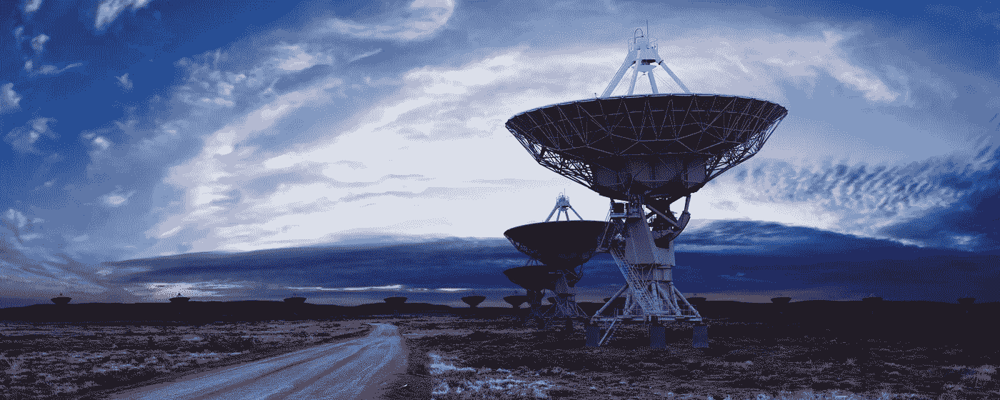

由 [iStock](https://www.istockphoto.com/photo/xl-satellite-dish-twilight-gm156725813-15556869) 上的[sharp _ done](https://www.istockphoto.com/portfolio/sharply_done?mediatype=photography)拍摄

# **动机**

有数百篇关于机器学习和深度学习项目的博客文章，我从我读过的那些文章中学到了很多。我想通过讨论我最近从事的一个深度学习项目来增加这些知识。这个项目/博客帖子有一些方面我认为值得一读:

*   它在数据集上训练了一个 Google AutoML Vision 模型作为基线，然后打败它:)。
*   它描述了一个基本但现实的数据管道和模型开发工作流，一个小团队可以在野外使用它从原始数据到产品模型服务实例。例如，它解释了如何使用 Docker 容器来部署模型训练实例，而大多数博客文章只描述了如何手动提供模型训练实例。
*   它包括截至 2020 年 2 月的有关 CNN 架构和超参数调谐的最佳实践。例如，有一个默认的 Keras 参数，如果不改变，可能会很危险，还有一种方式，我看到许多人错误地配置了 [hyperopt](https://hyperopt.github.io/hyperopt/) hyperparameter 调谐库。
*   它面向已经了解深度学习基础知识的读者，因此对卷积如何工作等基本概念的回顾较少，而更多地关注应用。

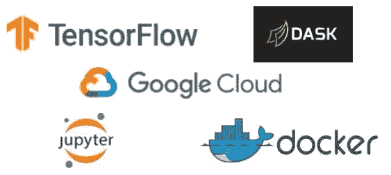

项目中使用的关键技术

该项目有以下步骤，这篇博文的结构反映了这些步骤:

*   识别分类问题并找到数据集
*   ETL 数据，为数据分析和模型训练做准备
*   执行探索性数据分析
*   使用 Google AutoML Vision 获取基线
*   设置模型开发工作流
*   原型深度学习模型
*   谷歌深度学习虚拟机上的训练模型
*   分析模型性能和商业价值
*   在 Google Cloud 虚拟机上部署获胜模型
*   最后的想法和谷歌自动视觉的回顾

我在一个 [Github repo](https://github.com/skeller88/deep_learning_project) 中分享了项目代码。

# **识别分类问题并找到数据集**

卫星图像中的云检测是一个重要的分类问题。它在遥感领域被大量使用，因为云掩盖了下面的土地，并且数据集中太多的云图像使得模型更难学习有意义的模式。一个强大的云分类器将使研究人员更容易自动筛选云图像，并构建更大和更准确标记的数据集。

BigEarth 数据集是世界上最大的公共卫星图像数据集，由柏林工业大学的一个德国研究小组于 2019 年创建。数据集由近 600，000 个 120x120 像素的卫星影像切片组成，每个切片有 13 个波段，这些切片已根据土地利用(河流、城市等)、影像是否被云遮挡以及其他元数据(如影像坐标)进行了标注。我构建了一个 CNN 二进制分类器，它使用云标签和每个图像块的红色、绿色和蓝色条带来将图像块分类为多云(`cloud`图像)或非多云(`no_cloud`图像)。

这里有一些`cloud`图像，出于数据探索的目的，我从 tiff 转换成 jpg，下面打印出了类别标签和图像网格位置。

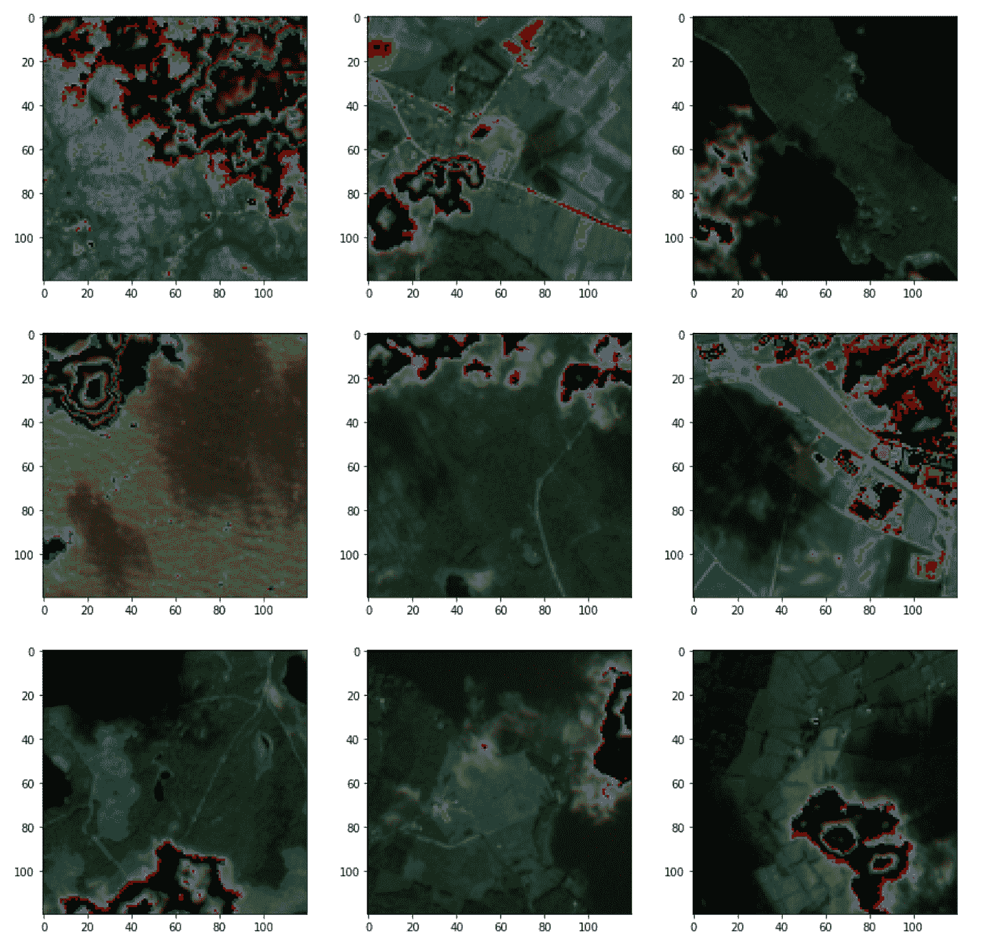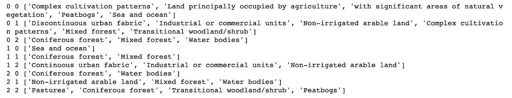

还有一些`no_cloud`图片:

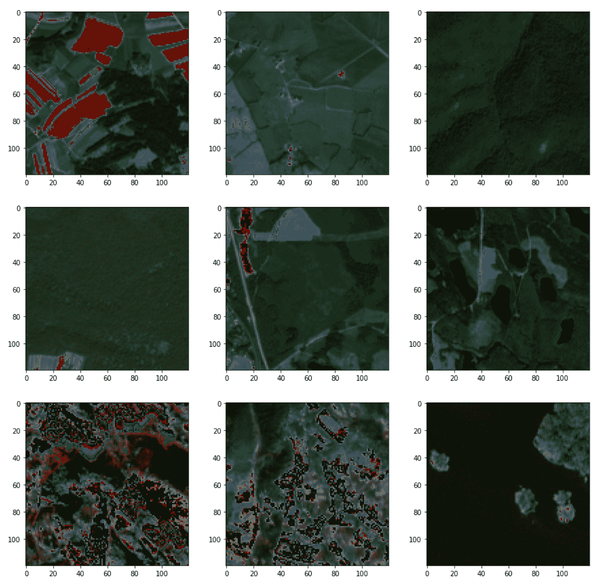

为了检查这些标签是否有意义，以及这个项目是否可行，我随机查看了 100 张 jpg 图片，并将它们归类为`cloud`或`no_cloud`。我看到了一些难以分类的图像，比如位于图形位置(2，0)和(2，1)的图像。如果我正在为一个生产应用程序做这个深度学习项目，我会对这些困难的标签进行更多的调查，以确保它们没有被错误分类。尽管如此，我还是能够正确地对 100 幅图像中的 77%进行分类，这给了我继续推进深度学习模型的信心。

# **ETL 数据，为数据分析和模型训练做准备**

大约有 600，000 幅卫星图像，数据集是 60GB 的压缩文件。ETL 过程包括获取目标文件，提取它，生成一些汇总像素统计数据，并将图像转换为可用的格式，以便在 Google AutoML Vision、Google Cloud VM 和本地笔记本电脑上进行深度学习。

ETL 管道由以下步骤组成:

*   下载。tarfile 从 BigEarth.net 到一个连接了持久磁盘的 Google Cloud 虚拟机，并提取. tarfile。
*   使用 dask 来聚合。将每个图像的 json 元数据文件平铺到一个. csv 文件中。
*   对于每个图像拼贴，将 RGB 波段 tiff 文件聚合到一个单独的文件中。npy 和。png 文件。

我在同一个。npy 文件，以提高训练时的读取性能。我选择了。npy 文件格式，因为它与 keras 和 pytorch 都兼容(以防我在某个时候想用 pytorch 重写我的代码)。我将文件存储在磁盘上，而不是谷歌云存储中，因为这样更容易实现高读取吞吐量，还因为 RGB 数据集相当小，只有 50GB。如果你有兴趣深入探讨这个话题，我强烈推荐[这篇关于机器学习文件格式的文章](/guide-to-file-formats-for-machine-learning-columnar-training-inferencing-and-the-feature-store-2e0c3d18d4f9)。

我在一个. png 文件中存储了另一个图像切片的波段副本，因为该文件格式与 Google AutoML Vision 兼容。[该产品目前不接受。npy 或者。tiff 文件](https://cloud.google.com/vision/automl/docs/prepare)。

# **进行探索性数据分析**

我创建了一个包括所有 9000 张`cloud`图像和 9000 张随机`no_cloud`图像的数据集，并通过从大数据集中随机抽取 1200 张`cloud`图像和 1200 张`no_cloud`图像创建了一个小的训练数据集。我使用较大的数据集来训练来自小数据集训练回合的获胜模型。

我创建了一个平衡的数据集，因为我想确定问题的范围，为自己的成功做准备。如果我有更多的时间，我会创建一个不平衡的数据集，更准确地反映数据集中`cloud`与`no_cloud`图像的比例。有一个信息丰富的 [tensorflow 教程](https://www.tensorflow.org/tutorials/structured_data/imbalanced_data)和一个 [kaggle 内核](https://www.kaggle.com/rafjaa/resampling-strategies-for-imbalanced-datasets)概述了处理不平衡数据的不同策略。

我想了解像素值在整个数据集和样本中的分布，包括`cloud`图像和`no_cloud`图像。我还想确认像素值分布在`cloud`和`no_cloud`图像之间是不同的，并且在样本和整个数据集之间的每个类内是一致的。如果不使用高内存(> 60GB)实例，内存中容纳不下太多的像素值，所以我使用 dask 来计算所有 600K 图像的统计数据(在下图中标为`all`),以及大数据集和小数据集的每类统计数据。

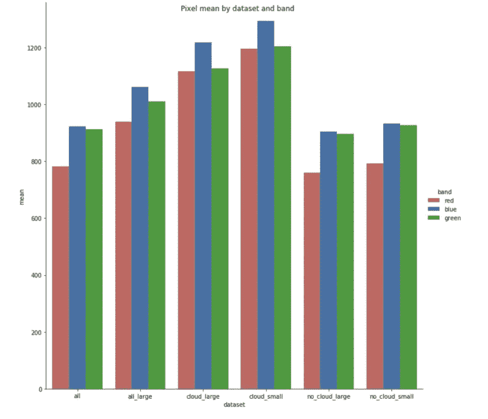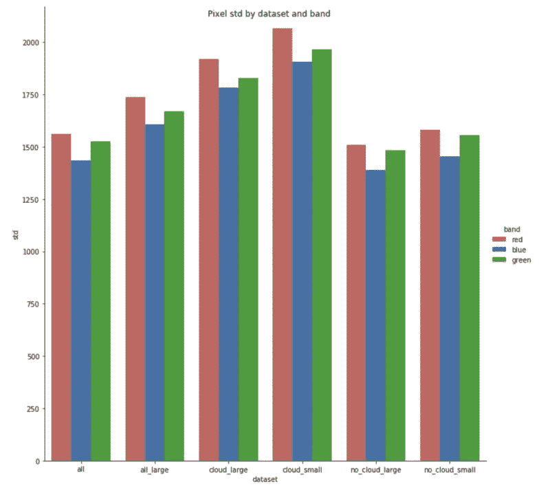

所有波段的平均值和标准差`cloud`像素值都高于`no_cloud`像素值，这提供了分类任务是可学习的证据。

样本和整个数据集之间的每个类中的均值和标准差像素值是相似的，这使我有相当高的信心认为样本代表了数据集。

# **使用 Google AutoML Vision 获取基线**

现在我对数据有了基本的了解和更多的信心，我可以用 Google AutoML Vision 模型得到一个基线。我通过上传样本创建了一个数据集。png 文件到谷歌云存储。注意，目标 GCS 桶必须在`us-central-1`区域中。AutoML 文档建议您在训练时提供尽可能多的图像，因此为了帮助验证和测试准确性，我使用了[albuminations](https://github.com/albumentations-team/albumentations)库为样本中的每个图像创建翻转、旋转和翻转+旋转图像。我把这些增强的图像添加到数据集中。

我上传了一个包含数据集分割和 GCS 图像斑点路径的. csv 文件。AutoML 可以为您进行拆分，但是我需要自己进行拆分，以便在相同的数据上训练我自己的模型。

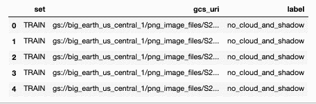

然后，我在小型和大型数据集上训练该模型。82%的准确率和召回率是一个良好的开端。在这篇博文的后面，你会看到我的模型如何与谷歌的相抗衡。

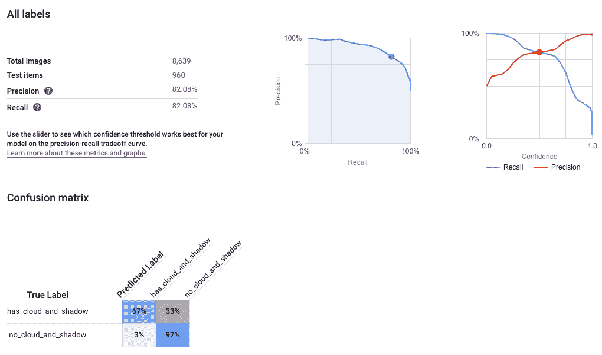

谷歌云自动视觉控制台

我通过使用基于逻辑回归的 [SGDClassifier](https://scikit-learn.org/stable/modules/generated/sklearn.linear_model.SGDClassifier.html) 实现增量学习获得了另一个简单的基线，该分类器将展平的图像数组作为输入。训练准确率为 63%，验证准确率为 65%。

# **建立模型开发工作流程**

我需要一个模型开发工作流，让我能够在本地笔记本电脑上的原型工作和云实例上的繁重培训工作之间轻松转换。我必须能够在 jupyterhub 上以 CPU 和 GPU 模式运行 tensorflow，使用我自己的代码模块，配置依赖关系，在运行之间保存笔记本，并连接到云实例上的 GPU。Docker with conda 是显而易见的解决方案，但我必须弄清楚细节。

深度学习环境有很多移动部分:NVIDIA 驱动程序、CUDA 工具包和安装 jupyter、python、tensorflow 和其他库的 conda 环境。我做了一些关于最佳实践的研究，发现了大量不同的选项，以及大量未回答的 StackOverflow 问题、Github 问题和人们遇到安装问题的[博客帖子讨论](/tensorflow-gpu-installation-made-easy-use-conda-instead-of-pip-52e5249374bc)。很难过。我想避免这种事发生在我身上。

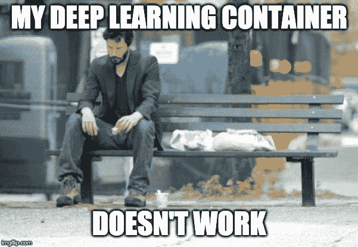

[GCP 提供深度学习 VM 镜像](https://cloud.google.com/ai-platform/deep-learning-vm/docs/images)，将 NVIDIA 驱动库和 tensorflow 库安装到 VM 上。但是 VM 并没有提供我所需要的一切，因为我在 VM 上运行一个容器，我需要能够在容器内运行 CUDA 工具包和 Tensorflow。我还想了解安装过程是如何工作的，GCP 没有公开其深度学习 VM 镜像源代码。最后，我想要一个解决方案，如果我需要的话，它可以为我将来的 Kubernetes 部署做好准备。所以我决定使用 GCP 深度学习虚拟机来安装 CUDA 驱动程序和 [nvidia-docker 工具包](https://github.com/NVIDIA/nvidia-docker)来运行 GPU 加速的 docker 容器，然后将其他所有东西安装到我在虚拟机上运行的 Docker 容器中。

我在 GCP VM 主机上安装了 CUDA 驱动程序，因为由于 NVIDIA 的驱动程序代码是专有的，所以在 Docker 容器中安装驱动程序的解决方案没有得到广泛支持。X11docker 提供了支持，但是我没有找到很多人使用它的例子，并且厌倦了添加另一个工具。我使用了 GCP common-cu100 基本虚拟机映像，它在实例上安装了 NVIDIA 驱动程序和 CUDA 10.0 工具包。注意，尽管 CUDA 工具包安装在主机上，我还是在容器中使用了这个工具包。

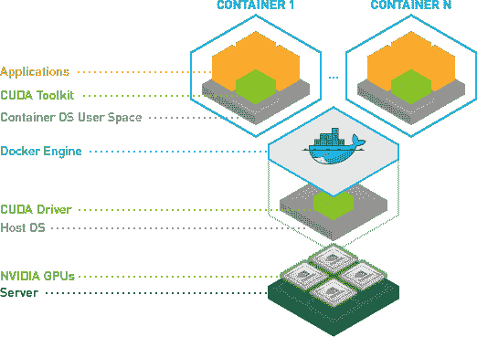

支持 NVIDIA 的应用程序的组成部分([来源](https://github.com/NVIDIA/nvidia-docker/blob/master/README.md))

至于配置 Docker 映像在 VM 上运行，我考虑过使用一个 [GCP 深度学习容器](https://cloud.google.com/ai-platform/deep-learning-containers/docs/)作为基本 Docker 映像，但该产品截至 2019 年 6 月处于测试阶段，并且源 Docker 文件不是公开的。缺乏透明度将使调试任何问题变得困难。我对[谷歌云人工智能平台笔记本](https://cloud.google.com/ai-platform-notebooks/)(在谷歌云上管理的 Jupyterhub)有类似的担忧，因为它们运行的是测试版深度学习容器。

Google 的 [Kubernetes 引擎文档](https://cloud.google.com/kubernetes-engine/docs/how-to/gpus#installing_drivers)和 [cloudml-samples repo](https://github.com/GoogleCloudPlatform/cloudml-samples/blob/master/pytorch/containers/quickstart/mnist/Dockerfile-gpu) 都有使用`nvidia/cuda`作为基础映像来处理 CUDA 工具包安装和路径配置的例子。所以我使用了`nvidia/cuda:10.0-devel-ubuntu18.04`图像，并在上面安装了`miniconda`来建立一个`python3.6`、`jupyterhub`和`tensorflow-2.0.0-gpu`环境。

下面是创建 GCP 虚拟机实例的 [gcloud 命令、GCP 虚拟机实例启动脚本](https://github.com/skeller88/deep_learning_project#create-gcp-instance-from-google-image-family)和构建虚拟机实例上运行的映像的 [Dockerfile](https://github.com/skeller88/deep_learning_project/blob/master/data_science/jupyter_tensorflow_notebook/Dockerfile) 。

概括地说，我的工作流程是:

*   在本地运行 Docker 容器进行模型原型制作
*   在 GCP 虚拟机实例上运行 Docker 容器进行模型训练
*   在这两种环境中，使用装载在主机上的 Docker 卷来保存 jupyter 笔记本
*   使用 scp 使 GCP 上的模型笔记本与本地模型笔记本保持同步(一个更健壮但速度较慢的解决方案可以使用 github repo 进行笔记本同步)

# **原型深度学习模型**

现在我有了一个工作流，我在本地运行 docker 容器，并原型化了一个 Keras CNN 二元分类器，它将把`cloud`图像分类为`1`，把`no_cloud`图像分类为`0`。

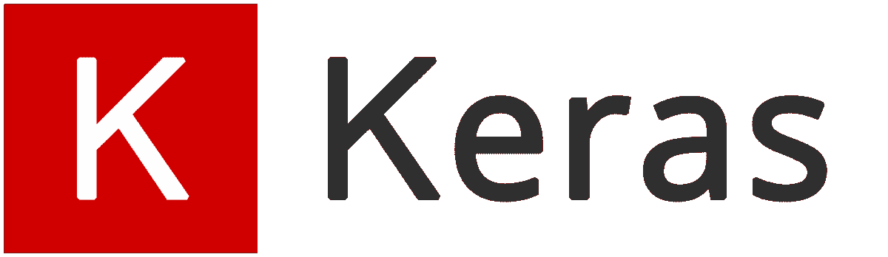

我遵循了安德烈·卡帕西和吴恩达推荐的模型开发流程组合。首先，我用遵循当前最佳实践的最简单的模型建立了培训和评估。

神经网络用的是 ReLU 激活，所以我用的是明凯/he_uniform 初始化而不是 Xavier 初始化进行权重初始化。[詹姆斯·德林杰对这些差异做了很好的概述](/weight-initialization-in-neural-networks-a-journey-from-the-basics-to-kaiming-954fb9b47c79)。以下是关键要点:

> 当使用 ReLU 激活时，单个层的平均标准偏差非常接近输入连接数量的平方根*除以两个*的平方根，或者我们示例中的√512/√2。
> 
> 将层激活的标准偏差保持在 1 左右将允许我们在深度神经网络中堆叠多个层，而不会出现梯度爆炸或消失。
> 
> 因此，明凯初始化将每个初始激活乘以`*√*2/*√n*`，其中`*n*`是从前一层的输出进入给定层的传入连接数(也称为“扇入”)。

这种更智能的初始化意味着网络更有可能收敛，尤其是在深度网络中:

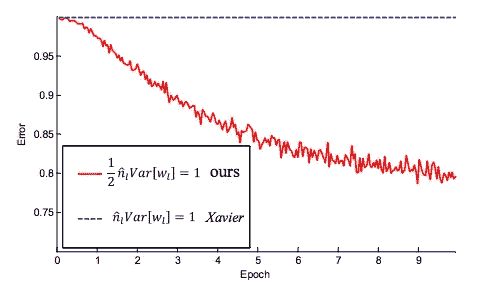

泽维尔对明凯的 30 层小模式的收敛(我们的)。何等人。艾尔。(2015)

我了解到 Keras 默认使用 Xavier/glorot_uniform，但是有一个开放的 Tensorflow 票证可以将该默认更改为 he_uniform。

[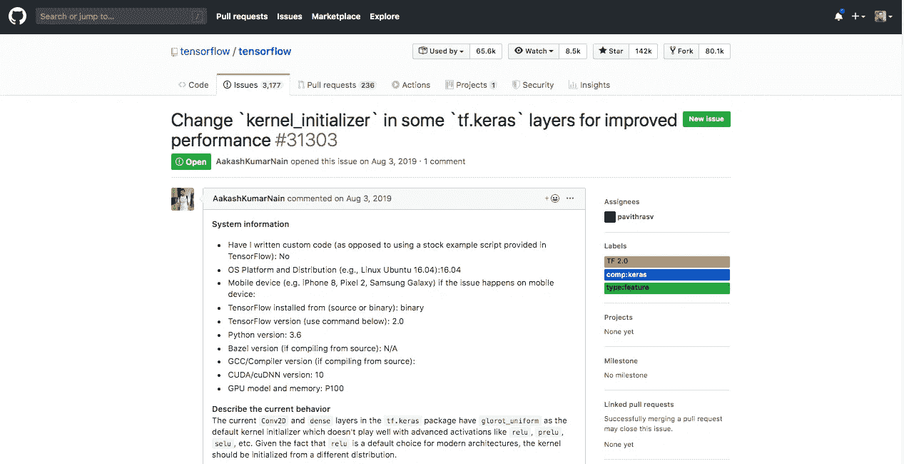](https://github.com/tensorflow/tensorflow/issues/31303)

权重初始化参数是一个很好的例子，说明在不理解默认参数的情况下在机器学习方法中使用默认参数是多么危险，因为它们可能是任务的不正确参数。

我使用了 Adam 优化器，因为 Adam 优化器收敛速度很快，并且被普遍认为可以很好地处理各种任务。我选择了 3e-4 的学习率，因为我见过很多人使用这个学习率(包括 Andrej Karpathy)。这也比 Tensorflow 中 Adam 的默认学习速率低一个数量级，因为数据集很小，所以我没意见。

我通过一个[优化的 tf.data API 管道](https://www.tensorflow.org/guide/data_performance#optimize_performance)向模型提供数据，该管道利用预取和并行图像增强来准备向神经网络模型提供的批处理。这大大加快了训练速度。

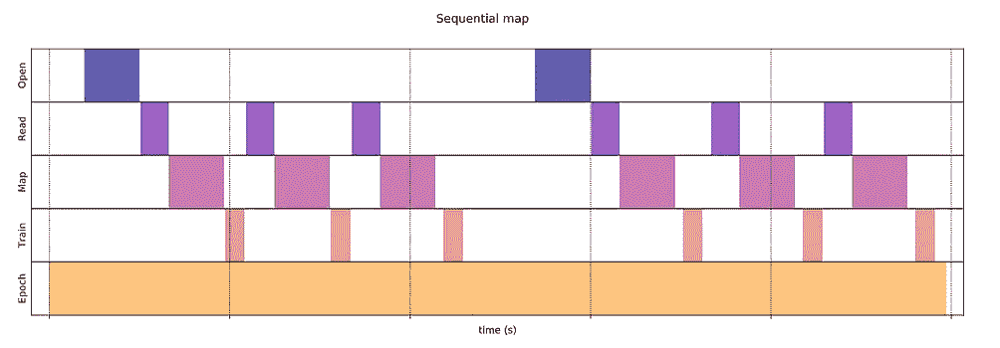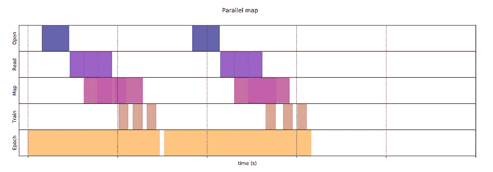

顺序处理与并行处理(Tensorflow 文档)

我对输入神经网络的批次数据、未经训练的神经网络的预测以及未经训练的神经网络的性能进行了全面检查。由于这是一个二元分类问题，二元交叉熵被用于损失函数。

我检查了神经网络预测的二进制交叉熵损失与随机预测`0`和`1`之间的类别概率的模型的近似损失不太远。我还检查了预测的分布是否以`.5`为中心。

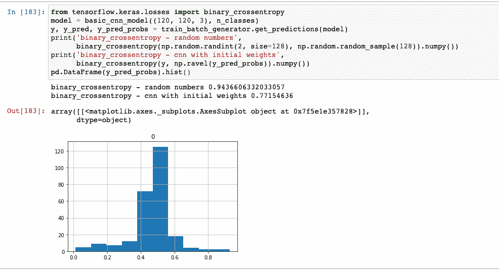

将偏差减少(拟合)步骤与正则化步骤分开很有用，因为如果模型不能过度拟合数据，则表明数据集中存在缺陷或限制。为此，我只在训练集上过度使用网络。我用云类的正面和负面例子在 10 次观察中反复训练模型，直到准确率达到 100%。

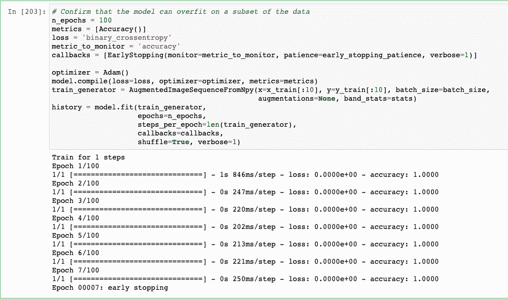

我确认预测值和实际值完全匹配。

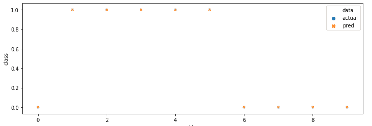

# **在谷歌深度学习虚拟机上训练模型**

现在我对我的训练过程有了信心，我将我的 docker 训练映像部署到一个 Google 深度学习 VM 并启动它。我添加了一个定制的 Keras 回调函数，它子类化了 ModelCheckpoint，并在每次达到新的最佳精度时将最佳模型和实验元数据写入 GCS。这允许我为部署持久化模型，并在训练结束后在一台不太昂贵的本地机器上分析实验结果。

我使用验证数据和批量标准化(BN)从原型阶段开始调整模型，以最小化过度拟合并提高验证集的准确性，同时尽可能保持训练集的准确性。我添加了一个验证集，并将成本函数改为使用验证损失而不是训练损失。[关于具体的 BN 层放置有很多争论](https://stackoverflow.com/questions/47143521/where-to-apply-batch-normalization-on-standard-cnns/59939495#59939495)，但我也在激活层之后向神经网络添加了 BN 层。

这些变化导致初始验证精度为. 862，训练精度为. 999。

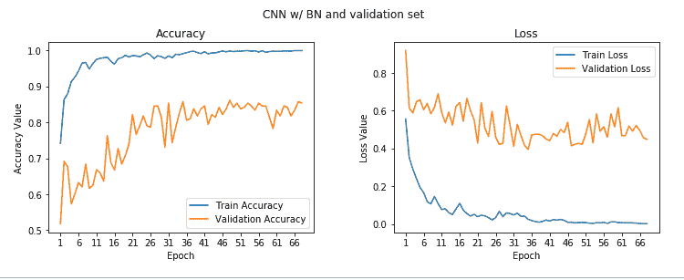

训练和验证性能之间仍有差距，所以接下来我添加了一个图像增强步骤，使用[albuminations](https://github.com/albumentations-team/albumentations)库来随机翻转和/或旋转一批图像。这将验证准确度从 0.862 提高到 0.929，同时将训练准确度从 0.999 降低到 0.928。

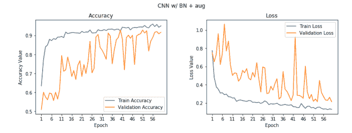

我将神经网络输出可视化，以确保它是合理的。预测的类别概率的分布显示了我的预期，因为分类器已经清楚地将类别分开。

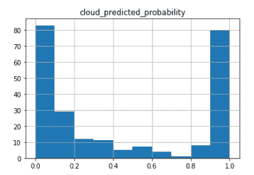

我研究了添加 Dropout 层来提高验证性能。李、项等。艾尔。表明在模型架构中，在批量标准化层之前插入漏失层可能会对后面的 BN 层的性能产生负面影响。这些 BN 层在训练期间学习归一化数据中的某个协变量偏移，但是在测试时，当关闭压差时，该协变量偏移不再准确。所以我在最后一个 BN 层之后用一个 Dropout 层训练了一个模型。与 BN +增强模型相比，它没有带来任何改进，而且需要更长的训练时间。于是我对 BN +增强模型进行了超参数调优，没有掉线。

我对优化器和学习率执行了超参数调整，以便改进初始神经网络架构搜索的最佳模型。我选择这些参数是因为我已经有了一个运行良好的神经网络架构。如果我没有一个好的神经网络基础性能，我会使用神经结构搜索作为超参数调整步骤的一部分。

贝叶斯优化搜索(BO)是目前推荐的超参数优化方法，优于随机搜索，因为它可以在更少的迭代次数内达到最佳结果。我发现没有公开发表的论文对这两种搜索方法做了明确的比较，但是 Google 的 hyperparameter tuning 产品的默认优化方法，大多数 automl 库支持的优化方法，以及像 T2 这样的几个 ML talks 都推荐 BO 而不是随机搜索。我使用了[hyperpt](https://hyperopt.github.io/hyperopt/)库来执行优化。值得一提的是，我看到许多教程在数值超参数上使用 hp.choice，这是不正确的，因为它删除了这些参数的数值排序所传达的信息，从而降低了搜索的效率和有效性。参见[这篇关于 hyperpt](https://github.com/hyperopt/hyperopt/issues/253#issuecomment-295871038)的高度评价评论，以获得进一步的讨论。

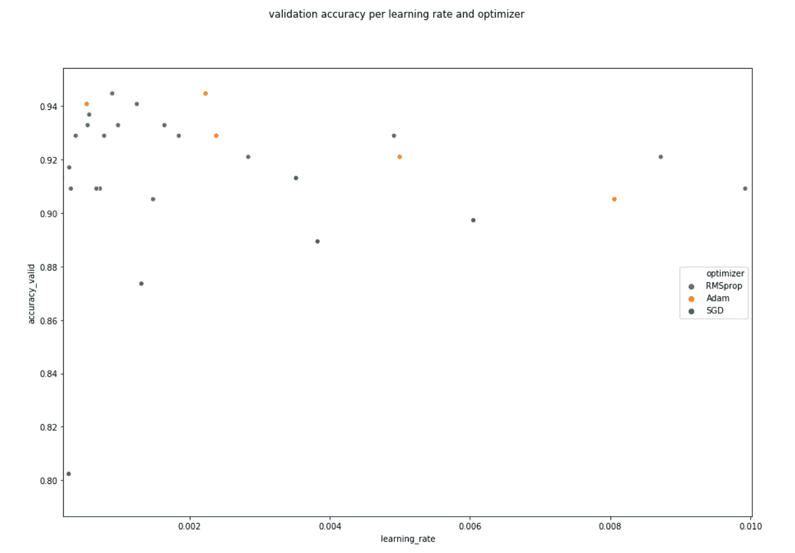

超参数调整结果

最佳模型具有 Adam 优化器和 2e-4 的学习率，这与未优化的优化器相同，并且几乎与未优化的 3e-4 的学习率相同。我最初的学习速度和优化器表现良好，这在一定程度上是幸运的，因此通过超参数调优来确认我已经在该搜索空间中找到了最好的模型之一是很好的。超参数调整带来了改进，因为最佳模型将验证精度从. 929 提高到. 945，同时将训练精度保持在. 928。获胜模型的训练时间略多于 8 分钟。

我还用 Resnet50V2 作为特征提取器进行了迁移学习。它在 25 分钟的训练时间内达到了 0.921 的验证精度。

我在包含所有 9000 张云图像和 9000 张 no_cloud 图像的大数据集上训练了来自小数据集的最佳模型。验证精度从 0.945 下降到 0.935，但训练精度保持不变，为 0.928，这表明模型的过度拟合程度低于它在小数据集上的情况。虽然大数据集的大小是小数据集的 9 倍，但训练时间仅增加了 3 倍，达到 27 分钟。正如在以前的模型运行中，预测的类概率是我所期望的，有明确的类分离。

在大型数据集上训练 Resnet50V2 分类器似乎也是值得的。它在小数据集上有很好的验证准确性，模型越复杂，它就越能从额外的数据中受益。训练时间太慢，无法尝试超参数调优，所以我坚持使用 Adam 优化器和 3e-4 的学习率，并在 82 分钟的训练时间内找到了验证精度为. 905 的模型。我很失望验证的准确性没有提高，但这仍然是一个相当好的结果。

# **分析模型性能和商业价值**

我评估了最强模型(姑且称之为`hp_tuned_keras_cnn`)和`resnet50_v2`模型在小型和大型数据集上的测试性能，并将这些结果与 Google AutoML 模型(`google_automl`)在小型和大型数据集上的性能进行了比较。在两个数据集上，在 0.5 类预测阈值的情况下，`hp_tuned_keras_cnn`和`resnet50_v2`在精度和召回率上胜过`google_automl`。以下是大型数据集性能的结果:

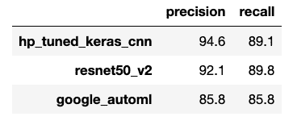

hp_tuned_keras_cnn 精度/召回率与阈值

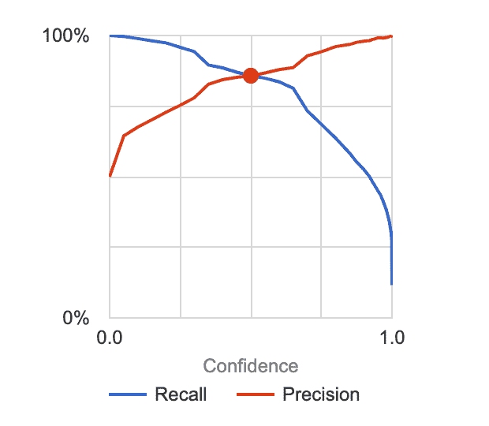

google_automl 精度/召回率与阈值

每个模型的混淆矩阵显示，两个模型在将`no_cloud`图像分类为`no_cloud`时表现最佳，但在`cloud`图像上与第二类错误(假阴性)斗争最激烈。鉴于我对`cloud`图像中令人困惑和扭曲的形状的视觉观察，这是有道理的。

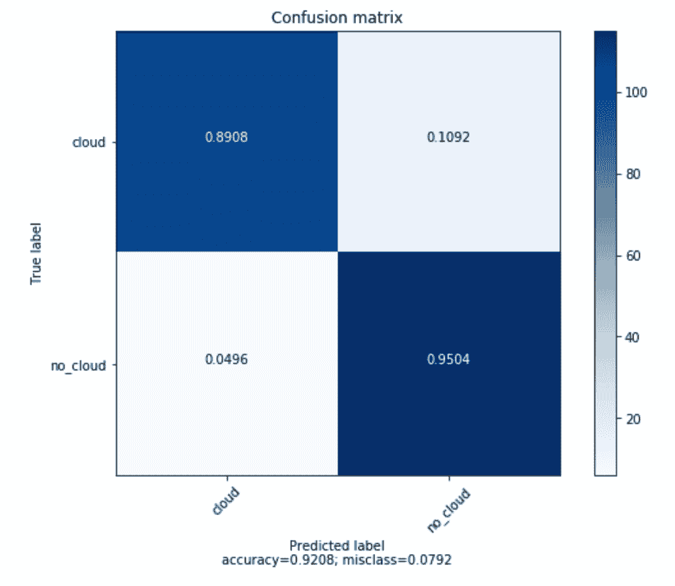

`hp_tuned_keras_cnn`混淆矩阵

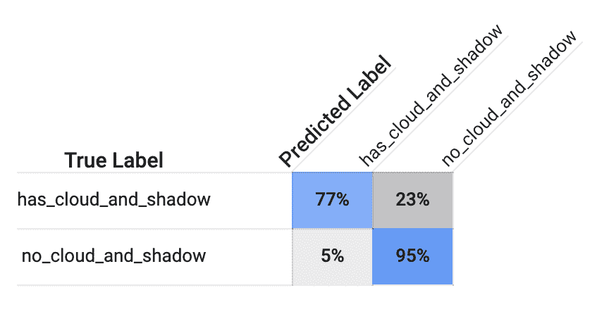

`google_automl`混淆矩阵

我考虑了这个分类器的实际应用。一个应用程序将使用这个模型来筛选出有云的图像，为其他一些图像分类任务做准备。如果我有大量的图像，我会优先考虑云分类任务的召回而不是精度，因为假阳性会导致图像不在数据集中使用，而假阴性会导致有噪声的云图像被添加到数据集中。当然，精度仍然需要很高，因为否则太多的图像(可能还有太多同一土地类型的图像)会被筛选掉。

考虑到这种商业环境，我比较了以更高召回率为目标的模型。在 0.26 的云预测阈值下，`hp_tuned_keras_cnn`的召回率为 95.8%，准确率为 91.2%。在 0.25 的云预测阈值下，`google_automl`具有相同的召回率，但准确率为 75.3%。`hp_tuned_keras_cnn`拥有我一直在寻找的云探测能力。下一步将是在不平衡数据集上测试该模型，然后看看该模型在新数据集上的表现如何。

# **在谷歌云虚拟机上部署获胜模型**

对于部署，我使用了一个 Docker 容器，它在 conda 环境中运行 Flask 和 tensorflow，并在运行时从 Google 云存储中加载模型。客户端通过展平图像张量并向服务器发送 JSON 序列化的张量来发出推断请求。服务器重塑张量，进行类预测，将类预测作为 JSON 发回。

模型部署的重要技术

我将容器部署在一个没有 GPU 的 Google VM 实例上，获得了 100 毫秒的模型服务器响应速度(50 毫秒的推理+50 毫秒的数据处理和其他请求开销)。

在一个成熟的生产系统中，我会对这个部署做一些改进。100 毫秒的延迟高于人类可以察觉的 70 毫秒阈值，因此为了减少延迟，我将使用 [TensorFlow 服务于](https://www.tensorflow.org/tfx/serving/docker)的容器，使用[请求批处理](https://github.com/tensorflow/serving/tree/master/tensorflow_serving/batching)而不是 Flask，并在 GPU 而不是 CPU 上运行。在 Kubernetes 上部署该模型还会增加水平可伸缩性。

我还会在部署中添加更多的 MLOps 功能。d .斯卡利等人。艾尔。⁴讨论 ML 系统中隐藏技术债务的来源。一个强有力的建议是监控模型预测分布。如果分布发生了显著变化，这可能表明输入数据的性质发生了变化，模型的最新部署发生了回归，或者两者都有。

# **谷歌汽车视觉回顾**

AutoML Vision 是一款很有潜力的有趣产品。我可以看到 AutoML Vision 在非技术人员或工程师想要深度学习功能但没有人实现它的情况下有其一席之地。然而，我对 AutoML 的性能没有什么印象，因为我能够用一个简单的模型和一个迁移学习模型击败它。我希望 AutoML 至少能超过这些基准。这可能是这个数据集没有发挥 AutoML 的优势，但我也发现[是一个性能基准](https://www.statworx.com/de/blog/a-performance-benchmark-of-google-automl-vision-using-fashion-mnist/)，AutoML 在时尚 MNIST 数据集上的表现比最先进的模型差 93.9%到 96.7%。

AutoML 也不便宜。培训费用 [$3.15 每节点小时](https://cloud.google.com/vision/automl/pricing)，最少 16 小时。如果您遵循针对您的数据集大小的建议训练时间，这将快速增加，而且这还不包括推理请求的定价，或者许多生产级模型所需的重复训练运行。培训 16 个节点小时的小型 AutoML 模型花费 38 美元，培训 65 个节点小时的大型 AutoML 模型花费 195 美元。作为对比，小的`hp_tuned_keras_cnn`模型训练 8 分钟，花费 0.40 美元，大的`hp_tuned_keras_cnn`模型训练 27 分钟，花费 1.35 美元。鉴于运行一个 Tesla V100 可抢占实例的成本为每节点小时 0.82 美元，如果 Google 能够提供一个更宽松的 sla 价格点就好了。同样，也许这个产品的成本对于一个没有足够的 ML 专业知识的组织来说是可以接受的。

# **最终想法**

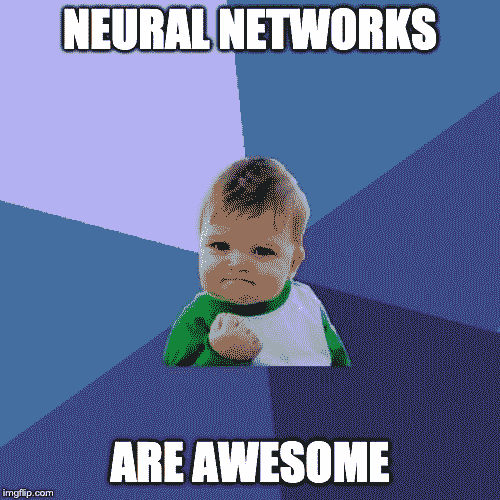

成功小子迷因生成器([来源](https://imgflip.com/memegenerator/Success-Kid))

咻！如果你已经读到这里，恭喜你，谢谢你。我希望你能从我的经历中学到一些有用的东西。这个项目非常有趣，让我有机会玩更多最新的 ML 技术。

我期待着在未来建立更多的机器学习驱动的系统，无论是在我的工作中还是在我的兼职项目中。我对机器学习领域工具的增长感到兴奋，包括堆栈的所有部分。随着这些工具的成熟，它们将使机器学习更容易为每个人所用。我也对神经网络最佳实践的发展速度感到惊讶。看看这种创新会走向何方将是一件有趣的事情。

有兴趣联系或一起工作吗？在下面分享你的回答，或者在 linkedin 上给我留言。

本文使用的代码可以在这个 [**资源库**](https://github.com/skeller88/deep_learning_project) 中的 [**my GitHub**](https://github.com/skeller88) 上获得。

[1] G. Sumbul，M. Charfuelan，b .德米尔，V. Markl， [BigEarthNet:遥感影像理解的大规模基准档案库](http://bigearth.net/static/documents/BigEarthNet_IGARSS_2019.pdf) (2019)，IEEE 国际地球科学与遥感研讨会

[2] K. [何](https://arxiv.org/search/cs?searchtype=author&query=He%2C+K)，X. [张](https://arxiv.org/search/cs?searchtype=author&query=Zhang%2C+X)，S. [任](https://arxiv.org/search/cs?searchtype=author&query=Ren%2C+S)， [J .孙](https://arxiv.org/search/cs?searchtype=author&query=Sun%2C+J)，[深入研究整流器:在 ImageNet 分类上超越人类水平的性能](https://arxiv.org/abs/1502.01852) (2015)，IEEE 计算机视觉国际会议(ICCVV)

[3] [X 李](https://scholar.google.com/citations?user=cBDOkNIAAAAJ&hl=en&oi=sra)， [S 陈](https://scholar.google.com/citations?user=vlu_3ksAAAAJ&hl=en&oi=sra)， [X 胡](https://scholar.google.com/citations?user=PksdgoUAAAAJ&hl=en&oi=sra)， [J 杨](https://scholar.google.com/citations?user=6CIDtZQAAAAJ&hl=en&oi=sra)，[用方差移位理解丢失与批量归一化的不协调](http://openaccess.thecvf.com/content_CVPR_2019/html/Li_Understanding_the_Disharmony_Between_Dropout_and_Batch_Normalization_by_Variance_CVPR_2019_paper.html) (2019)，IEEE 计算机视觉与模式识别会议()

[4] D .斯卡利，g .霍尔特，d .戈洛文，e .达维多夫，t .菲利普，[机器学习系统中隐藏的技术债务](https://papers.nips.cc/paper/5656-hidden-technical-debt-in-machine-learning-systems.pdf) (2015)，神经信息处理系统进展 28 (NIPS)