# 超过 100 个数据科学家面试问题和答案！

> 原文：<https://towardsdatascience.com/over-100-data-scientist-interview-questions-and-answers-c5a66186769a?source=collection_archive---------0----------------------->

## 来自亚马逊、谷歌、脸书、微软等公司的面试问题！


图片由阿曼达·福西特提供

> 我知道这很漫长…

真的很长。但是不要被它的长度吓倒——我已经把它分成了四个部分(机器学习、统计、SQL、杂项),这样你就可以一点一点地看完它。

请将此视为一本工作簿或一门速成课程，其中包含数百个数据科学面试问题，您可以用这些问题来磨练自己的知识，并找出差距，以便随后填补。

我希望这对您有所帮助，并祝您在数据科学事业中好运！

如果你喜欢这篇文章并想支持我，请考虑订阅我下面的链接！:)

[](https://terenceshin.medium.com/membership) [## 通过我的推荐链接加入 Medium-Terence Shin

### 作为一个媒体会员，你的会员费的一部分会给你阅读的作家，你可以完全接触到每一个故事…

terenceshin.medium.com](https://terenceshin.medium.com/membership) 

# 目录

*   [机器学习基础](#ba56)
*   [统计、概率和数学](#6c1e)
*   [SQL 练习题](#e4e2)
*   [杂项](#0ff0)

# 机器学习基础

## 问:在应用机器学习算法之前，数据争论和数据清洗的一些步骤是什么？

当数据争论和数据清理时，可以采取许多步骤。下面列出了一些最常见的步骤:

*   **数据剖析:**几乎每个人都是从了解他们的数据集开始的。更具体地说，您可以使用。形状和对数值变量的描述。描述()。
*   **数据可视化:**有时，用直方图、箱线图和散点图来可视化数据很有用，这样可以更好地理解变量之间的关系，也可以识别潜在的异常值。
*   **语法错误**:这包括确保没有空格，确保字母大小写一致，检查错别字。您可以使用。unique()或使用条形图。
*   **标准化或规范化**:根据您正在处理的数据集和您决定使用的机器学习方法，标准化或规范化您的数据可能会很有用，这样不同变量的不同尺度就不会对模型的性能产生负面影响。
*   **处理空值:**有多种方法来处理空值，包括完全删除具有空值的行，用均值/中值/众数替换空值，用新的类别(例如未知)替换空值，预测值，或者使用可以处理空值的机器学习模型。*阅读更多*[此处](https://analyticsindiamag.com/5-ways-handle-missing-values-machine-learning-datasets/) *。*
*   **其他还有:**去除无关数据，去除重复，类型转换。

> ***请务必*** [***订阅此处***](https://terenceshin.medium.com/membership) ***或至我的*** [***独家快讯***](https://terenceshin.substack.com/embed) ***千万不要错过另一篇关于数据科学的指南、技巧和提示、生活经验等！***

## 问:如何处理不平衡的二元分类？

有许多方法可以处理不平衡的二进制分类(假设您想要识别少数类):

*   首先，你要重新考虑你用来评估模型的**指标**。你的模型的准确性可能不是最好的衡量标准，因为我将用一个例子来解释为什么。假设 99 次银行取款不是欺诈，1 次取款是欺诈。如果你的模型只是简单地将每个实例归类为“非欺诈”，那么它的准确率将达到 99%！因此，您可能需要考虑使用精度和召回率等指标。
*   另一种改善不平衡二进制分类的方法是通过**增加错误分类**少数类的成本。通过增加这样的惩罚，该模型应该更准确地对少数民族进行分类。
*   最后，你可以通过**过采样**少数阶级或者**欠采样**多数阶级来改善阶级的平衡。你可以在这里阅读更多关于它的[。](http://how%20to%20deal%20with%20unbalanced%20binary%20classification/?)

## 问:箱形图和直方图有什么区别？

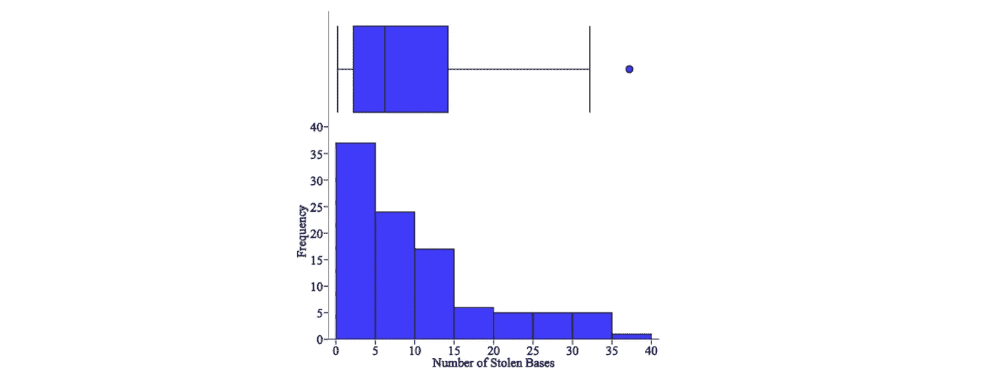

箱线图与直方图

虽然箱线图和直方图是用于显示数据分布的可视化工具，但它们传达信息的方式不同。

直方图是显示数值变量值的频率的条形图，用于估计给定变量的概率分布。它允许您快速了解分布的形状、变化和潜在的异常值。

箱线图表达了数据分布的不同方面。虽然您无法通过箱线图看到分布的形状，但您可以收集其他信息，如四分位数、范围和异常值。当您想要同时比较多个图表时，箱线图尤其有用，因为它们比直方图占用更少的空间。


如何阅读箱线图

## 问:描述不同的正则化方法，如 L1 和 L2 正则化？

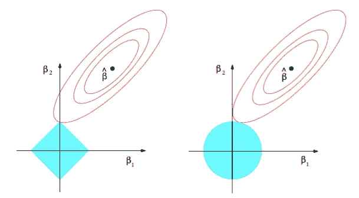

L1 和 L2 正则化都是用于减少训练数据过拟合的方法。最小二乘法使残差平方和最小，这可能导致低偏差但高方差。

L2 正则化，也称为岭回归，最小化残差平方和**加上λ乘以斜率平方**。这个附加项被称为**岭回归惩罚**。这增加了模型的偏差，使得对训练数据的拟合更差，但是也减少了方差。

如果采用岭回归罚分并用斜率的**绝对值**替换它，则得到套索回归或 L1 正则化。

L2 不太稳健，但有一个稳定的解决方案，而且总是一个解决方案。L1 更稳健，但是具有不稳定的解，并且可能具有多个解。

StatQuest 有一个关于套索和山脊回归的惊人视频[这里](https://www.youtube.com/watch?v=NGf0voTMlcs)。

## 问:神经网络基础

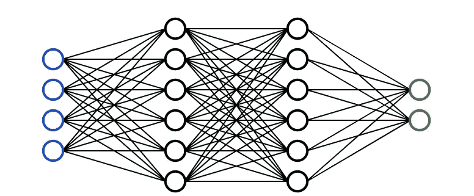

一个**神经网络**是一个受人脑启发的多层模型。就像我们大脑中的神经元一样，上面的圆圈代表一个节点。蓝色圆圈代表**输入层，**黑色圆圈代表**隐藏层，**绿色圆圈代表**输出层。**隐藏层中的每个节点代表输入经过的功能，最终导致绿色圆圈中的输出。这些功能的正式术语称为**s 形激活功能**。

如果你想要一步一步的创建神经网络的例子，请点击这里查看 Victor Zhou 的文章。

如果你是一名视觉/音频学习者，3Blue1Brown 在 YouTube 上有一个关于神经网络和深度学习的惊人系列[这里](https://www.youtube.com/watch?v=aircAruvnKk)。

> ***务必*** [***订阅此处***](https://terenceshin.medium.com/membership) ***或至我的*** [***独家快讯***](https://terenceshin.substack.com/embed) ***千万不要错过另一篇关于数据科学的指南、窍门和技巧、生活经验等！***

## 问:什么是交叉验证？

交叉验证本质上是一种用于评估模型在新的独立数据集上表现如何的技术。交叉验证最简单的例子是将数据分成两组:定型数据和测试数据，其中定型数据用于构建模型，测试数据用于测试模型。

## 问:如何定义/选择指标？

没有放之四海而皆准的标准。选择用于评估机器学习模型的度量取决于各种因素:

*   是回归还是分类任务？
*   商业目标是什么？精确度与召回率
*   目标变量的分布是什么？

可以使用的指标有很多，包括调整后的 r 平方、MAE、MSE、准确度、召回率、精确度、f1 分数等等。

## 问:解释什么是精确和召回

**回忆一下**试图回答“正确识别实际阳性的比例是多少？”


**Precision** 试图回答“多大比例的肯定识别实际上是正确的？”

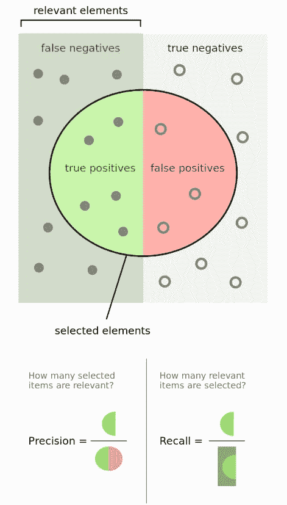

摘自维基百科

## 问:解释什么是假阳性和假阴性。为什么这些对彼此很重要？举例说明假阳性比假阴性更重要，假阴性比假阳性更重要，以及这两种错误同等重要

一个**假阳性**是当一个条件不存在时对其存在的不正确识别。

**假阴性**是对实际存在的条件不存在的错误识别。

假阴性比假阳性更重要的一个例子是癌症筛查。与其说有人得了癌症，后来才发现没有，不如说有人没得癌症。

这是一个主观的论点，但从心理学的角度来看，假阳性可能比假阴性更糟糕。例如，赢得彩票的假阳性可能比假阴性更糟糕，因为人们通常不会期望赢得彩票。

## 问:监督学习和无监督学习有什么区别？给出具体的例子

**监督学习**包括学习一个函数，该函数基于示例输入-输出对将输入映射到输出[1]。

例如，如果我有一个包含两个变量的数据集，年龄(输入)和身高(输出)，我可以实现一个监督学习模型，根据年龄预测一个人的身高。

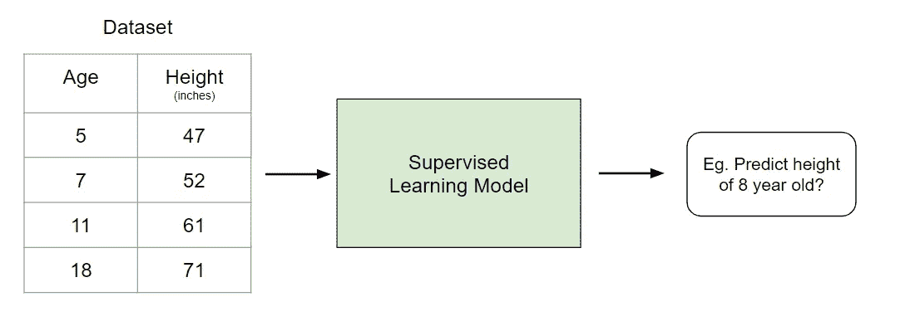

由作者创建

与监督学习不同，**非监督学习**用于从输入数据中进行推断和发现模式，而不参考标记的结果。无监督学习的一个常见用途是根据购买行为对客户进行分组，以找到目标市场。

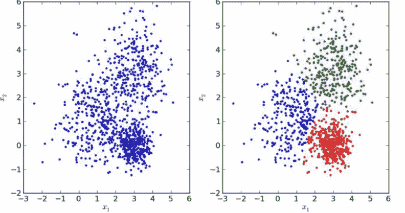

*查看我的文章'* [*六分钟解释所有机器学习模型*](/all-machine-learning-models-explained-in-6-minutes-9fe30ff6776a) *'如果你想了解更多这方面的信息！*

## 问:假设您需要使用多元回归生成一个预测模型。解释你打算如何验证这个模型

有两种主要方法可以做到这一点:

**A)调整后的 R 平方**。

r 平方是一种度量，它告诉你因变量的方差在多大程度上是由自变量的方差来解释的。更简单地说，当系数估计趋势时，R 平方表示最佳拟合线周围的散布。

然而，添加到模型中的每一个额外的独立变量**总是**增加 R 平方值——因此，具有几个独立变量的模型可能看起来更适合，即使它不是。这就是调整后的 R 的用武之地。调整后的 R 补偿每个额外的独立变量，并且仅在每个给定变量将模型改进到超出概率可能的程度时才增加。这很重要，因为我们正在创建一个多元回归模型。

**B)交叉验证**

大多数人常用的一种方法是交叉验证，将数据分成两组:训练数据和测试数据。有关这方面的更多信息，请参见第一个问题的答案。

## 问:NLP 代表什么？

NLP 代表自然语言处理。它是人工智能的一个分支，赋予机器阅读和理解人类语言的能力。

## 问:什么时候你会使用随机森林来对抗 SVM，为什么？

为什么随机森林是比支持向量机更好的模型选择，有几个原因:

*   随机森林允许您确定要素的重要性。SVM 不能这么做。
*   随机森林比 SVM 建造起来更快更简单。
*   对于多类分类问题，支持向量机需要一种 one-vs-rest 方法，这种方法扩展性差，占用内存多。

## 问:为什么降维很重要？

降维是减少数据集中要素数量的过程。这主要在您想要减少模型中的方差(过度拟合)的情况下很重要。

维基百科陈述了降维的四个优点([见此处](https://en.wikipedia.org/wiki/Dimensionality_reduction#Advantages_of_dimensionality_reduction)):

1.  *它减少了所需的时间和存储空间*
2.  *多重共线性的消除改善了机器学习模型参数的解释*
3.  *当数据降低到非常低的维度时，如 2D 或 3D* ，将变得更容易可视化
4.  *它避免了维数灾难*

## 问:什么是主成分分析？解释你会用主成分分析来解决哪类问题。

从最简单的意义上来说，PCA 涉及将高维数据(例如 3 维)投影到更小的空间(例如 2 维)。这导致数据的维度降低(2 维而不是 3 维)，同时保持模型中的所有原始变量。

PCA 通常用于压缩目的，以减少所需的内存并加速算法，以及用于可视化目的，使汇总数据更容易。

## 问:为什么朴素贝叶斯这么差？如何改进使用朴素贝叶斯的垃圾邮件检测算法？

朴素贝叶斯的一个主要缺点是，它有一个很强的假设，即假设这些特征彼此不相关，但事实通常并非如此。

改进这种使用朴素贝叶斯的算法的一种方法是对特征去相关，使得假设成立。

## 问:线性模型的缺点是什么？

线性模型有几个缺点:

*   线性模型有一些强有力的假设，在应用中可能不成立。它假设线性关系、多元正态性、没有或很少多重共线性、没有自相关和同方差
*   线性模型不能用于离散或二元结果。
*   您不能改变线性模型的模型灵活性。

## 问:你认为 50 个小决策树比一个大决策树好吗？为什么？

问这个问题的另一种方式是“随机森林是比决策树更好的模型吗？”答案是肯定的，因为随机森林是一种集成方法，需要许多弱决策树来形成强学习器。随机森林更准确、更健壮，并且不容易过度拟合。

## 问:为什么均方差不是衡量模型性能的好方法？你有什么建议？

均方误差(MSE)对大误差给予相对较高的权重，因此，MSE 往往过于强调大偏差。更可靠的替代方法是 MAE(平均绝对偏差)。

## 问:线性回归需要哪些假设？如果这些假设中的一些被违反了呢？

这些假设如下:

1.  用于拟合模型的样本数据是代表人口的
2.  **X 和 Y 的均值之间的关系是**线性****
3.  **残差的方差对于 X 的任何值都是相同的**(同方差)****
4.  **观察是相互独立的**
5.  **对于 X 的任意值，Y 都是**正态分布**。**

**极端违反这些假设将使结果变得多余。对这些假设的小的违反将导致估计的更大的偏差或方差。**

## **问:什么是共线性，如何处理共线性？如何去除多重共线性？**

**当多元回归方程中的一个自变量与另一个自变量高度相关时，就存在多重共线性。这可能是有问题的，因为它破坏了一个独立变量的统计意义。**

**您可以使用方差膨胀因子(VIF)来确定自变量之间是否存在多重共线性-标准基准是，如果 VIF 大于 5，则存在多重共线性。**

## **问:如何检查回归模型是否很好地拟合了数据？**

**有几个指标可供您使用:**

****R 平方/调整后的 R 平方:**相对拟合度。*这在之前的回答*中已经解释过了**

****F1 得分**:评估所有回归系数都等于零的原假设与至少一个不等于零的替代假设**

****RMSE:** 绝对契合度。**

## **什么是决策树？**

**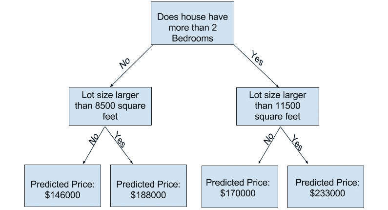**

**图片来自 Kaggle**

****决策树**是一种流行的模型，用于运筹学、战略规划和机器学习。上面的每个方块被称为一个**节点**，节点越多，你的决策树就越精确(一般来说)。决策树的最后一个节点，也就是做出决策的地方，被称为树的**叶**。决策树直观且易于构建，但在准确性方面有所欠缺。**

## **问:什么是随机森林？为什么好？**

**随机森林是一种基于决策树的集成学习技术。随机森林包括使用原始数据的[自举数据集](https://machinelearningmastery.com/a-gentle-introduction-to-the-bootstrap-method/)创建多个决策树，并在决策树的每一步随机选择一个变量子集。然后，该模型选择每个决策树的所有预测的模式。依靠“多数获胜”模型，它降低了单个树出错的风险。**

**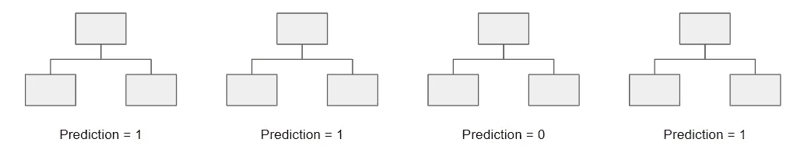**

**例如，如果我们创建一个决策树，第三个，它会预测 0。但是如果我们依赖所有 4 个决策树的模式，预测值将是 1。这就是随机森林的力量。**

**随机森林提供了其他几个好处，包括强大的性能，可以模拟非线性边界，不需要交叉验证，并赋予功能重要性。**

> *****务必*** [***订阅此处***](https://terenceshin.medium.com/membership) ***或至我的*** [***独家快讯***](https://terenceshin.substack.com/embed) ***千万不要错过另一篇关于数据科学的指南、窍门和技巧、生活经验等！*****

## **问:什么是内核？解释内核技巧**

**核是一种计算两个向量 **𝐱** x 和 **𝐲** y 在某个(可能是非常高维的)特征空间内点积的方法，这就是为什么核函数有时被称为“广义点积”[2]**

**核心技巧是一种使用线性分类器来解决非线性问题的方法，方法是将线性不可分的数据转换为高维线性可分的数据。**

****

**摘自分析 Vidhya**

## **问:在拟合 SVM 之前进行降维是否有益？为什么或为什么不？**

**当特征的数量大于观察的数量时，那么执行维数减少通常会改善 SVM。**

## **问:什么是过度拟合？**

****

**摘自维基百科**

**过度拟合是一种错误，即模型“拟合”数据太好，导致模型具有高方差和低偏差。因此，过度拟合模型将会不准确地预测新的数据点，即使它对训练数据具有高的准确性。**

## **问:什么是助推？**

**Boosting 是一种集成方法，通过减少模型的偏差和方差来改进模型，最终将弱学习者转换为强学习者。总体思路是训练一个弱学习器，通过对前一个学习器的学习，依次迭代改进模型。*你可以在这里* 了解更多 [*。*](https://medium.com/greyatom/a-quick-guide-to-boosting-in-ml-acf7c1585cb5)**

> *****一定要*** [***订阅***](https://terenceshin.medium.com/membership) ***千万不要错过另一篇关于数据科学指南、技巧和提示、生活经验等的文章！*****

# **统计、概率和数学**

## **问:商品在位置 A 的概率是 0.6，在位置 b 的概率是 0.8。在亚马逊网站上找到该商品的概率是多少？**

**我们需要对这个问题做一些假设才能回答。让我们假设在亚马逊上有两个可能的地方购买一件特定的商品，在位置 A 找到它的概率是 0.6，在位置 B 找到它的概率是 0.8。在亚马逊上找到该商品的概率可以这么解释:**

**我们可以把上面的话重新措辞为 P(A) = 0.6，P(B) = 0.8。此外，让我们假设这些是独立的事件，这意味着一个事件的概率不受另一个事件的影响。然后我们可以使用公式…**

**P(A 或 B) = P(A) + P(B) — P(A 和 B)
P(A 或 B) = 0.6 + 0.8 — (0.6*0.8)
P(A 或 B) = 0.92**

> **点击查看亚马逊数据科学家采访指南[。](/the-amazon-data-scientist-interview-93ba7195e4c9?source=friends_link&sk=a1989d6e50387d8e18c8af8e8bcf7f89)**

## **问:你从 100 枚硬币中随机抽取一枚——1 枚不公平硬币(正面朝上)，99 枚公平硬币(正面朝下)，然后掷 10 次。如果结果是 10 头，硬币不公平的概率是多少？**

**这可以用贝叶斯定理来回答。贝叶斯定理的扩展方程如下:**

**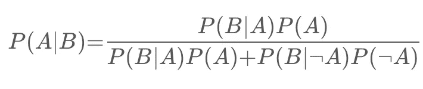**

**假设选到不公平硬币的概率表示为 P(A)，连续翻转 10 个头像的概率表示为 P(B)。那么 P(B|A)等于 1，P(B∣ A)等于 0。⁵ ⁰，P( A)等于 0.99。**

**如果填入等式，那么 P(A|B) = 0.9118 或者 91.18%。**

## **问:凸与非凸代价函数的区别；当一个代价函数是非凸的时候意味着什么？**

**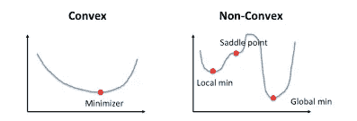**

**摘自加州大学洛杉矶分校谢卓瑞**

****凸函数**是指在图上任意两点之间画出的一条线位于图上或图上。它有一个最小值。**

****非凸函数**是在图上任意两点之间画的线可能与图上其他点相交的函数。它的特征是“波浪形”。**

**当成本函数是非凸的时，这意味着该函数有可能找到局部最小值而不是全局最小值，从优化的角度来看，这在机器学习模型中通常是不期望的。**

## **问:浏览概率基础知识**

***为此，我要在这里*[](https://bolt.mph.ufl.edu/6050-6052/unit-3/module-6/)**和四种不同的计数方法(详见* [*这里*](https://78bbm3rv7ks4b6i8j3cuklc1-wpengine.netdna-ssl.com/wp-content/uploads/tutoring/handouts/Fundamentals-of-Probability.pdf) *)。****

*****概率的八大法则*****

*   ***规则#1:对于任何事件 A，**0≤P(A)≤1**；*换句话说，一个事件的概率范围可以从 0 到 1。****
*   ***规则 2:所有可能结果的概率总和总是等于 1。***
*   ***规则#3: **P(不是 A)= 1—P(A)**；*这个规则解释了一个事件的概率和它的补事件之间的关系。补充事件是指包含 a 中没有的所有可能结果的事件****
*   ***规则#4:如果 A 和 B 是不相交事件(互斥)，那么 **P(A 或 B)= P(A)+P(B)**；*这被称为不相交事件的添加规则****
*   ***规则#5: **P(A 或 B) = P(A) + P(B) — P(A 和 B)**；*这就是所谓的一般加法法则。****
*   ***规则#6:如果 A 和 B 是两个独立事件，那么 **P(A 和 B)= P(A)* P(B)**；*这叫做独立事件的乘法法则。****
*   ***规则#7:给定事件 A，事件 B 的条件概率是 **P(B|A) = P(A 和 B) / P(A)*****
*   ***规则#8:对于任意两个事件 A 和 B， **P(A 和 B)= P(A)* P(B | A)**；*这就是所谓的一般乘法法则****

*****计数方法*****

***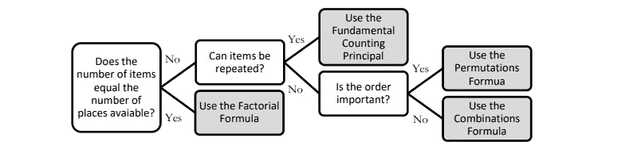***

*****阶乘公式:n！= n x (n -1) x (n — 2) x … x 2 x 1** 当项目数等于可用位置数时使用。*例:找出 5 个人可以坐在 5 个空座位上的总方式数。
= 5×4×3×2×1 = 120****

*****基本计数原理(乘法)** 当允许重复且填充空位的方式数不受之前填充的影响时，应使用此方法。早餐有 3 种，午餐有 4 种，甜点有 5 种。组合总数= 5 x 4 x 3 = 60***

*****排列:P(n，r)= n！/(n r)！
 *例如，一个代码有 4 个数字，按特定顺序排列，数字范围从 0 到 9。如果一个数字只能用一次，有多少种排列？
P(n，r) = 10！/(10–4)!=(10 x 9 x 8 x 7 x 6 x 5 x 4 x 3 x2 x 1)/(6x 5 x 4 x 3 x2 x 1)= 5040******

*****组合公式:C(n，r)=(n！)/[(n r)！r！]** 当不允许替换并且项目的排列顺序不重要时使用。要赢得彩票，你必须从 1 到 52 中以任意顺序选出 5 个正确的数字。有多少种可能的组合？
C(n，r) = 52！/ (52–5)!5!= 2598960***

## ***问:描述马尔可夫链？***

***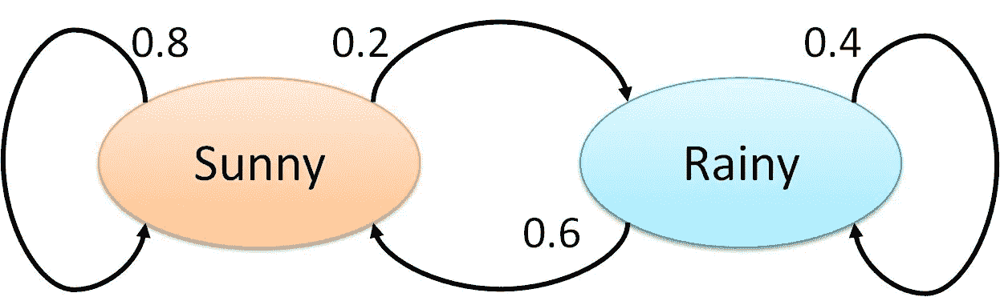***

***Brilliant 提供了马尔可夫链的一个很好的定义([此处](https://brilliant.org/wiki/markov-chains/)):***

> ****“马尔可夫链是一个数学系统，它按照一定的* [*概率*](https://brilliant.org/wiki/probability-rule-of-product/) *规则经历从一个状态到另一个状态的转变。马尔可夫链的定义特征是，无论* [*过程*](https://brilliant.org/wiki/stochastic-processes/) *如何到达其当前状态，可能的未来状态都是固定的。换句话说，转换到任何特定状态的概率只取决于当前状态和经过的时间。”****

***马尔可夫链背后的实际数学需要线性代数和矩阵的知识，所以我会在下面留下一些链接，以防你想自己进一步探索这个主题。***

****查看更多* [*此处*](https://www.dartmouth.edu/~chance/teaching_aids/books_articles/probability_book/Chapter11.pdf) *或* [*此处*](/brief-introduction-to-markov-chains-2c8cab9c98ab) *。****

## ***问:一个盒子里有 12 张红卡和 12 张黑卡。另一个盒子里有 24 张红牌和 24 张黑牌。你想从两个盒子中的一个里随机抽取两张卡片，一次抽取一张。哪个盒子得到同色卡片的概率更大，为什么？***

***有 24 张红卡和 24 张黑卡的盒子获得两张同色卡片的概率更大。让我们走过每一步。***

***假设你从每副牌中抽出的第一张牌是红色的 a。***

***这意味着在有 12 个红和 12 个黑的牌组中，现在有 11 个红和 12 个黑。因此，你再抽一张红色的几率等于 11/(11+12)或 11/23。***

***一副牌中有 24 个红和 24 个黑，那么就有 23 个红和 24 个黑。因此，你再抽一张红色的几率等于 23/(23+24)或 23/47。***

***由于 23/47 > 11/23，所以卡数较多的第二副牌有较大概率得到相同的两张牌。***

## ***问:你在赌场，有两个骰子可以玩。你每掷一次 5 就赢 10 美元。如果你一直玩到你赢了然后停止，预期的回报是多少？***

******

*   ***我们假设每次你想玩的时候要花 5 美元。***
*   ***两个骰子有 36 种可能的组合。***
*   ***在 36 种组合中，有 4 种组合会掷出 5(*见蓝色*)。这意味着有 4/36 或 1/9 的机会掷出 5。***
*   ***1/9 的胜算意味着你会输八次，赢一次(理论上)。***
*   ***因此，您的预期支出等于$ 10.00 * 1-$ 5.00 * 9 =-35.00。***

****编辑:谢谢各位的评论和指出，应该是-$35！****

## ***问:如何判断给定的硬币是否有偏差？***

***这不是一个难题。答案很简单，就是进行假设检验:***

1.  ***零假设是硬币没有偏向，翻转头的概率应该等于 50% (p=0.5)。另一个假设是硬币有偏差，p！= 0.5.***
2.  ***抛硬币 500 次。***
3.  ***计算 Z 得分(如果样本小于 30，则需要计算 t 统计量)。***
4.  ***对比 alpha(双尾检验所以 0.05/2 = 0.025)。***
5.  ***如果 p 值>α，则不拒绝 null，硬币不偏。
    如果 p 值<α，则 null 被拒绝，硬币有偏差。***

****了解更多假设检验* [*这里*](https://www.statisticshowto.datasciencecentral.com/probability-and-statistics/hypothesis-testing/) *。****

## ***让不公平的硬币变得公平***

***由于抛硬币是二进制的结果，你可以通过抛两次硬币来使不公平的硬币变得公平。如果你掷两次，有两种结果可以赌:正面跟着反面或者反面跟着正面。***

> ***P(正面)* P(反面)= P(反面)* P(正面)***

***这是有意义的，因为每一次抛硬币都是一个独立的事件。这意味着如果你得到正面→正面或反面→反面，你需要重新抛硬币。***

## ***问:你即将登上去伦敦的飞机，你想知道你是否需要带雨伞。你随便打电话给三个朋友，问他们是否在下雨。你的朋友说实话的概率是 2/3，他们通过撒谎对你恶作剧的概率是 1/3。如果他们三个都说在下雨，那么伦敦下雨的概率是多少。***

***你可以看出这个问题与贝叶斯理论有关，因为最后一个陈述本质上遵循这样的结构，“假设 B 为真，A 为真的概率是多少？”因此，我们需要知道某一天伦敦下雨的概率。假设是 25%。***

***P(A) =下雨的概率= 25%
P(B) =三个朋友都说在下雨的概率
P(A|B)假定他们说在下雨的概率
P(B|A)假定在下雨的情况下三个朋友都说在下雨的概率= (2/3) = 8/27***

****第一步:求解 P(B)*
P(A | B)= P(B | A) * P(A)/P(B)，可以改写为
P(B)= P(B | A)* P(A)+P(B |非 A)* P(非 A)
P(B)=(2/3)* 0.25+(1/3)* 0.75 = 0.25 * 8/27+0.75 * 1/1***

****第二步:求解 P(A | B)*
P(A | B)= 0.25 *(8/27)/(0.25 * 8/27+0.75 * 1/27)
P(A | B)= 8/(8+3)= 8/11***

***因此，如果三个朋友都说在下雨，那么有 8/11 的几率是真的在下雨。***

## ***问:给你 40 张四种不同颜色的卡片——10 张绿卡、10 张红牌、10 张蓝卡和 10 张黄牌。每种颜色的卡片都从一到十编号。随机抽取两张牌。找出所选卡片不是相同号码和相同颜色的概率。***

***由于这些事件不是独立的，我们可以使用规则:
P(A 和 B) = P(A) * P(B|A)，也等于
P(非 A 非 B) = P(非 A) * P(非 B |非 A)***

***例如:***

***P(非 4 非黄)= P(非 4) * P(非黄|非 4)
P(非 4 非黄)= (36/39) * (27/36)
P(非 4 非黄)= 0.692***

***所以，挑出来的牌不是同号同色的概率是 69.2%。***

## ***问:如何评估洞察力的统计显著性？***

***您将执行假设检验来确定统计显著性。首先，你要陈述零假设和替代假设。其次，您将计算 p 值，即假设零假设为真，获得测试观察结果的概率。最后，您将设置显著性水平(alpha ),如果 p 值小于 alpha，您将拒绝 null 换句话说，结果具有统计显著性。***

## ***问:解释什么是长尾分布，并提供三个具有长尾的相关现象的例子。为什么它们在分类和回归问题中很重要？***

******

***长尾分布的例子***

*****长尾分布**是一种重尾分布，它有一条(或多条)逐渐渐近消失的尾巴。***

***3 实际例子包括幂定律、帕累托原则(通常称为 80-20 法则)和产品销售(即最畅销的产品与其他产品相比)。***

***在分类和回归问题中注意长尾分布是很重要的，因为出现频率最低的值构成了总体的大多数。这最终会改变您处理异常值的方式，并且它也与一些假设数据正态分布的机器学习技术相冲突。***

## ***问:什么是中心极限定理？解释一下。为什么重要？***

******

***来自维基百科***

***统计学如何为 CLT 提供了最好的定义，这就是:***

> ****“中心极限定理表明，无论总体分布的形状如何，随着样本量的增加，样本均值的抽样分布都接近正态分布。”[1]****

***中心极限定理很重要，因为它用于假设检验和计算置信区间。***

## ***问:什么是统计能力？***

***“统计功效”是指二元假设的功效，即假设替代假设为真，测试拒绝零假设的概率。[2]***

******

## ***问:解释选择偏差(关于数据集，而不是变量选择)。为什么重要？丢失数据处理等数据管理程序如何使情况变得更糟？***

*****选择偏倚**是指在选择个人、群体或数据进行分析时，没有实现适当的随机化，最终导致样本不能代表总体的现象。***

***理解和识别选择偏差是很重要的，因为它会严重扭曲结果，并提供关于特定人群的错误见解。***

***选择偏差的类型包括:***

*   *****抽样偏倚**:由非随机抽样引起的有偏倚的样本***
*   *****时间间隔**:选择支持预期结论的特定时间框架。例如，在临近圣诞节时进行销售分析。***
*   *****暴露**:包括临床易感性偏倚、原发性偏倚、适应症偏倚。*此处阅读更多*[](https://en.wikipedia.org/wiki/Selection_bias)**。*****
*   ******数据**:包括摘樱桃、压制证据、证据不全的谬误。****
*   ******流失**:流失偏倚类似于生存偏倚，即只有那些在长期过程中“存活”下来的人才会被纳入分析，或者类似于失败偏倚，即只有那些“失败”的人才会被纳入分析****
*   ****观察者选择:与人择原理有关，这是一种哲学上的考虑，我们收集的关于宇宙的任何数据都要经过过滤，为了让它可以被观察到，它必须与观察它的有意识和有智慧的生命兼容。[3]****

****处理缺失数据会使选择偏差变得更糟，因为不同的方法会以不同的方式影响数据。例如，如果您用数据的平均值替换空值，您就增加了偏差，因为您假设数据并不像实际可能的那样分散。****

## ****问:提供一个简单的例子，说明实验设计如何帮助回答一个关于行为的问题。实验数据和观测数据如何对比？****

******观察数据**来自观察研究，即观察某些变量并试图确定它们之间是否存在关联。****

******实验数据**来自实验研究，即当你控制某些变量并保持它们不变，以确定是否存在因果关系。****

****实验设计的一个例子如下:将一组分成两个。对照组正常生活。测试组被告知在 30 天内每天晚上喝一杯酒。然后可以进行研究，看看酒是如何影响睡眠的。****

## ****问:缺失数据的均值插补是可接受的做法吗？为什么或为什么不？****

******均值插补**是用数据的均值替换数据集中的空值的做法。****

****均值插补通常是不好的做法，因为它没有考虑特征相关性。例如，假设我们有一个显示年龄和健康分数的表格，并假设一个 80 岁的老人缺少健康分数。如果我们从 15 岁到 80 岁的年龄范围内取平均健康分数，那么 80 岁的人看起来会有一个比他实际应该有的高得多的健康分数。****

****第二，均值插补减少了数据的方差，增加了数据的偏倚。由于方差较小，这导致模型不太精确，置信区间较窄。****

## ****问:什么是异常值？解释如何筛选异常值，如果在数据集中发现异常值，您会怎么做。此外，解释什么是内联体，如何筛选内联体，如果在数据集中发现了内联体，你会怎么做。****

****一个**异常值**是一个明显不同于其他观察值的数据点。****

****根据异常值的原因，从机器学习的角度来看，它们可能是坏的，因为它们会降低模型的准确性。如果异常值是由测量误差引起的，那么将它们从数据集中移除是非常重要的。有几种方法可以识别异常值:****

******Z 值/标准偏差:**如果我们知道一个数据集中 99.7%的数据位于三个标准偏差之内，那么我们可以计算一个标准偏差的大小，将其乘以 3，并确定超出该范围的数据点。同样，我们可以计算给定点的 z 分数，如果它等于+/- 3，那么它就是异常值。
注意:使用该方法时，需要考虑一些意外情况；数据必须呈正态分布，这一点[不适用于小数据集](https://statisticsbyjim.com/basics/outliers/)，过多异常值的存在会影响 z 值。****

********

******四分位距(IQR):** IQR，用于构建箱线图的概念，也可用于识别异常值。IQR 等于第三个四分位数和第一个四分位数之差。然后，如果一个点小于 Q1-1.5 * IRQ 或大于 Q3 + 1.5*IQR，则可以确定该点是否为异常值。这达到大约 2.698 个标准偏差。****

********

****照片来自迈克尔·加拉尼克****

****其他方法包括 DBScan 聚类、隔离森林和稳健随机采伐森林。****

****一个**内联者**是一个数据观察，它位于数据集的其余部分内，是不寻常的或者是一个错误。由于它位于数据集中，通常比异常值更难识别，需要外部数据来识别它们。如果您发现了任何内联者，您可以简单地将它们从数据集中删除以解决它们。****

## ****问:你如何处理丢失的数据？有什么插补技巧推荐？****

****有几种方法可以处理丢失的数据:****

*   ****删除缺少数据的行****
*   ****均值/中值/众数插补****
*   ****分配唯一的值****
*   ****预测缺失值****
*   ****使用支持缺失值的算法，如随机森林****

****最好的方法是删除缺少数据的行，因为这样可以确保没有偏差或差异被添加或删除，并最终产生一个稳健而准确的模型。但是，只有在开始时有大量数据并且缺失值的百分比很低的情况下，才建议这样做。****

## ****问:你有呼叫中心通话时长的数据。为如何编码和分析这些数据制定一个计划。解释一下这些持续时间的分布情况。你如何测试，甚至是图形化地测试，你的期望是否实现了？****

****首先，我会进行 EDA——探索性数据分析，以清理、探索和理解我的数据。*见我关于 EDA 的文章* [*这里*](/an-extensive-guide-to-exploratory-data-analysis-ddd99a03199e) *。作为我的 EDA 的一部分，我可以构建一个通话持续时间的直方图来查看潜在的分布。*****

****我的猜测是，呼叫的持续时间将遵循对数正态分布(见下文)。我认为它是正偏的原因是因为下限被限制为 0，因为调用不能是负秒。然而，在高端，很可能有一小部分通话时间相对较长。****

********

****对数正态分布示例****

****您可以使用 QQ 图来确认通话时长是否符合对数正态分布。*参见* [*此处*](https://www.youtube.com/watch?v=okjYjClSjOg) *了解更多 QQ 剧情。*****

## ****问:解释行政数据集和从实验研究中收集的数据集之间可能的差异。管理数据可能会遇到什么问题？实验方法如何帮助缓解这些问题？它们带来了什么问题？****

****行政数据集通常是政府或其他组织出于非统计原因使用的数据集。****

****管理数据集通常比实验研究更大，更具成本效益。假设与管理数据集相关联的组织是活动的并且正在运行，那么它们也会被定期更新。与此同时，管理数据集可能无法捕获用户可能需要的所有数据，也可能不是所需的格式。它还容易出现质量问题和遗漏条目。****

## ****问:你正在为每个月上传的用户内容编写一份报告，并注意到 10 月份的上传量有一个峰值。特别是图片上传的高峰。您可能认为这是什么原因造成的，您将如何测试它？****

****照片上传数量激增的潜在原因有很多:****

1.  ****一项新功能可能已经在 10 月份实施，它涉及上传照片，并获得了用户的大量关注。例如，提供创建相册能力的功能。****
2.  ****同样，有可能之前上传照片的过程不直观，在 10 月份得到了改善。****
3.  ****可能有一场病毒式的社交媒体运动，包括持续了整个 10 月的上传照片。八月天，但更具扩展性的东西。****
4.  ****这有可能是因为人们上传了自己穿着万圣节服装的照片。****

****测试的方法取决于尖峰的原因，但是您可以进行假设测试来确定推断的原因是否是实际原因。****

## ****问:给出既不是高斯分布也不是对数正态分布的数据的例子。****

*   ****任何类型的分类数据都不会有高斯分布或对数正态分布。****
*   ****指数分布——例如，汽车电池的持续时间或地震发生前的时间。****

> *******一定要*** [***订阅***](https://terenceshin.medium.com/membership) ***千万不要错过另一篇关于数据科学的文章，包括指南、诀窍和技巧、生活经验等！*******

## ****问:什么是根本原因分析？如何识别原因和相关性？举例说明****

******根本原因分析:**用于确定问题根本原因的解决问题的方法[5]****

******相关性**衡量两个变量之间的关系，范围从-1 到 1。**因果关系**是指第一个事件似乎引发了第二个事件。因果关系主要看直接关系，而相关性可以看直接和间接关系。****

****例句:在加拿大，较高的犯罪率与较高的冰淇淋销售额有关，也就是说，它们是正相关的。然而，这并不意味着一个导致另一个。相反，这是因为当室外温度较高时，这两种情况发生得更多。****

****您可以使用假设检验或 A/B 检验来检验因果关系。****

## ****问:举一个例子，中间值比平均值更好衡量****

****当有许多异常值正或负地扭曲了数据时。****

## ****问:给定两个公平的骰子，得分总和为 4 的概率是多少？到 8？****

****滚动 a 4 有 4 种组合(1+3，3+1，2+2):
P(滚动 a 4) = 3/36 = 1/12****

****有滚安 8 的组合(2+6，6+2，3+5，5+3，4+4):
P(滚安 8) = 5/36****

## ****问:什么是大数定律？****

****大数定律是一种理论，它指出随着试验次数的增加，结果的平均值将越来越接近期望值。****

****正面硬币 100，000 次的翻转次数应该接近 0.5 次而不是 100 次。****

## ****问:如何计算所需的样本量？****

********

****误差幅度公式****

****您可以使用误差幅度(ME)公式来确定所需的样本量。****

*   ****t/z =用于计算置信区间的 t/z 分数****
*   ****ME =期望的误差幅度****
*   ****S =样本标准偏差****

## ****问:当你取样时，你会造成什么样的偏见？****

****潜在的偏见包括:****

*   ******抽样偏倚:**由非随机抽样引起的有偏倚的样本****
*   ******覆盖偏差:**采样太少的观测值****
*   ******生存偏差:**忽略没有通过选择过程的观察的错误。****

## ****问:你如何控制偏见？****

****你可以做很多事情来控制和减少偏见。两种常见的方式包括**随机化**，参与者被随机分配，以及**随机抽样**，每个成员被选中的概率相等。****

## ****问:什么是混杂变量？****

****混杂变量或混杂因素是一种既影响因变量又影响自变量的变量，导致虚假关联，即两个或更多变量相关但无因果关系的数学关系。****

## ****问:什么是 A/B 测试？****

****A/B 检验是假设检验和双样本假设检验的一种形式，用于比较单个变量的两个版本，即控制变量和变量。它通常用于改善和优化用户体验和营销。****

****[*查看我的文章，数据科学 A/B 测试的简单指南。*](/a-simple-guide-to-a-b-testing-for-data-science-73d08bdd0076)****

## ****问:只知道性别身高，你如何证明男性平均比女性高？****

****你可以用假设检验来证明男性平均比女性高。****

****零假设是男性和女性平均身高相同，而另一个假设是男性的平均身高高于女性的平均身高。****

****然后，您将收集男性和女性身高的随机样本，并使用 t 检验来确定您是否拒绝空值。****

## ****问:医院的感染率高于每 100 人-日感染 1 例被认为是高的。某医院在过去的 1787 人/天中有 10 例感染风险。给出医院是否低于标准的正确片面检验的 p 值。****

****由于我们查看的是给定时间段内发生的事件数量(感染数量)，因此这是一个泊松分布问题。****

********

****在一个区间内观察到 k 个事件的概率****

****零(H0):每人每天 1 例感染
备选方案(H1): >每人每天 1 例感染****

****k(实际)= 10 次感染
λ(理论)= (1/100)*1787
p = 0.032372 或 3.2372% *计算使用。excel 中的 poisson()或 R 中的 ppois*****

****由于 p 值< alpha (assuming 5% level of significance), we reject the null and conclude that the hospital is below the standard.****

## ****Q: You roll a biased coin (p(head)=0.8) five times. What’s the probability of getting three or more heads?****

****Use the General Binomial Probability formula to answer this question:****

********

****General Binomial Probability Formula****

****p = 0.8
n = 5
k = 3，4，5****

****P(3 头以上)= P(3 头)+ P(4 头)+ P(5 头)= **0.94 或 94%******

## ****问:一个随机变量 X 是正态的，均值为 1020，标准差为 50。计算 P(X>1200)****

****使用 Excel…
p =1-norm.dist(1200，1020，50，true)
**p= 0.000159******

## ****问:假设出现在公交车站的人数为泊松分布，平均值为 2.5 人/小时。四小时内最多出现三人的概率是多少？****

****x = 3
平均值= 2.5*4 = 10****

****使用 Excel…****

****p = poisson.dist(3，10，true)
**p = 0.010336******

## ****问:艾滋病毒检测的敏感性为 99.7%，特异性为 98.5%。患病率为 0.1%的人群中的受试者获得阳性测试结果。测试的精确度是多少(即他是 HIV 阳性的概率)？****

********

****精度方程(PV)****

****精度=阳性预测值= PV
PV =(0.001 * 0.997)/[(0.001 * 0.997)+((1–0.001)*(1–0.985))]
PV = 0.0624 或 6.24%****

*****查看更多关于这个方程的* [*这里*](https://online.stat.psu.edu/stat509/node/151/) *。*****

## ****问:你正在竞选公职，你的民意调查机构调查了数百人。他们中的 60 个人声称他们会投你的票。你能放松吗？****

*   ****假设只有你和另一个对手。****
*   ****另外，假设我们想要 95%的置信区间。这使我们的 z 值为 1.96。****

********

****置信区间公式****

****p-hat = 60/100 = 0.6
z * = 1.96
n = 100
这就给了我们一个[50.4，69.6]的置信区间。因此，给定 95%的置信区间，如果你可以接受最糟糕的捆绑情形，那么你可以放松了。否则，你不能放松，直到 100 分中有 61 分说是。****

## ****问:盖革计数器在 5 分钟内记录 100 次放射性衰变。找到每小时衰变数的大约 95%的区间。****

*   ****因为这是一个泊松分布问题，均值=λ=方差，这也意味着标准差=均值的平方根****
*   ****95%的置信区间意味着 z 值为 1.96****
*   ****一个标准偏差= 10****

****因此置信区间= 100 +/- 19.6 = [964.8，1435.2]****

## ****问:苏格兰的谋杀率从前年的 115 下降到了去年的 99。这种报道的变化真的值得注意吗？****

*   ****因为这是一个泊松分布问题，均值=λ=方差，这也意味着标准差=均值的平方根****
*   ****95%的置信区间意味着 z 值为 1.96****
*   ****一个标准偏差= sqrt(115) = 10.724****

****因此置信区间= 115+/- 21.45 = [93.55，136.45]。由于 99 在这个置信区间内，我们可以假设这个变化不是很值得注意。****

## ****问:考虑双亲异性恋家庭的流感流行。假设父母中至少有一方患病的概率是 17%。父亲感染流感的概率为 12%，而母亲和父亲都感染该疾病的概率为 6%。母亲感染流感的概率有多大？****

****利用概率中的一般加法法则:
P(母亲或父亲)= P(母亲)+ P(父亲)— P(母亲和父亲)
P(母亲)= P(母亲或父亲)+ P(母亲和父亲)— P(父亲)
P(母亲)= 0.17+0.06–0.12
P(母亲)= 0.11****

## ****问:假设 35-44 岁男性的舒张压(DBPs)呈正态分布，均值为 80(毫米汞柱)，标准差为 10。随机选择一个 35-44 岁的人，其 DBP 低于 70 的概率是多少？****

****因为 70 比平均值低一个标准差，所以取一个标准差左边的高斯分布的面积。****

****= 2.3 + 13.6 = 15.9%****

## ****问:在感兴趣的人群中，9 名男性的样本产生了 1,100cc 的样本平均脑容量和 30cc 的标准偏差。这个新群体的平均脑容量的 95%学生 T 置信区间是多少？****

********

****样本的置信区间****

****假设置信度为 95%，自由度等于 8，t 值= 2.306****

****置信区间= 1100±2.306 *(30/3)
置信区间= [1076.94，1123.06]****

## ****问:在六周的时间里，9 名受试者服用了减肥药。体重的平均差异(随访-基线)为-2 磅。要使 95% T 置信区间的上端点达到 0，体重差异的标准偏差必须是多少？****

****上限=平均值+ t 得分*(标准偏差/sqrt(样本大小))
0 =-2+2.306 *(s/3)
2 = 2.306 * s/3
s = 2.601903
因此，标准偏差必须至少约为 2.60，95% T 置信区间的上限才能达到 0。****

## ****问:在一项关于急诊室等待时间的研究中，调查人员考虑了一种新的标准的分流系统。为了测试系统，管理员选择了 20 个晚上，并随机分配新的分流系统在 10 个晚上使用，标准系统在其余 10 个晚上使用。他们计算了每晚看医生的平均等待时间(MWT)。新系统的平均 MWT 为 3 小时，方差为 0.60，而旧系统的平均 MWT 为 5 小时，方差为 0.68。考虑与新系统相关的平均 MWT 差异的 95%置信区间估计。假设方差不变。间隔是多少？按此顺序减去(新系统—旧系统)。****

****[*查看这里寻找两个独立样本的置信区间的完整教程。*](http://sphweb.bumc.bu.edu/otlt/MPH-Modules/BS/BS704_Confidence_Intervals/BS704_Confidence_Intervals5.html)****

********

****置信区间=平均值+/- t 分数*标准误差*(见上文)*****

****均值=新均值-旧均值= 3–5 =-2****

****给定 df = 18(20–2)和 95%的置信区间，t 得分= 2.101****

********

****标准误差= sqrt((0。⁶ *9+0.⁶⁸* 9)/(10+10–2))* sqrt(1/10+1/10)
标准误差= 0.352****

****置信区间= [-2.75，-1.25]****

## ****问:为了进一步测试医院的分诊系统，管理员选择了 200 个晚上，并随机分配了一个新的分诊系统用于 100 个晚上，一个标准系统用于其余的 100 个晚上。他们计算了每晚看医生的平均等待时间(MWT)。新系统的平均 MWT 为 4 小时，标准偏差为 0.5 小时，而旧系统的平均 MWT 为 6 小时，标准偏差为 2 小时。考虑与新治疗相关的平均 MWT 降低的假设。相对于这一假设，方差不等的 95%独立组置信区间说明了什么？(因为每组有如此多的观察值，所以用 Z 分位数代替 t 分位数。)****

****假设我们按照这个顺序减去(新系统—旧系统):****

********

****两个独立样本的置信区间公式****

****均值=新均值-旧均值= 4–6 =-2****

****z 得分= 1.96 95%的置信区间****

********

****st. error = sqrt((0。⁵* 99+* 99)/(100+100–2))* sqrt(1/100+1/100)
标准差= 0.205061
下界=-2–1.96 * 0.205061 =-2.40192
上界= -2+1.96*0.205061 = -1.59808****

****置信区间= [-2.40192，-1.59808]****

> *******如果您想测试自己的代码，请查看***[***Saturn cloud***](https://saturncloud.io/?utm_source=TerenceShinMedium+&utm_medium=Medium&utm_campaign=TerenceShinFellow&utm_term=over-100-data-science-questions-and-answers)***，一个可扩展、灵活的数据科学平台。*******

********

# ****SQL 练习题****

## ****问题 1:第二高的薪水****

*****编写一个 SQL 查询，从* `*Employee*` *表中获取第二高的薪水。例如，给定下面的雇员表，查询应该返回* `*200*` *作为第二高的薪金。如果没有第二高的薪水，那么查询应该返回* `*null*` *。*****

```
**+----+--------+
| Id | Salary |
+----+--------+
| 1  | 100    |
| 2  | 200    |
| 3  | 300    |
+----+--------+**
```

## ****解决方案 A:使用 IFNULL，OFFSET****

*   ******IFNULL( *表达式，alt* )** : ifNULL()如果为 null 则返回指定值，否则返回预期值。如果没有第二高的薪水，我们将用它返回 null。****
*   ******OFFSET :** offset 与 ORDER BY 子句一起使用，忽略您指定的前 n 行。这将是有用的，因为你想得到第二排(第二高的薪水)****

```
**SELECT
    IFNULL(
        (SELECT DISTINCT Salary
        FROM Employee
        ORDER BY Salary DESC
        LIMIT 1 OFFSET 1
        ), null) as SecondHighestSalary
FROM Employee
LIMIT 1**
```

## ****解决方案 B:使用 MAX()****

****这个查询说选择不等于最高工资的最高工资，相当于说选择第二高的工资！****

```
**SELECT MAX(salary) AS SecondHighestSalary
FROM Employee
WHERE salary != (SELECT MAX(salary) FROM Employee)**
```

> ****在你下一次面试之前，这里有三个 SQL 概念需要回顾！****

## ****问题 2:重复的邮件****

*****编写一个 SQL 查询，在一个名为* `*Person*` *的表中查找所有重复的电子邮件。*****

```
**+----+---------+
| Id | Email   |
+----+---------+
| 1  | a@b.com |
| 2  | c@d.com |
| 3  | a@b.com |
+----+---------+**
```

## ****解决方案 A:子查询中的 COUNT()****

****首先，创建一个子查询来显示每封电子邮件的频率计数。然后在计数大于 1 时过滤子查询。****

```
**SELECT Email
FROM (
    SELECT Email, count(Email) AS count
    FROM Person
    GROUP BY Email
) as email_count
WHERE count > 1**
```

## ****解决方案 B: HAVING 子句****

*   ******HAVING** 是一个子句，本质上允许您将 WHERE 语句与 aggregates (GROUP BY)结合使用。****

```
**SELECT Email
FROM Person
GROUP BY Email
HAVING count(Email) > 1**
```

## ****问题#3:温度上升****

*****给定一个* `*Weather*` *表，编写一个 SQL 查询来查找与前一个(昨天的)日期相比温度更高的所有日期的 id。*****

```
**+---------+------------------+------------------+
| Id(INT) | RecordDate(DATE) | Temperature(INT) |
+---------+------------------+------------------+
|       1 |       2015-01-01 |               10 |
|       2 |       2015-01-02 |               25 |
|       3 |       2015-01-03 |               20 |
|       4 |       2015-01-04 |               30 |
+---------+------------------+------------------+**
```

## ****解决方案:DATEDIFF()****

*   ****DATEDIFF 计算两个日期之间的差异，用于确保我们将今天的温度与昨天的温度进行比较。****

****简单地说，该查询是说，选择某一天的温度高于昨天温度的 id。****

```
**SELECT DISTINCT [a.Id](http://a.id/)
FROM Weather a, Weather b
WHERE a.Temperature > b.Temperature
AND DATEDIFF(a.Recorddate, b.Recorddate) = 1**
```

## ****问题 4:部门最高工资****

*****`*Employee*`*表包含所有员工。每个雇员都有一个 Id，一份薪水，还有一个部门 Id 列。******

```
**+----+-------+--------+--------------+
| Id | Name  | Salary | DepartmentId |
+----+-------+--------+--------------+
| 1  | Joe   | 70000  | 1            |
| 2  | Jim   | 90000  | 1            |
| 3  | Henry | 80000  | 2            |
| 4  | Sam   | 60000  | 2            |
| 5  | Max   | 90000  | 1            |
+----+-------+--------+--------------+**
```

*****`*Department*`*表包含公司的所有部门。******

```
**+----+----------+
| Id | Name     |
+----+----------+
| 1  | IT       |
| 2  | Sales    |
+----+----------+**
```

****编写一个 SQL 查询来查找每个部门中工资最高的雇员。对于上面的表，您的 SQL 查询应该返回下面的行(行的顺序无关紧要)。****

```
**+------------+----------+--------+
| Department | Employee | Salary |
+------------+----------+--------+
| IT         | Max      | 90000  |
| IT         | Jim      | 90000  |
| Sales      | Henry    | 80000  |
+------------+----------+--------+**
```

## ****解决方案:IN 子句****

*   ****子句中的**允许您在 WHERE 语句中使用多个 OR 子句。例如，country = 'Canada '或 country = 'USA '与 WHERE country IN ('Canada '，' USA ')相同。******
*   ****在这种情况下，我们希望筛选 Department 表，只显示每个部门的最高工资(即 DepartmentId)。然后我们可以连接两个表，其中 DepartmentId 和 Salary 位于筛选的 Department 表中。****

```
**SELECT
    Department.name AS 'Department',
    Employee.name AS 'Employee',
    Salary
FROM Employee
INNER JOIN Department ON Employee.DepartmentId = Department.Id
WHERE (DepartmentId , Salary) 
    IN
    (   SELECT
            DepartmentId, MAX(Salary)
        FROM
            Employee
        GROUP BY DepartmentId
 )**
```

## ****问题 5:交换座位****

*****玛丽是一所中学的老师，她有一个表* `*seat*` *存储着学生的名字和他们对应的座位号。列* ***id*** *是一个连续的增量。玛丽想给相邻的学生换座位。*****

*****您能编写一个 SQL 查询来为 Mary 输出结果吗？*****

```
**+---------+---------+
|    id   | student |
+---------+---------+
|    1    | Abbot   |
|    2    | Doris   |
|    3    | Emerson |
|    4    | Green   |
|    5    | Jeames  |
+---------+---------+**
```

*****对于样本输入，输出为:*****

```
**+---------+---------+
|    id   | student |
+---------+---------+
|    1    | Doris   |
|    2    | Abbot   |
|    3    | Green   |
|    4    | Emerson |
|    5    | Jeames  |
+---------+---------+**
```

*******注:*** *如果学生人数为奇数，则无需换最后一个座位。*****

## ****解决方案:CASE WHEN****

*   ****想一个例子，当 THEN 语句类似于代码中的 IF 语句时。****
*   ****第一个 WHEN 语句检查是否有奇数行，如果有，确保 id 号不变。****
*   ****第二个 WHEN 语句为每个 id 加 1(例如 1，3，5 变成 2，4，6)****
*   ****类似地，第三个 WHEN 语句将每个 id 减 1(2，4，6 变成 1，3，5)****

```
**SELECT 
    CASE 
        WHEN((SELECT MAX(id) FROM seat)%2 = 1) AND id = (SELECT MAX(id) FROM seat) THEN id
        WHEN id%2 = 1 THEN id + 1
        ELSE id - 1
    END AS id, student
FROM seat
ORDER BY id**
```

# ****多方面的****

## ****问:如果有 8 个重量相等的弹珠和 1 个稍重的弹珠(总共 9 个弹珠)，需要称重多少次才能确定哪个弹珠最重？****

****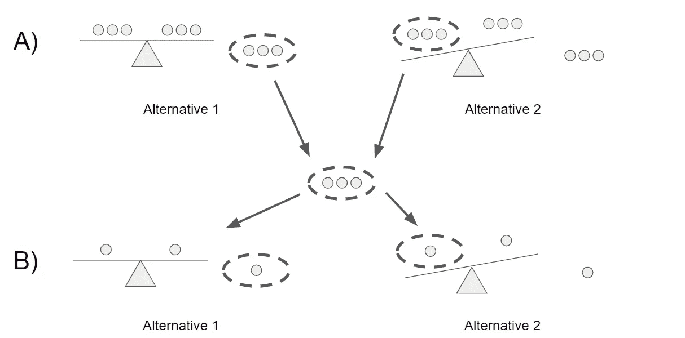****

****作者创建的图像****

****需要称重两次(见上文 A 和 B 部分):****

1.  ****你将九个弹珠分成三组，每组三个，称其中两组的重量。如果天平平衡(选择 1)，你知道重的弹球在第三组弹球中。否则，您将选择权重更大的组(选项 2)。****
2.  ****然后你将练习同样的步骤，但是你将有三组一个弹球，而不是三组三个。****

## ****问:改变基本会员费会对市场产生什么影响？****

****我对这个问题的答案没有 100%的把握，但我会尽力而为！****

****让我们举一个主要会员费上涨的例子——有两方参与，买方和卖方。****

****对于买家来说，提高会员费的影响最终取决于买家需求的价格弹性。如果价格弹性很高，那么给定的价格上涨将导致需求大幅下降，反之亦然。继续购买会员费的买家可能是亚马逊最忠诚和最活跃的客户——他们也可能更加重视 prime 产品。****

****卖家将受到打击，因为现在购买亚马逊一篮子产品的成本更高了。也就是说，一些产品将受到更严重的打击，而其他产品可能不会受到影响。亚马逊最忠实的顾客购买的高端产品可能不会受到太大影响，比如电子产品。****

## ****问:如果 iOS 上 70%的脸书用户使用 Instagram，但 Android 上只有 35%的脸书用户使用 Instagram，你会如何调查这种差异？****

****有许多可能的变量会导致这种差异，我将检查一下:****

*   ****iOS 和 Android 用户的人口统计数据可能会有很大差异。例如，根据 Hootsuite 的调查，43%的女性使用 Instagram，而男性只有 31%。如果 iOS 的女性用户比例明显高于 Android，那么这可以解释这种差异(或者至少是部分差异)。这也适用于年龄、种族、民族、地点等****
*   ****行为因素也会对差异产生影响。如果 iOS 用户比 Android 用户更频繁地使用手机，他们更有可能沉迷于 Instagram 和其他应用程序，而不是那些在手机上花费时间少得多的人。****
*   ****另一个需要考虑的因素是 Google Play 和 App Store 有什么不同。例如，如果 Android 用户有明显更多的应用程序(和社交媒体应用程序)可供选择，这可能会导致用户的更大稀释。****
*   ****最后，与 iOS 用户相比，用户体验的任何差异都会阻止 Android 用户使用 Instagram。如果这款应用对安卓用户来说比 iOS 用户更容易出错，他们就不太可能在这款应用上活跃。****

> ****查看更多脸书数据科学面试问题[点击这里](https://www.interviewquery.com/blog-facebook-data-science-interview-questions-and-solutions/)****

## ****问:每个用户的点赞数和在一个平台上花费的时间在增加，但用户总数在减少。它的根本原因是什么？****

****一般来说，你会想从面试官那里获得更多的信息，但是让我们假设这是他/她唯一愿意提供的信息。****

****关注每个用户的点赞数，有两个原因可以解释为什么这个数字会上升。第一个原因是，随着时间的推移，用户的平均参与度普遍提高了——这是有道理的，因为随着使用该平台成为一种习惯性做法，久而久之的活跃用户更有可能成为忠实用户。每个用户点赞数会增加的另一个原因是分母，即用户总数，在减少。假设停止使用该平台的用户是不活跃的用户，也就是参与度和点赞数低于平均水平的用户，这将增加每个用户的平均点赞数。****

****上面的解释也适用于在平台上花费的时间。随着时间的推移，活跃用户变得越来越活跃，而很少使用的用户变得不活跃。总体而言，参与度的增加超过了参与度很低的用户。****

****更进一步说，有可能“参与度低的用户”是脸书能够检测到的机器人。但随着时间的推移，脸书已经能够开发出识别和删除机器人的算法。如果以前有大量的机器人，这可能是这种现象的根本原因。****

## ****问:脸书发现赞数每年增长 10%，为什么会这样？****

****给定年份的总赞数是用户总数和每个用户的平均赞数的函数(我称之为参与度)。****

****用户总数增加的一些潜在原因如下:由于国际扩张而获得的用户以及随着年龄增长而注册脸书的年轻群体。****

****参与度增加的一些潜在原因是用户对应用程序的使用增加，用户变得越来越忠诚，新的特性和功能以及用户体验的改善。****

## ****问:如果我们测试产品 X，你会看什么标准来确定它是否成功？****

****决定产品成功的标准取决于商业模式和企业试图通过产品实现的目标。《精益分析》一书展示了一个很好的框架，人们可以用它来确定在给定场景中使用什么指标:****

****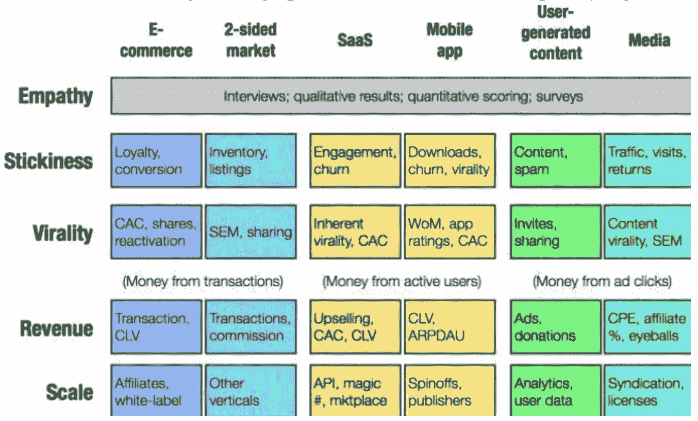****

****精益分析框架****

## ****问:如果一个项目经理说他们想把新闻订阅的广告数量增加一倍，你如何判断这是不是一个好主意？****

****您可以通过将用户分成两组来执行 A/B 测试:一组是广告数量正常的对照组，一组是广告数量翻倍的测试组。然后，您将选择指标来定义什么是“好主意”。例如，我们可以说零假设是广告数量翻倍会减少花在脸书上的时间，另一个假设是广告数量翻倍不会对花在脸书上的时间有任何影响。但是，您可以选择不同的指标，如活跃用户数或流失率。然后，您将进行测试，并确定拒绝或不拒绝 null 的测试的统计显著性。****

## ****问:什么是:提升、KPI、稳健性、模型拟合、实验设计、80/20 法则？****

******提升:**提升是针对随机选择目标模型测量的目标模型的性能的度量；换句话说，lift 告诉你你的模型在预测事物方面比没有模型时好多少。****

******KPI:** 代表关键绩效指标，这是一个可衡量的指标，用于确定公司实现其业务目标的情况。错误率。****

****健壮性:健壮性通常是指系统处理可变性并保持有效的能力。****

******模型拟合:**指模型拟合一组观察值的程度。****

******实验设计:**也称为 DOE，是在假设反映变量的条件下，旨在描述和解释信息变化的任何任务的设计。[4]本质上，实验的目的是根据一个或多个输入(独立变量)的变化来预测结果。****

******80/20 法则:**又称帕累托原理；80%的结果来自 20%的原因。80%的销售额来自 20%的顾客。****

## ****问:定义质量保证，六西格玛。****

******质量保证:**一项或一组活动，旨在通过减少错误和缺陷来维持期望的质量水平。****

******六西格玛:**一种特定类型的质量保证方法，由一套用于过程改进的技术和工具组成。六西格玛流程是指所有结果的 99.99966%没有缺陷。****

# ****参考****

****【1】[中心极限定理，定义及例题步骤简单](https://www.statisticshowto.datasciencecentral.com/probability-and-statistics/normal-distributions/central-limit-theorem-definition-examples/)，*如何统计*****

****[2] [权力，统计，*百科*](https://en.wikipedia.org/wiki/Power_(statistics))****

****[3] [人择原理，*百科*](https://en.wikipedia.org/wiki/Anthropic_principle)****

****[4] [实验设计，*百科*](https://en.wikipedia.org/wiki/Design_of_experiments)****

****[5] [根本原因分析，*百科*](https://en.wikipedia.org/wiki/Root_cause_analysis)****

# ****感谢阅读！****

> *******如果您喜欢这篇文章，请务必点击*** [***订阅此处***](https://terenceshin.medium.com/membership) ***千万不要错过另一篇关于数据科学指南、技巧和提示、生活经验等的文章！*******

****不确定接下来要读什么？我为你挑选了另一篇文章:****

****[](/over-100-data-scientist-interview-questions-and-answers-c5a66186769a) [## 超过 100 个数据科学家面试问题和答案！

### 来自亚马逊、谷歌、脸书、微软等公司的面试问题！

towardsdatascience.com](/over-100-data-scientist-interview-questions-and-answers-c5a66186769a) 

**或者你可以查看我的介质页面:**

[](https://terenceshin.medium.com/) [## 特伦斯·申—中号

### 阅读特伦斯·申在媒体上的文章。数据科学@ KOHO，SaturnCloud |理学硕士，MBA |…

terenceshin.medium.com](https://terenceshin.medium.com/) 

# 特伦斯·申

*   [***同道@农神***](https://saturncloud.io/?utm_source=TerenceShinMedium+&utm_medium=Medium&utm_campaign=TerenceShinFellow&utm_term=over-100-data-science-questions-and-answers)
*   [***订阅我的媒体***](https://terenceshin.medium.com/membership)
*   [***跟我上媒***](https://medium.com/@terenceshin)
*   [***在 LinkedIn 上关注我***](https://www.linkedin.com/in/terenceshin/)****