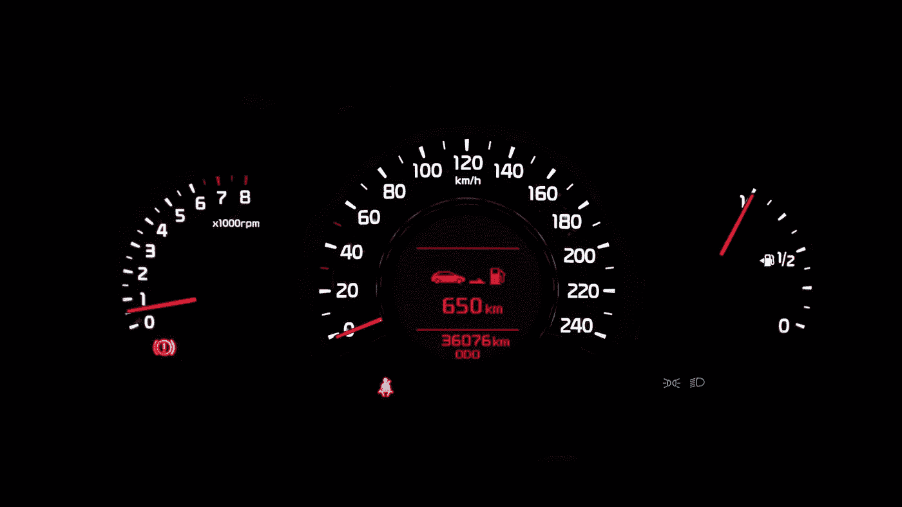
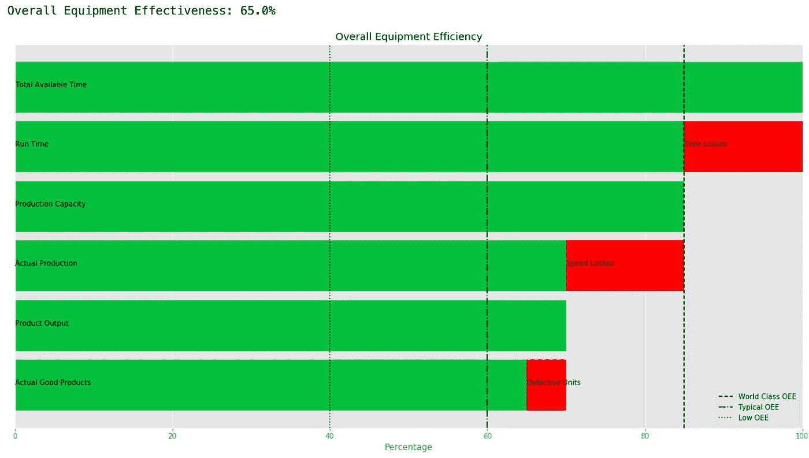

# 使用 Python 的整体设备效率

> 原文：<https://towardsdatascience.com/overall-equipment-effectiveness-with-python-fb34ccc6127b?source=collection_archive---------42----------------------->

## 面向工业工程师的 Python

## 测量制造业生产率

图片由 Marek Szturc 拍摄，可在 [Unsplash](https://unsplash.com/photos/ttqUsX1G3aE) 获得

# 整体设备效率

总体设备效率(OEE)是监控和提高工艺效率的一种行之有效的方法；它被认为是一种诊断工具，因为它不提供给定问题的解决方案。OEE 是一个关键的过程指标，用于衡量有效性以及与有效机器性能的偏差。它在全面生产维护(TPM)和精益计划中被广泛使用，用于定位低效率的来源和量化低效率的程度。

OEE 的目标是减少六大设备损失:设备故障、设置和调整、轻微停工、减速、启动报废和产品报废。这些损失分为三类:

*   **可用性**:考虑**可用性/时间损失**，包括所有与计划外停机(如设备故障、材料短缺)和计划内停机(如转换时间)相关的事件。可用性衡量机器或单元运行时间占总*理论*可用时间的比例。
*   **性能**:考虑**性能/速度损失**，包括所有阻止机器或单元以最大/最佳速度运行的因素(例如，慢循环、小停止)。性能衡量在给定的运行中生产的单位占可能生产的单位总数的比例。
*   **质量**:考虑**质量** **损失**，包括导致不符合客户质量标准和规格的缺陷单元的所有因素(如返工、报废、缺陷)。质量衡量无缺陷单位占生产的总单位的比例。

# OEE 计算

OEE 可以通过其三个组成部分相乘得到:

OEE 公式

它被分解为:

OEE 配方成分

其中:

*   *=总可用时间*
*   ****B***=运行时间*
*   ****C*** =生产能力*
*   ****D*** =实际产量*
*   ****E*** =产品产量(与实际产量相同)*
*   ****F*** =实际良品(即产品产量减去废品)*

*通过测量 OEE 和潜在损失，公司和组织可以深入了解如何系统地改进制造流程，从而消除浪费。*

# *OEE 作为基准和基线*

*作为基准，OEE 可用于将给定制造流程的性能与行业标准、相似(或相同)制造流程或同一制造流程不同班次的结果进行比较。*

*作为基线，OEE 可用于监控和跟踪给定制造流程的改进和废物减少。*

***什么被认为是“好的”OEE？***

*   ***100% —完美生产**:没有停机时间，没有废料，产品以最高速度生产*
*   ***85%** **—离散制造商的世界级水平**:这是一个合适的长期目标*
*   ***60% —典型的离散制造商**:表示有很大的改进空间*
*   ***40% —低**:常见于开始跟踪和改善制造绩效的公司*

*在下面的示例中，让我们获取一台机器的 OEE，该机器的总可用时间为 100 小时，但由于某些物料短缺和意外维护而运行了 85 小时，该机器的最大生产率为每小时 10 件，但在运行中生产了 700 件，其中 50 件有缺陷。让我们来看看 Python 代码！*

**

*综合效率图*

*在前一示例中分析的机器的 OEE 为 65%,根据之前解释的 OEE 基准，可以认为该机器的 OEE 高于标准值(即 60%),但仍低于世界级 OEE(即 85%)。*

*任何旨在提高 OEE 和减少特定流程浪费的公司或组织的真正挑战不是提高 OEE 本身，而是随着时间的推移保持 OEE。*

*把 OEE 想象成赛车的速度。尽管 *F1* 的一些赛车速度可以达到 220 英里/小时(约 354 公里/小时)或更高，但发动机在某些时候会出现故障(即车手无法让赛车长时间保持最大速度)。生产机器和设备也是如此:由于大多数情况下 100%的 OEE 是不可能维持的，因此 85%或以上的 OEE 仍然被认为是世界级的 OEE。*

# *总结想法*

*OEE 是生产设施中的运营经理跟踪给定制造过程性能的一个很好的工具。这是一个必须不断监控的指标，以确定其组成部分中的机会领域，从而在必要时制定和执行行动计划。*

*有效的生产计划和调度，以及准确的预防性维护计划，可以导致有效运行时间( *B* )的增加，这将提高 OEE 可用性部分。对操作人员进行充分的培训可以通过减少小停车来提高实际产量( *D* )，从而提高 OEE 性能。最后，在流程改进项目中使用精益和六西格玛工具可以减少最终结果的浪费和可变性( *F* )，从而提高 OEE 质量。*

*Python 代表了一种简单而有效的工具，只需几行代码就能计算出流程的 OEE。同样，它允许获得 OEE 图，以图形化方式显示其组成部分和损失，从而显示过程中的实际附加值百分比。*

**—**

**如果你觉得这篇文章有用，欢迎在*[*GitHub*](https://github.com/rsalaza4/Python-for-Industrial-Engineering/blob/master/Operations%20Management/OEE.py)*上下载我的个人代码。你也可以直接在 rsalaza4@binghamton.edu 给我发邮件，在*[*LinkedIn*](https://www.linkedin.com/in/roberto-salazar-reyna/)*上找到我。有兴趣了解工程领域的数据分析、数据科学和机器学习应用的更多信息吗？通过访问我的媒体* [*简介*](https://robertosalazarr.medium.com/) *来探索我以前的文章。感谢阅读。**

**——罗伯特**