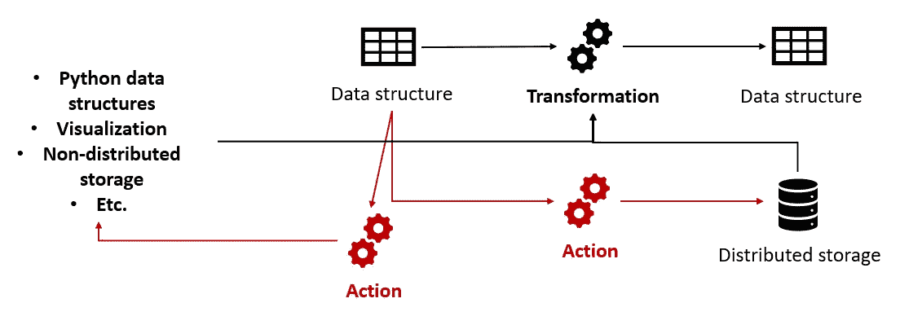
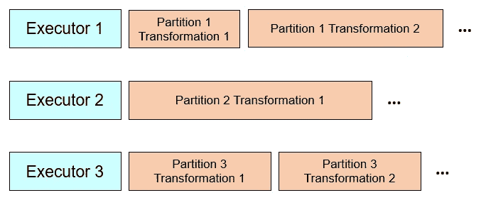
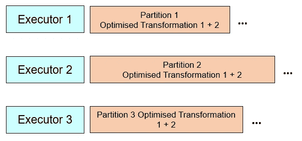

# 克服 Apache Spark 最大的痛点

> 原文：<https://towardsdatascience.com/overcoming-apache-sparks-biggest-pain-points-b374cebcf6a4?source=collection_archive---------7----------------------->

## [理解大数据](https://towardsdatascience.com/tagged/making-sense-of-big-data)

## 关于 Spark 最具挑战性的方面以及数据科学家和工程师如何克服它们的高级指南

卡姆拉奈季诺夫创作的*电脑照片—*[*www.freepik.com*](https://www.freepik.com/photos/computer)

大约 6 年前，我第一次使用 Apache Spark，当时，它是“大数据”分析领域的开端。毫无疑问，掌握 Spark 是任何想成为数据科学家或数据工程师的人的职责；毕竟，除此之外，如何利用海量数据和分布式 CPU 计算来创建尽可能最好的机器学习模型？

如果那时我可以看到 2020 年的未来，我可能会有点惊讶，很大一部分 ML/AI 从业者仍然不使用 Spark 或只将其用于数据工程，而不是机器学习。一部分自然是因为兴趣部分转移到面向 GPU，而不是面向 CPU 的机器学习技术，尤其是深度学习。但是对于图像和自然语言处理之外的大多数应用程序，面向 CPU 的技术的有用性是毋庸置疑的，令人惊讶的是许多数据科学家仍然严重依赖单机 ML 工具，如 Scikit-learn 以及 XGBoost 和 LightGBM 的非分布式版本。

**就我个人而言，我觉得这很遗憾，因为如果使用得当，Spark 对于任何处理数据的人来说都是一个非常强大的工具，可以帮助我们避免浪费时间来找出如何将大型数据集放入内存和处理器，并允许我们完全控制数据分析工作流，包括提取数据、生成模型以及将模型部署到生产和测试中。**

在 Apache Spark 上举办了研讨会并指导了几十名数据科学家和工程师，我能够理解用户在使用该工具时通常面临的最大困难，为什么会发生这些问题以及如何克服它们。这份由两部分组成的指南是为那些不仅想使用 Spark，而且想真正理解 Spark 的内部原理以解决复杂问题并生成高性能、稳定代码的人准备的。

*注意，我假设读者已经对 Spark 有了基本的了解，例如，什么是 Spark 驱动程序和执行器，数据集被划分为分区，什么是懒求值以及 Spark 的基本数据结构。*

# 第 1 部分:Spark 的分区和资源管理

## 挑战

与单处理器的 vanilla Python(例如 Pandas)不同，在 Pandas 中，内部处理的细节是一个“黑盒”,使用 Spark 执行分布式处理需要用户做出大量决策:

*   **每个数据集使用多少个分区**？
*   何时对数据集进行**重新分区**？
*   要用多少个 **Spark 执行器**，给它们分配多少内存和多少内核？
*   给**火花驱动器**分配多少内存？

让事情变得更复杂的是:

*   一个典型的处理流水线将涉及多个操作，每个操作可能会产生大小显著不同的数据集，这使得**不太可能找到适合整个数据流水线**的单一参数集。
*   **某些 Spark 操作会自动改变分区的数量**，这使得用户更难跟踪每个数据集使用了多少分区。例如，连接操作会将输出数据集的分区数量更改为在`spark.sql.shuffle.partitions`配置参数中指定的数量。

## 知道什么是重要的

关于分区和资源管理的每个决定的含义可以总结如下:

1.  如果我们为一个特定的表使用太多的分区，由于优化和并行化开销等多种原因，可能会导致资源的缓慢/浪费，因为**Spark 作为单个分区处理一定量的数据所需的 CPU 总量比作为多个分区处理要快得多**。即使在同一个物理服务器中处理分区时也是如此；
2.  如果我们为一个特定的表使用太少的分区，这可能会导致资源的缓慢/浪费，因为**许多执行器在处理完他们的分区** s 后将会“空闲”,等待其他分区完成处理；
3.  如果我们过于频繁地执行重新分区，可能会由于**改组而导致速度变慢/浪费资源，改组包括在执行器之间重新安排分区**。洗牌是一种高成本的操作，无论是从处理还是内存方面来说，它都严重限制了我们稍后将讨论的 Spark 的处理优化；
4.  如果我们没有使用足够的重新分区，可能会由于不平衡分区导致的执行器过载和空闲而导致速度变慢/浪费资源；即**非常大的分区可能会导致执行器在内核和内存方面资源不足，并使其他执行器在等待分区处理时处于空闲状态**；
5.  如果我们在每个执行器上使用太多的内核，由于并行化水平低于预期，可能会导致速度变慢/资源浪费。当执行器控制多个内核时，它会尝试创建多个线程来同时处理多个分区，从而允许线程共享内存中的变量。然而，**这种并行化并不完美，可能会受到 I/O 操作**的限制(例如写入 HDFS 或其他分布式数据存储)。通常，即使用户为每个执行器分配了多个内核，也会使用单个内核。此外，由于一个执行器只能在一个物理服务器上运行，因此不可能在执行器中分配用户请求的所有内核。用户可以通过 Spark UI 监控执行器有效使用的内核数量；
6.  如果我们在每个执行器上使用的内核太少，由于创建每个执行器所需的开销，可能会导致速度变慢/资源浪费。由于 Spark 知道同一个执行器中的内核肯定在同一个物理服务器中，因此它可以优化处理，使它们之间的并行化开销比跨执行器的并行化开销小得多。

为了处理流水线的多个步骤中分区和资源需求的变化，以及跟踪每个中间数据集的分区数量的困难，有两种策略可以单独使用或组合使用:

*   当计算资源在用户池中共享或用户同时运行多个作业时，**通过`spark.dynamicAllocation.maxExecutors`和`spark.dynamicAllocation.enabled`参数激活执行器**的动态分配可以大大减少 Spark 计算资源的闲置；
*   **将一个大型处理任务分割成多个较小的任务**，每个任务的数据集大小变化较小，这使我们能够更好地调整配置参数和每个步骤的分区数量。对于每一个更小的任务，我们也可以适当地设置参数`spark.default.parallelism`和`spark.sql.shuffle.partitions`，以避免不断的重新分区。像 Airflow 这样的管道工具对于设置和部署由较小作业组成的复杂数据任务非常有用。

# 第 2 部分:Spark 的不变性、惰性评估和执行计划优化

## 挑战

Spark 用户首先学到的两件事是不变性和惰性求值的概念。**不变性**意味着 Spark 数据集不能被修改；对数据集的每个操作都会创建一个新的数据集。**惰性评估**基于数据集上有两种操作的事实:

*   **转换**产生一个新的 Spark 数据集作为输出(Spark 具有不变性，因此它永远不能修改现有的数据集，只能创建新的数据集)；
*   **动作**将 Spark 数据集作为输入，但会产生 Spark 数据集以外的东西，比如写入存储、创建局部(非 Spark)变量或在用户 UI 中显示某些东西。

转换与行动说明(图片由作者提供)

当流程调用转换操作时，这会导致创建一个**不可变的、内存中的“执行计划”**，该计划描述了如何基于其他数据集生成数据集。但是，此时不会生成实际数据。只有当一个动作操作被调用时，Spark **才会评估输入的执行计划**，以生成计算输出所需的数据。因为输入本身可能有依赖于其他数据集的执行计划，所以这些计划被递归地评估，并且该过程继续。

如果在某个时刻触发了另一个动作，要求再次重新创建相同的中间数据集，则该过程重复进行；重新创建执行计划，并且需要再次执行执行计划的所有步骤。为了防止这种情况发生，用户可以**“保存”中间数据集**。当通过触发执行计划创建“持久化”数据集时，数据集将被保存到分布式内存中(或一些配置的分布式存储，如果内存中没有足够的空间)，它将保留在那里，直到手动“取消持久化”或直到 Spark 的垃圾收集器识别出数据集“超出范围”(不能由运行的代码访问)。

许多 Spark 用户没有深入思考不变性和惰性评估的概念及其实际后果，认为知道我们应该**“持久化”一个将被多次使用的中间数据集**就足够了，防止重复计算不止一个操作需要相同的中间数据集。

然而，事实是，很好地利用不变性和懒惰评估远不止于此。事实上，它们与一个鲜为人知的方面密切相关，即通过 Spark Catalyst 完成的**执行计划优化**。不深入理解这些概念很容易导致缓慢、不稳定的 Spark 处理，以及用户在调试和解密神秘的错误消息上浪费大量时间。

## 知道什么是重要的

*   ***Spark 在分区级别执行转换，而不是数据集级别***

我们可能会有一个错误的印象，即调用一个操作会导致该操作之前的一系列转换被逐个执行，每个步骤都会生成一个中间数据集。如果是这样的话，如果数据帧 2 是通过转换数据帧 1 生成的，Spark 将首先创建数据帧 1，然后创建数据帧 2，就像我们使用 Pandas 时的情况一样。

但事情没那么简单。当一个动作被调用时，所有必要的执行计划实际上被合并成一个执行计划，除了洗牌的情况，每个分区的处理都是独立完成的。这意味着**转换是在分区级别完成的，而不是数据集级别**。因此，对于一个分区，Spark 可能仍在生成数据帧 1，而对于另一个分区，Spark 可能已经在从数据帧 1 生成数据帧 2。例如，我们可能有如下情况:

(图片由作者提供)

从性能角度来看，这是一种强大的机制，因为它**防止处理器和内存浪费**，即在移动到下一个中间数据集之前等待整个中间数据集生成。分区级转换的另一个优点是，我们将在下一节看到，它允许 Spark 更好地优化处理。

*   ***Spark 优化执行计划，执行计划越大，优化效果越好***

**Spark 催化剂**无疑是 Spark 最有价值的特性之一。，因为实现高效的分布式处理比实现高效的单核或单内存处理要复杂得多。本质上，**Catalyst 将优化执行计划以最大化分布式性能。**例如，在 Spark 中，一次在同一行中执行多个操作，然后移动到下一行，以此类推，比在同一列中执行多个操作，然后移动到下一列要快得多，因此执行计划会相应地得到优化。

需要考虑的一个重要因素是**单个大型执行计划比多个小型执行计划有更大的优化潜力**。类似地，通过利用转换是在分区级别而不是数据集级别完成的这一事实，Spark 可以为相同的分区组合多个转换，并优化它们以获得更好的性能。以我们之前的例子为例，优化后的结果如下所示:

(图片由作者提供)

*   ***Spark 的惰性求值和分区级转换使得调试更加复杂***

然而，从开发/调试的角度来看，如果发生了错误或者出现了性能瓶颈，惰性评估与分区级转换相结合，会使用户很难准确地找出是哪个处理步骤导致了错误或瓶颈。毕竟，Spark UI 只会告诉用户哪个触发操作导致了错误或瓶颈，而不是实际的转换。

解决方案是**“强制”Spark 每次**生成一个完整的中间数据集，方法是插入多个`persist()`语句，后跟动作，如`count()`或`take()`。然而，由于前面提到的处理器/内存浪费和缺乏优化，这些代码的效率非常低，所以最好只在开发目的(而不是生产)和临时的基础上使用这种解决方案。

*   ***太大/太多的执行计划也会成为问题***

我观察到的一件事是，执行计划并不总是与操作的数量成线性关系，有时是多项式或指数关系。由于执行计划存储在 Spark 驱动程序的内存中(与存储在 Spark 执行器内存中的持久化对象不同)，这可能会导致 Spark**耗尽驱动程序内存，或者由于 Spark Catalyst 的优化**而变得极其缓慢。这有点讽刺，因为 Catalyst 应该在部署到 Spark 执行器时使代码运行得更快；但是在火花驱动器中运行的催化剂会成为处理本身的瓶颈。

对于具有数千列的数据帧来说尤其如此，在这种情况下，我们需要跨所有列执行多个操作。Spark 的不变性使情况变得更糟，因为它不断地有新的执行者计划实例被 Catalyst 创建和评估。

坚持可能是处理这个问题的有效策略。它将消除在生成持久化的中间数据集之前创建执行器计划的新实例的需要，以及防止 Catalyst 在创建数据集之前试图优化执行计划。

然而，对于复杂、长的管道，执行计划变得非常庞大，甚至**不频繁的持久化也不能防止由优化或驱动程序耗尽内存导致的缓慢**，因为持久化可以防止大型执行计划的多个实例化，但不能首先防止它们的创建。此外，**过多的持久化本身也会成为一个问题**，因为它会占用分布式内存和存储空间。虽然经常尝试去持久化和/或尝试构建代码以最大化垃圾收集肯定有所帮助，但这是一项艰巨的工程任务，并不能总是防止资源耗尽。

一种解决方案是名为**检查点**的技术，它包括从用户定义的适当存储系统中保存和加载中间结果。当有效使用时，检查点既可以防止执行计划规模的巨大增长，又可以防止 Spark 的分布式资源与持久化对象发生冲突。

另一个解决方案，已经提到过，是**将一个大的处理任务分割成更小的任务**。这样，执行计划就不会变得太大，也不需要担心驱动程序或执行程序内存中的剩余对象。

# 结论

当然，关于 Spark，本文还会涉及更多内容，例如，如何构建代码以提高 Catalyst 优化的质量。但是我希望这篇文章可以帮助一些人克服 Spark 的困难，并利用它在数据工程和机器学习方面的非凡能力和多功能性。虽然 Spark 仍然是一个具有挑战性的工具，但我可以诚实地证明，在我使用它的 6 年时间里，Databricks 和开源社区如何在用户友好性和灵活性方面大大改进了它。

如果你想学习如何使用 Spark 和 Apache Hadoop YARN 并行运行多个分布式作业，比如模型训练的多个实例，[查看我的另一篇文章](/how-to-train-multiple-machine-learning-models-and-run-other-data-tasks-in-parallel-by-combining-2fa9670dd579)。