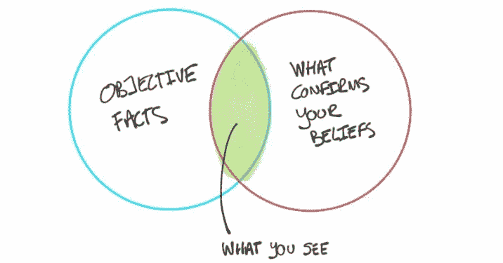
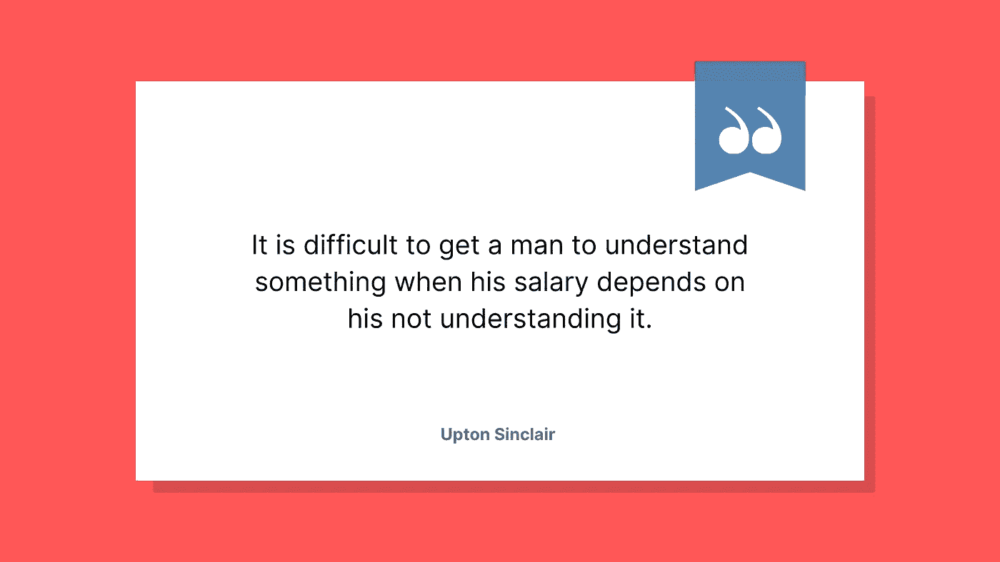
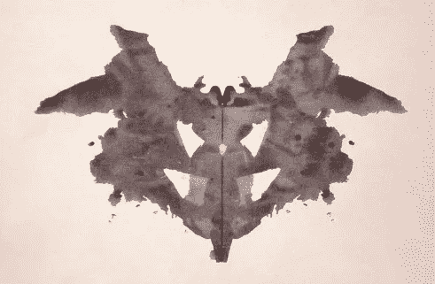

# 克服确认偏差

> 原文：<https://towardsdatascience.com/overcoming-confirmation-bias-during-covid-19-51a64205eceb?source=collection_archive---------5----------------------->

## 为什么确认偏差是数据科学的克星，以及如何与之对抗

下面是文章的音频版本，由作者为你朗读。

让我们来谈谈一种令人讨厌的心理效应，这种效应可能会破坏你有效应对每天涌入的信息的能力: [**确认偏差**](http://bit.ly/quaesita_inspired) **。**

> 让你陷入麻烦的并不是你不知道的事情。你确定的事情并不是这样的。马克·吐温。

## 这是什么？

*“****确认偏差*** *是以确认或强化个人先前信念的方式搜索、解释、偏好和回忆信息的倾向。”—维基百科*

## 是啊，但这是什么？

这个:

保罗 J 插图，经许可使用。

如果你热衷于研究心理学，让我们将确认偏差与其他一些现象区分开来:

*   [***确认偏差***](https://en.wikipedia.org/wiki/Confirmation_bias)***:***你的**已有观点**改变了你对信息的感知方式。
*   [***一厢情愿的盲目***](https://fs.blog/2015/12/dan-ariely-on-why-and-how-we-cheat/)***:***你的**利己主义**改变了你对信息的感知方式，尤其是在道德决策的背景下。(不要和 [*故意视而不见*](https://en.wikipedia.org/wiki/Willful_blindness) 混淆)，这是一个来自法律的术语。)
*   *[***滤泡***](https://en.wikipedia.org/wiki/Filter_bubble)*指智能隔离在线回音室。如果一种算法被设计成对你喜欢的内容进行优先排序，并且你倾向于喜欢来自已经同意你的人的内容，那么你就不太可能接触到可能改变你想法的内容。**

**我不会用如何从回音室里爬出来的建议来烦你——你已经全都听过了。"*某事某事……寻求……某事……与你意见相左的人的智力训练。"*对吧？没错。**

****

**图片由作者提供。**

**一厢情愿的盲目是一个棘手的问题，因为这是一个相对较新的理论，没有太多关于如何克服它的研究。**

****

**我最喜欢引用的关于一厢情愿的盲目的话，在我们称之为一厢情愿的盲目之前。**

**不过，确认偏差自 20 世纪 60 年代以来就一直存在，所以让我们来关注一下这个问题。**

> **过滤泡沫是关于扭曲的信息，而确认偏差是关于扭曲的感知。**

****确认偏差**不是指你的社交媒体反馈与自身过于一致的情况。这要微妙得多:即使你接触到与你的观点不一致的信息，你也可能不会接受。你可能会记错。你可能会找到忽略它的理由。你将继续挖掘，直到你看到的数字是你想看到的。头脑就是那样滑稽。**

> **确认偏差意味着我们都可以看到同一个数字，并对它有不同的理解。事实不再仅仅是事实。**

**换句话说，[确认偏差](http://bit.ly/quaesita_inspired)是[数据科学](http://bit.ly/quaesita_datasci)的死对头，因为它意味着一个事实不再仅仅是一个事实，无论你投入多少数学和科学去得到它。你和我可以看着同一个数字，然后[感知到不同的](http://bit.ly/quaesita_inkblot)。努力让自己接触更好的信息来源并不足以解决一个始于你眼前的问题。**

> **确认偏差是数据科学的宿敌。**

**在信任自己的大脑时，你应该小心。(那个叛徒！)如果你从一个强烈的无知的观点开始，去搜寻信息，你很可能在完成后以同样的观点结束。何必呢？除非你[预先对抗确认偏见](http://bit.ly/quaesita_inspired)并且[按照正确的顺序做事](http://bit.ly/quaesita_default)，否则你对数据的尝试注定是浪费时间。**

****

**有兴趣了解更多关于扭曲的数据感知吗？见我关于 [apophenia](http://bit.ly/quaesita_inkblot) 的文章。图片:[维基百科](https://en.wikipedia.org/wiki/Rorschach_test#/media/File:Rorschach_blot_01.jpg)**

# **确认偏差和新冠肺炎**

**一言以蔽之:如果你对新冠肺炎有强烈的看法，然后你去寻找支持它们的证据，你会认为你看到了……不管那些看法有多古怪。你也将更难吸收指向相反方向的证据。**

> **如果你感到害怕，你去寻找让你感觉更好的信息，确认偏见反而会让你感觉更糟。**

**更糟糕的是，每当你感到恐慌，并试图用一个愉快放松的互联网会话来抚慰自己时，你很可能会找到更多恐慌的理由。**

> **快速恐慌不是一种美德——通常会适得其反。**

**虽然恐慌会让你肾上腺素激增— *“确认偏差:一个奇怪的技巧来提高你的家庭健身计划”—但它不会帮助你做出更好的决定。这通常会适得其反，削弱你清晰思考的能力，对你的情绪或应对压力的能力没有任何好处。无论你的处境有多糟糕，冷静的现实主义会比恐慌更好地为你服务。***

# **如何对抗确认偏差**

**结果是，一个强有力的开始意见会搞乱你的决策和你的心情。幸运的是，有四种简单的方法可以对抗确认偏见:**

*   ****不要固执己见。****
*   ****强调决定，而不是意见。****
*   **专注于你能控制的事情。**
*   ****改变获取信息的顺序。****

****

**图片由作者提供。**

## ****保持你的观点宽松****

**这一条可能说起来容易做起来难，尤其是如果你已经在头条新闻中煎熬了一段时间，但是保持开放的心态，不要太认真地对待你的观点，这是一个很好的智力练习，即使它们是基于大量的数据(嗨， [Bayesians](https://en.wikipedia.org/wiki/Bayesian_statistics) )。**

**这里还有一个值得了解的偏见:[过度自信偏见](https://en.wikipedia.org/wiki/Overconfidence_effect)。*(***一种根深蒂固的偏见，在这种偏见中，一个人对自己判断的主观信心确实大于这些判断的客观准确性，尤其是在信心相对较高的时候。”—维基百科)*是啊，但是是什么呢？你可以通过养成不严格坚持自己观点的习惯来减轻压力。***

> **松散地持有你的观点会减少他们扭曲你的感知的能力。**

**我所知道的最好的决策者是适应性强的。他们有接受新信息并承认错误的技能。在你跑去钦佩那些坚定不移地做出判断的领导者之前(坚定而忠诚，对吗？)，花点时间从心理学家的角度来看他们:他们受到确认偏见的阻碍，无法恰当地处理新信息(或者他们是出色的演员)。**

**如果你渴望抑制自己的自大倾向，那就从科学家的书里取一页吧。有没有注意到应用科学的研究论文充满了警告，谦逊地提醒读者那些可能使他们的结论无效的未知情况？这是一个不错的目标标准。**

## ****强调决策，而不是意见****

**在我看来，呃，放松你的观点对你的情绪和决定的控制的最好方法是养成先做决定的习惯。如果一个观点在森林里消失了，并且没有任何行动受到它的影响，这个观点重要吗？**

> **通过我们的决定——我们的行动——我们影响着周围的世界。**

**想象一下，我相信[尼斯湖水怪](https://en.wikipedia.org/wiki/Loch_Ness_Monster)是真的。如果我的信念不以任何方式影响我的决定——与世界的互动，这有什么害处呢？另一方面，如果我的信念确实影响了我的行为(有意识地或下意识地)，那么也许我应该在它会影响的行为的背景下评估我的观点。这涉及到在发表意见之前思考行动(按重要性顺序)*，然后作为第二步形成测试假设。我的文章是这里的。***

****

**图片由作者提供。**

> ***“这些信息会让我采取不同的行动吗？”***

**每当你发现自己收到新信息时，记得问问自己:*“这是可操作的吗？”*如果是，它会影响您的哪些决定？**

## ****关注你能控制的事情****

**谈到新冠肺炎，我们许多人已经发现我们的决策受到新规则的约束。如果我们不花一点时间去认识到我们一直担心的一些决定已经不再摆在桌面上，我们会在没有作用的意见上浪费不必要的精力。**

**难道你不想专注于对那些在你控制之下的事情做出决定和计划吗？(或者把那段时间用在给你带来快乐的活动上？)**

**例如，在 2020 年初的纽约(*是的，我知道*)我这个月不再有去剧院的选择。无论我对在拥挤的空间里会如何影响我的健康有什么看法——这是我从阅读[世卫组织](https://www.who.int/)的出版物中粗略得出的看法——我都无法将这些信息作为输入做出决定。**

> **这个月，即使我想，我也不再有在人群中的选择。这个决定不在讨论范围内。**

**也许我最好将我的认知努力转移到其他地方，转向对我来说*已经摆在桌面上的*决定，例如是否远程帮助(是的)，是否在线订购卫生纸(不，这是我所有教科书的目的)，以及是否投入大量精力拍摄关于[数据科学](http://bit.ly/quaesita_datasci)的家庭视频系列(也许不是，除非我已经放在 YouTube 上的[视频](http://bit.ly/quaesita_stc001)获得更多流量)。**

****

**埃德温·胡珀在 [Unsplash](https://unsplash.com?utm_source=medium&utm_medium=referral) 上拍摄的照片**

**远离那些你无法影响的事情并不是对无知的呼唤。比较下列使用你精神能量的方法:**

1.  ***担心你的市长正在努力应对的一个决定，同时努力思考如果你处在他们的位置，你会怎么做。***
2.  ***从你所做的决定的角度来考察你的市长的决策技巧(例如，投票支持/反对市长连任)。***
3.  **考虑你应该采取哪些行动——如果有的话——来回应(或准备)你的市长正在选择的每一个可能的选项。**
4.  **决定你是否应该尝试运用你自己的影响力/努力去影响市长的决定或其潜在后果。**

**其中，(2)-(4)是更有用的观点(除非你的兴趣是学术)，而(1)是对决策学生的良好实践(*)“如果我是负责人，我会如何做出这个决定，我能在这里学到什么技能？”但对于情绪失控的人来说，这并不是一个有效的利用空间的方法。***

> **区别不在于你寻找什么信息。这是你寻求它的方式。作为奖励，你可能会发现你能控制的比你意识到的要多。**

**请注意，这种差异不是消息灵通与否的问题。区别在于你是否明确地将你的精力集中在该由你做出(或影响)的决定上。纠结于别人的决定很可能会让你感到无能为力，被模糊的信息淹没(尤其是当负责决策的人比你掌握更多信息的时候)。如果你发现自己在压力大的时候采取了(1)这样的观点，转向(2)、(3)或(4)可能会给你带来一些缓解。作为奖励，你可能会发现你能控制的比你意识到的要多。**

## ****改变获取信息的顺序****

**既然你已经把注意力集中在行动和决定上了，是时候揭示大笑话了:**消除确认偏见的最有效方法是在你寻找信息之前*计划好你的决策。*****

> **在你看到球落在哪里后，用一种防止你移动球门柱的方式来框定你的决策。**

**换句话说，重要的是，在你看到球落地的地方后，要以一种防止你移动球门柱的方式来框定你的决策。好奇想了解更多？我有一篇一般的[文章](http://bit.ly/quaesita_inspired)加一篇[循序渐进的新冠肺炎决策指南](http://bit.ly/quaesita_covid)帮你出。**

# **现在是完全不同的东西…**

**感谢阅读！如果你在这里玩得开心，并且对人工智能感兴趣，这里有一个初学者友好的介绍供你娱乐:**

**在这里欣赏整个课程播放列表:[bit.ly/machinefriend](http://bit.ly/machinefriend)**

# **喜欢作者？与凯西·科兹尔科夫联系**

**让我们做朋友吧！你可以在 [Twitter](https://twitter.com/quaesita) 、 [YouTube](https://www.youtube.com/channel/UCbOX--VOebPe-MMRkatFRxw) 、 [Substack](http://decision.substack.com) 和 [LinkedIn](https://www.linkedin.com/in/kozyrkov/) 上找到我。有兴趣让我在你的活动上发言吗？使用此表格取得联系。**