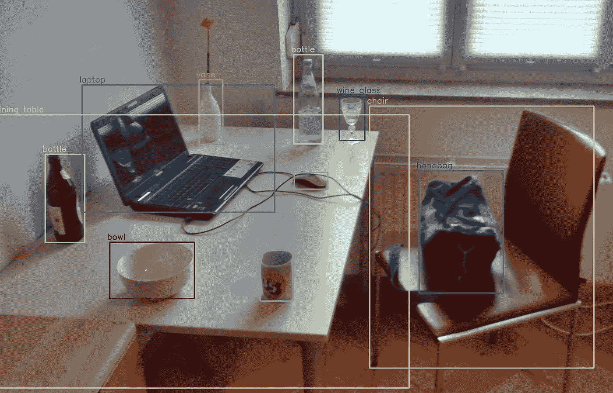
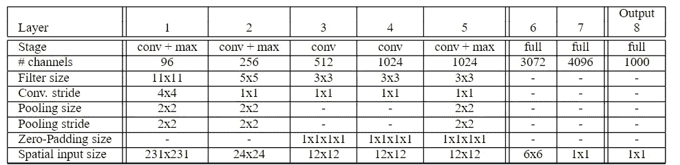
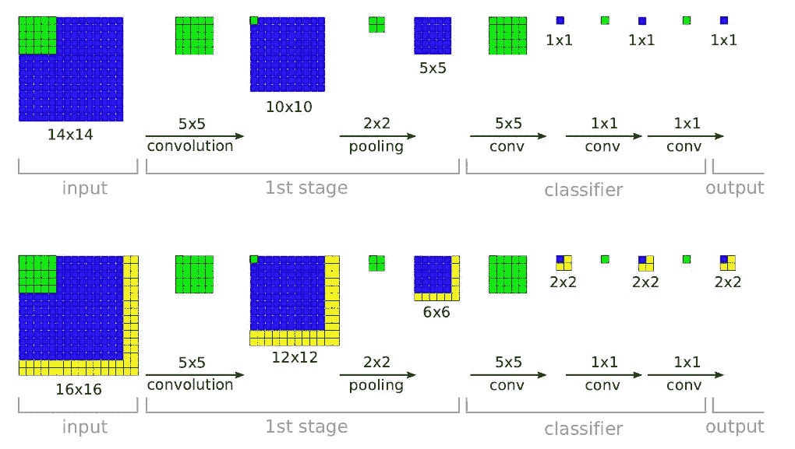
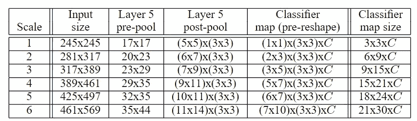
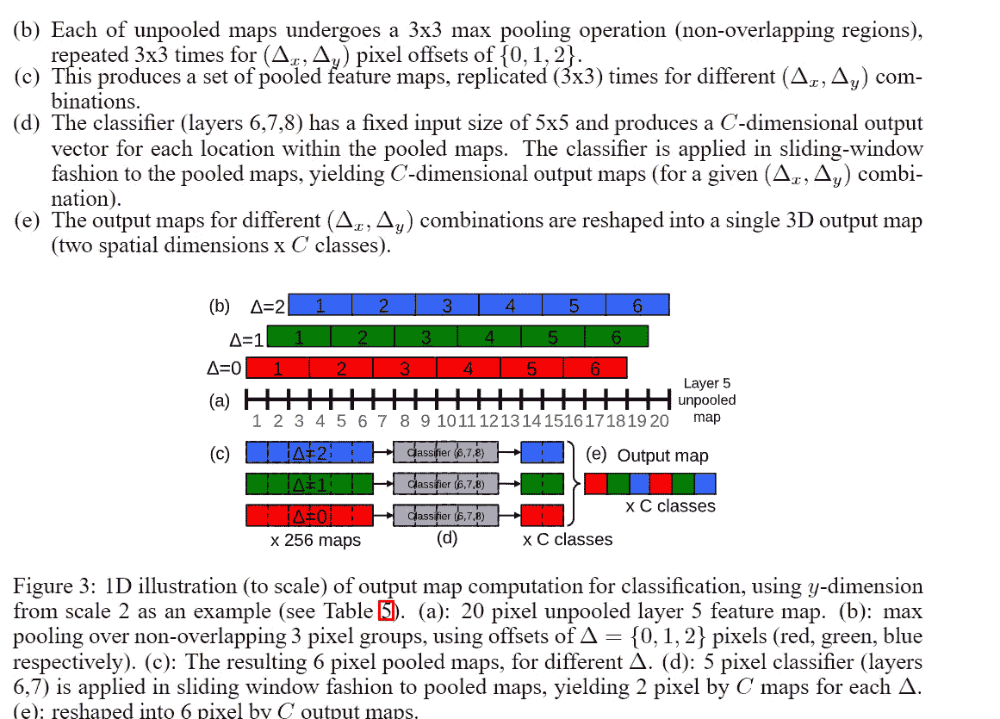
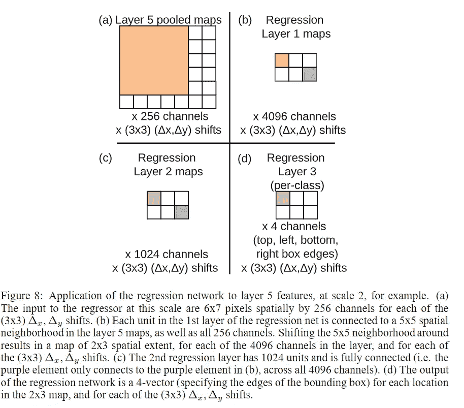
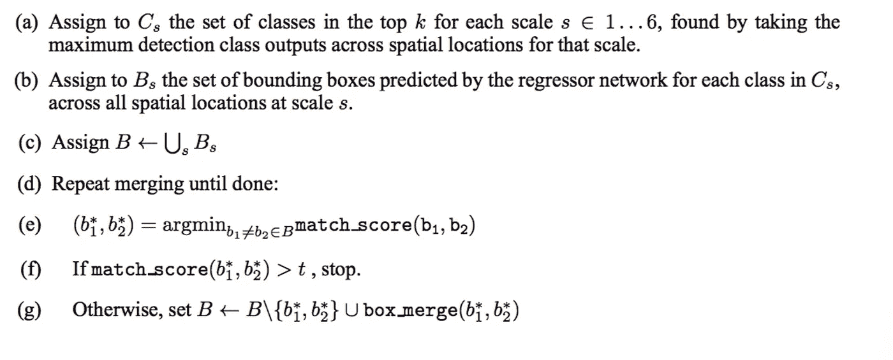

# 过量饮食评论[1312.6229]

> 原文：<https://towardsdatascience.com/overfeat-review-1312-6229-4fd925f3739f?source=collection_archive---------29----------------------->

## 过量进食的理论综述

演职员表:[https://en.wikipedia.org/wiki/Object_detection](https://en.wikipedia.org/wiki/Object_detection)

我已经计划阅读主要的物体探测论文(虽然我已经粗略地阅读了它们中的大部分，但我会详细地阅读它们，好到足以写一篇关于它们的博客)。这些论文与基于深度学习的对象检测相关。随时给建议或询问疑惑会尽我所能帮助大家。我将在下面写下每篇论文的 arxiv 代码，并在下面给出博客(我写的时候会不断更新)和他们论文的链接。任何从这个领域开始的人都可以跳过许多这样的论文。当我读完所有的论文后，我还会写下它们的优先级/重要性(根据理解主题的必要性)。
我写这篇博客是考虑到和我相似并且仍在学习的读者。万一我犯了任何错误(我将通过从各种来源(包括博客、代码和视频)深入理解论文来尽量减少错误)，任何人都可以随意地在博客上强调它或添加评论。我已经提到了我将在博客末尾涉及的论文列表。

我们开始吧:)

Overfeat 论文探讨了三个计算机视觉任务分类，定位，检测分别按照难度递增的顺序。每个任务都是下一个任务的子任务。所有任务都使用一个框架和一个共享的功能学习库来解决。

## 分类

用于分类的架构类似于 alexnet，但有一些改进。作者准备了两种不同的架构:快速和准确。与 alexnet 架构的不同之处包括没有对比度归一化、汇集区域不重叠、由于步幅较小而具有较大的第一层和第二层特征地图。我将添加显示快速和精确架构的表格。训练和推理步骤的执行是不同的。我在这里解释训练步骤，后面解释推理步骤**。**分类器的训练是在 221*221 大小的单一尺度上完成的。通过首先将图像大小调整为 256，然后裁剪为 221，提取了 5 个随机裁剪及其水平翻转。我不会详细讨论训练的细节，比如学习速度，体重下降等等。该架构可以在图 1 中看到。

图一。过度饮食建筑

## ConvNets 和滑动窗口效率(在 convnets 内部应用滑动窗口)

我们知道滑动窗口方法可以改善分类和定位的结果，但是增加了许多倍的计算。ConvNets 在应用滑动窗口技术方面具有内在的效率，因为它们共享重叠区域的共同计算(大部分将重叠)。我将在 CNN 的内部解释这个滑动窗口是如何工作的。拿这个图做参考。

图二。

我希望你意识到感受野(即使你在这篇博客之后没有阅读它，这是一个重要的概念)。上图分为两个子部分，先考虑第一部分。应用第一次卷积后，输出变为 10*10(如果计算卷积运算的输出尺寸，请阅读[此](https://www.quora.com/How-can-I-calculate-the-size-of-output-of-convolutional-layer))。)之后是最大池层，类似地在后面的层中给出 1*1 的最终输出。这里我们可以直观地说，最终的 1*1 编码了 14*14 输入的信息(基本上这是一个感受域)。没有跳转到第二部分，过滤器大小没有变化，唯一的变化是输入大小(16*16)。当第一个卷积被应用，随后是最大池时，输出大小变成 6*6，在先前的情况下是 5*5，现在当具有 5*5 滤波器大小的卷积将被应用时，输出大小将是 2*2 而不是 1*1。如果您看到 2*2 输出中的蓝点，它会对输入中蓝色部分的所有信息进行编码，而不会看到黄色区域。类似地，2*2 输出的第二个点((输出矩阵上的(0，1)位置)将永远看不到输入的前两列和底部两行(我们的模型的感受野是 14*14，因此输入大小的增加线性地增加了输出大小)。

## 多尺度分类

在推理时，为了提高分类精度，他们使用了多视图投票。他们使用培训中讨论的类似策略生成 10 幅不同的图像，并对预测进行平均。但这忽略了图像中的许多区域(因为与滑动窗口方法不同，我们只对每幅图像使用 5 次裁剪)。因此，他们采用了一种更好的方法，解释如下:

他们使用了 6 种不同的输入比例，从而生成了不同大小的第 5 层要素地图(这些大小请参考下表)。

图三。多尺度方法的空间维度

在这里我们可以看到不同尺度下模型输入大小的变化是(36，72)。这里的 36 值(二次采样率)类似于我们在上一节中观察到的 2 像素移动。第 5 层(上表中的预池)的输出将因规模而异。应用 3*3 最大池。考虑输出形状为 17*17 的第一个比例。这里，如果在没有填充的情况下应用 max-pooling(3*3 ),则生成的输出大小将为 5*5。在这里，我们可以观察到最大池的输出没有来自预池化特征地图的最后两行和列的任何输入。由于 CNN 具有本地连接性，在原始图像的情况下，这两个列和行变成大约 30。为了解决这个问题，考虑到起始像素位置为(x{0，1，2}，y{0，1，2}，总共应用了 9 次最大池。因此，现在输出将是 3*3 的形状(前面提到的 9 倍是 2d 的行和列)。作者在图 4 中解释了这一点。

图 4。

从上一段继续。因此，我们得到的总输出是(5*5)*(3*3)的形状。应用 5×5 卷积来获得最终的分类器图。它的形状是(1*1)*(3*3)*C，这里 C 是因为这是我们得到预测的最后一步。对于其他比例，最大池化后生成的输出地图会有所不同。对于其他规模，它将是类似的，我想你现在可以计算我们如何得到输出尺寸。现在，通过首先在每个尺度上取空间最大值(3*3*C 或 6*9*C 中的最大值)来计算最终输出。然后对所有尺度的输出进行平均，最终得到每个图像的一个类输出。

我们完成了分类，我们的主要任务是对象检测，我们甚至还没有开始。

别担心，现在没那么久了。我们几乎涵盖了所有的理论。

## 本地化

分类训练网络由回归网络代替分类图层，并对其进行训练以预测每个空间位置和比例的边界框。回归网络从第 5 层获取合并的要素地图，随后是大小为 4096 和 1024 的两个 FC 层。最终输出有 4 个单元(见图 5。).特征提取层(前 5 层)的权重是固定的，并且使用 l2 损失来训练模型。训练是在多个尺度上进行的(不同于在单个尺度上训练的分类网络，在多个尺度上仅生成预测)。这将使预测跨尺度正确匹配，并增加合并预测的可信度。

图 5

为了生成对象边界框预测，我们跨所有位置和规模同时运行分类器和回归器网络。由于这些图层共享相同的要素提取图层，因此在计算分类网络后，只需重新计算最终回归图层。

由于模型将预测多个框(在本地化的情况下将有一个框)，我们需要一些策略来消除所有的坏预测。应用了一个贪婪的合并策略，如图 6 所示(你可以跳过它，因为我没有看到任何其他论文使用这种策略，NMS(将在未来的博客中讨论)使用得更频繁)。

图 6

这里，match_score 被计算为 b1 和 b2 的中心之间的距离之和。box_merge 计算边界框坐标的平均值。

## 侦查

在检测的情况下，与定位任务的主要区别在于当不存在物体时，需要预测背景类别。因此，我们现在从定位网络获得的先前属于某个类别的盒子现在属于背景，因此我们可以移除这些预测，并且仅获得在哪个类别中被有把握地预测的预测。

过量论文总结到此结束。如果我做错了请重点指出，提出疑问作为评论。

**参考文献:**

1.  https://arxiv.org/pdf/1312.6229
2.  [https://medium . com/coin monks/review-of-over feat-winner-of-ils vrc-2013-localization-task-object-detection-a6f8b 9044754](https://medium.com/coinmonks/review-of-overfeat-winner-of-ilsvrc-2013-localization-task-object-detection-a6f8b9044754)
3.  [https://www.youtube.com/watch?v=JKTzkcaWfuk](https://www.youtube.com/watch?v=JKTzkcaWfuk)
4.  [https://www.youtube.com/watch?v=3U-bZgKFS7g&t = 70s](https://www.youtube.com/watch?v=3U-bZgKFS7g&t=70s)
5.  [Alexnet](https://papers.nips.cc/paper/4824-imagenet-classification-with-deep-convolutional-neural-networks.pdf)
6.  感受野:[https://medium . com/ml review/a-guide-to-receptive-field-algorithm-for-卷积神经网络-e0f514068807](https://medium.com/mlreview/a-guide-to-receptive-field-arithmetic-for-convolutional-neural-networks-e0f514068807)

## 论文列表:

1.  [OverFeat:使用卷积网络的综合识别、定位和检测](https://arxiv.org/pdf/1312.6229.pdf)。←你完成了这篇博客。
2.  [丰富的特征层次，用于精确的对象检测和语义分割(RCNN)。](https://arxiv.org/pdf/1311.2524.pdf) [ [链接到博客](https://medium.com/@sanchittanwar75/rcnn-review-1311-2524-898c3148789a) ]
3.  [用于视觉识别的深度卷积网络中的空间金字塔池。](https://arxiv.org/pdf/1406.4729.pdf) [ [链接到博客](https://medium.com/@sanchittanwar75/review-spatial-pyramid-pooling-1406-4729-bfc142988dd2)
4.  [快速 R-CNN](https://arxiv.org/pdf/1504.08083.pdf) 【链接到博客】
5.  更快的 R-CNN:用区域提议网络实现实时目标检测。【博客链接】
6.  [你只看一次:统一的，实时的物体检测。](https://arxiv.org/pdf/1506.02640.pdf)【博客链接】
7.  [SSD:单次多盒探测器](https://arxiv.org/pdf/1512.02325.pdf)。[博客链接]
8.  R-FCN:通过基于区域的完全卷积网络的目标检测。【博客链接】
9.  [用于目标检测的特征金字塔网络。](https://arxiv.org/pdf/1612.03144.pdf)【博客链接】
10.  [DSSD:解卷积单粒子探测器](https://arxiv.org/pdf/1701.06659.pdf)。[博客链接]
11.  [密集物体检测的焦点丢失(视网膜网)。](https://arxiv.org/pdf/1708.02002.pdf)【博客链接】
12.  YOLOv3:一种渐进的改进。[博客链接]
13.  [狙击手:高效多尺度训练](https://arxiv.org/pdf/1805.09300v3.pdf)。[博客链接]
14.  [标注像素和区域的高分辨率表示。](https://arxiv.org/pdf/1904.04514.pdf)【博客链接】
15.  [FCOS:全卷积一级目标检测](https://arxiv.org/pdf/1904.01355v5.pdf)。[博客链接]
16.  [物为点](https://arxiv.org/pdf/1904.07850.pdf)。[博客链接]
17.  CornerNet-Lite:高效的基于关键点的对象检测。【博客链接】
18.  [CenterNet:用于对象检测的关键点三元组](https://arxiv.org/pdf/1904.08189v3.pdf)。[博客链接]
19.  用于实时目标检测的训练时间友好网络。【博客链接】
20.  [CBNet:一种用于目标检测的新型复合主干网络体系结构。](https://arxiv.org/pdf/1909.03625v1.pdf)【博客链接】
21.  [EfficientDet:可扩展且高效的对象检测](https://arxiv.org/pdf/1911.09070v2.pdf)。[博客链接]

和平…