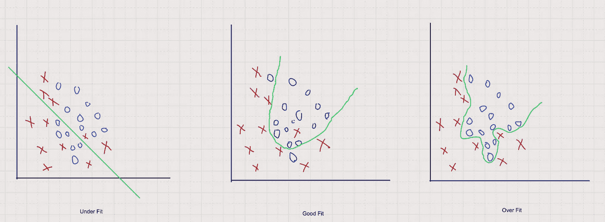
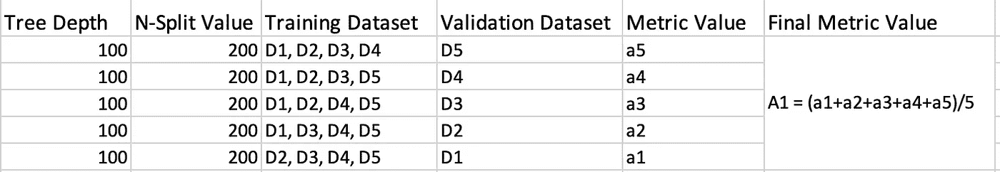
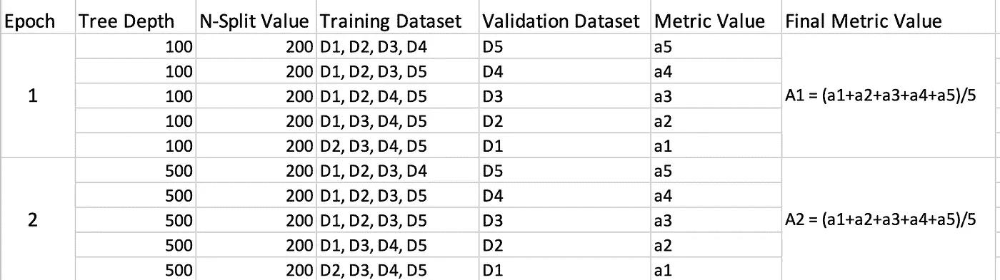

# 机器学习中的过拟合和欠拟合

> 原文：<https://towardsdatascience.com/overfitting-and-underfitting-in-machine-learning-89738c58f610?source=collection_archive---------21----------------------->

## 在这篇文章中，你将了解什么是过度拟合和欠拟合。您还将学习如何防止模型过拟合或欠拟合。

在数据集上训练模型时，人们面临的最常见问题是过拟合和欠拟合。过度拟合是机器学习模型性能不佳背后的主要原因。如果你曾经面临过过度拟合的问题，也不用担心。浏览一下这篇文章。在本文中，我们将通过一个运行示例来展示如何防止模型过度拟合。在此之前，让我们先了解什么是过拟合和欠拟合。

> 我们在机器学习中的主要目标是正确地估计训练数据集中的分布和概率，以便我们可以有一个可以预测测试数据集的分布和概率的通用模型。

## 过度拟合:

当模型学习到数据中的模式和噪声，以致损害模型在新数据集上的性能时，称为过拟合。该模型与数据拟合得如此之好，以至于它将噪声解释为数据中的模式。

过度拟合的问题主要发生在其决策边界是非线性的非线性模型中。在逻辑回归的情况下，线性决策边界的例子可以是直线或超平面。如上面的过度拟合图所示，您可以看到决策边界是非线性的。这种类型的决策边界是由非线性模型(如决策树)生成的。

我们也有非线性模型中的参数，通过这些参数我们可以防止过度拟合。我们将在本文后面看到这一点。

## 欠拟合:

当模型既没有从训练数据集学习也没有在测试数据集上很好地概括时，它被称为欠拟合。这种类型的问题并不令人头痛，因为这可以很容易地通过性能指标检测出来。如果性能不好，尝试其他模式，你一定会得到很好的结果。因此，对拟合不足的讨论不像对拟合过度的讨论那样频繁。

## 非常适合:

既然我们已经看到什么是过度拟合和欠拟合，让我们看看什么是良好拟合。

> 在欠拟合和过拟合中间的点是好的拟合。

在现实世界中，得到一个完美的模型是非常困难的。你不可能一下子找到完美的模特。首先，您将有一个将在生产中使用的初步解决方案，然后您将根据您随时间收集的数据重新训练该模型。

## 如何解决过度拟合

在这一节中，我将通过一个真实的案例研究来演示如何防止模型过度拟合。我们将使用亚马逊美食评论数据集，并在此数据集上训练决策树。我还会提供一个 GitHub 链接供进一步参考。我假设你们都知道什么是决策树。我们将使用 sklearn 库。

您可以通过使用像 **K-fold 交叉验证和超参数调整**这样的技术来防止模型过度拟合。一般人们用 K 重交叉验证来做超参数调优。我将通过一个决策树的例子来展示如何做到这一点。首先，我来解释一下什么是 K 倍交叉验证。

**K-fold 交叉验证**:在这种技术中，我们通常将数据集分为三个部分。训练部分包含 80%的数据，测试部分包含 20%的数据。此外，在训练期间，训练数据集被分成 80:20 的比例，80%的数据用于训练，20%用于交叉验证。在决策树中，超参数是树的深度和每个节点上的数据点的数量，在此之后节点将被分割。我们将看到 k-fold 交叉验证是如何工作的。这里我举一个 5 重交叉验证的例子。因此，训练数据集将被分为 5 个部分，随机选择 4 个部分进行训练，1 个部分进行验证。这将重复 5 次，并且该度量的平均值将是该时期的最终度量。在一个时期中，树的深度和分裂值是固定的。例如:在一个纪元中，我们可以让树的深度为 100，分割值为 200。让训练数据集 D 被分成 D1、D2、D3、D4 和 D5。对于超参数的固定值，验证计算如下所示。

交叉验证计算。

这有助于监控培训，因为在培训期间，我们会根据看不见的数据验证模型。现在让我们以准确性作为衡量标准。训练后 A1 是训练精度。如果训练精度和测试精度都接近，则模型没有过拟合。如果训练结果非常好，而测试结果很差，则模型过度拟合。如果训练精度和测试精度较低，则模型有欠拟合。如果模型欠拟合或过拟合，那么我们改变超参数的值，并再次重新训练模型，直到我们得到一个很好的拟合。

**超参数调整**:在这个过程中，我们取一系列的超参数，然后我们监控所有可能的超参数组合的交叉验证准确性。我们采用给出最佳精度的超参数(这里我们将精度作为度量)。然后我们用那个超参数训练模型，然后测试。以下是如何计算每个超参数组合的交叉验证准确度。

交叉验证计算示例。

我们可以使用 sklearn 库提供的 GridSearchCv 或 RandomSearchCv 来做超参数。GridSearchCv 将检查所有可能组合的交叉验证，但 RandomSearchCv 通过随机选择组合进行检查。下面是进行超参数调整的代码。要查看完整代码，点击 [**此处**](https://github.com/riteshranjan110/AmazonFineFoodReviewClassification/blob/master/Amazon_Fine_Food_Reviews_Analysis_Decision_Trees.ipynb) 。

进行超参数调整的代码。

我希望这能弄清楚什么是过度拟合和欠拟合，以及如何解决它们。

难以理解为什么我们会交叉熵。通过这篇 [**博客**](https://medium.com/analytics-vidhya/cross-entropy-log-loss-and-intuition-behind-it-364558dca514) 来有一个清晰的直觉。

 [## 交叉熵、对数损失及其背后的直觉

### 在这篇博客中，你会对交叉熵和对数损失在机器学习中的应用有一个直观的了解。

medium.com](https://medium.com/@riteshk981/cross-entropy-log-loss-and-intuition-behind-it-364558dca514) 

如果您在理解校准方面有困难，请浏览此 [**博客**](https://medium.com/analytics-vidhya/calibration-in-machine-learning-e7972ac93555) **。**

 [## 机器学习中的校准

### 在这篇博客中，我们将学习什么是校准，为什么以及何时应该使用它。

medium.com](https://medium.com/analytics-vidhya/calibration-in-machine-learning-e7972ac93555) 

参考资料:

1.  [https://en.wikipedia.org/wiki/Overfitting](https://en.wikipedia.org/wiki/Overfitting)

2.[https://sci kit-learn . org/stable/modules/generated/sk learn . model _ selection。RandomizedSearchCV.html](https://scikit-learn.org/stable/modules/generated/sklearn.model_selection.RandomizedSearchCV.html)

3.[https://machine learning mastery . com/over fitting-and-under fitting-with-machine-learning-algorithms/](https://machinelearningmastery.com/overfitting-and-underfitting-with-machine-learning-algorithms/)