# 过度合身和不够合身:视觉上解释得像你五岁

> 原文：<https://towardsdatascience.com/overfitting-and-underfitting-visually-explained-like-youre-five-8a389b511751?source=collection_archive---------47----------------------->

## 关于机器学习和深度学习中过度拟合和欠拟合的检测和预防，我们需要知道的一切

来源:[【2】](https://thenounproject.com/search/?q=fly%20swatter&i=345496)[【3】](https://thenounproject.com/search/?q=bazooka&i=2752735)[【4】](https://thenounproject.com/search/?q=boom&i=342755)[【5】](https://thenounproject.com/search/?q=godzilla&i=1894760)—名词项目

每周，我的花园里都会长出一束花。你可以把它**看成一个数据集**。这是一个向我的孩子有趣地介绍复杂概念的好方法。在这篇文章中，我们将通过这个绚丽的花园来强调:

*   理解数据集的重要性。
*   **过拟合**和**欠拟合**
*   **特异性**和**一般化**的平衡
*   **检测**过拟合和欠拟合
*   **防止**过度配合
*   **K 重交叉验证**
*   分割训练、**验证**、**测试**

# 了解数据集

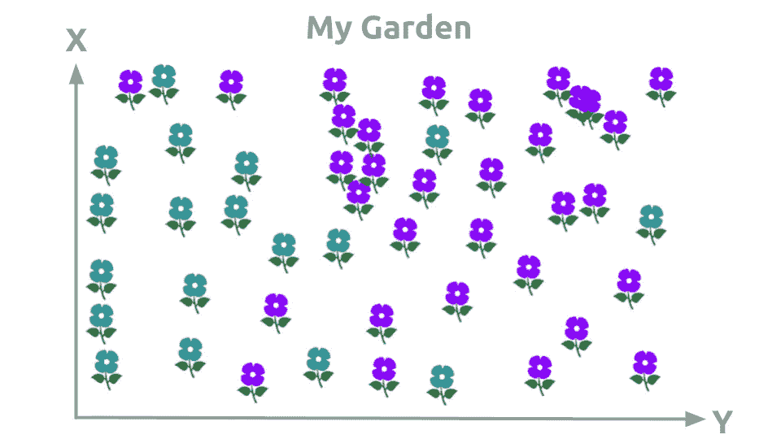

我花园里所有的花都一模一样。但我不得不撒了点小谎。我说有些花帮助我们的兔子长得更快更聪明。其他的花什么都不做。

在两个星期里，我们采摘了花园里所有的花，把蓝色的 T42 树枝放在魔法花上，紫色的树枝放在普通花上。对于每一朵花，我都发明了它是不是魔法，但这并不重要。我们有一个花的数据集，我们知道它们在棍子上的 X，Y 位置，以及棍子的颜色，它们是神奇的还是普通的。

出于实际原因，在我的插图中，花将被替换为点。

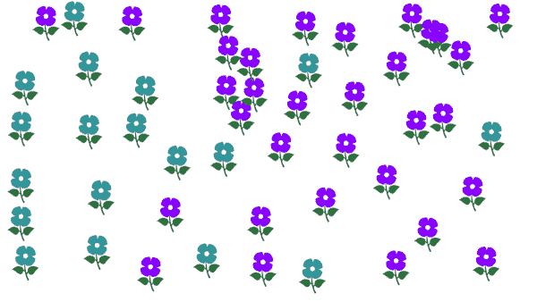

# 一般化

我和我的孩子用我们种在花园里的棍子制作了我们的小数据集。我们称之为**训练集**。我现在希望我的孩子**能够根据现有的数据预测**花园里下一朵生长的花**会是神奇的还是普通的，取决于它们的位置**。我又等了一周，等待数据集的另一部分。我们没有摘这些花，甚至没有把树枝放在它们的位置上。我们将这组花称为**验证集**。

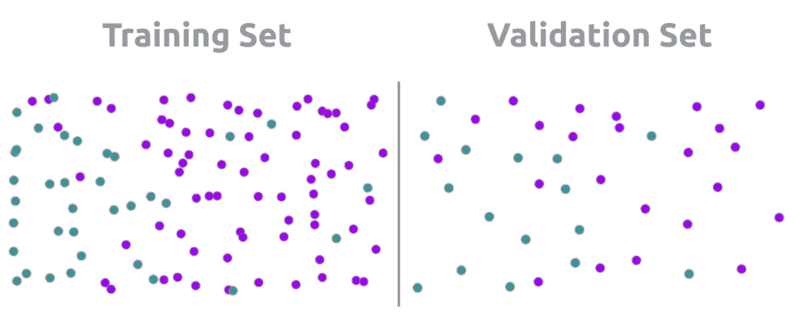

# 你将如何做出预测

这些是我孩子的游戏规则。当他试图为我们的兔子划定花园中种植魔法花的区域时，他需要做出选择。他必须做出选择:

*   一根**刚性**绳索
*   一根**柔性**绳索
*   **多根**柔性绳索

接下来的规则很简单:尽可能以最好的方式布置电缆，将的神奇花卉区与普通花卉区区分开来。每当我的孩子**试图解开**的绳子时，我就会根据验证集**向他报告**他所犯的错误。

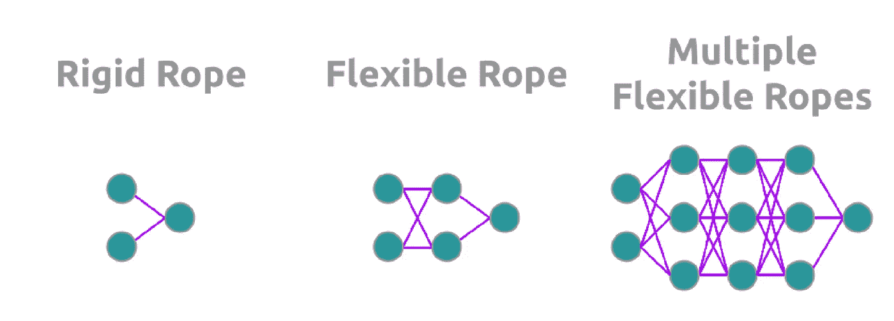

你猜对了。所以是 3 种不同的型号，参数**或多或少**。它可以是任何**预测模型**，但是例如，我将使用**神经网络**插图来说明这些绳索。

# 欠拟合

在理解什么是**欠配合**之前，更容易理解**过配合**。当模型**过于简单**时，出现欠拟合。或者当模型**对于给定数据不够好**时。

这是很少遇到的情况。另外，我的孩子没有选择刚性绳。使用听起来**太死板而没用的东西**似乎很荒谬。

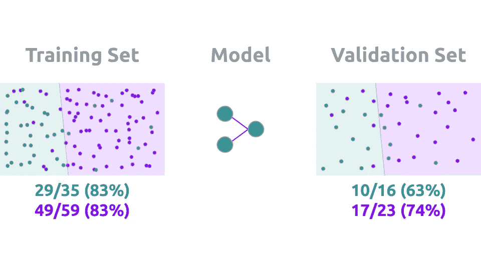

如果我的孩子使用硬绳:

*   他会试着把他已经知道种类的花放在一起。
*   他会用我的**反馈**一步步**评估刚性绳索的正确位置**以提高**他对它的预测。**

但是这种刚性绳索的选择不够灵活，不适合我们的数据。在机器学习或深度学习中，**无论**使用什么算法(SVM、安、随机森林)，我们都必须确保我们的模型对于我们的数据有**足够的特征**。因此，了解数据集非常重要。

# 过度拟合

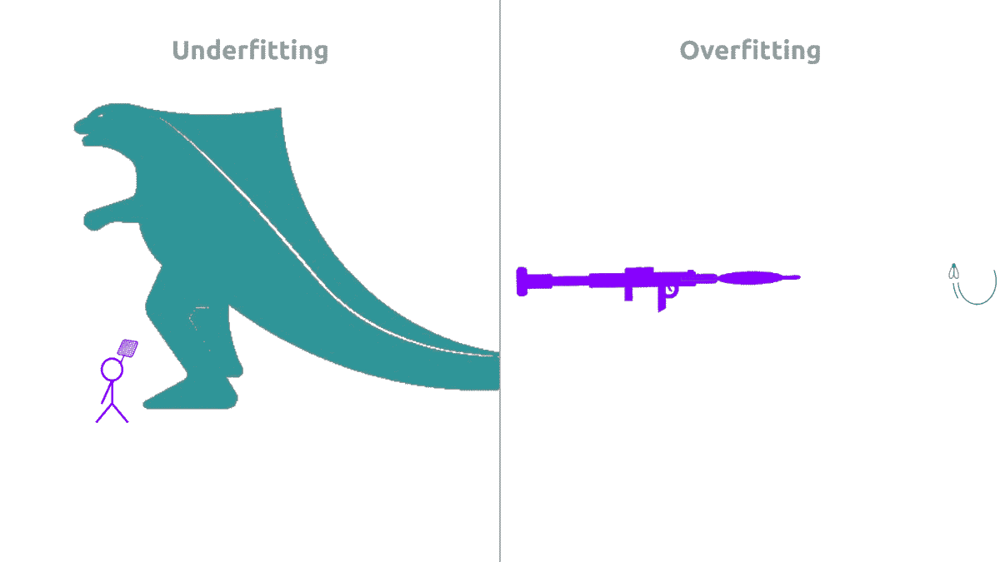

来源:[【2】](https://thenounproject.com/search/?q=fly%20swatter&i=345496)[【3】](https://thenounproject.com/search/?q=bazooka&i=2752735)[【4】](https://thenounproject.com/search/?q=boom&i=342755)[【5】](https://thenounproject.com/search/?q=godzilla&i=1894760)—名词项目

如果你已经明白什么是欠拟合:过拟合是**的反义词**。经常使用以下比喻:

*   **欠配合**:试着用**苍蝇拍**杀死**哥斯拉**。
*   **过度配合**:尝试用**火箭筒**杀死一只**苍蝇**。

我的孩子选择用我向他提出的最后一个选择来划定神奇的花区:多根柔性绳索。人们总是倾向于使用过多的功能，而不是最基本的功能。**本能的，我们都是孩子！**

这是我们太容易犯的错误。为什么不用**什么都有而不是什么都没有？我们大多数人对此都有偏见。作为我的孩子，我们也会选择带上所有的绳索。**

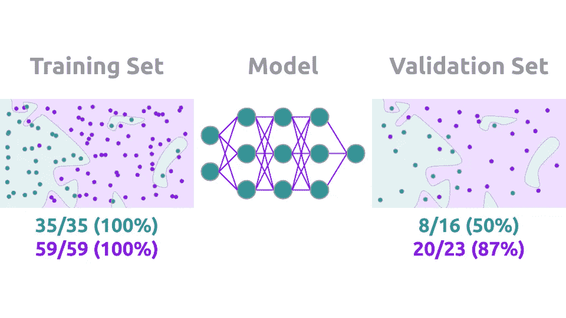

多亏了这束绳子，我的孩子终于设法把魔法花生长的所有地方都围了起来。

> "100%!恭喜你！”

然后我们用我们的验证集和**哎呀** …本周的神奇花朵进行评估，准确性非常差。甚至**比刚性绳**更糟糕，导致不匹配。

我承认我真的没有孩子，我从来没有在这篇文章之外编过这个花的故事。但是**我的孩子是我编程的模型**。我邀请你去**考虑你的模特。因为如果我们让他们选择使用许多功能，那么我们就可以确定**我们的模型会使用所有的功能**。那它就会超负荷。**

# 找到一个好的平衡点

我们刚才已经看到的是我们必须在特异性和普遍性之间找到**正确的平衡**。

*   **一般化**:将**应用于一组可见数据中的不可见**数据的能力。
*   **特异性**:在**最细微的细节**中**发现**数据的能力。

在训练一个模型时，你应该小心找到正确的平衡点:

*   **过拟合** : **低**泛化，**高**特异性
*   **欠拟合**:高**泛化，**低**特异性**

因此**与直觉相反的是**，预测神奇花朵生长区域的模型应该是**简单的柔性绳子**。不是那几根柔韧的绳子。

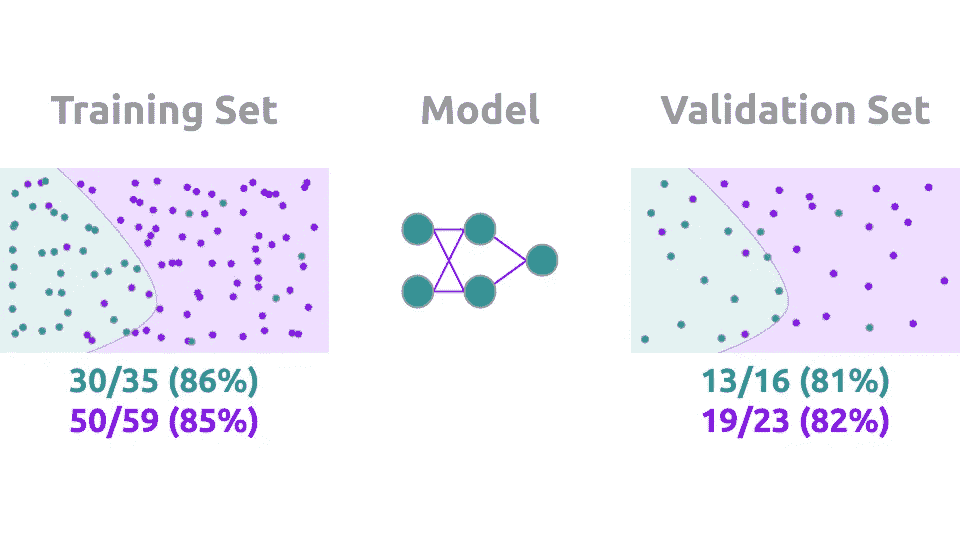

# 检测过度拟合

嗯，我们必须小心过度合身。知道这一点很好，但是我们如何检测它呢？有两种思想流派:

*   **验证设置**上的**错误**可以被**监控**。训练集上的误差将继续减少，训练的特异性越来越强。当验证集上的**错误**开始**增加**时，您会注意到**开始过拟合**。
*   **验证集**上的**度量**可以被**监控**。这在视觉上和上一点是一样的。

我更喜欢**度量监控**。我**对**知道描绘普通花和神奇花的区域的线条的**误差距离**不感兴趣。我感兴趣的是那些线条的精确度。对我来说，**误差用来调整**绳索的位置。**该度量用于评估**他们的位置。

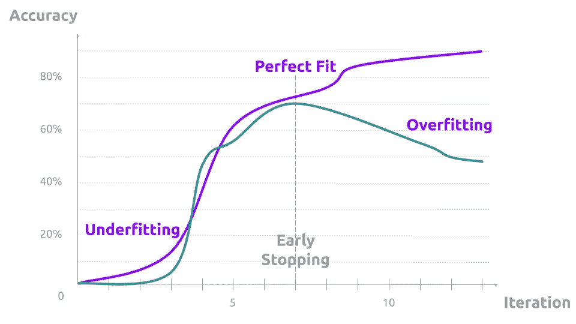

一旦确定，防止过度拟合的最简单和最直观的方法是应用**提前停止**。如果在验证集上准确度开始下降，是时候停止我们的训练以**避免失去泛化**和过度拟合。

防止过度拟合的另一个显而易见的方法是检查我们的模型对于给定的数据集是否包含太多的特征。换句话说，如果我们的模型有**过度拟合**的趋势，那么我们可以**逐渐移除**特性和/或它们的灵活性。这允许我们获得一个更适合数据集的模型。

# 验证和测试设备

当我们修改模型的架构、学习率或参数初始化方法时:这些是我们正在修改的**超参数**。

*   **参数**:由模型自身在训练过程中选择并更新**以最小化误差。**
*   **超参数** : **提供给**型号。这些元素**无法在培训期间学习**。它们定义了模型以及如何优化其性能。

让我们回到基础。我们需要一个**验证测试**来确定我们没有执行任何可能导致过度拟合的特异性。但是我们用验证集来评估这个性能。调整超参数后，**验证数据本身变得有偏差**。我们用它们在某种程度上“训练”我们的超参数。

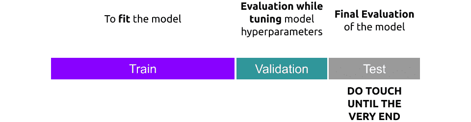

这就是为什么有必要将数据集分成 **3 个不同的集合**。一个给**训练**的模特。另一个是**验证**我们的培训和调整我们的模型。最后，一个**测试**设定来验证我们的模型。该套件**只能在最末端**使用。你不应该使用这个设置来重新调整你的模型。

# k 重交叉验证

另一种防止过度拟合的方法是所谓的 **K 倍交叉验证**。让我解释一下。当我们分割数据集时，我们把测试留到最后。然后我们**将**我们的训练集划分为**个子集**。

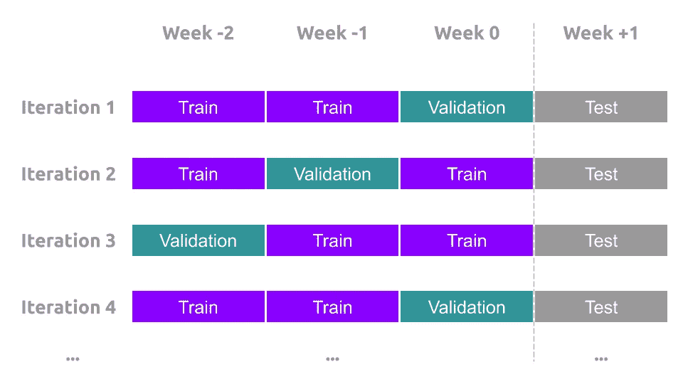

在我们的花卉数据集中，我们可以方便地进行。我们**用每个**周**的花来划分**我们的数据集。在第一次**迭代中，**我们用前两周训练我们的模型，用最后一周评估它。在第二次迭代中，我们**为每次迭代**切换并重复过程**。**

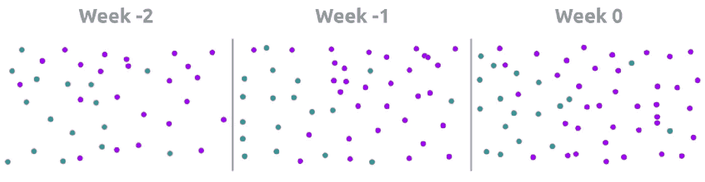

这将**限制特异性**到一个星期的魔法花，这些魔法花本来会生长在更稀少的区域。这个**导致了泛化**。在最后，我们将能够在接下来的一周评估我们的模型，我们的测试集。

# 防止过度拟合的其他方法

还有其他方法可以防止过度拟合:

*   **集合**:几个不同模型的**组合****投票**预测。
*   **规则化**:人为**强制**模型变得**简单**的方法。

然而他们很快就会有自己的文章😜

# 结论

*   **了解**你的数据集。
*   不要对你的模型的特性过于贪婪。
*   总是**评估**你的模型。
*   注意在**特异性**和**概括性**之间的正确平衡。
*   监控错误或度量的行为以**提前停止**培训。
*   保留一个**测试集**。
*   使用分区数据集上的**交叉验证**防止过度拟合。

> **知识就是分享。**
> **支持**我，一键获取 [**中**我所有文章的**访问**](https://axel-thevenot.medium.com/membership) 。

# 来源图像

[【1】](https://thenounproject.com/search/?q=fly&i=156654)[【2】](https://thenounproject.com/search/?q=fly%20swatter&i=345496)[【3】](https://thenounproject.com/search/?q=bazooka&i=2752735)[【4】](https://thenounproject.com/search/?q=boom&i=342755)[【5】](https://thenounproject.com/search/?q=godzilla&i=1894760)—名词项目

其他图片有**自制的**和**免费使用的**