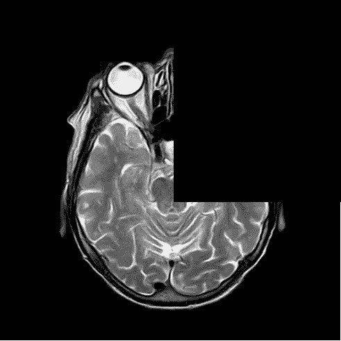

# 过度拟合，不仅仅是一个问题

> 原文：<https://towardsdatascience.com/overfitting-more-than-an-issue-fac2d8b1fb5d?source=collection_archive---------45----------------------->

## 识别过度拟合的实例

图片来自 [Pixabay](https://pixabay.com) ，由 [alehigalgo](https://pixabay.com/photos/wrong-way-wrong-way-no-confused-429723/) 提供。

我多年来一直从事机器学习和深度学习模型的研究。在这段时间里，我发现有些情况下过度拟合并不明显。同样，我也见过其他人，比如朋友、同事或学生，他们不能在自己的问题中识别过度匹配。

因此，我决定制作这个小指南，讲述我遇到的难以识别过度拟合的案例，以及在试图解决它时遇到的主要错误。

# 什么是过度拟合？

当处理经典的机器学习或深度学习问题及其模型时，如人工神经网络或用于分类的 SVM，有一个初始训练阶段。在训练期间，模型被输入选定的数据，以便教会它如何对给定的数据进行分类。

一旦用数据训练了模型，就该用新数据测试它了。这被称为测试阶段，它证明模型是否能够从以前从未学习过的数据中提取信息。

如果模型对训练数据有好的结果，但对测试数据有坏的结果，则称该模型过度拟合。这些结果来自评估指标，如准确度、召回率、精确度……通常，当第一次学习机器学习时，据说训练期间的准确度或召回率接近 100%，但测试期间没有，这意味着过度拟合。

有时候这并不完全正确。可能有 70%的召回涉及过度拟合的情况。因此，这里列出了一些不容易识别过度拟合的情况。

# 案例 1:兴趣类的问题

这个案例是我在生物信息学问题中看到比较多的一个。先说个例子。在这个例子中，我们是生物信息学家，试图找到一个深度学习模型，该模型必须能够检测神经退行性疾病的存在。神经退行性疾病通常有阶段，越早发现，治疗越有效，因为疾病还没有发展到那种程度。

我们关注的疾病有 3 个阶段，阶段 1 是疾病的初始表现，阶段 3 是最晚期的表现。因此，检测阶段 1(感兴趣的类别)比阶段 2 和 3 更重要，因为治疗会更有效。

在训练过程中，我们达到了预期的情况，我们几乎完美地检测到了第一阶段的病例。在测试过程中，阶段 3 的病例被最好地检测到，而阶段 1 的病例被正确分类的最少。这显然是一个过拟合问题，因为模型无法对新数据进行分类。

有时这并不像看起来那样清楚。当我在学习深度学习时，我面临过这样的问题。我的模型在训练时对阶段 1 有 70%的回忆，是最好的分类，阶段 3 有 50%的回忆，是第二好的分类。测试时，第一阶段的召回率为 60%，而第三阶段的召回率为 80%。这些结果表明这个模型不好，但是我没有足够的经验去理解它。首先，这个模型对于医学专家来说是没有用的，因为他们想要一个可以在疾病不明显的时候诊断疾病的模型。第二，即使第一阶段的回忆没有显著变化，第三阶段的回忆还是有显著变化。这意味着训练数据不能代表测试期间可能出现的情况，并且模型不能概括其知识。

正如我之前所说，这在生物信息学问题中非常常见，在一些科学论文中，作者无法发现他们过度拟合了他们的模型，或者没有以适当的方式解决它。

大多数人使用数据扩充技术是为了产生更多不同案例的新例子。这在一些情况下很有用，比如图像增强问题。在图像恢复问题中，模型识别噪声之类的伪像，并试图消除它们。它在训练中学习的不同类型的工件越多，它对新图像的处理就越好。一些作者用人工噪声创建新的图像，以便在训练期间增加多样性。

在其他问题中，比如医学问题，人工数据可以代表自然界中不可能存在的病例。用错误的数据训练模型可能会使它产生偏差。这在学生或刚开始机器学习的人中间很常见。他们不检查增加的数据，然后有像这样的不现实的情况:

图片编辑自 [Pixabay](https://pixabay.com) ，由 [toubibe](https://pixabay.com/illustrations/mri-magnetic-x-ray-skull-head-782457/) 提供

# 案例 2:不平衡数据

第二种情况是我在新手中看到的。当我还是个大学生时，我也遇到了同样的问题。有些问题是使用的数据非常不平衡。例如，在我使用的数据集中，90%的数据来自类 0，10%来自类 1。

当将数据分为测试和训练数据时，我使用了保留策略，80%的数据用于训练，20%用于测试。很明显这是个坏主意。在训练过程中，模型显示了很高的准确性和回忆价值。测试中的这些值也很高，因为数据来自相同的数据集。我并没有在那一刻意识到，因为我在训练和测试阶段都取得了不错的成绩。

当使用非常不平衡的数据时，模型倾向于学习最常见的类。我的情况是 0 级。大多数人没有意识到的问题是，模型将大多数的例子归为一个特定的类。发生这种情况是因为该模型了解到给定的示例更有可能来自该类，所以它不会从其他类中提取信息。

在这种情况下，大多数人试图解决过度拟合问题，从代表过多的类中删除示例，或者从代表不足的类中重复数据，以便每个类包含相同数量的元素。

如果选择了删除数据的解决方案，您可能会从定义该类的可能案例范围中删除重要的和有代表性的数据。然后，该类的评估指标可能会变得更差，因为新的示例可能包含模型无法学习的用于抽象知识的特征。

另一方面，重复数据可能会使代表性较低的类的分类产生偏差。当重复数据时，大多数例子都要重复多次。该模型可以学习那些重复的例子作为该类的最具代表性的例子，并忽略该类中其他代表性较低的例子。例如，如果我们正在训练一个动物分类器，并且我们只重复灰色猫的图像，那么我们的模型可能只将灰色猫识别为猫。

一个类别的数据种类很少也会在分类中产生偏差。也就是说，该模型是欠拟合的，并且在训练期间显示出较差的结果。一个众所周知的袋子是图里奥·里贝罗等人在 2016 年[1]测试的一个区分狼和哈士奇的模型。最终的结果是一个模型，如果背景中有雪，它会将图像中的动物检测为狼。

# 案例 3:数据种类少

有时数据很难获得。有时没有可用的资源或数据，而获取这些资源或数据又很昂贵。当这种情况发生时，人们倾向于只使用他们拥有的少量数据。例如，医疗数据很难获得。有时研究人员只有一个病人或几个病人的数据(几个来源)。这意味着大多数数据示例是相关和依赖的。

当数据来自少数来源时，模型在部署用于生产时可能会出现问题。在我的案例中，我只有一个病人的视网膜图像，并且我正在尝试制作一个系统来检测视网膜图像中的血管。由于示例数量较少，我不得不将数据分成训练和测试数据进行交叉验证。在培训和测试中，我都取得了不错的成绩。

在部署该系统时，对第二名患者进行了测试。不出所料，结果很糟糕。人体的器官通常互不相同。

与前一种情况一样，所有类别中的少量数据可能会产生偏差，但不会过度拟合。只检测到与训练模型的少数案例非常相似的案例。

当这种情况发生时，缺乏经验的人很难找到问题的根源。因此，为了能够做出特别的解决方案，最好尝试不同的技术，而不仅仅是机器学习。当你没有更多的数据时，这将是一个快速的解决方案。

# 经验是伟大的老师

这里解释的案例是一些人们通常不会识别过度拟合问题的例子。都是我亲身遇到的案例。我发现它们都很有趣，尤其是对那些刚刚起步的人来说。这个世界上没有人生来就什么都懂，实践和实验是我们最好的老师。永远不要停止学习和实验。

如果你对这篇文章有任何疑问或修正，请不要犹豫，通过 LinkedIn 向我提出问题或建议。

谢谢您们。

## 参考

[1] M. T .里贝罗，s .辛格，c .盖斯特林，[“我为什么要相信你？《解释任何分类器的预测](https://dl.acm.org/doi/abs/10.1145/2939672.2939778)》(2016)，第 22 届 ACM SIGKDD 知识发现和数据挖掘国际会议论文集。