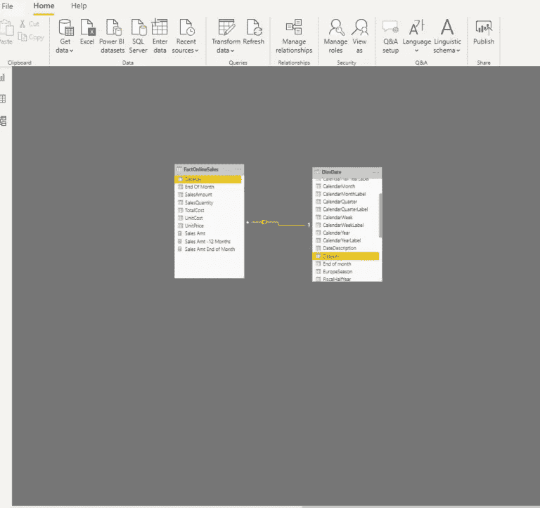
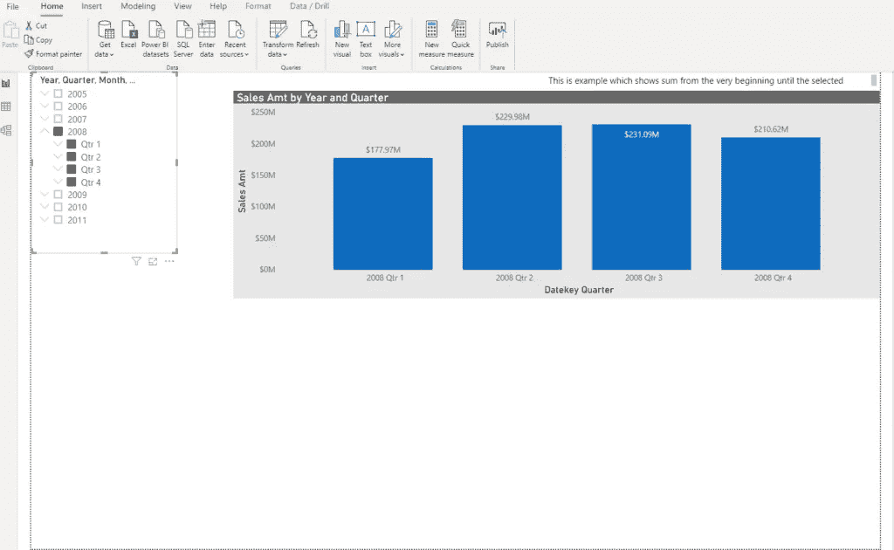
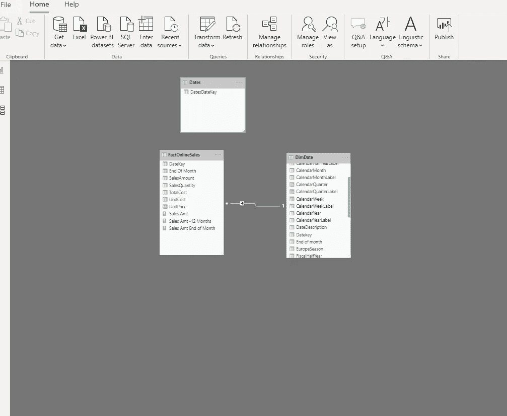
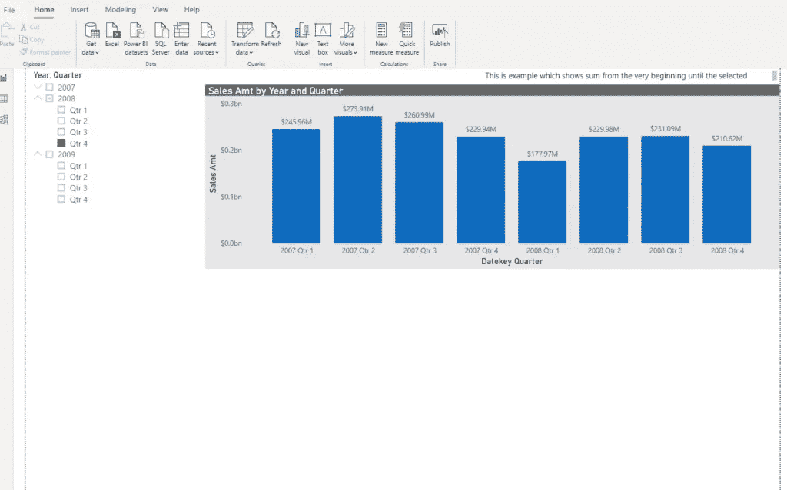
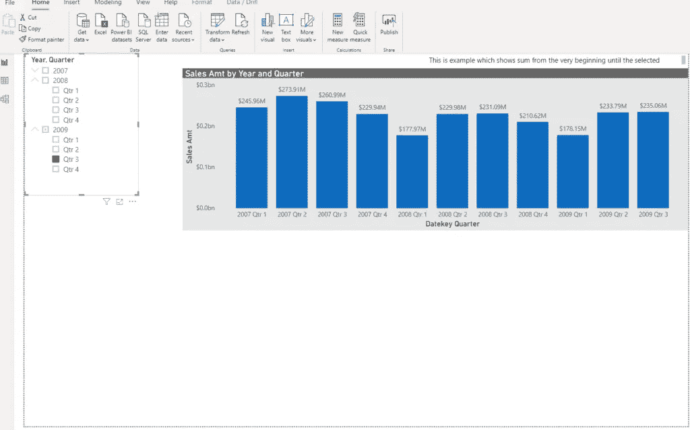
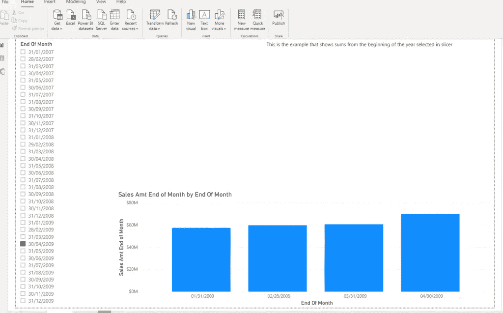
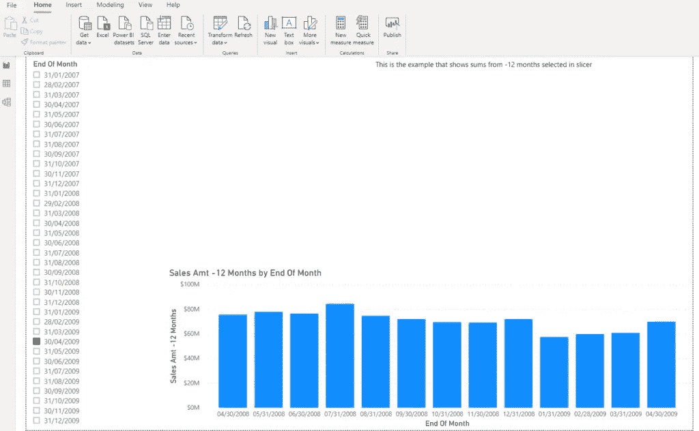

# 覆盖 Power BI 中的日期过滤器

> 原文：<https://towardsdatascience.com/override-date-filter-in-power-bi-743b9e8b9b2?source=collection_archive---------10----------------------->

## 在 Power BI 中覆盖标准的日期过滤可能比您想象的要复杂


伊加特·库尚列夫在 Unsplash 上拍摄的照片

最近，我的一个朋友从他的客户那里得到了一个有趣的请求。他们需要根据[日期选择](/tiq-part-3-ultimate-guide-to-date-dimension-creation-98b951ffa68c)来查看过去指定时间段的值。

例如，如果他们选择 2020 年 3 月 31 日，他们需要查看前 12 个月的值，因此从 2019 年 4 月 1 日开始。此外，他们需要一个选项来选择特定的日期，并查看所选日期的年初值。同样，如果他们选择 2020 年 3 月 31 日，他们需要查看从 2020 年 1 月 1 日开始的值。视觉效果将被调整为[基于用户选择动态变化](/dynamic-filtering-in-power-bi-5a3e2d2c1856)。

也就是说，编辑交互作为一种从特定视觉中移除过滤器的方式，并不是一种选择，因为它会完全拒绝用户选择任何特定的值进行过滤。

## 棘手的部分

这里最棘手的事情是建立[日期维度和事实表之间的正确关系](/role-playing-dimensions-in-power-bi-185dc58f90f1)。因为，如果您依赖于日期维度和事实数据表之间的“正常”关系，数据将根据日期选择进行筛选，日期选择充当这两个表之间的关系。

让我们前往 Power BI Desktop，看看是否可以做些什么。



正如您在上面的模型视图中所看到的，DimDate 和 FactOnlineSales 与 DateKey 列相连接。因此，只要我在切片器中选择日期，我的条形图就只显示那些由切片器选择过滤的值，如下面的屏幕截图所示。



这里的主要问题是:我们如何“覆盖”从日期切片器传递的值。

## 解决方案的关键

这里的关键是断开日期维度和事实表之间的“常规”关系。我们需要一个独立的，不连续的日期表，这将有助于定义我们需要在条形图视觉显示值的时间框架。

因此，我将使用以下定义创建一个新表:

```
Dates = DISTINCT(FactOnlineSales[DateKey])
```

这将包括事实表中的所有日期。该表与我们的事实表保持断开，正如您在模型视图中看到的:



现在，让我们创建一个新的度量，它将计算我们指定的日期内的销售额:

```
Sales Amt = 
         VAR MaxDate = MAX(Dates[DatesDateKey])
         VAR MinDate = CALCULATE(MIN(Dates[DatesDateKey]),
                                ALLEXCEPT(Dates,Dates[DatesDateKey])
                                )
            VAR SalesAmt = CALCULATE(SUM(FactOnlineSales[SalesAmount]),
                              FILTER(FactOnlineSales,FactOnlineSales[DateKey] >= MinDate && FactOnlineSales[DateKey] <= MaxDate))
            RETURN
            SalesAmt
```

我们在这里所做的基本上如下:我们正在定义一个变量，该变量将选择最后选择的日期(MaxDate)。然后，我们定义我们的起点:在这种情况下，它将在日期表中找到第一个日期，用 *ALLEXCEPT* 函数覆盖现有的过滤器上下文。最后，我们使用*过滤器*函数计算 SalesAmt 值，以便根据变量中设置的日期限制时间范围。在我们将新的度量拖到条形图视觉效果后，我们将得到以下结果:



因此，如果我选择 2008 年的第 4 季度，我将看到从开始(事实表中的第一个日期值)到所选期间的所有值。如果我选择 2009 年第 3 季度，我将得到以下值:



很酷吧，哈？

## 微调我们的解决方案

但是，如果我们只需要查看所选日期年初以来的值，或者所选日期之前 12 个月的值，该怎么办呢？

断开连接的表保持不变，因为，别忘了，它是解决这个问题的关键要素。我们将稍微改变一下计算销售额的方法。

如果要查看年初以来的所有值，可以像这样调整 measure:

```
Sales Amt StartYear = 
        VAR MaxDate = MAX('Dates'[DatesDateKey])
        VAR MinDate = STARTOFYEAR('Dates'[DatesDateKey])
        VAR Result = CALCULATE(
                            SUM(FactOnlineSales[SalesAmount]),
                            FILTER(FactOnlineSales,
                                FactOnlineSales[DateKey] >=MinDate && FactOnlineSales[DateKey]<=MaxDate)
        )
        RETURN
        Result
```

所以，唯一的区别是 MinDate 变量的定义。这里，我们使用 DAX 函数 *STARTOFYEAR* 来获取所选日期的第一个日期。

另一个选项使您能够查看您根据需要定义的尾随期间:以下示例显示了过去 12 个月，但您可以轻松地修改它:

```
Sales Amt -12 Months = 
        VAR MaxDate = MAX('Dates'[DatesDateKey])
        VAR MinDate = DATE(YEAR(MaxDate),MONTH(MaxDate)-12,DAY(MaxDate))
        VAR Result = CALCULATE(
                            SUM(FactOnlineSales[SalesAmount]),
                            FILTER(FactOnlineSales,
                                FactOnlineSales[DateKey] >=MinDate && FactOnlineSales[DateKey]<=MaxDate)
        )
        RETURN
        Result
```

同样，唯一的区别在于起点的定义。通过组合*日期*和*月份*函数，我们告诉我们的度量我们想要计算过去多长时间。在这种情况下，它是-12 个月，但您也可以使用年、季度、天作为标准。



年初的例子



-12 个月的示例

## 结论

正如您所看到的，我们可以使用一些非标准的技术来覆盖过滤器的常规行为，比如创建定制的非连接表。

感谢阅读！

[成为会员，阅读 Medium 上的每一个故事！](https://datamozart.medium.com/membership)