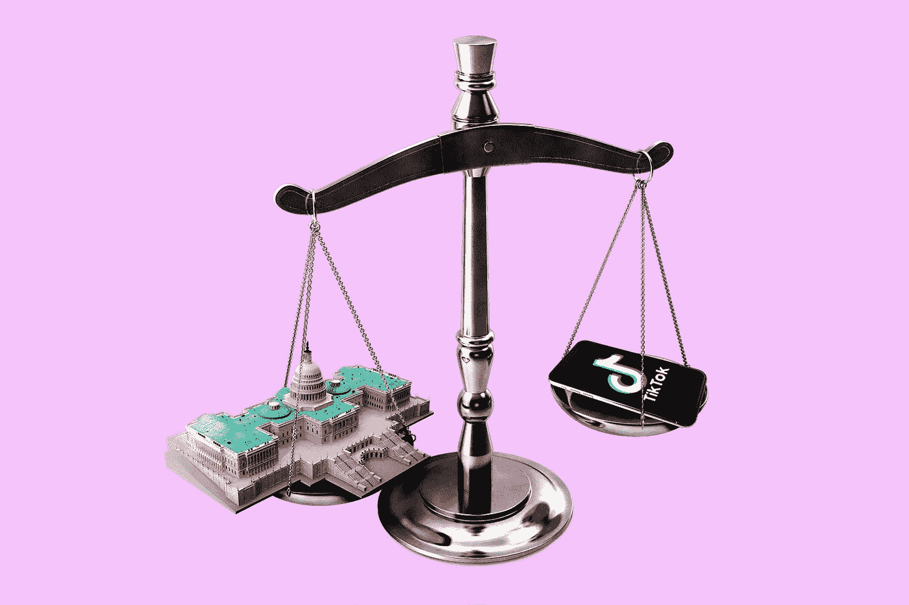
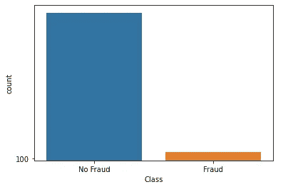

# 过采样和欠采样

> 原文：<https://towardsdatascience.com/oversampling-and-undersampling-5e2bbaf56dcf?source=collection_archive---------1----------------------->

## 一种不平衡分类技术



照片由[晨酿](https://unsplash.com/@morningbrew?utm_source=medium&utm_medium=referral)在 [Unsplash](https://unsplash.com?utm_source=medium&utm_medium=referral) 拍摄

## 我简介

不平衡分类问题是当我们的训练数据的类别分布存在严重偏斜时我们所面临的问题。好吧，偏斜可能不是非常严重(它可以变化)，但我们将不平衡分类识别为一个问题的原因是因为它可以影响我们的机器学习算法的性能。

不平衡可能影响我们的机器学习算法的一种方式是当我们的算法完全忽略少数类时。这之所以是一个问题，是因为少数民族阶层通常是我们最感兴趣的阶层。例如，当构建一个分类器来根据各种观察结果对欺诈性和非欺诈性交易进行分类时，数据中的非欺诈性交易可能比欺诈性交易多，我的意思是想一想，如果我们有等量的欺诈性交易和非欺诈性交易，这将非常令人担忧。



图 1:欺诈检测问题的类别分布示例

应对这一挑战的方法是*随机抽样。*执行随机重采样有两种主要方式，各有利弊:

**过采样** —从少数类中复制样本

**欠采样** —从多数类中删除样本。

换句话说，过采样和欠采样都涉及引入一种偏向，从一个类别中选择比另一个类别更多的样本，以补偿数据中已经存在的不平衡，或者如果采取纯粹随机的样本，可能会出现的不平衡(来源:[维基百科](https://en.wikipedia.org/wiki/Oversampling_and_undersampling_in_data_analysis))。

我们将随机抽样定义为一种幼稚的技术，因为在执行时，它不假设任何数据。它涉及创建我们数据的新转换版本，其中有一个新的类分布，以减少数据对我们机器学习算法的影响。

> **注意**:我们称随机重采样为幼稚，因为在执行时，它不对数据做任何假设。

在本文中，我们将利用 2014 年启动的`imbalanced-learn`框架，主要关注 SMOTE(另一种不平衡数据技术)的实施。多年来，已经实现了额外的过采样和欠采样方法，并使该框架与流行的机器学习框架`scikit-learn`兼容。访问[不平衡学习](https://imbalanced-learn.readthedocs.io/en/stable/about.html)获取安装指南和完整文档。

```
from sklearn.datasets import make_classification
from imblearn.over_sampling import RandomOverSampler
from imblearn.under_sampling import RandomUnderSampler
from collections import Counter# defining the dataset
X, y = make_classification(n_samples= 10000, weights=[.99])# class distribution
**print**(Counter(y))Counter({0: 9844, 1: 156})
```

完整的代码你可以访问我的 [Github](https://github.com/kurtispykes/demo/blob/master/notebook/kpy_random_sampling_example.ipynb) 。

[](https://github.com/kurtispykes/demo/blob/master/notebook/kpy_random_sampling_example.ipynb) [## kurtispykes/演示

### permalink dissolve GitHub 是超过 5000 万开发人员的家园，他们一起工作来托管和审查代码，管理…

github.com](https://github.com/kurtispykes/demo/blob/master/notebook/kpy_random_sampling_example.ipynb) 

## 随机过采样

随机过采样包括用替换从少数类中选择随机样本，并用该样本的多个副本补充训练数据，因此单个样本可能被选择多次。

> 随机过采样可能增加过拟合发生的可能性，因为它精确复制了少数类的例子。以这种方式，举例来说，一个符号分类器可能构建表面上准确的规则，但实际上覆盖了一个复制的例子。”—第 83 页，[从不平衡数据集学习](https://www.amazon.co.uk/Learning-Imbalanced-Data-Alberto-Fern%C3%A1ndez/dp/3319980734)，2018。

对于受偏斜分布影响的机器学习算法，如人工神经网络和[支持向量机](/algorithms-from-scratch-support-vector-machine-6f5eb72fce10)，这是一种非常有效的技术。然而，在许多情况下建议调整目标类分布，因为为严重不平衡的数据集寻求平衡分布会导致算法过度适应少数类，从而导致我们的泛化错误增加。

我们应该意识到的另一件事是计算成本的增加。当我们训练模型时，增加少数类中的示例数量(特别是对于严重偏斜的数据集)可能会导致计算量增加，并且考虑到模型多次看到相同的示例，这不是一件好事。

尽管如此，过采样是一个相当不错的解决方案，应该进行测试。下面是我们如何用 Python 实现它…

```
# instantiating the random over sampler 
ros = RandomOverSampler()
# resampling X, y
X_ros, y_ros = ros.fit_resample(X, y)# new class distribution 
**print**(Counter(y_ros))Counter({0: 9844, 1: 9844})
```

## 随机欠采样

随机欠采样与随机过采样相反。该方法试图从多数类中随机选择和移除样本，从而减少变换数据中多数类中的样本数量。

> “在(潜在的)随机欠采样中，大量数据被丢弃。[……]这可能是一个很大的问题，因为这些数据的丢失会使少数和多数实例之间的决策界限更难了解，从而导致分类性能的损失。”——第 45 页，[不平衡学习:基础、算法和应用](https://www.amazon.co.uk/Imbalanced-Learning-Foundations-Algorithms-Applications/dp/1118074629)，2013 年

欠采样的结果是在多数类中具有较少样本的变换数据集——可以重复该过程，直到每个类中的样本数量相等。

尽管存在严重的不平衡，但在少数类有足够数量的例子的情况下，使用这种方法是有效的。另一方面，考虑有价值的信息被删除的可能性总是很重要的，因为我们随机地将它们从我们的数据集中删除，因为我们没有办法检测或保存在多数类中信息丰富的例子。

为了更好地理解这个方法，这里有一个 python 实现…

```
# instantiating the random undersampler
rus = RandomUnderSampler() 
# resampling X, y
X_rus, y_rus = rus.fit_resample(X, y)# new class distribution
print(Counter(y_rus))Counter({0: 156, 1: 156})
```

## 结合两种随机抽样技术

与单独执行的方法相比，结合使用两种随机采样方法有时可以提高整体性能。

其概念是，我们可以对少数类应用适度的过采样，这改善了对少数类示例的偏差，同时我们还对多数类执行适度的欠采样，以减少对多数类示例的偏差。

为了在 Python 中实现这一点，利用`imbalanced-learn`框架，我们可以在过采样和欠采样技术中使用`sampling_strategy`属性。

```
# instantiating over and under sampler
over = RandomOverSampler(sampling_strategy=0.5)
under = RandomUnderSampler(sampling_strategy=0.8)# first performing oversampling to minority class
X_over, y_over = over.fit_resample(X, y)
**print**(f"Oversampled: {Counter(y_over)}")Oversampled: Counter({0: 9844, 1: 4922})# now to comine under sampling 
X_combined_sampling, y_combined_sampling = under.fit_resample(X_over, y_over)
**print**(f"Combined Random Sampling: {Counter(y_combined_sampling)}")Combined Random Sampling: Counter({0: 6152, 1: 4922})
```

## 包裹

在本指南中，我们讨论了不平衡分类的过采样和欠采样。在许多情况下，我们可能会遇到不平衡的数据集，应用随机抽样可以为我们提供一个非常好的模型来克服训练中的这个问题，并仍然保持一个可以很好地推广到新示例的模型。

让我们继续 LinkedIn 上的对话…

[](https://www.linkedin.com/in/kurtispykes/) [## Kurtis Pykes -人工智能作家-走向数据科学| LinkedIn

### 在世界上最大的职业社区 LinkedIn 上查看 Kurtis Pykes 的个人资料。Kurtis 有两个工作列在他们的…

www.linkedin.com](https://www.linkedin.com/in/kurtispykes/)