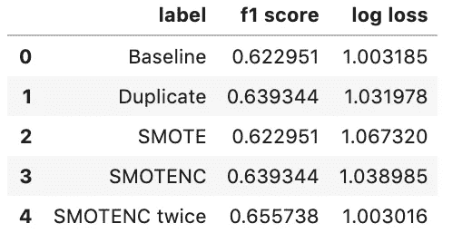

# 非少数类的过采样

> 原文：<https://towardsdatascience.com/oversampling-with-a-non-majority-class-7bbf73b8505e?source=collection_archive---------41----------------------->

## 有意或无意地使用 SMOTENC 方法


平衡法~律师和数据集；图片来自 [Robert J. Debry Associates](https://robertdebry.com/day-life-lawyer/)

我的一个朋友最近决定申请法学院，这是一项需要多年准备的艰巨任务。参加 LSAT 本身就是一项令人生畏的任务，而且这仅仅是收集你的建议并使每一份申请适合学校的漫长过程中的第一步。

就在那时，我决定创造一个[预测器](http://34.208.178.120:8501/)，它可以告诉你被某所法学院拒绝、列入等候名单或录取的概率。这帮助了她，也有望帮助其他人决定去哪里申请并投入他们的精力和金钱(法学院的申请并不便宜！).

我从一个非盈利网站[搜集数据，该网站允许以前的法学院申请者输入他们在法学院的统计数据和成绩。我在这里使用的统计数据是本科 GPA、LSAT、URM 和工作经验作为我的预测指标。值得注意的是，所有这些数据都是自我报告的。](https://www.lawschooldata.org/)

法学院通常是根据排名来评判的，而排名每年都会变化。排名基于许多[变量](https://www.usnews.com/education/best-graduate-schools/articles/law-schools-methodology)，包括毕业率、即将入学班级的 LSAT 中值分数、就业安置成功率以及即将入学班级的本科生 GPA 中值。法学院每年都会调整他们的入学标准。我在创建预测器时考虑到了这一点，将最近一年的数据“加权”得比往年更重。

实际上，这听起来是个好主意，但是我在 Python 实现上遇到了一些麻烦。衡量最近一年的最佳方法是什么？我将 2019 年至 2020 年的入学周期作为我的测试数据，并希望 2018 年至 2019 年比之前的几年更重要。

首先，我复制了一些行，发现 F-measure 得分比我的基线模型有所提高。

```
school_df = school_df.append([df_cycle18],ignore_index=True)
```

然而，我认为这并没有给模型提供任何额外的信息。我想为我的模型创建新的信息和新的可行数据，所以我考虑使用 MCMC，但最终使用了 SMOTE。为了使用 SMOTE 来增加最近一年的观测数据，我不得不重组这个问题。

入学年是现在的目标，我的新预测指标是 GPA，LSAT，URM，工作经验和决定(旧目标:录取，拒绝，等待)。我通过创建一个字典并将其传递给 SMOTE 的`sampling_strategy`参数来指定要过采样的周期:

```
cycles = np.unique(smote_cycle_y)for cycle in cycles:
    smt_dict[cycle] = smote_cycle_y[smote_cycle_y==cycle].shape[0]smt_dict[np.max(smote_cycle_y)] = smt_dict[np.max(smote_cycle_y)]*2oversample = SMOTE(sampling_strategy = smt_dict)
```

然后我看了看我的数据，发现 SMOTE 默认只处理连续变量。它将我的接受、拒绝或等待变量转换成浮点数。我之前定义良好的分类问题也有一些浮动，因此创建了 3 个以上的类。作为一个快速的解决方案，我将这些浮点数四舍五入为整数 0、1 或 2，这一结果令人惊讶地好。然而，我需要一个更好的解决方案。

接下来，我开始搜索多标签分类 SMOTE，并争论创建一个自定义类，然后我找到了答案，SMOTENC。SMOTENC 允许您识别哪些类是名义类，哪些是范畴类，因此称为“NC”。最近一年的过采样现在是无缝的:

```
smt_dict2 = {}for cycle in np.unique(smt_cycle_y):
    smt_dict2[cycle] = smt_cycle_y[smt_cycle_y==cycle].shape[0]smt_dict2[np.max(smt_cycle_y)] = smt_dict2[np.max(smt_cycle_y)]*2oversample = SMOTENC(sampling_strategy = smt_dict2, categorical_features = [0,3,4], random_state = 7)
```

结果很好，再次提高了 F 值。现在我在我的少数民族类上使用了来自我的原始数据的 SMOTENC，这非常有帮助。

```
smote_2_y = df_resample_train[['decision_numeric']] #original targetsamp_dict_2 = {}max_class = np.max(smote_2_y['decision_numeric'].value_counts())for cycle_id_smote in np.unique(smote_2_y):
    samp_dict_2[cycle_id_smote] = max_classoversample_2 = SMOTENC(sampling_strategy = samp_dict_2, categorical_features = [2,3])smote_2_y = df_resample_train.decision_numericX_fin, y_fin = oversample_2.fit_resample(smote_2_X,smote_2_y)
```

如您所见，F-measure 增加了，对数损失减少了，我们的整体模型得到了改善:



希望本文对您有所帮助，并向您展示了过采样的强大功能。要阅读更多关于 SMOTE 方法论的内容，请查看这里的[文档](https://imbalanced-learn.readthedocs.io/en/stable/generated/imblearn.over_sampling.SMOTE.html)和这个伟大的[解释](https://machinelearningmastery.com/smote-oversampling-for-imbalanced-classification/)。这里是[代码报告](https://github.com/rushilsheth/law_school_prediction)和工作[法学院预测应用](http://34.208.178.120:8501/)(使用 [streamlit](https://www.streamlit.io/) 制作)的链接！)

*如果这篇文章对你有帮助，我很乐意听听！在*[*LinkedIn*](https://www.linkedin.com/in/rushil-sheth/)*上联系我。*