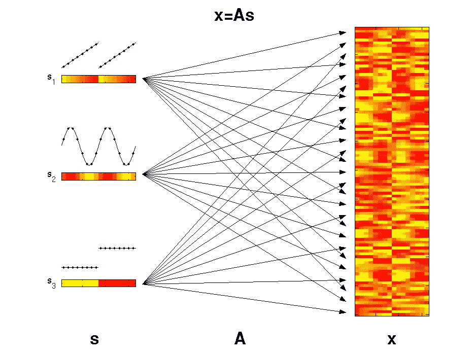

# VAEs 过采样

> 原文：<https://towardsdatascience.com/oversampling-with-vaes-e410887fe51?source=collection_archive---------45----------------------->

## 使用 VAEs 生成欺诈交易

我作为一个研究团队的成员与 VAEs 一起工作了一段时间。我总是想知道它们在实践中何时何地被使用。当然有很多很好的例子。在这篇博客中，我想向你展示如何使用 VAE 在高度不平衡的[信用卡欺诈检测](https://www.kaggle.com/mlg-ulb/creditcardfraud)数据上训练一个分类器。

*   如何训练一个简单的 VAE
*   如何使用训练有素的 VAE 平衡数据？(我将讨论两种策略)
*   SMOTE 的讨论与比较

使用简单的流程生成复杂的数据。图片摘自[[http://PhD thesis-bio informatics-maxplanckinstitute-molecularplanphys . Matthias-scholz . de/](http://phdthesis-bioinformatics-maxplanckinstitute-molecularplantphys.matthias-scholz.de/)]

## 1.如何训练简单的 VAE？

VAE 是一种生成模型，试图通过将特征与一组潜在变量相关联来捕捉特征的联合概率分布。

假设有一个简单高斯分布的变量`z`。如果我们通过一个密集的神经网络传递这个变量，`z`的不同维度开始混合在一起，并在输出的维度(在这种情况下是数据的特征)之间创建高度复杂的相关性。

`p(x) = p(x|z)p(z)`

在提供的[代码](https://github.com/hosseinsadeghi/oversampling_vae)中，您将看到如何定义一个模型并训练它。

为了简化，我修改了目标，使用 MSE 作为 VAE 目标的重建部分的目标函数。所以我们训练的不是爱尔博，而是一个伪爱尔博。

我选择只在少数民族班训练 VAE。这完全忽略了数据中的结构(在这种情况下，正常的事务是什么样子)。然而，我认为这没关系，因为少数类不同于正常数据。

## 2.如何使用训练有素的 VAE 平衡数据？

一旦我们有了训练好的模型，我们就可以使用生成尽可能多的样本。

## 2.1 通过正向传递生成样本

如所解释的，使用 VAE 的分级设计，我们可以通过简单地使正态高斯分布的样本通过解码器网络来从模型中采样。根据模型的能力，我们可能会也可能不会准确地捕捉到这种分布。这就是所谓的方差高估。

使用这种方法，开箱即用的 XGBoost 分类器给出的平均精确召回分数为 0.50

## 2.2 通过潜在空间中的插值生成样本

另一种生成样本的方法是使用 VAE 的 autoencoder 属性。

首先，我们通过编码器网络传递现有数据。一旦我们找到了最佳点(每个潜在维度的平均值)，我们就可以用它在不同的点之间进行插值。例如，我们可以取另一个第二个数据点，找到它的最佳潜在变量值，然后在潜在空间中的值之间随机插值。

Z1 ~ p(Z1 | x1)，z2 ~ p(z2 | x2)

z = a Z1+(1-a)z2

x～p(x | z)

如果我们对所有可用的数据进行编码，并对它们进行许多随机配对插值，我们就可以生成许多新的样本，用少数类来扩充数据。

该方法显著改善了分类结果。我发现 XGBoost 和 Random Forest 给出了或多或少相同的召回率、f1 值和 0.65 的平均精确召回率。

## 结论

我们可以看到使用 VAE 对数据集进行过采样是多么容易。这种方法工作得非常好，它提高了 F1 分数和回忆分数，同时保持大约相同的准确度(并且非常高，达到 99.98%)。

然而，似乎像 SMOTE 这样更好的方法[更适合过采样](https://www.kaggle.com/janiobachmann/credit-fraud-dealing-with-imbalanced-datasets)的工作。平心而论，如果我们有大量的维度，SMOTE 的计算量要少得多。这还能进一步改进吗？

## 最后的想法

我想我留给你几个问题。我可能会创建其他博客来回答这些问题。
——你认为这是 VAE 的一个好用途吗？
-您认为使用 VAE 可以在多大程度上改善过采样过程？
-你还能想到其他能受益于 VAE 的应用吗？
-有没有办法通过将信息传播到 VAE 来提高分类器的性能？

请查看这个存储库，获取工作示例、代码和更详细的讨论。
[https://github.com/hosseinsadeghi/oversampling_vae](https://github.com/hosseinsadeghi/oversampling_vae)