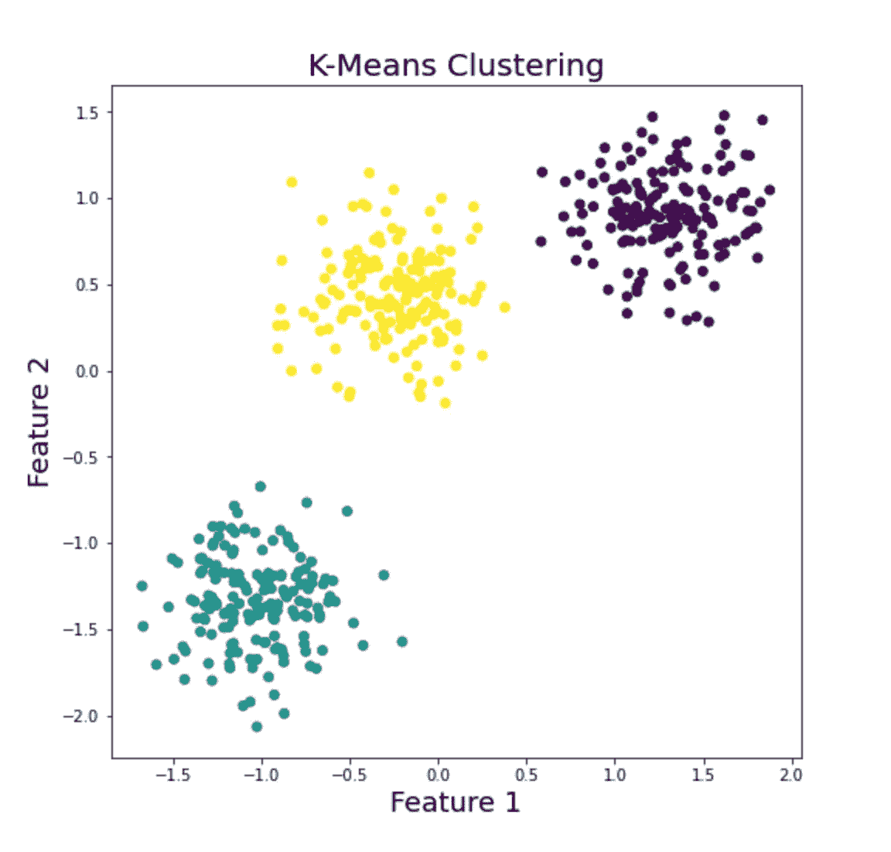
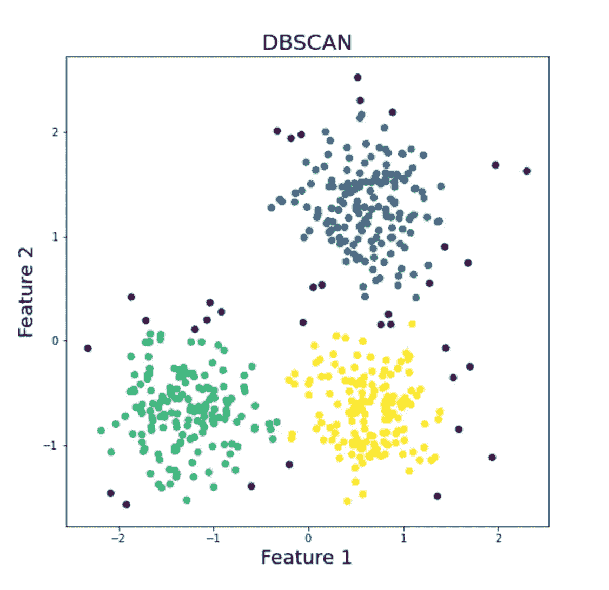
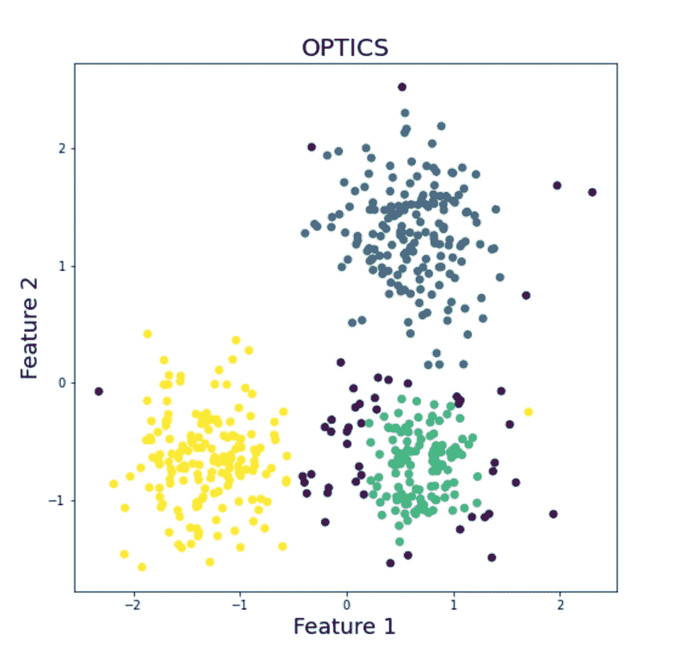

# 聚类算法概述

> 原文：<https://towardsdatascience.com/overview-of-clustering-algorithms-27e979e3724d?source=collection_archive---------40----------------------->

## 实践聚类算法:Python 中的演练！

凯利·西克玛在 [Unsplash](https://unsplash.com?utm_source=medium&utm_medium=referral) 上的照片

# 使聚集

聚类是一种无监督的技术，其中相似数据点的集合被分组在一起以形成聚类。如果簇内(同一簇内的数据点)相似性高，而簇间(簇外的数据点)相似性低，则称该簇是好的。聚类也可以被视为一种**数据压缩**技术，其中一个聚类的数据点可以被视为一个组。聚类也称为**数据分割**，因为它对数据进行分区，使得一组相似的数据点形成一个聚类。

## 聚类与分类有何不同？

分类算法是区分组和分类的好技术。分类需要手动标注数据，当数据集很大时，这是一个很累的过程。反过来的过程怎么样？即将相似的数据点分割在一起，并给它们分配聚类标签。聚类算法不需要标签来进一步处理，因为它是一种无监督的技术。

# 集群的要求

*   可量测性
*   应对不同属性的潜力
*   对噪声和异常值的鲁棒性
*   面对高维数据的能力

# 聚类方法

最常见的聚类方法是，

*   分割方法
*   分层方法
*   基于密度的方法
*   基于模型的方法

> ***分区方法:*** *分区方法包括对数据进行分区，对相似项的组进行聚类。该方法中常用的算法有，*

*   k 均值
*   k-水母类
*   k 模式

> ***分层方法:*** *分层方法是将数据进行分层分解。存在两种类型的分层方法，*

*   凝聚(自下而上的方法)
*   分裂(自上而下的方法)

> ***基于密度的方法:*** *基于密度的方法用于异常检测。高密度的数据点被分组在一起，留下低密度的数据点。*

*   带噪声应用的基于密度的空间聚类
*   光学(排序点以识别簇结构)

> ***基于模型的方法:*** *基于模型的方法涉及应用模型来寻找最佳的聚类结构。*

*   EM(期望最大化)算法

在这篇文章中，我们集中讨论一些**分割方法和基于密度的方法的算法。**

# 用 Python 加载所需的库

# 分割方法

## 1.k 均值聚类

k 均值聚类是一种经典的聚类方法。K-Means 通过计算一个聚类的均值来迭代地重新定位聚类中心。

*   最初，K-Means 随机选择 *k* 个聚类中心。
*   计算每个数据点和聚类中心之间的距离(通常使用欧几里德距离)。数据点被分配给与其非常接近的聚类。
*   在所有数据点被分配到一个聚类之后，该算法计算聚类数据点的平均值，并将聚类中心重新定位到其对应的聚类平均值。
*   这个过程一直持续到聚类中心不变。

PC:作者

使用 K-Means 的优点是可伸缩性。K-Means 在大数据上表现很好。使用 K-Means 的主要缺点是对异常值敏感。在计算聚类的均值时，离群点会产生严重的影响。聚类结果根据 *k* 值和聚类中心的初始选择而不同。K-Means 算法仅适用于球形数据，而不适用于任意形状的数据。

## 2.k-模式聚类

K-Means 适用于连续数据。分类数据呢？K-Modes 聚类可以解决这个问题。该算法非常类似于 K-Means，但是 K-Modes 不是计算聚类的平均值，而是计算聚类的模式(一个经常出现的值)。

*   最初，K-Mode 随机选择 *k* 个聚类中心。
*   计算每个数据点和聚类中心之间的相似性。数据点被分配给与其具有高相似性的聚类。
*   在所有数据点被分配到一个聚类之后，该算法计算聚类数据点的模式，并将聚类中心重新定位到其对应的聚类模式。
*   这个过程一直持续到聚类中心不变。

## 如何为 *k* 找到一个最优值？

肘方法和轮廓指数是最常用的方法来寻找 k 的最佳值。

# 基于密度的方法

## 1.基于密度的噪声应用空间聚类

DBSCAN(带噪声的应用程序的基于密度的空间聚类)是一种基于密度的聚类算法，能够对任意形状的数据执行良好的操作。DBSCAN 查找密集的数据点，并将其分配给一个聚类，将不太密集的数据点从该聚类中分离出来

**数据库扫描术语**

*   如果一个数据点 *q* 在另一个数据点 *p* 的**半径ϵ** 内，那么该数据点 *q* 被认为是该数据点 *p* 的**ϵ-neighborhood(ε邻域)**。
*   如果点 *p* 的ϵ-neighborhood 由 ***MinPts(最小点)中提到的值组成，则称数据点 *p* 为**核心对象**。*** 例如，考虑 **MinPts = 5，如果 *p* 的ϵ-neighborhood 由 5 个数据点组成，则** *p* 被称为核心对象。
*   如果点 *p* 在 *q* 的ϵ-neighborhood 内，则称一个数据点 *p* 是从点 *q* 直接密度可达的。

它是如何工作的？DBSCAN 检查每个数据点的ϵ-neighborhood。如果 *p* 是核心对象，并且其在ϵ-neighborhood 的数据点高于 MinPts 的值，则它在核心对象 *p* 周围形成新的聚类。DBSCAN 迭代地直接寻找密度可达的数据点，并且可以合并其他少数聚类。该过程继续进行，直到不再有要分析的点。

PC:作者

使用 DBSCAN 的缺点是存在超参数ϵ和 *MinPts。*产生的结果因超参数的选择值而异。

## 2.光学

**OPTICS(排序点以识别聚类结构)**是一种聚类算法，克服了在 DBSCAN 中使用超参数所面临的缺点。光学与 DBSCAN 非常相似，但它使用灵活的半径ϵ.值

**光学术语**

*   使点 *p* 成为核心对象的𝜖′的最小值(小于𝜖′的值)称为 *p* 的**核心距离**。
*   p 的核距离和 p 与 q 之间的欧氏距离的最大值称为点 q 相对于另一个对象 p 的**可达距离**

PC:作者

# 摘要

聚类在销售和营销行业中用于识别正确的客户群。网飞使用聚类算法将兴趣相似的观众分组。聚类是研究工作的一个领域，可用算法的许多变体都处于开发阶段。

**在我的 Kaggle 笔记本中找到这篇文章:**[https://www . ka ggle . com/srivignesh/overview-of-clustering-algorithms](https://www.kaggle.com/srivignesh/overview-of-clustering-algorithms)

**参考文献:**

[1]韩家玮和 Micheline Kamber，数据挖掘:概念和技术第二版(2006)

*在*[*LinkedIn*](https://www.linkedin.com/in/srivignesh-rajan-123569151/)*[*Twitter*](https://twitter.com/RajanSrivignesh)*上与我联系！**

***快乐的机器学习！***

## ***谢谢！***