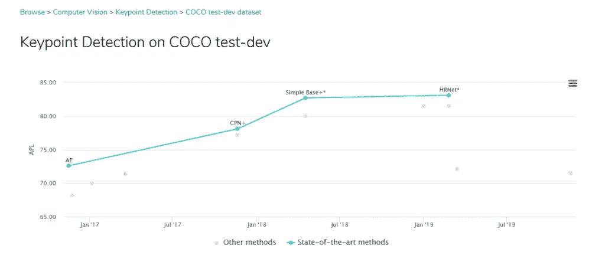
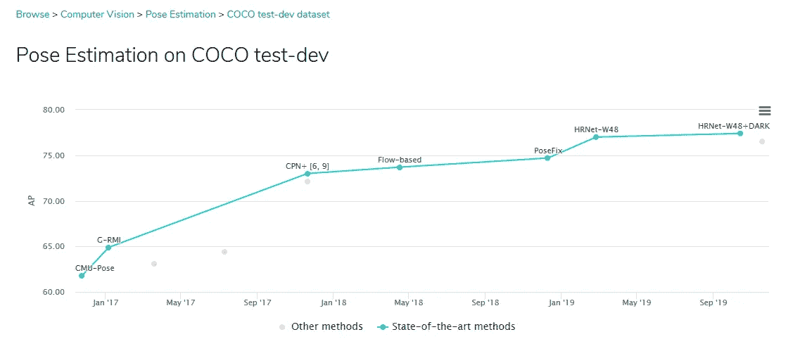
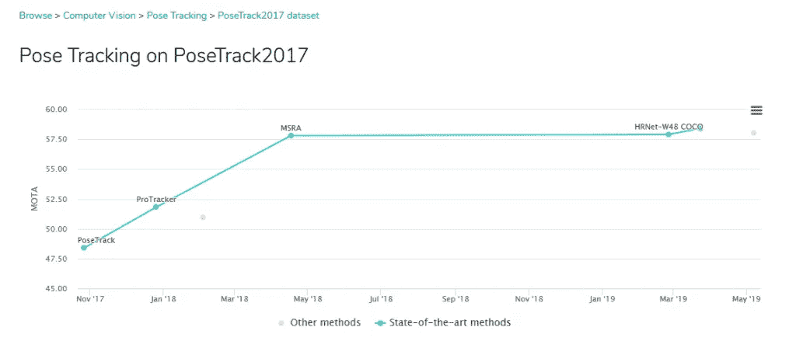
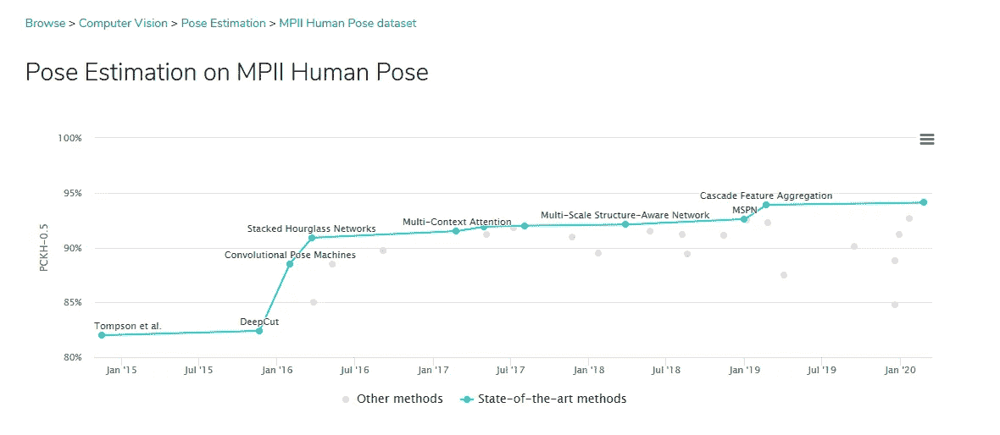
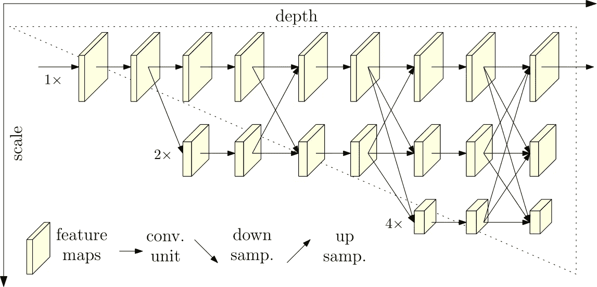
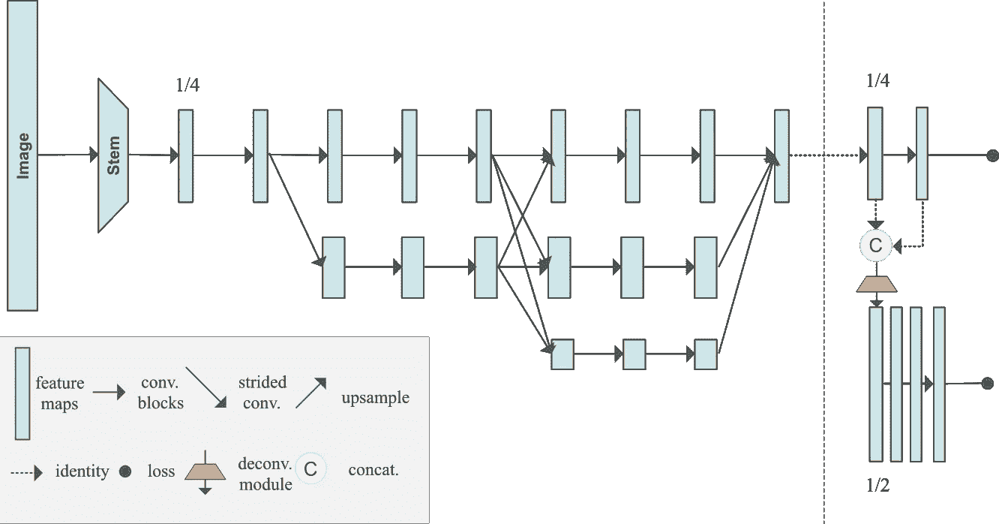
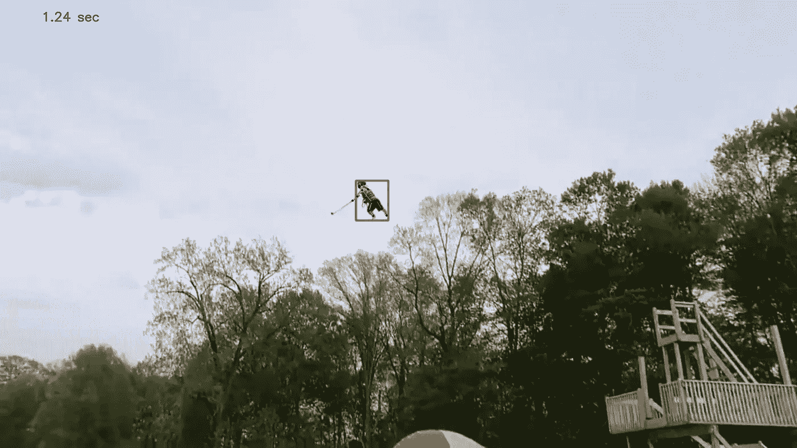

# 人体姿态估计神经网络概述—HRNet+higher rnet，架构和常见问题— 2d3d.ai

> 原文：<https://towardsdatascience.com/overview-of-human-pose-estimation-neural-networks-hrnet-higherhrnet-architectures-and-faq-1954b2f8b249?source=collection_archive---------6----------------------->

[高分辨率网络(HRNet)](https://arxiv.org/pdf/1902.09212.pdf) 是一种用于人体姿势估计的最先进的神经网络，这是一种图像处理任务，可以在图像中找到对象的关节和身体部位的配置。该网络的新颖之处在于保持输入数据的高分辨率表示，并将其与高到低分辨率子网络并行组合，同时保持有效的计算复杂性和参数计数。

演示视频 HRNet 姿势估计超过世界纪录侏儒发射！

# 在本帖中，我们将介绍:

*   为什么选择 HRNet？
*   人力资源网与建筑
*   HigherHRNet:用于自下而上人体姿态估计的尺度感知表征学习
*   演示视频
*   代码常见问题

# 为什么选择 HRNet？

*   良好的文档化和维护的开源([链接](https://github.com/leoxiaobin/deep-high-resolution-net.pytorch))。github 上的 2490 颗星——在所有人类姿势评估中排名最高。
*   它被用作同一研究领域中最近的新架构的主干(例如在[项目](https://jingdongwang2017.github.io/Projects/HRNet/PoseEstimation.html)
*   许多姿势估计挑战中的顶级竞争者([参考](https://paperswithcode.com/paper/deep-high-resolution-representation-learning)):

可可排名第一

可可排名第一

PoseTrack2017 排名第二

MPII 排名第六

# HRNet 解释道

当处理人体姿态估计时，我们需要能够检测图像中的人，并估计他的关节(或关键点)的配置。因此，存在两种可能的姿势估计方法:

## 自顶向下和自底向上的姿态估计

自下而上的方法首先找到关键点，然后将它们映射到图像中的不同人物，而自上而下的方法首先使用一种机制来检测图像中的人物，在每个人物实例周围放置一个边界框区域，然后估计边界框内的关键点配置。

自上而下的方法依赖于单独的人检测网络，并且需要为每个人单独估计关键点，因此它们通常是计算密集型的，因为它们不是真正的端到端系统。相比之下，自下而上的方法首先通过预测不同解剖关键点的热图来定位输入图像中所有人的无身份关键点，然后将他们分组到人实例中，这有效地使他们更快。

自上而下的方法更为普遍，并且目前实现了更好的预测准确性，因为它将两项任务分开，以使用为每项任务训练的特定神经网络，并且因为自下而上的方法由于图像中不同人的比例变化而在预测关键点方面存在问题(也就是说，直到 HigherHRNet 出现——如下)。自顶向下方法中不存在这种比例变化，因为所有人员实例都被规范化为相同的比例。而自底向上的方法被认为更快，因为

HRNet 使用自上而下的方法，该网络是基于由另一个网络(FasterRCNN)在推理\测试期间检测的人包围盒来估计关键点而构建的。在训练期间，HRNet 使用给定数据集的带注释的边界框。

## 两个数据集用于训练和评估网络

*   COCO —超过 20 万张图片和 25 万个人实例，标注了 17 个关键点。COCO 数据集评估还需要评估人的边界框，这是使用 FasterRCNN 网络完成的。评估度量是[对象关键点相似性(OKS)](http://cocodataset.org/#keypoints-eval)——标准的关键点检测准确度度量。
*   MPII 人体姿势——大约 25000 张照片，40000 个主题。MPII 评估是使用数据集中带注释的边界框完成的。

# 体系结构

以下是基于 [git 项目](https://github.com/leoxiaobin/deep-high-resolution-net.pytorch)中代码的神经网络图，之后是研究论文中描述的网络图。

基于公开开源的 HRNet 网络架构

HRNet 网络体系结构如本文所述

需要注意的重要结构是，网络计算高分辨率子网络(分支 1)与低分辨率子网络(分支 2–4)并行。子网络通过融合层融合，使得每个高到低分辨率表示反复接收来自其他并行表示的信息，导致丰富的高分辨率表示。

输入图像为 256 x 192 或 384 x 288，对应的热图输出尺寸为 64 x 48 或 96 x 72。前两个卷积根据预期的热图大小减小输入大小。网络输出热图大小和 17 个通道-热图中每个关键点(17 个关键点)的每个像素的值。

所描述的开源架构是针对 32 通道配置的。对于 48 个通道，从第一个过渡层开始改变每一层，直到 48 个通道，不同的乘数为 2。

本文中的交换块是开源中的一个模块，交换单元是开源中的保险丝层。在纸图中，过渡层看起来像子网络的独立融合，而在代码中，当创建较低分辨率(较高通道)的子网络时，过渡是基于与另一个卷积层的融合，该融合导致先前最低分辨率的子网络。此外，在开放源代码中，最后一层的融合仅针对高分辨率分支(分支 1)进行计算，而不是针对纸图中看到的所有分支。

下采样是在融合部分(或交换单元)从高分辨率分支转移到较低分辨率分支的跨距=2 的卷积，对于双倍和三倍下采样，仅在最后一次下采样中扩大通道的数量。这要么是代码中的错误，要么是论文中没有明确解释。很可能是代码中的错误，因为信息没有从较大分辨率映射到较深通道中的第一个下采样，即 git 中的[开放问题。](https://github.com/leoxiaobin/deep-high-resolution-net.pytorch/issues/187)

*如果有疑问，使用基于开源的图表——这是运行训练有素的网络时使用的图表。*

## 网络培训

*   对于权重初始化，作者使用 ImageNet 分类数据集上的不同输出层训练相同的网络，并使用权重值作为姿势估计训练的初始化值。
*   在 COCO 数据集上训练 HRNet-W32 的 210 个历元需要大约 50-60 小时，使用 4 个 P100 GPU—[参考](https://github.com/leoxiaobin/deep-high-resolution-net.pytorch/issues/3)。

# [higher rnet:自下而上人体姿态估计的尺度感知表示学习](https://arxiv.org/abs/1908.10357)

这是同一个研究小组使用 HRNet 作为主干的自下而上姿势跟踪的新网络。作者解决了自下而上姿态估计中的尺度变化问题(如上所述),并表示他们能够通过输出多分辨率热图和使用 HRNet 提供的高分辨率表示来解决该问题。

HigherHRNet 在 COCO 数据集上的表现优于所有其他自下而上的方法，对于中等身材的人来说收益尤其大。HigherHRNet 还在 CrowdPose 数据集上取得了最先进的结果。作者表示，这表明自下而上的方法比自上而下的方法对拥挤的场景更鲁棒，但在同一数据集上没有与常规的自上而下的 HRNet 结果进行比较。

该网络的主干是常规的 HRNet，但在末端增加了一个部分，用于输出更高分辨率的热图:

体系结构的右侧部分输出两个热图，一个用于低分辨率，一个用于高分辨率，分辨率分别为 128 x 128 和 256 x 256。在推断期间，两个热图被平均聚合到更高的分辨率，并且最高值的点被选择用于关键点检测。梯形是一个反卷积层，它输出 2 倍高的分辨率，后面是 4 个剩余块。此外，对于每个关键点，计算输出标量标签，近标签值形成属于特定人的一组关键点，远标签值指示属于不同人的关键点组。标签是根据本文中[描述的“关联嵌入”方法计算的。仅针对最低分辨率的热图训练和预测标签值，因为作者发现，根据经验，较高分辨率的热图标签值无法很好地预测，甚至无法收敛。](https://arxiv.org/abs/1611.05424)

在训练期间，损失函数是热图预测损失和标签值损失的加权平均值(根据关联嵌入方法，相同组的标签之间的较小距离导致较低的损失，不同组的标签之间的较大距离也是如此)。每个热图分辨率损失是根据地面实况独立计算的，它们是总和。

检查 HigherHRNet 的[开源代码](https://github.com/HRNet/HigherHRNet-Human-Pose-Estimation)还没有推理代码可用于创建基于训练好的网络的演示姿势估计视频。

# 演示视频

演示视频基于 HRNet 中的推理脚本(这是一个修改过的脚本，在 joins 之间画棍子，运行时不打开 pop 图像— [脚本链接](https://drive.google.com/drive/folders/1KR462gnw05sB0nN9sicR8evyrsy1zwKs?usp=sharing))。感谢罗斯·史密斯的 Youtube 频道。

## 视频特征

*   1920X1080 像素，每秒 25 帧，56 秒(1400 帧)。
*   多人、挑战性场景的好例子——同质和异质背景、变化的背景、不同的摄像机角度，包括放大和缩小，以及姿势令人敬畏的侏儒。

## 运行时信息

*   带有 Resnet50 的 FasterRCNN 用于人员检测
*   使用具有 48 个通道和 384 x 288 分辨率输入图像的 HRNet。
*   戴尔笔记本电脑酷睿 i5–7200，32GB 内存，GeForce 940MX，使用 Ubuntu 18.04。推断期间 GPU 达到 100%利用率。
*   跟踪一帧中所有边界框的平均时间:1.14 秒
*   一帧中所有姿态估计的平均时间:0.43 秒
*   一帧解析的平均总时间:1.62 秒
*   代码在整个视频上运行推理的总时间:2586.09 秒

## 演示中的问题

当评估图像处理算法的结果时，重要的是要注意该算法哪里执行得不好，这给出了其固有问题的线索:

*   具有木制背景的赤膊者在 faster CNN 中未被很好地检测到-这可能是 faster CNN 网络的训练数据问题，没有足够的赤膊样本或没有足够的背景颜色类似于人的颜色的样本
*   大黄色蹦床被检测为人(分钟 00:11)-这可能显示了同质场景的快速 CNN 的固有问题。
*   在边界框中检测到 17 个关键点，即使框中没有人或没有显示所有关节 HRNet 的构建方式是必须预测所有 17 个关节，即使它们不是可视的。

*   值得注意的是，在视频的开始，即使有遮挡，也有很好的姿势估计。处理图像中由于模糊而丢失的信息是一件棘手的事情，HRNet 能够很好地解决这个问题。
*   另外值得一提的是，矮人手持的棍子估计不是四肢之一，这也是一个积极的迹象。

# 代码常见问题

1.  姿势跟踪在 RGB([https://github . com/leoxiaobin/deep-high-resolution-net . py torch/issues/41](https://github.com/leoxiaobin/deep-high-resolution-net.pytorch/issues/41))中完成，而人检测基线训练网络在 BGR([https://github . com/leoxiaobin/deep-high-resolution-net . py torch/issues/15](https://github.com/leoxiaobin/deep-high-resolution-net.pytorch/issues/15))中完成
2.  使用 coco 数据集 API pycocotools 与 python 3【https://github.com/cocodataset/cocoapi/issues/49 不兼容。HRNet 基本上可以工作，但是一旦你开始使用 pycocotools，可能会有例外。
3.  必须使用 numpy 1.17:[https://github . com/leoxiaobin/deep-high-resolution-net . py torch/issues/177](https://github.com/leoxiaobin/deep-high-resolution-net.pytorch/issues/177)
4.  如何用自己的数据集训练网络:[https://github . com/leoxiaobin/deep-high-resolution-net . py torch/issues/68](https://github.com/leoxiaobin/deep-high-resolution-net.pytorch/issues/68)
5.  在推理中，考虑使用 model.no_grad 来提高性能和降低内存使用量(我还没有测试过)
6.  第三个关节参数似乎总是为零，对于 joints_3d_vis 对象，前两个参数总是具有相同的生存能力标志，而第三个参数也是零，来自 coco . py--> _ load _ coco _ key point _ annotation _ kernal()。joins dataset->**getitem**()->affine _ transform 中，关节的大小为 3，作为仿射变换的准备，但第三个参数从未使用过(可能是遗留的，或者，它被放置在适当的位置，供以后用于 HigherHRNet)。同样的事情似乎发生在 MPII 数据集上。
7.  在验证\测试期间，不使用带注释的关节(即使它们保存在 dataloader 管道中)，因此测试运行期间打印的准确性结果不正确。试运行期间的整个精度计算流程是多余的。在运行结束时，他们使用 coco api 来计算正确的精度度量
8.  推理配置为 384X288(但自述文件说使用 256X192)

## 图像和关节变换

*   演示/推断— box_to_center_scale()根据框缩放图像，但不清楚 pixel_std=200 做什么。关于它有几个公开的问题:
    [https://github . com/Microsoft/human-pose-estimation . py torch/issues/26](https://github.com/microsoft/human-pose-estimation.pytorch/issues/26)
    [https://github . com/leoxiaobin/deep-high-resolution-net . py torch/issues/23](https://github.com/leoxiaobin/deep-high-resolution-net.pytorch/issues/23)
    [https://github . com/leoxiaobin/deep-high-resolution-net . py torch/issues/9](https://github.com/leoxiaobin/deep-high-resolution-net.pytorch/issues/9)
    [https://github . com 别管它了。](https://github.com/microsoft/human-pose-estimation.pytorch/issues/94)
*   中心和比例是根据原始图像中检测到的注释 bbox 的位置。中心是原始图像上 bbox 的中心，比例应该是 bbox 相对于原始图像的大小—来自 coco . py--> _ load _ coco _ person _ detection _ results()。bbox 由 x，y，w，h = box[:4] (x，y，width，height)构成。计算比例时，会根据预先配置的 pixel_std 和 1.25 比例进行纵横比和归一化。
*   推理-> get _ pose _ estimation _ prediction 返回原始图像上的坐标(没有旋转，只有每个边界框的中心和比例)
*   JointsDataset-> getitem-> get _ affine _ transform 获取一个变换，该变换根据原始图像比 bbox 大多少来放大原始图像的比例，然后将图像置于 bbox 的中心。
*   然后，warpAffine 将原始图像转移到中心，并提供缩放比例，这意味着我们应该在输出图像中看到 bbox 的区域。输出图像被裁剪，其' 0，0 点对应于原始图像上的点，该点在转换后落在 0，0 坐标上，裁剪是从该点向右下移动完成的。
*   在训练期间，仿射变换还具有随机旋转缩放和翻转类关节 Dataset → __getitem__()
*   JointsDataset 中 self.db 中的对象通过引用进行更改。self.db 填充在 coco dataset-> _ load _ coco _ person _ detection _ results()类的第 246 行。
*   变换计算是:x_new(of x_old)，y_new(of y_old)，z = T*(x_old，y_old，1)
    好地方看例子:[https://docs . opencv . org/master/DD/d52/tutorial _ js _ geometric _ transformations . html](https://docs.opencv.org/master/dd/d52/tutorial_js_geometric_transformations.html)
*   变换后关节位置可以是负的，它们使用与图像相同的变换矩阵进行传递，并且由于存在向中心的变换和根据边界框的放大比例，一些关节可以在框外。
*   MPII 的中心和比例尺标注不完全清楚—[https://github . com/leoxiaobin/deep-high-resolution-net . py torch/issues/51](https://github.com/leoxiaobin/deep-high-resolution-net.pytorch/issues/51)

*原载于 2020 年 6 月 13 日*[*https://2d3d . ai*](https://2d3d.ai/index.php/2020/06/14/human-pose-estimation-hrnet/)*。*