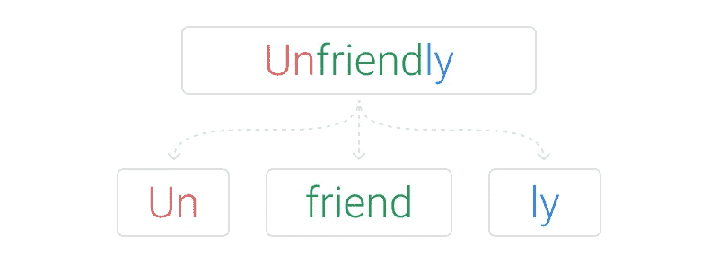

# 自然语言处理中的标记化算法综述

> 原文：<https://towardsdatascience.com/overview-of-nlp-tokenization-algorithms-c41a7d5ec4f9?source=collection_archive---------5----------------------->

## 符号化方法介绍，包括子词、BPE、词块和句子块

汉娜·赖特在 [Unsplash](https://unsplash.com?utm_source=medium&utm_medium=referral) 上的照片

## ⚠️读了我在⚠️博客中的[原帖](https://anebz.eu/nlp-tokenization-algorithms)

本文是对标记化算法的概述，从词级、字符级和子词级标记化，重点是 BPE、单字 LM、词块和句子块。这意味着专家和初学者都可以阅读。如果有任何概念或解释不清楚，请与我联系，我很乐意澄清任何需要。

# 什么是标记化？

标记化是自然语言处理的第一步，它的任务是将一个文本序列分割成具有语义意义的单元。这些单元被称为记号，记号化的难点在于如何得到理想的拆分，使得文本中的所有记号都具有正确的含义，并且没有遗漏记号。

在大多数语言中，文本由空格分隔的单词组成，其中每个单词都有一个语义。我们稍后会看到使用符号的语言会发生什么，其中符号的含义比单词复杂得多。现在我们可以用英语工作。举个例子:

*   原文:我吃了一个汉堡，味道不错。
*   标记化文本:['I '，' ate '，' a '，' burger '，'，' and '，' it '，' was '，' good '，'.']

“Burger”是一种食物，“and”是连词，“good”是积极的形容词，等等。通过这种方式标记，每个元素都有一个意义，通过连接每个标记的所有意义，我们可以理解整个句子的意义。标点符号也有自己的记号，逗号分隔从句，句号表示句子的结束。下面是另一种标记化方法:

*   标记化的文本:['I ate '，' a '，' bur '，' ger '，' an '，' d it '，' wa '，' s good '，'.']

对于多词单位“我吃了”，我们可以只添加“我”和“吃了”的含义，对于子词单位“bur”和“ger”，它们没有单独的含义，但通过将它们连接起来，我们可以得到熟悉的单词，我们可以理解它的意思。

但是我们怎么处理它呢？这是什么意思？作为人类和说英语的人，我们可以推断出‘it’是代词，字母‘d’属于前一个单词。但在这种标记化之后，前面的单词“an”在英语中已经有了意义，冠词“an”与“and”非常不同。这个怎么处理？你可能会想:**坚持使用单词，给标点符号赋予它们自己的符号。**这是最常见的记号化方式，叫做词级记号化。

# 单词级标记化

它只包括用空格和标点符号分割句子。Python 中有很多这样的库，包括 NLTK、SpaCy、Keras、Gensim，或者你可以自定义正则表达式。

对空白进行拆分也可以拆分应该被视为单个标记的元素，例如 New York。这是有问题的，尤其是名字、借用的外国短语以及有时由多个单词组成的复合词。

像“不要”这样的词，或者像“约翰的”这样的缩写词呢？获得标记“不要”或“做”和“不要”更好吗？如果文中出现错别字，burger 变成了‘birger’怎么办？我们人类可以看到这是一个打字错误，用'汉堡'代替这个词并继续，但机器不能。错别字会影响整个 NLP 管道吗？

单词级标记化的另一个缺点是它产生了巨大的词汇量。每个标记都保存在一个标记词汇表中，如果这个词汇表是用所有输入文本中的所有唯一单词构建的，那么它将创建一个巨大的词汇表，这会在以后产生内存和性能问题。一个当前最先进的深度学习架构， [Transformer XL](https://arxiv.org/abs/1901.02860) ，拥有 267735 的词汇量。为了解决词汇量大的问题，我们可以考虑用**字符代替单词**来创建标记，这就是所谓的字符级标记化。

# 字符级标记化

由 [Karpathy 在 2015 年](https://github.com/karpathy/char-rnn)首次推出，它不是将文本拆分成单词，而是拆分成字符，例如，smarter 变成了 s-m-a-r-t-e-r。词汇量大大减少到语言中的字符数，英语加上特殊字符为 26 个。拼写错误或生僻字处理得更好，因为它们被分解成字符，而这些字符在词汇表中是已知的。

在字符级标记序列已经显示出一些令人印象深刻的结果。[来自 OpenAI 的拉德福德等人(2017)](https://arxiv.org/abs/1704.01444) 表明字符级模型可以捕捉文本的语义属性。[来自 Deepmind 的 Kalchbrenner 等人(2016)](https://arxiv.org/abs/1610.10099) 和 [Leet 等人(2017)](https://www.aclweb.org/anthology/Q17-1026) 都演示了角色层面的翻译。这些都是特别令人印象深刻的结果，因为翻译的任务是捕捉潜在文本的语义理解。

减小词汇表的大小需要权衡序列长度。现在，每个单词被拆分成所有的字符，标记化的序列比初始文本长得多。单词“smarter”被转化为 7 种不同的符号。此外，标记化的主要目标没有实现，因为字符，至少在英语中，没有语义。只有当字符连在一起时，它们才有意义。作为单词和字符标记化之间的中介，子单词标记化产生了**子单词单元**，比单词小，但比字符大。

# 子词级标记化

子词标记化示例

子词级标记化不会转换大多数常用词，而是将罕见词分解成有意义的子词单元。如果“不友好”被标记为一个罕见的词，它将被分解为“un-friend-ly”，这些都是有意义的单位，“un”表示相反的意思，“friend”是一个名词，“ly”将其转化为副词。这里的挑战是如何进行细分，我们如何做到“不友好”而不是“不友好”。

截至 2020 年，最先进的深度学习架构，基于 [Transformers、](https://arxiv.org/abs/1706.03762)使用子词级标记化。 [BERT](https://arxiv.org/abs/1810.04805) 对这个例子做了如下的记号化:

*   原文:我有一个新的 GPU。
*   标记化文本:['i '，' have '，' a '，' new '，' gp '，' ##u '，'.']

词汇表中的单词被标记为单词本身，但是在词汇表中找不到“GPU ”,它被视为一个罕见的单词。根据一种算法，决定将其分割成‘gp-u’。“u”前的##表示这个子词与前一个子词属于同一个词。BPE、单字标记法、单词块和句子块是最常见的子词标记化算法。因为这是一个介绍性的帖子，所以会对它们进行简单的解释，如果你对更深入的描述感兴趣，请告诉我，我会为它们每个做更详细的帖子。

## BPE

由 [Sennrich 等人在 2015 年](https://arxiv.org/abs/1508.07909)推出，它迭代合并最频繁出现的字符或字符序列。该算法大致是这样工作的:

1.  获得足够大的语料库。
2.  定义所需的子词词汇大小。
3.  将单词拆分为字符序列，并附加一个特殊的标记，分别显示单词的开头或单词的结尾的词缀/后缀。
4.  计算文本中的序列对及其频率。例如，(' t '，' h ')有频率 X，(' h '，' e ')有频率 y。
5.  根据出现频率最高的序列对生成一个新子词。例如，如果(‘t’，‘h’)在一组对中具有最高的频率，则新的子词单元将变成‘th’。
6.  从步骤 3 开始重复，直到达到子词词汇大小(在步骤 2 中定义)或者下一个最高频率对是 1。按照这个例子，语料库中的(' t '，' h ')将被替换为' th '，再次计算对，再次获得最频繁的对，并再次合并。

BPE 是一种贪婪和确定性的算法，不能提供多重分割。也就是说，对于给定的文本，标记化的文本总是相同的。关于 BPE 如何工作的更详细的解释将在后面的文章中详述，或者你也可以在[的许多其他文章](https://leimao.github.io/blog/Byte-Pair-Encoding/)中找到。

## **Unigram LM**

Unigram 语言建模( [Kudo，2018](https://arxiv.org/abs/1804.10959) )基于所有子词出现都是独立的假设，因此子词序列是由子词出现概率的乘积产生的。算法的步骤如下:

1.  获得足够大的语料库。
2.  定义所需的子词词汇大小。
3.  通过给出一个单词序列来优化单词出现的概率。
4.  计算每个子字的损失。
5.  按损失对符号进行排序，保留单词的前 X %(例如 X=80%)。为了避免超出词汇表实例，建议将字符级作为子词的子集包括在内。
6.  重复步骤 3-5，直到达到子词词汇大小(在步骤 2 中定义)或者没有变化(步骤 5)

Kudo 认为，unigram LM 模型比 BPE 模型更灵活，因为它基于概率 LM，可以输出多个分段及其概率。它不是从一组基本符号开始学习，也不是像 BPE 或单词块那样用某种规则进行合并，而是从大量词汇(例如，所有预标记的单词和最常见的子字符串)开始，然后逐渐减少。

## 文字片

word piece([Schuster and Nakajima，2012](https://research.google.com/pubs/archive/37842.pdf) )最初用于解决日语和韩语语音问题，目前已知用于 BERT，但精确的标记化算法和/或代码尚未公开。它在许多方面与 BPE 相似，只是它基于似然性而不是下一个最高频率对来形成新的子词。算法的步骤如下:

1.  获得足够大的语料库。
2.  定义所需的子词词汇大小。
3.  将单词拆分成字符序列。
4.  用文本中的所有字符初始化词汇表。
5.  根据词汇建立一个语言模型。
6.  通过组合当前词汇中的两个单元来生成新的子词单元，以将词汇递增 1。当添加到模型中时，从所有可能性中选择最能增加训练数据的可能性的新子词单元。
7.  重复步骤 5，直到达到子词词汇大小(在步骤 2 中定义)或者可能性增加低于某个阈值。

## 句子片断

到目前为止，所有的标记化方法都需要某种形式的预标记化，这构成了一个问题，因为不是所有的语言都使用空格来分隔单词，或者有些语言是由符号组成的。SentencePiece 可以接受特定语言的预发音。你可以在 [Github](https://github.com/google/sentencepiece) 找到开源软件。例如， [XLM](https://arxiv.org/abs/1901.07291) 使用了句子片断，并为中文、日文和泰文添加了特定的前缀词。

SentencePiece 在概念上类似于 BPE，但它不使用贪婪的编码策略，实现了更高质量的标记化。SentencePiece 认为字符分组中的模糊性是训练期间模型正则化的一个来源，这使得训练变得更慢，因为有更多的参数需要优化，并且不鼓励 Google 在 BERT 中使用它，而是选择 WordPiece。

# 结论

历史上，标记化方法已经从单词发展到字符，最近发展到子单词级别。这是对标记化方法的一个快速概述，我希望文本是可读和可理解的。关注我的推特了解更多 NLP 信息，或者在那里问我任何问题:)