# Google BigQuery 主要特性概述——练习撰写营销分析请求

> 原文：<https://towardsdatascience.com/overview-of-the-main-google-bigquery-features-28f3ef3af6f?source=collection_archive---------39----------------------->


来源: [Unsplash](https://unsplash.com/photos/5fNmWej4tAA)

## 在本文中，我们将研究 BigQuery 的主要功能，并通过具体的例子展示它们的可能性。您将学习如何编写基本的查询并在演示数据上测试它们。

企业积累的信息越多，在哪里存储信息的问题就越尖锐。如果你没有能力或者没有意愿维护自己的服务器， [Google BigQuery](https://cloud.google.com/bigquery/) (GBQ)可以帮忙。BigQuery 为处理大数据提供了快速、经济高效且可扩展的存储，它允许您使用类似 SQL 的语法以及标准和[用户定义函数](https://cloud.google.com/bigquery/docs/reference/standard-sql/user-defined-functions)编写查询。

# 什么是 SQL，BigQuery 支持哪些方言

结构化查询语言(SQL)允许您在大型数组中检索数据、添加数据和修改数据。Google BigQuery 支持两种 SQL 方言:标准 SQL 和过时的遗留 SQL。

选择哪种方言取决于您的偏好，但是 Google 建议使用标准 SQL，因为它有以下好处:

*   嵌套和重复字段的灵活性和功能性
*   支持 [DML](https://cloud.google.com/bigquery/docs/reference/standard-sql/data-manipulation-language) 和 [DDL](https://cloud.google.com/bigquery/docs/reference/standard-sql/data-definition-language) 语言，允许您更改表中的数据以及管理 GBQ 中的表和视图
*   与传统 SQL 相比，处理大量数据的速度更快
*   支持所有未来的 BigQuery 更新

您可以在 [BigQuery 文档](https://cloud.google.com/bigquery/docs/reference/standard-sql/migrating-from-legacy-sql)中了解更多关于方言差异的信息。

默认情况下，Google BigQuery 查询在遗留 SQL 上运行。

您可以通过几种方式切换到标准 SQL:

1.  在 BigQuery 界面的查询编辑窗口中，选择**显示选项**并取消勾选**使用遗留 SQL** 旁边的复选标记:

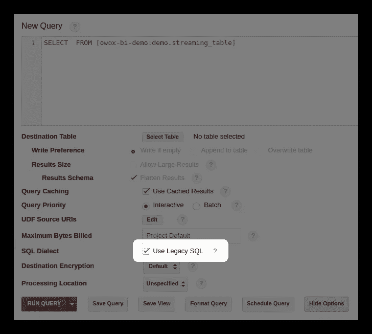

图片由作者提供

1.  在查询之前，添加#standardSQL 行，并从新行开始查询:

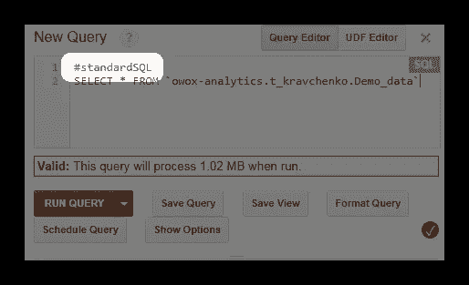

图片由作者提供

# 从哪里开始

首先，下载您的演示数据表，并将其上传到您的 Google BigQuery 项目。最简单的方法是使用 OWOX BI BigQuery Reports 插件。

1.  打开 Google Sheets 并[安装 OWOX BI BigQuery Reports 插件](https://gsuite.google.com/marketplace/app/owox_bi_bigquery_reports/263000453832?pann=cwsdp&hl=en)。
2.  打开下载的包含演示数据的表格，选择**OWOX BI big query Reports**–>**上传数据到 BigQuery** :

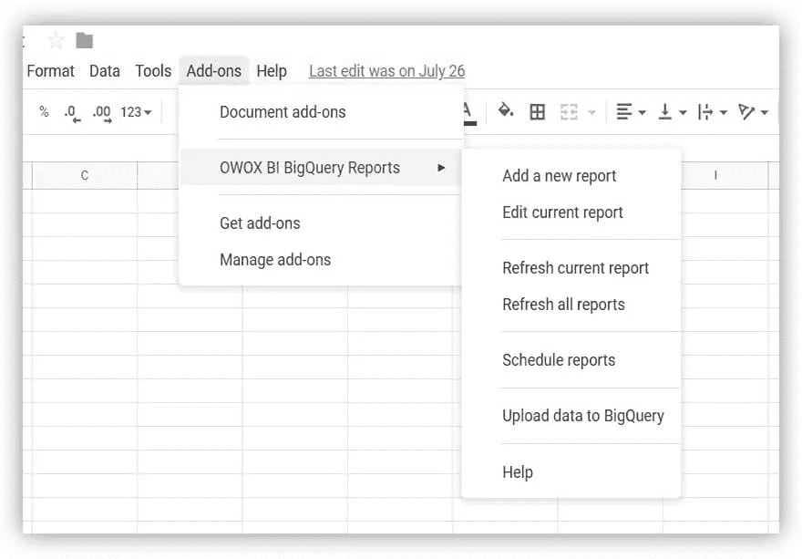

图片由作者提供

1.  在打开的窗口中，选择您的 Google BigQuery 项目，一个数据集，并为将要存储加载数据的表想一个名称。
2.  指定加载数据的格式(如屏幕截图所示):

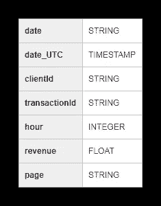

图片由作者提供

如果您在 Google BigQuery 中没有项目，[创建一个](https://cloud.google.com/bigquery/docs/quickstarts/quickstart-web-ui#before-you-begin)。要做到这一点，你需要在谷歌云平台中有一个[活跃的付费账户。不要让你需要链接银行卡吓到你:在你不知情的情况下，你不会被收取任何费用。此外，当你注册时，你会收到 12 个月的 300 美元，你可以用它来存储和处理数据。](https://cloud.google.com/billing/docs/how-to/manage-billing-account?visit_id=636776330112298770-3578127081&rd=1)

在讨论 Google BigQuery 特性之前，让我们记住传统 SQL 和标准 SQL 方言中的基本查询是什么样的:

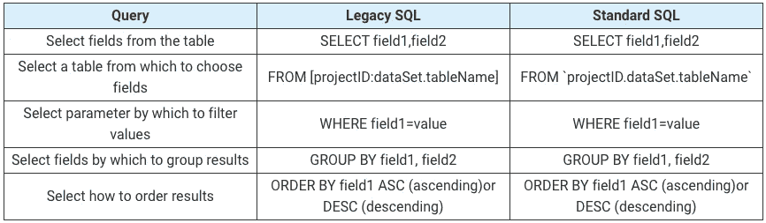

# Google BigQuery 特性

在构建查询时，您将最常使用聚合、日期、字符串和窗口函数。让我们仔细看看每一组函数。

# 聚合函数

聚合函数为整个表提供汇总值。例如，您可以使用它们来计算平均支票金额或每月总收入，或者您可以使用它们来选择购买次数最多的用户群。

这些是最常用的聚合函数:

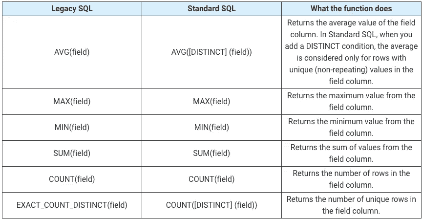

让我们看看演示数据，看看这些函数是如何工作的。我们可以计算交易的平均收入、最高和最低金额的购买、总收入、总交易和唯一交易的数量(以检查购买是否重复)。为此，我们将编写一个查询，在其中指定 Google BigQuery 项目的名称、数据集和表。

**#传统 SQL**

```
**SELECT**   
  **AVG**(revenue) **as** average_revenue,   
  **MAX**(revenue) **as** max_revenue,   
  **MIN**(revenue) **as** min_revenue,   
  **SUM**(revenue) **as** whole_revenue,   
  **COUNT**(transactionId) **as** transactions,      EXACT_COUNT_DISTINCT(transactionId) **as** unique_transactions 
**FROM**   
  [owox-analytics:t_kravchenko.Demo_data]
```

**#标准 SQL**

```
**SELECT**   
  **AVG**(revenue) **as** average_revenue,   
  **MAX**(revenue) **as** max_revenue,   
  **MIN**(revenue) **as** min_revenue,   
  **SUM**(revenue) **as** whole_revenue,   
  **COUNT**(transactionId) **as** transactions,      **COUNT**(**DISTINCT**(transactionId)) **as** unique_transactions 
**FROM**   
  `owox-analytics.t_kravchenko.Demo_data`
```

结果，我们将得到以下结果:

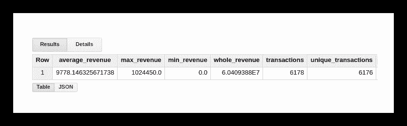

图片由作者提供

您可以使用标准的 Google Sheets 函数(SUM、AVG 和其他函数)或使用数据透视表，在带有演示数据的原始表格中检查这些计算的结果。

从上面的截图可以看出，交易数和唯一交易数是不一样的。这表明我们的表中有两个事务具有相同的 transactionId:

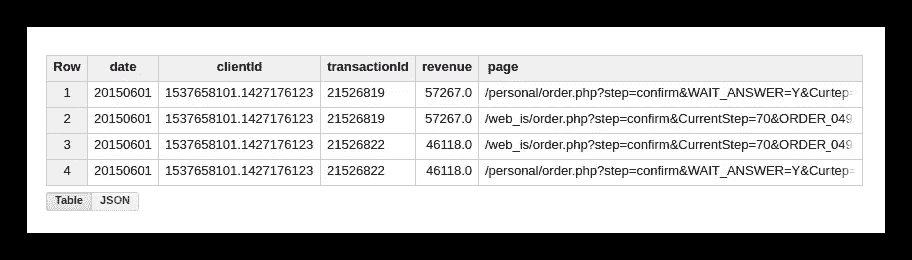

图片由作者提供

如果您对唯一的事务感兴趣，请使用计算唯一字符串的函数。或者，您可以使用 GROUP BY 函数对数据进行分组，以便在应用聚合函数之前消除重复项。

# 日期函数

这些函数允许您处理日期:更改它们的格式，选择必要的字段(日、月或年)，或者将日期移动一定的间隔。

在下列情况下，它们可能有用:

*   将不同来源的日期和时间转换为单一格式，以设置高级分析
*   创建自动更新的报告或触发邮件(例如，当您需要过去两个小时、一周或一个月的数据时)
*   创建[群组报告](https://www.owox.com/blog/articles/what-is-cohort-analysis/)，其中需要获取几天、几周或几个月的数据

这些是最常用的日期函数:

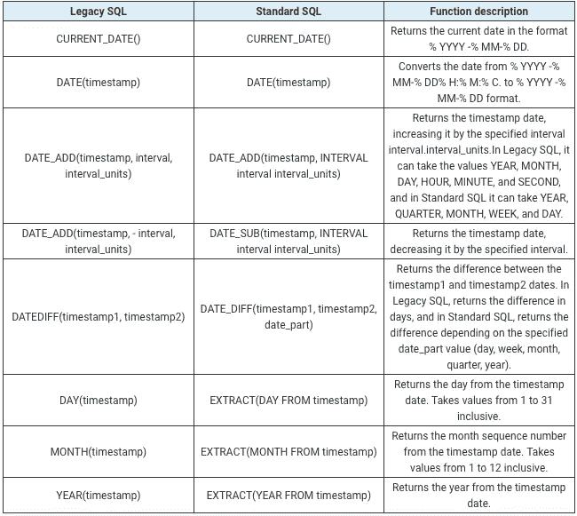

有关所有日期函数的列表，请参见[遗留 SQL](https://cloud.google.com/bigquery/docs/reference/legacy-sql#datetimefunctions) 和[标准 SQL](https://cloud.google.com/bigquery/docs/reference/standard-sql/date_functions) 文档。

让我们来看看我们的演示数据，看看这些函数是如何工作的。例如，我们将获取当前日期，将原始表中的日期转换为格式% YYYY -% MM-% DD，将其删除，并添加一天。然后，我们将计算当前日期和源表中的日期之间的差值，并将当前日期分成单独的年、月和日字段。为此，您可以复制下面的示例查询，并用您自己的查询替换项目名称、数据集和数据表。

**#传统 SQL**

```
**SELECT** **CURRENT_DATE**() **AS** today,     
DATE( date_UTC ) **AS** date_UTC_in_YYYYMMDD,    
**DATE_ADD**( date_UTC,1, 'DAY') **AS** date_UTC_plus_one_day,              **DATE_ADD**( date_UTC,-1, 'DAY') **AS** date_UTC_minus_one_day,     **DATEDIFF**(**CURRENT_DATE**(), date_UTC ) **AS** difference_between_date,     **DAY**( **CURRENT_DATE**() ) **AS** the_day,     
**MONTH**( **CURRENT_DATE**()) **AS** the_month,     
**YEAR**( **CURRENT_DATE**()) **AS** the_year   
**FROM**     
  [owox-analytics:t_kravchenko.Demo_data]
```

**#标准 SQL**

```
**SELECT** 

today,   
date_UTC_in_YYYYMMDD,   
 **DATE_ADD**( date_UTC_in_YYYYMMDD, INTERVAL 1 **DAY**) **AS**                            date_UTC_plus_one_day,   
 **DATE_SUB**( date_UTC_in_YYYYMMDD,INTERVAL 1 **DAY**) **AS** date_UTC_minus_one_day,   
 DATE_DIFF(today, date_UTC_in_YYYYMMDD, **DAY**) **AS** difference_between_date,   
 **EXTRACT**(**DAY** **FROM** today ) **AS** the_day,   
 **EXTRACT**(**MONTH** **FROM** today ) **AS** the_month,   
 **EXTRACT**(**YEAR** **FROM** today ) **AS** the_year 
**FROM** (   
  **SELECT**     
    **CURRENT_DATE**() **AS** today,     
    DATE( date_UTC ) **AS** date_UTC_in_YYYYMMDD   
**FROM**     
  `owox-analytics.t_kravchenko.Demo_data`)
```

运行查询后，您将收到以下报告:

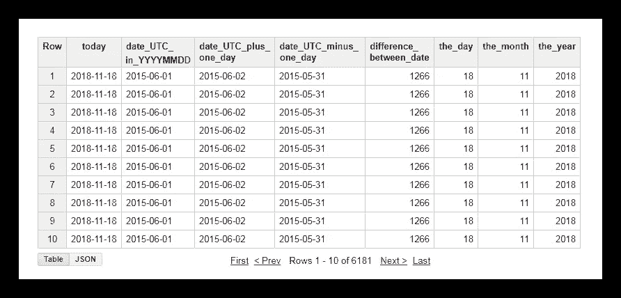

图片由作者提供

# 字符串函数

字符串函数允许您生成一个字符串，选择和替换子字符串，计算字符串的长度以及子字符串在原始字符串中的索引序列。例如，使用字符串函数，您可以:

*   使用传递到页面 URL 的 UTM 标签过滤报表
*   如果源和活动名称写在不同的寄存器中，将数据转换为单一格式
*   替换报告中不正确的数据(例如，如果活动名称打印错误)

以下是处理字符串最常用的函数:

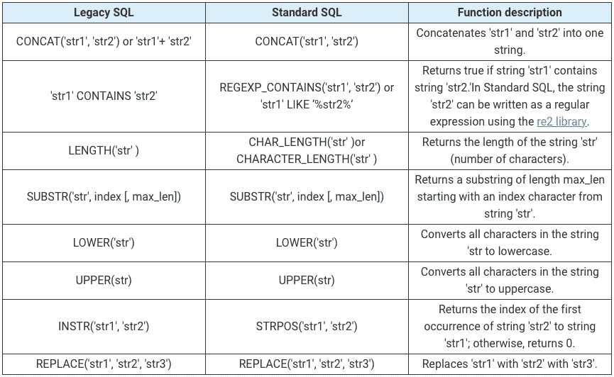

您可以在[遗留 SQL](https://cloud.google.com/bigquery/docs/reference/legacy-sql#stringfunctions) 和[标准 SQL](https://cloud.google.com/bigquery/docs/reference/standard-sql/string_functions) 文档中了解更多关于所有字符串函数的信息。

让我们看看演示数据，看看如何使用所描述的功能。假设我们有三个分别包含日、月和年值的列:

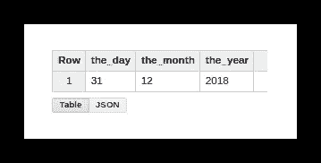

图片由作者提供

使用这种格式的日期不太方便，所以我们可以将这些值合并到一列中。为此，请使用下面的 SQL 查询，并记住在 Google BigQuery 中替换您的项目、数据集和表的名称。

**#遗留 SQL**

```
**SELECT**   
  **CONCAT**(the_day,'-',the_month,'-',the_year) **AS** mix_string1 
**FROM** (   
  **SELECT**     
    31 **AS** the_day,     
    12 **AS** the_month,     
    2018 **AS** the_year   
  **FROM**     
    [owox-analytics:t_kravchenko.Demo_data]) 
**GROUP** **BY**   
  mix_string1
```

**#标准 SQL**

```
**SELECT**   
  **CONCAT**(the_day,'-',the_month,'-',the_year) **AS** mix_string1 
**FROM** (   
  **SELECT**     
    31 **AS** the_day,     
    12 **AS** the_month,     
    2018 **AS** the_year   
  **FROM**     
    owox-analytics.t_kravchenko.Demo_data) 
**GROUP** **BY**   
  mix_string1
```

运行查询后，我们在一列中收到日期:

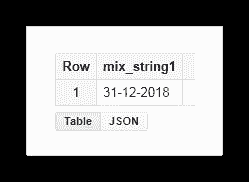

图片由作者提供

通常，当您在网站上下载页面时，URL 会记录用户选择的变量的值。这可以是支付或交付方法、交易号、购买者想要提取物品的实体店的索引等。使用 SQL 查询，您可以从页面地址中选择这些参数。考虑两个例子来说明如何以及为什么要这样做。

**例 1** 。假设我们想知道用户从实体店提货的购买次数。为此，我们需要计算从 URL 中包含子字符串 shop_id(实体店的索引)的页面发送的交易数量。我们可以通过以下查询来实现这一点:

**#遗留 SQL**

```
**SELECT**   
  **COUNT**(transactionId) **AS** transactions,   
  **check** 
**FROM** (   
  **SELECT**     
    transactionId,     
    page CONTAINS 'shop_id' **AS** **check**   
**FROM**     
  [owox-analytics:t_kravchenko.Demo_data]) 
**GROUP** **BY**   
  **check**
```

**#标准 SQL**

```
**SELECT**   
  **COUNT**(transactionId) **AS** transactions,   
  check1,   
  check2 
**FROM** (   
  **SELECT**     
    transactionId,     
    REGEXP_CONTAINS( page, 'shop_id') **AS** check1,     
    page **LIKE** '%shop_id%' **AS** check2   
**FROM**     
  `owox-analytics.t_kravchenko.Demo_data`) 
**GROUP** **BY**    
  check1,   
  check2
```

从结果表中，我们看到 5502 个交易(check = true)是从包含 shop_id 的页面发送的:

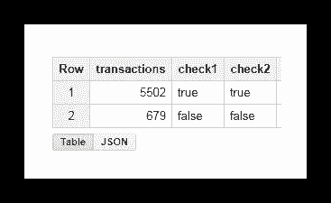

图片由作者提供

**例二**。您已经为每种交付方法分配了一个 delivery_id，并在页面 URL 中指定了该参数的值。要找出用户选择了哪种交付方法，您需要在单独的列中选择 delivery_id。

为此，我们可以使用以下查询:

**#传统 SQL**

```
**SELECT**   
  page_lower_case,    
  page_length,   
  index_of_delivery_id,   
  selected_delivery_id,   
  **REPLACE**(selected_delivery_id, 'selected_delivery_id=', '') **as** delivery_id 
**FROM** (   
  **SELECT**     
    page_lower_case,     
    page_length,     
    index_of_delivery_id,     
    **SUBSTR**(page_lower_case, index_of_delivery_id) **AS** selected_delivery_id   
**FROM** (     
  **SELECT**       
    page_lower_case,       
    **LENGTH**(page_lower_case) **AS** page_length,                 **INSTR**(page_lower_case, 'selected_delivery_id') **AS** index_of_delivery_id     
**FROM** (       
  **SELECT**         
    **LOWER**( page) **AS** page_lower_case,         
    **UPPER**( page) **AS** page_upper_case       
**FROM**         
  [owox-analytics:t_kravchenko.Demo_data]))) 
**ORDER** **BY**   
  page_lower_case **ASC**
```

**#标准 SQL**

```
**SELECT**   
  page_lower_case,   
  page_length,   
  index_of_delivery_id,   
  selected_delivery_id,   
  **REPLACE**(selected_delivery_id, 'selected_delivery_id=', '') **AS** delivery_id 
**FROM** (   
  **SELECT**     
    page_lower_case,     
    page_length,     
    index_of_delivery_id,     
    **SUBSTR**(page_lower_case, index_of_delivery_id) **AS** selected_delivery_id   
**FROM** (     
  **SELECT**       
    page_lower_case,       
    **CHAR_LENGTH**(page_lower_case) **AS** page_length,         STRPOS(page_lower_case, 'selected_delivery_id') **AS** index_of_delivery_id     
**FROM** (       
  **SELECT**         
    **LOWER**( page) **AS** page_lower_case,         
    **UPPER**( page) **AS** page_upper_case       
**FROM**         
  `owox-analytics.t_kravchenko.Demo_data`))) 
**ORDER** **BY**   
  page_lower_case **ASC**
```

结果，我们在 Google BigQuery 中得到这样一个表:

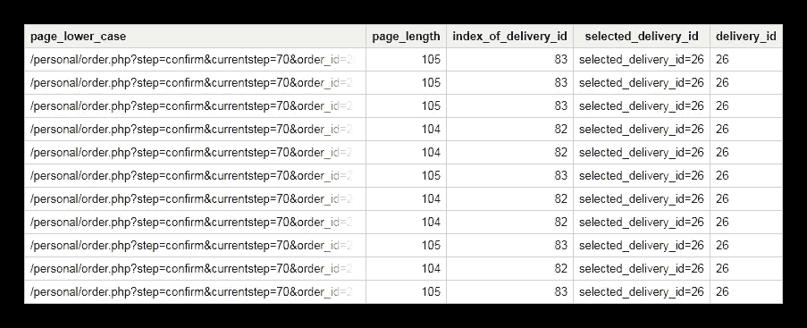

图片由作者提供

# 窗口功能

这些函数类似于我们上面讨论的聚合函数。主要区别在于，窗口函数不在使用查询选择的整个数据集上执行计算，而只在部分数据上执行计算——子集或*窗口*。

使用窗口函数，您可以在组节中聚合数据，而无需使用 JOIN 函数来组合多个查询。例如，您可以计算每个广告活动的平均收入或每台设备的交易数量。通过向报表中添加另一个字段，您可以很容易地找到，例如，黑色星期五广告活动的收入份额或移动应用程序的交易份额。

除了查询中的每个函数，您还必须详细说明定义窗口边界的 OVER 表达式。OVER 包含您可以使用的三个组件:

*   分区依据—定义将原始数据划分为子集的特征，如 clientId 或 DayTime
*   排序依据-定义子集中行的顺序，例如小时 DESC
*   窗口框架-允许您处理特定要素子集内的行(例如，仅当前行之前的五行)

在此表中，我们收集了最常用的窗口函数:

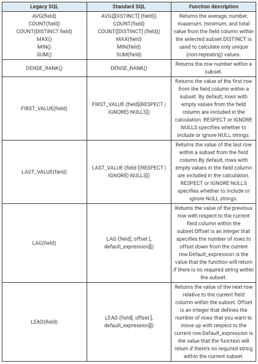

您可以在[遗留 SQL](https://cloud.google.com/bigquery/docs/reference/legacy-sql#syntax-window-functions) 和标准 SQL 的文档中看到所有[聚合分析函数和](https://cloud.google.com/bigquery/docs/reference/standard-sql/aggregate_analytic_functions) [导航函数](https://cloud.google.com/bigquery/docs/reference/standard-sql/navigation_functions)的列表。

**例 1** 。假设我们想要分析客户在工作时间和非工作时间的活动。为此，我们需要将事务分为两组，并计算感兴趣的指标:

*   第 1 组—在 9:00 至 18:00 的工作时间内购买
*   第 2 组—00:00 至 9:00 和 18:00 至 23:59 的下班后购买

除了工作和非工作时间，形成窗口的另一个变量是 clientId。也就是说，对于每个用户，我们将有两个窗口:

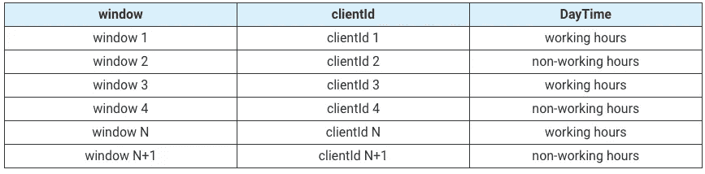

让我们使用演示数据来计算平均、最大、最小和总收入、交易总数，以及每个用户在工作时间和非工作时间的唯一交易数。下面的请求将帮助我们做到这一点。

**#传统 SQL**

```
**SELECT**   
  date,   
  clientId,   
  DayTime,   
  avg_revenue,   
  max_revenue,   
  min_revenue,   
  sum_revenue,   
  transactions,   
  unique_transactions 
**FROM** (   
  **SELECT**     
    date,     
    clientId,     
    DayTime,     
    **AVG**(revenue) **OVER** (**PARTITION** **BY** date, clientId, DayTime) **AS** avg_revenue,     
    **MAX**(revenue) **OVER** (**PARTITION** **BY** date, clientId, DayTime) **AS** max_revenue,     
    **MIN**(revenue) **OVER** (**PARTITION** **BY** date, clientId, DayTime) **AS** min_revenue,     
    **SUM**(revenue) **OVER** (**PARTITION** **BY** date, clientId, DayTime) **AS** sum_revenue,     
    **COUNT**(transactionId) **OVER** (**PARTITION** **BY** date, clientId, DayTime) **AS** transactions,     
    **COUNT**(**DISTINCT**(transactionId)) **OVER** (**PARTITION** **BY** date, clientId, DayTime) **AS** unique_transactions   
**FROM** (     
  **SELECT**       
    date,       
    date_UTC,       
    clientId,       
    transactionId,       
    revenue,       
    page,       
    **hour**,       
    **CASE**         
      **WHEN** **hour**>=9 **AND** **hour**<=18 **THEN** 'working hours'         
      **ELSE** 'non-working hours'       
**END** **AS** DayTime     
**FROM**       
  [owox-analytics:t_kravchenko.Demo_data])) 
**GROUP** **BY**   
  date,   
  clientId,   
  DayTime,   
  avg_revenue,   
  max_revenue,   
  min_revenue,   
  sum_revenue,   
  transactions,   
  unique_transactions 
**ORDER** **BY**   
  transactions **DESC**
```

**#标准 SQL**

```
#standardSQL 
**SELECT**   
  date,   
  clientId,   
  DayTime,   
  avg_revenue,   
  max_revenue,   
  min_revenue,   
  sum_revenue,   
  transactions,   
  unique_transactions 
**FROM** (   
  **SELECT**     
    date,     
    clientId,     
    DayTime,     
    **AVG**(revenue) **OVER** (**PARTITION** **BY** date, clientId, DayTime) **AS** avg_revenue,     
    **MAX**(revenue) **OVER** (**PARTITION** **BY** date, clientId, DayTime) **AS** max_revenue,     
    **MIN**(revenue) **OVER** (**PARTITION** **BY** date, clientId, DayTime) **AS** min_revenue,     
    **SUM**(revenue) **OVER** (**PARTITION** **BY** date, clientId, DayTime) **AS** sum_revenue,     
    **COUNT**(transactionId) **OVER** (**PARTITION** **BY** date, clientId, DayTime) **AS** transactions,     
    **COUNT**(**DISTINCT**(transactionId)) **OVER** (**PARTITION** **BY** date, clientId, DayTime) **AS** unique_transactions   
**FROM** (     
  **SELECT**       
    date,       
    date_UTC,       
    clientId,       
    transactionId,       
    revenue,       
    page,       
    **hour**,       
    **CASE**         
      **WHEN** **hour**>=9 **AND** **hour**<=18 **THEN** 'working hours'         
      **ELSE** 'non-working hours'       
    **END** **AS** DayTime     
**FROM**       
  `owox-analytics.t_kravchenko.Demo_data`)) 
**GROUP** **BY**   
  date,   
  clientId,   
  DayTime,   
  avg_revenue,   
  max_revenue,   
  min_revenue,   
  sum_revenue,   
  transactions,   
  unique_transactions 
**ORDER** **BY**   
  transactions **DESC**
```

让我们以 clientId 为 1020 的用户为例，看看结果会怎样。56660.68668686661 在该用户的原始表中，我们有以下数据:

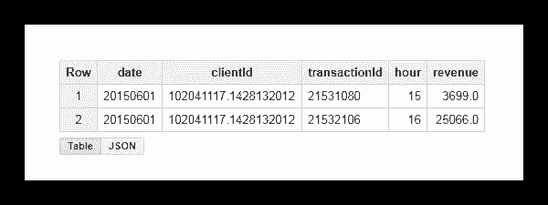

图片由作者提供

通过运行该查询，我们将收到一份报告，其中包含来自该用户的平均、最小、最大和总收入，以及该用户的交易总数。正如您在下面的截图中看到的，这两笔交易都是用户在工作时间进行的:

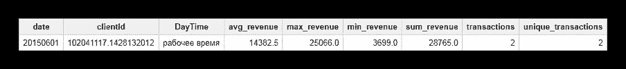

图片由作者提供

**例二**。现在是一个更复杂的任务:

*   根据事务的执行时间，将所有事务的序列号放在窗口中。回想一下，我们通过用户和工作/非工作时隙来定义窗口。
*   报告窗口内下一个/上一个交易(相对于当前交易)的收入。
*   在窗口中显示第一笔和最后一笔交易的收入。

为此，我们将使用以下查询:

**#遗留 SQL**

```
**SELECT**   
  date,   
  clientId,   
  DayTime,   
  **hour**,   
  **rank**,   
  revenue,   
  lead_revenue,   
  lag_revenue,   
  first_revenue_by_hour,   
  last_revenue_by_hour 
**FROM** (   
  **SELECT**     
    date,     
    clientId,     
    DayTime,     
    **hour**,     
    **DENSE_RANK**() **OVER** (**PARTITION** **BY** date, clientId, DayTime **ORDER** **BY** **hour**) **AS** **rank**,     revenue,     
    **LEAD**( revenue, 1) **OVER** (**PARTITION** **BY** date, clientId, DayTime **ORDER** **BY** **hour**) **AS** lead_revenue,     
    LAG( revenue, 1) **OVER** (**PARTITION** **BY** date, clientId, DayTime **ORDER** **BY** **hour**) **AS** lag_revenue,     
    **FIRST_VALUE**(revenue) **OVER** (**PARTITION** **BY** date, clientId, DayTime **ORDER** **BY** **hour**) **AS** first_revenue_by_hour,     
    **LAST_VALUE**(revenue) **OVER** (**PARTITION** **BY** date, clientId, DayTime **ORDER** **BY** **hour**) **AS** last_revenue_by_hour   
**FROM** (     
  **SELECT**       
    date,       
    date_UTC,       
    clientId,       
    transactionId,       
    revenue,       
    page,       
    **hour**,       
    **CASE**         
      **WHEN** **hour**>=9 **AND** **hour**<=18 **THEN** 'working hours'         
      **ELSE** 'non-working hours'       
    **END** **AS** DayTime     
**FROM**       
  [owox-analytics:t_kravchenko.Demo_data])) 
**GROUP** **BY**   
  date,   
  clientId,   
  DayTime,   
  **hour**,   
  **rank**,   
  revenue,   
  lead_revenue,   
  lag_revenue,   
  first_revenue_by_hour,   
  last_revenue_by_hour 
**ORDER** **BY**   
  date,   
  clientId,   
  DayTime,   
  **hour**,   
  **rank**,   
  revenue,   
  lead_revenue,   
  lag_revenue,   
  first_revenue_by_hour,   
  last_revenue_by_hour
```

**#标准 SQL**

```
**SELECT**   
  date,   
  clientId,   
  DayTime,   
  **hour**,   
  **rank**,   
  revenue,   
  lead_revenue,   
  lag_revenue,   
  first_revenue_by_hour,   
  last_revenue_by_hour 
**FROM** (   
  **SELECT**     
    date,     
    clientId,     
    DayTime,     
    **hour**,     
    **DENSE_RANK**() **OVER** (**PARTITION** **BY** date, clientId, DayTime **ORDER** **BY** **hour**) **AS** **rank**,     revenue,     
    **LEAD**( revenue, 1) **OVER** (**PARTITION** **BY** date, clientId, DayTime **ORDER** **BY** **hour**) **AS** lead_revenue,     
    LAG( revenue, 1) **OVER** (**PARTITION** **BY** date, clientId, DayTime **ORDER** **BY** **hour**) **AS** lag_revenue,     
    **FIRST_VALUE**(revenue) **OVER** (**PARTITION** **BY** date, clientId, DayTime **ORDER** **BY** **hour**) **AS** first_revenue_by_hour,     
    **LAST_VALUE**(revenue) **OVER** (**PARTITION** **BY** date, clientId, DayTime **ORDER** **BY** **hour**) **AS** last_revenue_by_hour   
**FROM** (     
  **SELECT**       
    date,       
    date_UTC,       
    clientId,       
    transactionId,       
    revenue,       
    page,       
    **hour**,       
    **CASE**         
      **WHEN** **hour**>=9 **AND** **hour**<=18 **THEN** 'working hours'         
      **ELSE** 'non-working hours'       
   **END** **AS** DayTime     
**FROM**       
  `owox-analytics.t_kravchenko.Demo_data`)) 
**GROUP** **BY**   
  date,   
  clientId,   
  DayTime,   
  **hour**,   
  **rank**,   
  revenue,   
  lead_revenue,   
  lag_revenue,   
  first_revenue_by_hour,   
  last_revenue_by_hour 
**ORDER** **BY**   
  date,   
  clientId,   
  DayTime,   
  **hour**,   
  **rank**,   
  revenue,   
  lead_revenue,   
  lag_revenue,   
  first_revenue_by_hour,   
  last_revenue_by_hour
```

我们可以使用一个已知用户的例子来检查计算结果:clientId 10 204 2036767636767

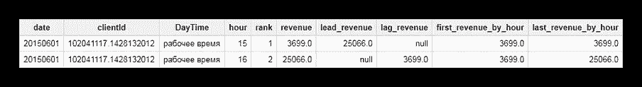

图片由作者提供

从上面的截图中，我们可以看到:

*   第一笔交易在 15:00，第二笔交易在 16:00
*   15:00 交易后，16:00 有一笔交易，收入 25066(列 lead_revenue)
*   在 16:00 交易之前，15:00 有一笔交易，收入 3699(列 lag_revenue)
*   窗口内的第一笔交易发生在 15:00，此交易的收入为 3699(first _ revenue _ by _ hour 列)
*   该查询逐行处理数据，因此对于所讨论的事务，窗口中的最后一个事务将是它本身，并且 last_revenue_by_hour 和 revenue 列中的值将是相同的

# 结论

在本文中，我们研究了最流行的函数组:聚合、日期、字符串和窗口。然而，Google BigQuery 有许多更有用的功能，包括:

*   允许您将数据转换为特定格式的转换函数
*   允许您访问数据集中多个表的表通配符函数
*   正则表达式函数，允许您描述搜索查询的模型，而不是它的确切值