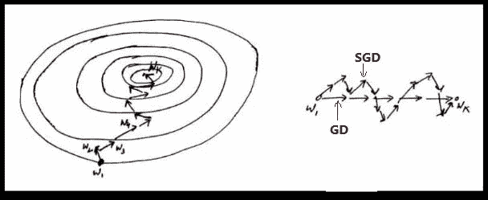

# 神经网络中各种优化器综述

> 原文：<https://towardsdatascience.com/overview-of-various-optimizers-in-neural-networks-17c1be2df6d5?source=collection_archive---------12----------------------->

## 理解各种优化器之间的关系以及它们的优缺点。

在 [Unsplash](https://unsplash.com?utm_source=medium&utm_medium=referral) 上由 [Hitesh Choudhary](https://unsplash.com/@hiteshchoudhary?utm_source=medium&utm_medium=referral) 拍摄的照片

优化器是用于改变神经网络属性(如权重和学习速率)以减少损失的算法或方法。优化器用于通过最小化函数来解决优化问题。

> **优化人员是如何工作的？**

你应该如何改变你的神经网络的权重或学习速率来减少损失是由你使用的优化器定义的。优化算法负责减少损失，并尽可能提供最准确的结果。

使用一些初始化策略来初始化权重，并且根据更新等式在每个时期更新权重。

上面的等式是更新等式，使用它来更新权重以达到最精确的结果。使用一些称为优化器的优化策略或算法可以获得最佳结果。

在过去的几年里，人们研究了各种各样的优化器，每一种都有其优缺点。阅读整篇文章，了解算法的工作原理、优点和缺点。

> **梯度下降(物品):**

梯度下降是最基本的一阶优化算法，它依赖于损失函数的一阶导数。它计算权重应该以何种方式改变，以便函数可以达到最小值。通过反向传播，损耗从一层转移到另一层，并且模型的参数(也称为权重)根据损耗进行修改，以便损耗可以最小化。

图片 1

从上图(图 1)可以看出，权重被更新以收敛到最小值。

**优点:**

1.  实现起来非常简单。

**缺点:**

1.  该算法一次采用 n 个点的整个数据集来计算导数，以更新需要大量存储器的权重。
2.  极小值是在很长一段时间后达到的，或者是永远达不到的。
3.  该算法可能会卡在局部最小值或鞍点:

图片 2

在上图(图 2)中，梯度下降可能会卡在局部最小值或鞍点，永远不会收敛到最小值。为了找到最佳解决方案，算法必须达到全局最小值。

> **随机梯度下降(SGD):**

SGD 算法是 GD 算法的扩展，它克服了 GD 算法的一些缺点。GD 算法有一个缺点，它需要大量的内存来一次加载 n 点的整个数据集到计算机导数。在 SGD 算法的情况下，每次取一个点来计算导数。

图 3

从上图(图 3)可以看出，与梯度下降相比，更新需要更多的迭代次数才能达到最小值。在图 3 的右边部分，GD 算法达到最小值需要较少的步骤，但是 SGD 算法噪声更大，迭代次数更多。

**优势:**

1.  与 GD 算法相比，内存需求更少，因为每次只取一个点来计算导数。

**缺点:**

1.  与 GD 算法相比，完成 1 个历元所需的时间很长。
2.  需要很长时间才能收敛。
3.  可能会陷入局部最小值。

> **小批量随机梯度下降(MB-SGD):**

MB-SGD 算法是 SGD 算法的扩展，它克服了 SGD 算法时间复杂度大的问题。MB-SGD 算法从数据集中取出一批点或点的子集来计算导数。

可以观察到，MB-SGD 的损失函数的导数与 GD 的损失函数的导数在若干次迭代之后几乎相同。但是与 GD 相比，MB-SGD 实现最小值的迭代次数很大，并且计算成本也很高。

权重的更新取决于一批点的损失的导数。在 MB-SGD 的情况下，更新的噪声更大，因为导数并不总是朝向最小值。

**优点:**

1.  与标准 SGD 算法相比，收敛的时间复杂度更低。

**缺点:**

1.  与 GD 算法的更新相比，MB-SGD 的更新噪音更大。
2.  比 GD 算法需要更长的时间来收敛。
3.  可能会陷入局部最小值。

> **SGD 带动量:**

MB-SGD 算法的一个主要缺点是权重的更新非常嘈杂。具有动量的 SGD 通过对梯度去噪克服了这个缺点。权重的更新依赖于有噪声的导数，并且如果我们以某种方式对导数去噪，那么收敛时间将会减少。

想法是使用指数加权平均来对导数进行去噪，即与先前更新相比，给予最近更新更多的权重。

SGD 更新公式:

使用所有先前的更新来计算时间“t”处的动量，与先前的更新相比，给予最近的更新更大的权重。这导致收敛速度加快。

**动量如何加速收敛？**

图 4

当通过仅减去具有先前权重的梯度项来计算新权重时，更新在方向 1 上移动，并且如果通过减去具有先前权重的动量项来计算新权重，则更新在方向 2 上移动(图 5)。

如果我们结合这两个方程，通过用动量和梯度项之和减去先前的权重来计算新的权重，那么更新将向方向 3 移动，这导致对更新去噪。

图 5

上图(图 5)总结了 SGD+动量降噪梯度，与 SGD 相比收敛更快。

**优点:**

1.  具有 SGD 算法的所有优点。
2.  比 GD 算法收敛得更快。

**缺点:**

1.  我们需要为每次更新多计算一个变量。

> **内斯特罗夫加速梯度(NAG):**

NAG 算法的思想非常类似于带有动量的 SGD，只是略有不同。在具有动量算法的 SGD 的情况下，动量和梯度是在先前更新的权重上计算的。

根据 NAG 算法，首先计算点 W_(t-1)的动量 V_t，并沿该方向移动以到达 W_dash，然后计算新的更新权重 W_dash 处的梯度，并再次向梯度移动(图 6)。净运动导致朝向最小值的方向。

图 6

NAG 和带动量算法的 SGD 工作得一样好，并且具有相同的优点和缺点。

> **自适应梯度(AdaGrad):**

对于前面讨论的所有算法，学习率保持不变。因此，AdaGrad 的关键思想是为每个权重设定一个自适应的学习速率。权重的学习速率将随着迭代次数而降低。

因此，随着迭代次数(t)的增加，学习率α增加，这导致学习率自适应地降低。

**优势:**

1.  无需手动更新学习率，因为它会随着迭代自适应地变化。

**缺点:**

1.  当迭代次数变得非常大时，学习率降低到非常小的数值，这导致收敛缓慢。

> **阿达德尔塔:**

以前的算法 AdaGrad 的问题是学习率随着大量迭代而变得非常小，这导致收敛缓慢。为了避免这种情况，AdaDelta 算法有一个取指数衰减平均值的想法。

> 亚当:

在 AdaDelta 算法的情况下，我们存储梯度平方的指数衰减平均值来修改学习速率。对于 Adam optimizer，想法是存储梯度的一阶矩(g_t)和二阶矩(g_t 的平方)。

一阶矩的 EDA:

二阶矩的 EDA:

偏差校正:

更新功能:

> **优化器的结论和比较:**

来源:https://arxiv.org/pdf/1412.6980.pdf

上图是本文中讨论的算法的迭代次数与训练损失的关系图。

对于给定的迭代次数(假设 100)，从图中可以观察到 adam 在所有其他算法中收敛最快。

> **什么时候选择哪种算法？**

来源:[https://ruder . io/content/images/2016/09/saddle _ point _ evaluation _ optimizer . gif](https://ruder.io/content/images/2016/09/saddle_point_evaluation_optimizers.gif)

*   在上面的动画中，可以看到 SGD 算法(红色)停滞在一个鞍点上。所以 SGD 算法只能用于浅层网络。
*   除 SGD 之外的所有其他算法最终一个接一个地收敛，AdaDelta 是最快的，其次是动量算法。
*   AdaGrad 和 AdaDelta 算法可用于稀疏数据。
*   动量和 NAG 在大多数情况下工作良好，但速度较慢。
*   Adam 的动画不可用，但是从上面的图中可以看出，它是收敛到最小值的最快算法。
*   Adam 被认为是上面讨论的所有算法中最好的算法。

> 感谢您的阅读！