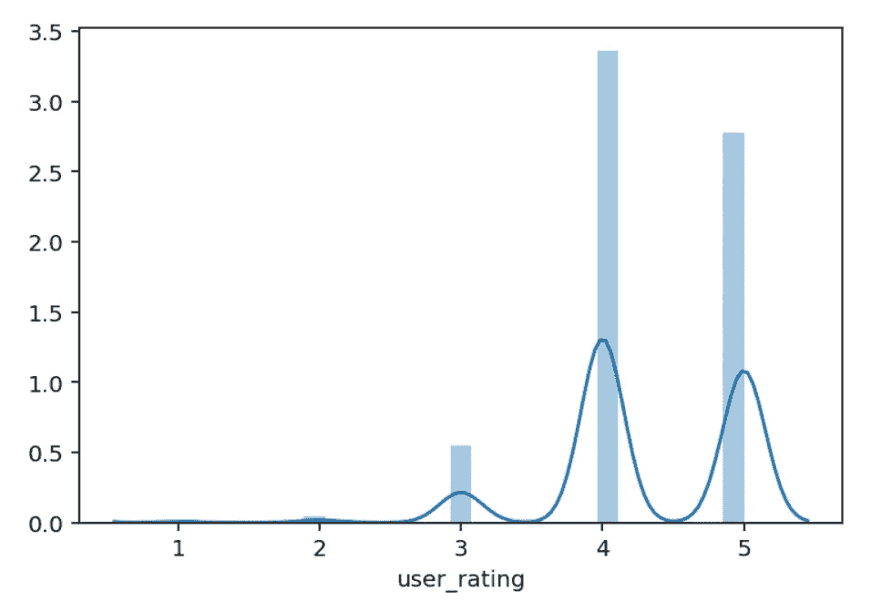
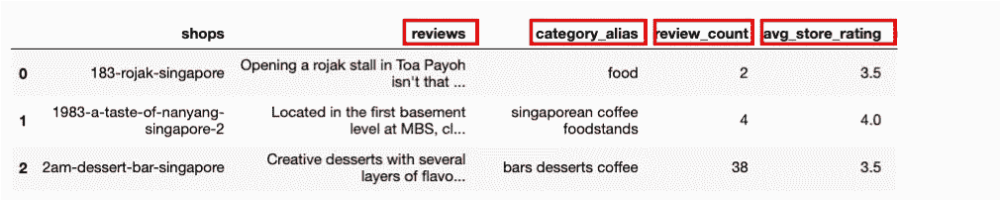
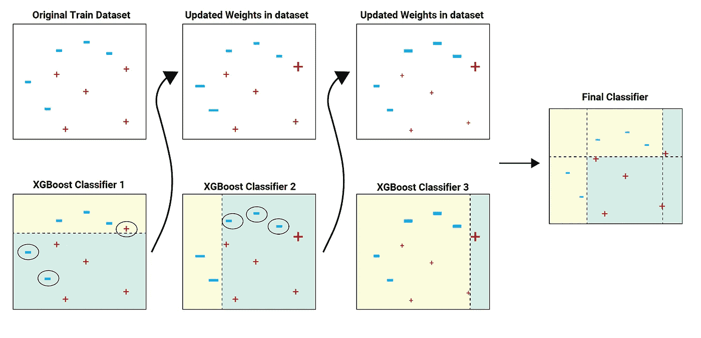
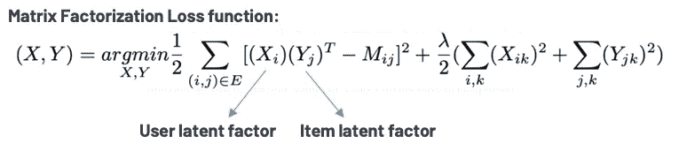
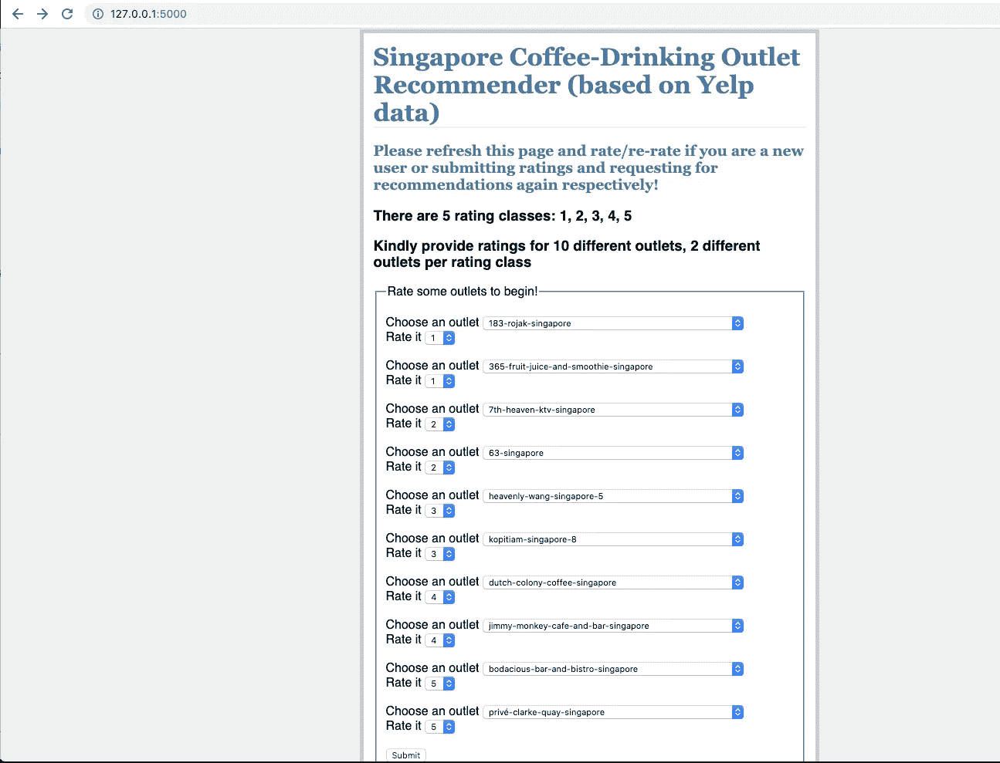
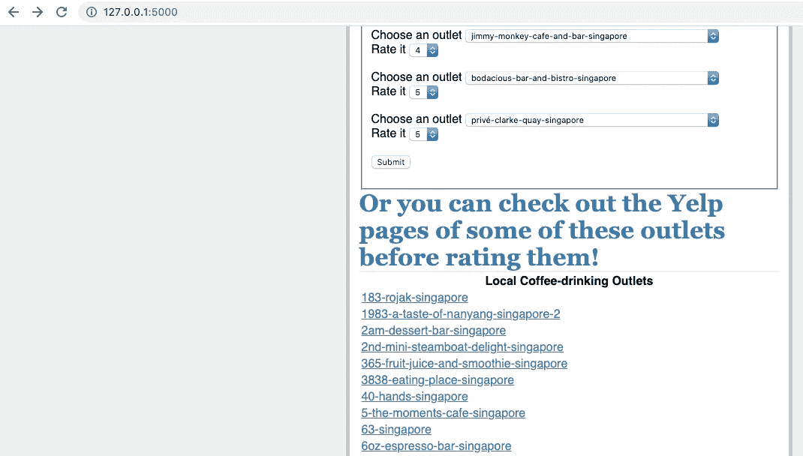
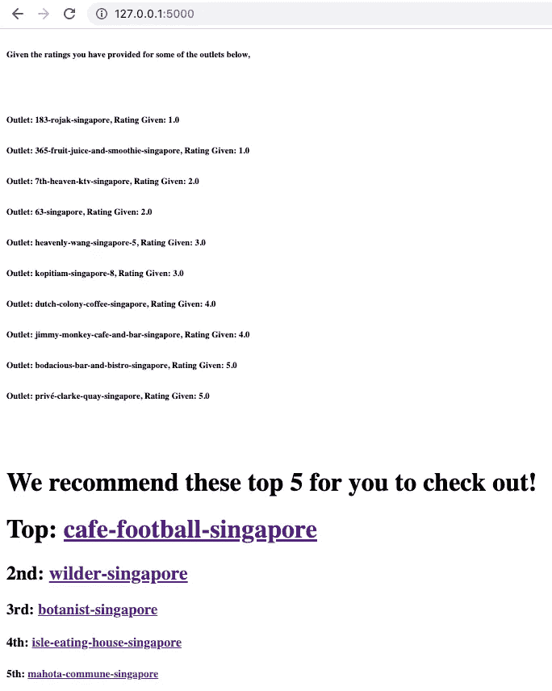
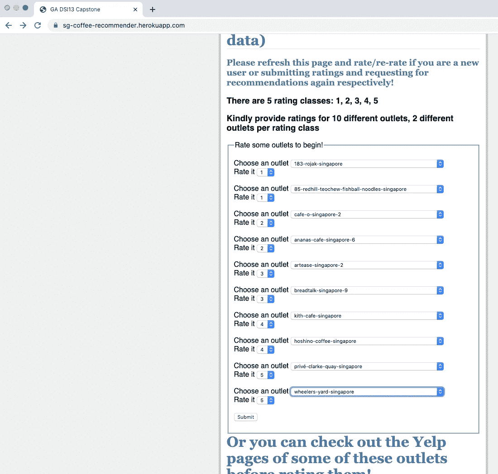
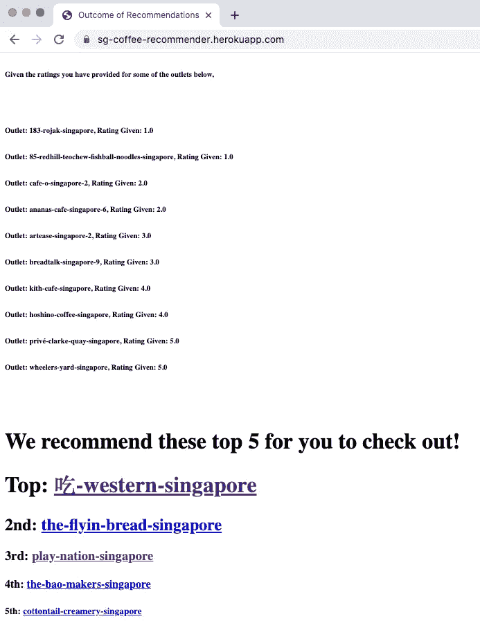

# 用 Flask 和 Heroku 构建和部署推荐器

> 原文：<https://towardsdatascience.com/overview-on-building-a-local-coffee-drinking-outlet-recommender-and-deployment-with-flask-and-39b16fb40388?source=collection_archive---------30----------------------->

## 使用 Heroku 构建混合推荐器和部署基于内容的过滤组件时基于模型的观点

我的数据科学沉浸式计划的顶点演示幻灯片的首页

在这篇文章中，我用 Flask 和 Heroku 展示了一种构建混合推荐器和部署一个基于模型的内容过滤系统的方法。这是我在新加坡大会(GA)下的数据科学沉浸式项目中的顶点项目。更多详情可以在这些 GitHub 回购链接中找到: [GA_Capstone](https://github.com/jasonchia89/GA_Capstone) ，[GA _ Capstone _ Flask _ Heroku _ deployment](https://github.com/jasonchia89/GA_Capstone_Flask)。

对于这个项目，我选择了咖啡作为感兴趣的主题，因为我周围都是热爱咖啡的社会团体(尽管我不喝咖啡！)而且我很清楚，在寻找喝茶的好去处时，实际上存在着无穷无尽的选择。因此，我认为建立一个推荐器可以解决被选择淹没的问题，并且不需要根据过多的属性如位置、服务标准等来过滤选择。，在这里可能会派上用场。

# 待建推荐系统类型概述

> *基于模型的内容过滤*

一种基于内容的过滤模式，在受监督的机器学习算法(由特征 *X* 和目标 *y* 定义)的背景下构建，其中项目(在这种情况下为咖啡店)的各种特征(特征矩阵， *X* )用于预测用户评级(目标 *y* )。预测的用户评级然后以降序排列，并且认为合适的前 5 个或任意数字 *n* 被呈现为前 5 个或前 *n* 个推荐，供用户检查。

> 基于模型的协同过滤

一种基于机器学习算法的协同过滤范例，该算法从现有数据中学习用户-项目交互，以预测用户的项目评级(或在我们的上下文中用户的咖啡出口评级)， 通过考虑具有相似评级模式的其他用户的项目评级——这就是为什么协作过滤 RecSys 经常遇到*冷启动问题*的原因，在该问题中，不可能找到具有与未对任何项目进行评级的新用户相似的评级模式的用户——然后向感兴趣的用户推荐那些相似用户最喜欢的项目(因此本质上是协作的)。

> 混合 RecSys

混合 RecSys 结合了基于内容的过滤和协作过滤，试图减少其中任何一种的缺点，以产生更整体和更全面的系统(可以说是两全其美)，例如，基于内容的过滤不能产生交叉推荐，即，它倾向于只推荐与用户曾经喜欢的项目类型相同的项目。协同过滤通过其协同特性解决了这一问题——可以潜在地推荐不属于用户曾经喜欢的项目类别的项目，只要那些项目是具有相似评级模式的其他用户最喜欢的。另一方面，对于只涉及显式反馈的数据集，如用户评级(如 Yelp 数据集)，协同过滤只考虑用户-项目交互矩阵，该矩阵包括*用户 id*、*评级*和*项目 id。*在这种情况下，基于内容的过滤可以通过提供更细粒度的项目特征来丰富 RecSys 的项目特征数据集(即*类别*、 *review_count* 、 *avg_store_rating* 等)。从而使 RecSys 更加全面和强大。

# **数据**

该数据集包括大约 987 家当地咖啡饮食店和相关功能，6，292 条用户评论和 7，076 条用户评级，这些都是使用 [BeautifulSoup](https://pypi.org/project/beautifulsoup4/) 和 Yelp 的 API 令牌的组合从 Yelp 搜集来的。

由于在收集的数据集中有很大比例的用户只对 1-2 家商店进行评级，因此在随后的模型评估阶段的 *train_test_split()* 和*交叉验证*阶段，当数据集被分成由 *userids* 分层的训练和验证集时(尤其是如果 test_size 小于 0.5 并且交叉验证折叠数大于 2)，针对所有这些用户的模型训练将不可避免地遇到错误。因此，我只将对至少 10 个不同渠道进行评级的用户纳入基于内容的过滤模型(这导致 *110 /2552* 用户被纳入模型训练)。数字 10 是任意选择的，尽管这可能与用户应该如何提供 10 个评级以生成部署模型中的前 5 个建议有关，我们将在后面看到。

从训练数据来看，我们的目标 *y* (用户评分)明显不平衡:

不平衡的目标类别:在类别 1 和类别 2 中几乎没有任何评级，在类别 3 中最小，大多数属于类别 4 和类别 5，其中类别 4 占主导地位

由于目标类的不平衡性质，以及我们不希望推荐差的推荐(*误报*)也不希望错过好的推荐(*误报*)，一个[微平均 F1 分数](https://datascience.stackexchange.com/questions/15989/micro-average-vs-macro-average-performance-in-a-multiclass-classification-settin)，这实质上是一个定义为精度和召回之间的微平均平衡的指标，用于稍后评估各个模型的性能。

# **型号**

> 基于内容的过滤

将被合并到基于内容的过滤模型中的项目(或咖啡店)方面的特征是:

基于内容的过滤功能:评论、类别、评论数量和平均商店评级

使用 naive *Tf-idf* 矢量器将评论分解为词项频率，该矢量器用于在模型训练之前显示每个评论词项的区分强度及其与各种咖啡店的关联。

我调整并试验了各种有监督的机器学习算法，如*逻辑回归*、*决策树分类器*，以及集成方法，如*极端梯度提升分类器(XGB)。* XGB 表现最好(**微观平均 F1 分:0.97** )，被选中部署。XGB 是一种极端的梯度推进回归树(GBRT)算法，它:

*   **减少偏差、方差，并从过去弱学习器的错误中“学习”以产生强学习器**,因为它从浅的低方差/高偏差基础估计器开始，并根据过去估计器的错误迭代拟合估计器，以纠正那些错误/错误分类
*   [**通过使用更规则的模型形式化来控制过拟合**](https://datascience.stackexchange.com/questions/16904/gbm-vs-xgboost-key-differences) ，从而比常规的梯度增强方法如*梯度增强分类器*执行得更好
*   **能够很好地处理混合数据类型**(回想一下:用于基于内容过滤的数据集混合了数字和分类数据类型，分别像 *review_count* 和 *reviews* )

XGB 的一个实例——感谢[https://blog.quantinsti.com/xgboost-python/](https://blog.quantinsti.com/xgboost-python/)

> 协同过滤

使用交替最小二乘法(ALS)算法，并使用 Pyspark 的*交叉验证器* ( **微平均 F1 分数:1.0** )进行调整。ALS 是一种矩阵分解技术，它将用户-项目交互矩阵(如具有显式反馈的数据集的用户-项目评级矩阵)分解为用户和项目潜在因素，其中它们的点积将预测用户的项目评级(或在此上下文中各种咖啡店的用户评级)。它在固定用户或项目潜在因素之间交替，以在最小化损失(实际和预测用户评级之间的误差)的过程中，通过每次迭代的梯度下降来求解另一个:

矩阵分解损失函数:解释潜在的用户和项目因素，这些因素将在使用 ALS 算法时通过梯度下降来学习

> 混合 RecSys

基于内容的过滤和协作过滤通过对来自两个过滤系统的评级预测进行加权求和而结合在一起。例如，如果基于内容的过滤的预测用户评级是 3，而协作过滤的预测用户评级是 4，则最终的预测用户评级将是:

> (0.97/(0.97(XGB 的微平均 F1)+1.0(ALS 的微平均 F1))(基于 XGB 的微平均 F1 分配给基于内容的过滤的权重)x3+(1.0/(0.97(XGB 的微平均 F1)+1.0(ALS 的微平均 F1))(基于 ALS 的微平均 F1 分配给协同过滤的权重)x 4 = ~3.51 = 3.5(四舍五入到最接近的 0.5)

混合 RecSys 的**微平均 F1 分数为 1.0** 。

# Flask 应用程序实现

使用 Flask python 脚本和一些 html 模板，在本地虚拟环境*中成功实现了混合 RecSys。*

基本上，用户应该选择并评价他们以前去过或熟悉的 10 个当地咖啡饮品店(最好每个评价等级有 2 个不同的店，以便允许在后端工作的机器学习模型更全面地了解用户的“偏好”，这反过来将产生更可靠的推荐)，并点击“*提交*以产生前 5 个推荐供所述用户检查。

在本地虚拟环境中实现的 Flask 应用程序的首页:用户首先根据既定的准则提交一些商店的评级

Flask 应用程序的首页还提供了额外的 Yelp 链接，链接到喝咖啡的商店，供用户在给它们评分前参考

根据提交的 10 个评分，为用户生成的前 5 个推荐示例

然而，与大多数部署的机器学习模型不同，这些模型仅简单地基于作为用户输入提供的看不见的特征(即 *X_test* )来预测结果，这种混合 RecSys 依赖于一对手动组合的机器学习模型来训练新的看不见的评级(即目标、 *y_train)* 和已评级的咖啡店(即特征、 *X_train* )并预测用户对其他未评级的咖啡店的评级。因此，点击“*提交*”后，平均需要**15–20 多分钟**才能在 Flask app 上生成前 5 条建议……这种持续时间对于 Heroku 这样的正式部署平台来说是不可接受的，只要等待时间超过仅仅 [**30 秒**](https://devcenter.heroku.com/articles/request-timeout) ，Heroku 就会终止任何 web 应用程序的进程，并在错误日志中输出一条“*请求超时*消息和一个 H12 错误……

# 使用 Heroku 部署基于内容的过滤

鉴于上述情况，我只能尝试部署 RecSys 的“一半”,特别是 XGB 组件:因为 ALS 只能从 Pyspark-*py spark . ml . recommendation*库导入，而且我还没有找到详细介绍使用 Heroku 部署 py spark 代码的在线资源。找到的大多数资源都是关于 Scala 和 Spark 应用程序的，这些应用程序需要用 *Scala 构建工具* ( *sbt* )和 *jar* 汇编进行编译，这对于我使用最少 Pyspark 代码的 Flask 应用程序来说似乎有点太复杂了——甚至没有 *SparkContext* 或 *spark-submit* ，只有 *SparkSession* 和 ALS 组件。

随着 RecSys 被削减到只有 XGB 组件，“*请求超时*”仍然是一个问题。在用*% %的时间削减了代码的 XGB 组件并在 Jupyter Notebook 中记录了每个代码单元的运行时之后，*我能够充分缩短运行时，以便 XGB 组件可以通过 Heroku 正式部署，而不是通过[这里的](http://sg-coffee-recommender.herokuapp.com)。

与 Heroku 一起部署的基于内容的过滤 RecSys:首页，用户在此提交 10 个出口评级

与 Heroku 一起部署的基于内容的过滤 RecSys:基于提交的 10 个评级的用户前 5 个建议的结果页面

# 模型限制

混合 RecSys 的一些局限性包括:

*   缺乏隐含数据
*   RecSys 基于不更新的静态数据，因此将来可能会过时
*   可疑的数据质量(大多数用户只对 1-2 个网点进行评级，因此不可能对包含所有 2552 个用户的模型进行训练和交叉验证)
*   很难同时调整 *Tf-idf* 和训练具有单词术语和数字特征组合的模型——因此 *Tf-idf* 没有被调整，而是使用了一个简单的版本
*   均值归一化可作为 RecSys 根据每个网点的平均用户评级向开始时未提供任何评级的用户推荐网点的备用方案

# 未来计划

在线关注各种部署平台、 *stackoverflow* 和 Pyspark 部署的更新，看看 Pyspark ALS 组件是否可以整合到 Heroku 部署中，以便可以在线部署完整的混合 RecSys。

如果上述结果很好，可以潜在地结合用户设计/用户体验的概念，以更好地设计 html 用户界面，为 A/B 测试做准备，以衡量混合 RecSys 构建的有效性。