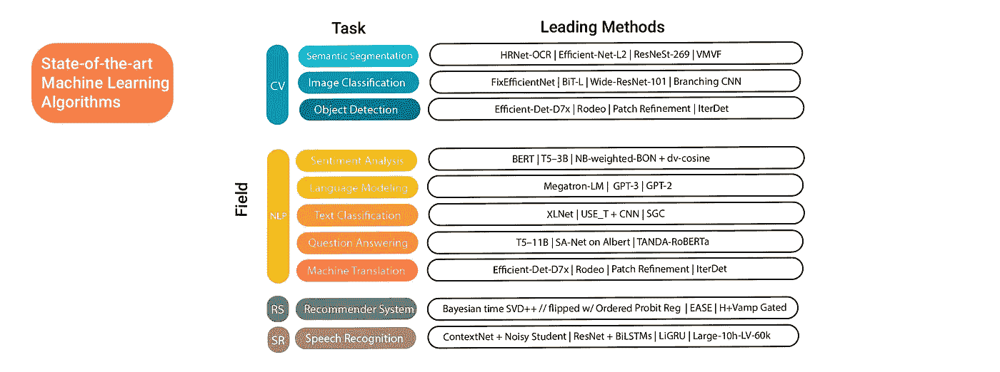
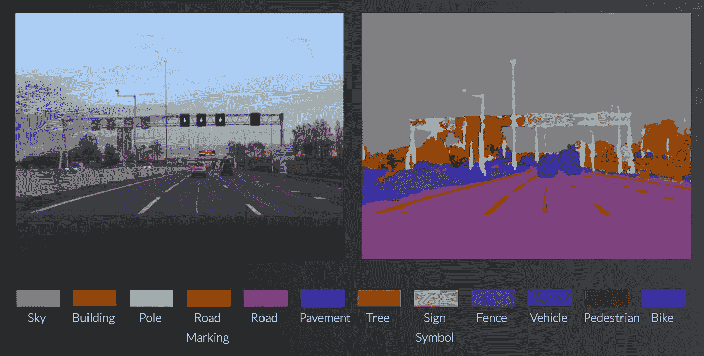
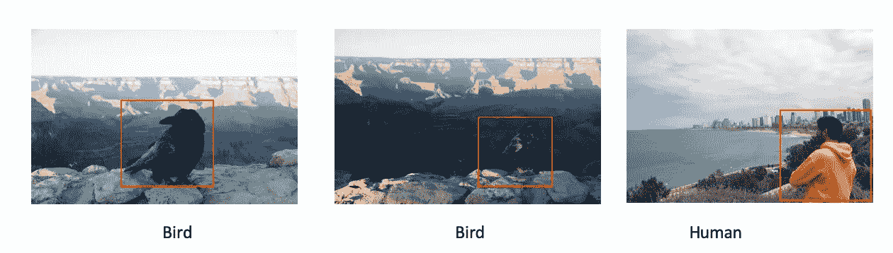

# 概述:每个学科和每个任务的最先进的机器学习算法

> 原文：<https://towardsdatascience.com/overview-state-of-the-art-machine-learning-algorithms-per-discipline-per-task-c1a16a66b8bb?source=collection_archive---------5----------------------->

## 了解自然语言处理、计算机视觉、语音识别和推荐系统的最佳算法



CV =计算机视觉，NLP =自然语言处理，RS =推荐系统，SR =语音识别|来源:来自作者。

机器学习算法正在兴起。每年都有新的技术出现，超越了当前领先的算法。其中一些只是现有算法的微小进步或组合，而另一些是新创造的，并带来了惊人的进步。对于大多数技术，已经有很好的文章解释了其背后的理论，其中一些还提供了代码和教程实现。目前还没有人提供当前领先算法的概述，所以这个想法出现了，根据所取得的结果(使用性能分数)来呈现每个任务的最佳算法。当然，还有更多的任务，并不是所有的任务都可以呈现。我试图选择最受欢迎的领域和任务，并希望这可能有助于更好地理解。本文将重点讨论计算机视觉、自然语言处理和语音识别。

文中介绍了所有的领域、任务和一些算法。如果您只对某个子部分感兴趣，请跳到您想深入了解的部分。

# 计算机视觉

计算机视觉是机器学习中研究最多、最热门的领域之一。它用于解决许多日常问题，并连续涉及多种应用，其中最受欢迎的是自动驾驶汽车的愿景。我们将要研究的任务是*语义分割、图像分类和目标检测。*

## 语义分割

语义分割可以被视为在像素级别上理解图像的结构和组件。语义分割方法试图预测图像中的结构和对象。为了更好地理解，可以在下面看到街道场景的语义分段:



用 SegNet 进行语义分割【https://mi.eng.cam.ac.uk/projects/segnet/ 

目前领先的算法 **HRNet-OCR** 是由 Nvidia 的 Tao 等人在 2020 年提出的。它实现了 85.1%的平均交集/并集(平均 IOU)。HRNet-OCR 对图像进行缩放，并对每个缩放比例使用密集遮罩。然后，所有尺度的预测“通过在掩模之间执行逐像素乘法，然后在不同尺度之间进行逐像素求和，从而获得最终结果”[1]。

查看 Github 来的技术:
[https://github.com/HRNet/HRNet-Semantic-Segmentation](https://github.com/HRNet/HRNet-Semantic-Segmentation)

其他顶层技术(方法—数据集):

*   [高效网-L2+NAS-FPN](https://arxiv.org/pdf/2006.06882v1.pdf) —帕斯卡 VOC
*   [ResNeSt-269](https://arxiv.org/pdf/2004.08955v1.pdf) — PASCAL 上下文
*   [VMVF](https://arxiv.org/pdf/2007.13138v1.pdf) —ScanNet

# 想看更多这样的故事？每天只需要 0.13 美元。

## [开始使用](https://medium.com/@hucker.marius/membership)

## 图像分类

不同于语义分割，图像分类不关注图像上的区域，而是关注图像的整体。这个学科试图通过分配一个标签来对每个图像进行分类。



来源:图片由作者提供。

**FixEfficientNet** 已经于 2020 年 4 月 20 日与脸书人工智能研究团队的相应论文一起首次提交[2][3]。它目前是最先进的，在 ImageNet 数据集上具有最好的结果，480M 参数，前 1 名准确率为 88.5%，前 5 名准确率为 98.7%。FixRes 是 Fix Resolution 的简称，它试图为用于训练时间的 RoC(分类区域)或用于测试时间的 crop 保持固定的大小。EfficientNet 是 CNN 维度的复合缩放，提高了准确性和效率。

欲了解 FixEfficientNet 的更多信息，[请阅读此](/state-of-the-art-image-classification-algorithm-fixefficientnet-l2-98b93deeb04c)。

其他顶层技术(方法—数据集):

*   [BiT-L](https://arxiv.org/pdf/1912.11370v3.pdf) — CIFAR-10
*   [Wide-ResNet-101](https://arxiv.org/pdf/2007.03347v2.pdf)—STL-10
*   [分支/合并 CNN +均质过滤胶囊](https://arxiv.org/pdf/2001.09136v4.pdf) — MNIST

## 目标检测

对象检测是识别图像中某一类对象的实例的任务。

目前领先的物体检测技术是谷歌大脑团队(Tan 等人)在 2020 年首次提出的**Efficient-Det D7x**[4]。它实现了 74.3 的 AP50 ( [了解 AP50 的更多信息:在 50](https://medium.com/@yanfengliux/the-confusing-metrics-of-ap-and-map-for-object-detection-3113ba0386ef) 的固定 IoU 阈值下的平均精度)和 55.1 的 box AP。Efficient-Det 是 **EfficientNets** 与双向特征金字塔网络( **BiFPNs** )的组合。

正如上面简要解释的那样， **EfficientNet** 是 CNN 维度的复合缩放，它提高了准确性和效率。更多关于 EfficientNet 的信息，你可以[点击这里](/state-of-the-art-image-classification-algorithm-fixefficientnet-l2-98b93deeb04c)。

在计算机视觉中，提高精确度的典型方法是创建具有不同分辨率的同一图像的多个副本。这导致了所谓的金字塔，因为最小的图像被布置为顶层，而最大的图像被布置为底层。要素金字塔网络代表了这样一个金字塔。双向意味着不仅有自上而下的方法，同时也有自下而上的方法。每个双向路径都被用作特征网络层，这导致了 bip pn。它有助于提高准确性和速度。有关 bip pn 的更多信息，[点击此处](https://medium.com/@nainaakash012/efficientdet-scalable-and-efficient-object-detection-ea05ccd28427)。

其他顶层技术(方法—数据集):

*   [竞技表演](https://arxiv.org/pdf/2008.06439v1.pdf) —帕斯卡 VOC
*   [补丁细化](https://arxiv.org/pdf/1910.04093v1.pdf) — KITTI Cars Easy
*   IterDet — CrowdHuman

# 自然语言处理

自然语言处理的常见定义如下:

> NLP 是人工智能的一个子领域，它赋予机器阅读、理解和从人类语言中获取意义的能力。

NLP 任务的范围很广，正如定义所揭示的，它们都试图从我们的语言中推断出一些含义，并根据我们的语言及其组成部分进行计算。基于 NLP 的算法可以在各种应用和行业中找到。仅举几个你可能每天都会遇到的应用程序，如翻译器、社交媒体监控、聊天机器人、垃圾邮件过滤器、微软 word 或 messengers 中的语法检查和虚拟助手。

## 情感分析

情感分析是文本挖掘的一个领域，用于对文本数据中的情感进行解释和分类。目前领先的算法之一是 **BERT** ，它在 2019 年的 SST-5 细粒度分类数据集上实现了 55.5 的准确率。最初的[论文](https://arxiv.org/pdf/1810.04805.pdf)由谷歌人工智能团队发布【5】。

BERT 代表来自变压器的**双向编码器表示，并应用变压器技术的双向训练。Transformer 技术是一种用于语言建模的注意力模型，以前只应用于一个方向。从左到右或从右到左解析文本。更多细节，请阅读这篇伟大的[文章](/bert-explained-state-of-the-art-language-model-for-nlp-f8b21a9b6270)。**

其他顶层技术(方法—数据集):

*   [T5–3B](https://arxiv.org/pdf/1910.10683v3.pdf)—SST-2 二元分类
*   [NB-加权-BON+dv-余弦](https://paperswithcode.com/paper/sentiment-classification-using-document) — IMDb

## 语言建模

语言建模是基于现有文本/先前单词来预测文本中的下一个单词或字母的任务。GPT-2 模型被赋予了两个关于生活在安第斯山脉的一群独角兽的句子，它创造了一个惊人的故事。这里可以看[。](https://openai.com/blog/better-language-models/)

在语言建模中，表现最好的算法之一可以在 **Megatron-LM** 中找到。这个模型和[论文](https://arxiv.org/pdf/1909.08053v4.pdf)是英伟达团队在 2019 年首次提出的。一个类似 GPT-2 的模型在 83000 亿个参数上进行训练。它能够将当前最高水平的 15.8 分降低到只有 10.8 分的测试困惑度。使用的数据集是 WikiText103 [6]。

该模型利用了变压器网络。在他们的工作中，变形层由一个自我注意块和两层、多层感知机(MLP)组成。在每个块中，使用模型并行性。这有助于减少通信并保持 GPU 的计算能力。GPU 的计算被复制以提高模型的速度。

其他顶层技术(方法—数据集):

*   [GPT-3](https://arxiv.org/pdf/2005.14165v4.pdf)——宾州树木银行
*   GPT-2——维基百科 2，文本 8，环境 8

## 机器翻译

机器翻译被用于谷歌翻译或 www.deepl.com 翻译等应用中。它用于使用算法将文本翻译成另一种语言。

这个领域最有前途的算法之一是 **Transformer Big +BT。**由谷歌大脑团队于 2018 年在[本文](https://arxiv.org/pdf/1808.09381v2.pdf)中提出。一般来说，变压器是处理序列和机器翻译的最先进技术。转换器不使用循环连接，而是同时解析序列[7]。


输入以绿色表示，提供给模型(蓝色)并转换为输出(紫色)。 [GIF 来源](https://jalammar.github.io/visualizing-neural-machine-translation-mechanics-of-seq2seq-models-with-attention/)

正如你在上面的 gif 中看到的，输入和输出是不同的。这是由于两种不同的语言，例如输入是英语，而输出语言是德语。为了提高速度，并行化是该模型的一个关键方面。这个问题通过使用 CNN 和注意力模型来解决。[自我关注](https://arxiv.org/abs/1706.03762)有助于提高速度和对某些单词的关注，而 CNN 用于并行化[8]。更多关于变形金刚的信息，请阅读这篇[伟大的文章](/transformers-141e32e69591)。作者应用**反向翻译(BT)** 进行训练。在这种方法中，训练数据集被翻译成目标语言，并且算法将其翻译回原始语言。然后可以很好地观察表演[7]。

其他顶层技术(方法—数据集):

*   [垫子+膝盖](https://arxiv.org/pdf/2003.03977v1.pdf) — IWSLT2014 德语-英语
*   [MADL](https://openreview.net/pdf?id=HyGhN2A5tm) — WMT2016 英德
*   [注意力编码器-解码器](https://arxiv.org/pdf/1606.02891v2.pdf) +BPE — WMT2016 德语-英语

## 文本分类

文本分类的任务是给一个句子、一篇文章或一个单词分配一个特定的类别。目前在三个不同数据集(DBpedia、AG News 和 IMDb)上领先的算法是 **XLNet。**

谷歌人工智能团队在 2019 年首次展示了[论文](https://arxiv.org/pdf/1906.08237v2.pdf)和技术 **XLNet** 。它在 20 个任务中改进了领先的算法 BERT。 **XLNet** 首创的方法叫做**置换语言建模**。它利用了单词的排列。假设你有三个单词，顺序如下[w1，w2，w3]。然后检索所有排列，这里是 3*2*1 = 6 个排列。显然，对于长句，这导致了无数的排列。位于预测字(例如 w2)之前的所有字用于预测[9]:

```
w3 w1 **w2**
w1 **w2** w3
w1 w3 **w2**
 …
```

在行 1 中，w3 和 w 1 用于 w2 的预测。在行 2 中，只有 w1 用于预测，依此类推。为了更好地理解这项技术，你可以在这里阅读更多相关内容。

其他顶层技术(方法—数据集):

*   [使用 _T + CNN](https://arxiv.org/pdf/1803.11175v2.pdf) — TREC-6
*   [SGC](https://arxiv.org/pdf/1902.07153v2.pdf)—20 条新闻

## 问题回答

问答是训练一个算法来回答问题的任务(通常基于阅读理解)。这项任务是迁移学习的一部分，因为要学习给定的文本数据库，并存储知识以在稍后的时间点回答问题。

通过 T5–11B，谷歌人工智能团队在四个不同的数据集上实现了最先进的基准测试:GLUE、SuperGLUE、SQuAD 和 CNN/Daily Mail。T5 代表文本到文本转换转换器中的五个 T，而 11B 代表用于训练算法的 110 亿个数据集。与 BERT 和其他优秀的算法相比，T5–11B 不输出输入句子的标签。相反，正如名称所示，输出也是一个文本字符串[10]。


来源:[https://ai . Google blog . com/2020/02/exploring-transfer-learning-with-t5 . html](https://ai.googleblog.com/2020/02/exploring-transfer-learning-with-t5.html)

论文[的作者](https://arxiv.org/pdf/1910.10683v3.pdf)已经严格评估和提炼了几十个现有的 NLP 任务，以将最好的想法应用到他们的模型中。这些包括对模型架构、预训练目标、未标记数据集、训练策略和规模的实验，如作者所述[10]:

> ***模型架构*** ，在这里我们发现编码器-解码器模型普遍优于“只有解码器”的语言模型；
> 
> ***预训练目标*** ，我们确认填空式去噪目标(训练模型以恢复输入中缺失的单词)效果最佳，最重要的因素是计算成本；
> 
> ***未标记数据集*** ，其中我们展示了对域内数据的训练可能是有益的，但是对较小数据集的预训练可能导致有害的过拟合；
> 
> **和 ***缩放*** ，其中我们比较模型大小、训练时间和集合模型的数量，以确定如何最好地利用固定的计算能力[11]**

**完整的 T5–11B 型号是现有 NLP 型号(如 BERT)的 30 多倍。**

**其他顶层技术(方法—数据集):**

*   **[T5–11B](https://arxiv.org/pdf/1910.10683v3.pdf)—1.1 班开发**
*   **阿尔伯特上的 SA-Net-squad 2.0**
*   **坦达-罗伯塔**

# **推荐系统**

**你很可能已经见过并使用过各种各样的推荐系统。你最喜欢的网上商店或平台用它来推荐你可能感兴趣的类似产品。**

**该领域目前领先的算法之一是**贝叶斯时间 SVD++。**它是由谷歌团队在 2019 年提出的，并在 MovieLens100K 数据集上达到了 SOTA 基准。谷歌团队尝试了多种不同的方法和方法组合，直到他们找到贝叶斯矩阵分解和 timeSVD++的领先组合。使用吉布斯采样训练贝叶斯矩阵分解模型。更多关于这个模型和所有尝试过的方法，你可以在这里找到【12】。**

**其他顶层技术(方法—数据集):**

*   **[H+鞋面门控](https://arxiv.org/pdf/1911.00936v1.pdf) —运动镜片 20M**
*   **[缓解](https://arxiv.org/pdf/1905.03375v1.pdf) —百万首歌曲数据集**
*   **[贝叶斯 timeSVD++翻转 w/有序概率单位回归](https://arxiv.org/pdf/1905.01395v1.pdf) — MovieLens 1M**

# **语音识别**

**和推荐系统一样，语音识别也参与了我们的日常生活。越来越多的应用程序以虚拟助手的形式利用语音识别，如 Siri、Cortana、Bixby 或 Alexa。**

**该领域的领先算法之一是基于 **ContextNet + SpecAugment 的带 Libri-Light 的嘈杂学生训练**，由谷歌团队于 2019 年首次推出，[论文](https://arxiv.org/pdf/2005.09629v1.pdf)【13】。**

**顾名思义，这种方法结合了语境和嘈杂的学生训练。上下文网络是一个 CNN-RNN 转换器。该模型由用于输入音频的音频编码器、用于产生输入标签的标签编码器和用于解码的两者的联合网络组成。对于标签编码器，使用 LSTM，音频编码器基于 CNN。嘈杂的学生训练是一种半监督学习，使用未标记的数据来提高准确性[13]。**

> **在有噪声的学生训练中，连续训练一系列模型，使得对于每个模型，该系列中的前一个模型充当数据集的未标记部分上的教师模型。嘈杂的学生训练的显著特征是利用增强，其中教师通过读入干净的输入来产生高质量的标签，而学生被迫用大量增强的输入特征来复制这些标签。”[13]**

**Libri 光指的是未标记的音频数据集，模型在该数据集上被训练，并且该数据集是从音频书籍中导出的。**

**其他顶层技术(方法—数据集):**

*   **[ResNet + BiLSTMs 声学模型](https://arxiv.org/pdf/1703.02136v1.pdf) —配电盘+ Hub500**
*   **[LiGRU+Dropout+batch norm+one phone Reg](https://arxiv.org/pdf/1811.07453v2.pdf)—TIMIT**
*   **[大型-10h-LV-60k](https://arxiv.org/pdf/2006.11477v2.pdf) — Libri-Light 测试-清洁**

# **结论**

**过去十年在多个学科和任务方面取得了突破。新的技术、算法和应用已经被发现和开发，而我们仍处于开始阶段。这主要是通过两项发展实现的:1)不断增长的数据库，这使得为算法提供足够的数据成为可能；2)处理器、RAM 和显卡的技术发展，使得训练需要更多计算能力的更复杂的算法成为可能。此外，随着数据科学投资的增加以及越来越多的人对数据科学和机器学习领域感兴趣，最先进的算法的半衰期也在缩短。连续，这篇文章可能已经过时一年。但是现在，这些领先的技术有助于创造越来越好的算法。**

**如果你知道其他应该添加的方法或学科，你可以评论或联系我。感谢您的反馈，希望您喜欢这篇文章！**

**[](https://medium.com/@hucker.marius/membership) [## 通过我的推荐链接加入 Medium-Hucker Marius

### 作为一个媒体会员，你的会员费的一部分会给你阅读的作家，你可以完全接触到每一个故事…

medium.com](https://medium.com/@hucker.marius/membership)** 

*****参考文献:*****

**[1]陶，a .，萨普拉，k .，&卡坦扎罗，B. (2020)。语义切分的分层多尺度注意。*ArXiv:2005.10821【Cs】*。[http://arxiv.org/abs/2005.10821](http://arxiv.org/abs/2005.10821)**

**[2]h .图夫龙、a .韦达尔迪、m .杜泽和 h .杰古(2020 年 b)。修正训练-测试分辨率差异。ArXiv:2003.08237 [Cs] 。[http://arxiv.org/abs/2003.08237](http://arxiv.org/abs/2003.08237)**

**[3]h .图夫龙、a .韦达尔迪、m .杜泽和 h .杰古(2020 年 a)。修复列车测试分辨率差异。*ArXiv:1906.06423【Cs】*。[http://arxiv.org/abs/1906.06423](http://arxiv.org/abs/1906.06423)**

**[【4】](https://arxiv.org/pdf/1911.09070v7.pdf)谭，m，庞，r，&乐，秦文伟(2020)。EfficientDet:可扩展且高效的对象检测。*ArXiv:1911.09070【Cs，Eess】*。[http://arxiv.org/abs/1911.09070](http://arxiv.org/abs/1911.09070)**

**[【5】](https://arxiv.org/pdf/1810.04805.pdf)Devlin，j .，Chang，m-w .，Lee，k .，& Toutanova，K. (2019)。BERT:用于语言理解的深度双向转换器的预训练。*ArXiv:1810.04805【Cs】*。【http://arxiv.org/abs/1810.04805 **

**[6] Shoeybi，m .，Patwary，m .，Puri，r .，LeGresley，p .，Casper，j .，& Catanzaro，B. (2020 年)。威震天-LM:使用模型并行性训练数十亿参数语言模型。*ArXiv:1909.08053【Cs】*。[http://arxiv.org/abs/1909.08053](http://arxiv.org/abs/1909.08053)**

**[7]艾杜诺夫，s .，奥特，m .，奥利，m .，&格兰吉尔，D. (2018)。理解大规模回译。*ArXiv:1808.09381【Cs】*。[http://arxiv.org/abs/1808.09381](http://arxiv.org/abs/1808.09381)**

**[8] Vaswani，a .，Shazeer，n .，Parmar，n .，Uszkoreit，j .，Jones，l .，Gomez，A. N .，Kaiser，l .，& Polosukhin，I. (2017)。你需要的只是关注。*ArXiv:1706.03762【Cs】*。[http://arxiv.org/abs/1706.03762](http://arxiv.org/abs/1706.03762)**

**[9]h .图夫龙、a .韦达尔迪、m .杜泽和 h .杰古(2020 年 b)。修正训练-测试分辨率差异。ArXiv:2003.08237 [Cs] 。[http://arxiv.org/abs/2003.08237](http://arxiv.org/abs/2003.08237)**

**[10] Raffel，c .，Shazeer，n .，Roberts，a .，Lee，k .，Narang，s .，Matena，m .，周，y .，Li，w .，和刘，P. J. (2020)。用统一的文本到文本转换器探索迁移学习的局限性。 *ArXiv:1910.10683 [Cs，Stat]* 。[http://arxiv.org/abs/1910.10683](http://arxiv.org/abs/1910.10683)**

**[【11】https://ai . Google blog . com/2020/02/exploring-transfer-learning-with-t5 . html](https://ai.googleblog.com/2020/02/exploring-transfer-learning-with-t5.html)**

**[12] Rendle，s .，Zhang，l .，& Koren，Y. (2019)。评估基线的困难:推荐系统的研究。*ArXiv:1905.01395【Cs】*。[http://arxiv.org/abs/1905.01395](http://arxiv.org/abs/1905.01395)**

**[13] [](https://arxiv.org/pdf/1905.01395v1.pdf)朴德生、张、杨、贾、杨、韩、魏、邱、陈正忠、李、吴正荣、&乐、秦文武(2020)。改进自动语音识别的嘈杂学生训练。*ArXiv:2005.09629【Cs，Eess】【http://arxiv.org/abs/2005.09629 ***