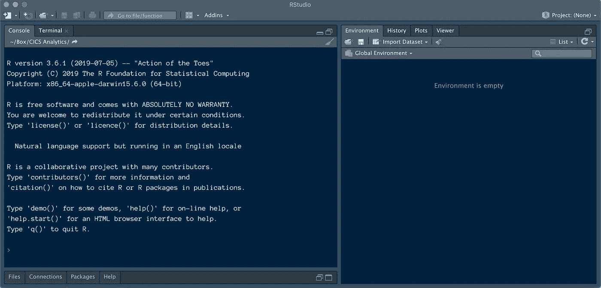

# 被 R 压倒？慢慢开始

> 原文：<https://towardsdatascience.com/overwhelmed-by-r-start-slow-ef5cec78ca26?source=collection_archive---------67----------------------->

## 面向非程序员的 R 命令的第一课


由 minkewink 在 [Pixabay](https://pixabay.com/photos/sloth-costa-rica-puerto-viejo-1879999/) 上拍摄的照片

如果你没有做过大量的编程工作，学习 R 可能会相当令人生畏。

但如果你专注于基础，并通过实践慢慢积累技能，那就更容易了。在这里，我将给出一个简短的教训，告诉你在 r 中可以做的最基本的事情。

*这篇文章改编自我的在线课程* [，所以你需要学习 R](https://www.udemy.com/course/so-you-need-to-learn-r/?couponCode=E01B6507F68E1467FCF4) *。它假设你已经安装了一个*[*r studio*](https://rstudio.com/products/rstudio/download/)*的副本，对个人来说是免费的。*

让我们从如何在 R 中输入命令的基础开始，告诉 R 我们想要做什么。这叫做给 R 一个*表达式*。

## 做一些数学

如果您打开一个 RStudio 会话，您将看到一个控制台，其中有一些介绍性文本和一个提示(小的 **>** 符号):



RStudio。图片作者。

您可以在提示符后键入命令，在您按下 Return 或 Enter 键后，R 将会对它们进行评估；这意味着它将解释它们的含义，并试图计算出某种结果。

首先，让我们把 R 作为一个美化了的科学计算器。输入这些命令并按 Enter 键以获得一些输出:

```
1 + 2
3 - 1
```

所以 R 理解数字和常见的数学运算符。这包括带星号*的乘法和带正斜杠/的除法。

```
2 * 6
6 / 3
```

您可以使用插入符号^ (shift-6)来计算幂，例如计算四的平方。你也可以做负数。

```
4 ^ 2
4 ^ -2
```

## 数字

r 理解十进制记数法(是 a .还是 a，取决于你的国家；r 在这方面通常很聪明)。但是我们不在大数字中使用逗号或其他千位分隔符:那会给我们一个错误。

```
1.2345 + 1 
12,345 + 1
```

## 圆括号

r 也理解并尊重*操作顺序。*乘方先于乘法，乘法先于加法，依此类推。是的，你必须重温高中数学的记忆。对于同一级别内的操作，R 从左到右工作。

```
1 + 2 * 3
4 / 2 / 8
```

您可以用括号修改这个顺序，就像您在任何其他
数学上下文中一样。如果你想让一加二先求值，你把它放在括号里，得到一个完全不同的答案:

```
(1 + 2) * 3
4 / (2 / 8)
```

我们也可以用括号来定义分数。这在某些情况下真的很重要。例如，如果你想求一个数的根呢？根实际上是分数幂。所以不要…

```
4 ^ 2
```

我们想反过来，这样我们从 16 开始，然后求平方根。

```
16 ^ 1 / 2
```

但是我们实际上*做错了*:上面的命令不会按照我们想要的顺序进行计算，因为 R 会先取插入符号——意思是先取幂——这意味着这实际上是 16 的 1 次方，然后除以 2。

但是我们想求平方根。我们需要把分数放在括号里。然后我们得到 16 的正确根是 4(不是 8)。

```
16 ^ (1 / 2)
```

还要注意，在我的例子中，我在 r 中留出了符号。这两个命令产生相同的结果:

```
3^4/2+(1/2)
3 ^ 4 / 2 + (1 / 2)
```

但是第二种可能更容易阅读。

## 一个例子

让我们用一个稍微更实用的例子来结束这一部分。我们可以做一道几何题，比如求球体的体积。公式是圆周率的三分之四乘以半径的立方:

> v = 4/3⨉π⨉r

使用近似圆周率和半径 100，我们可以在 R 中输入如下内容:

```
4 / 3 * 3.14 * 100 ^ 3
```

r 也碰巧将单词 *pi* 理解为一个特殊符号，所以我们可以用它来代替，得到一个更准确的答案:

```
pi
4/3 * pi * 100 ^ 3
```

现在，给你一个小练习，反向计算:从体积 100 开始，确定半径是多少。

这并不难，是吗？现在你明白 R 是如何解释简单语句的了。接下来，您可以开始考虑在变量中存储值，以及如何使用它们。

*Jasper McChesney 是一名高级数据分析师，拥有生物科学和数据可视化方面的背景。他曾在非营利组织、人力资源和高等教育部门工作过。他在马萨诸塞大学教授 R 课程，并在 Udemy 网上授课。*

[](https://www.udemy.com/course/so-you-need-to-learn-r/?couponCode=E01B6507F68E1467FCF4) [## 所以你需要学习 R

### 所以你需要学习 r，但你不是程序员。不要惊慌。在本课程中，我将带您参观…

www.udemy.com](https://www.udemy.com/course/so-you-need-to-learn-r/?couponCode=E01B6507F68E1467FCF4)