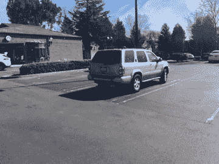
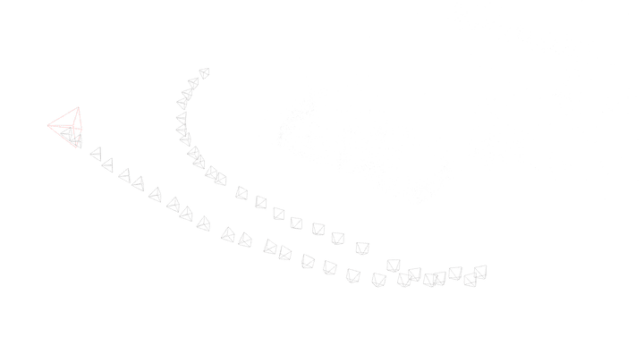
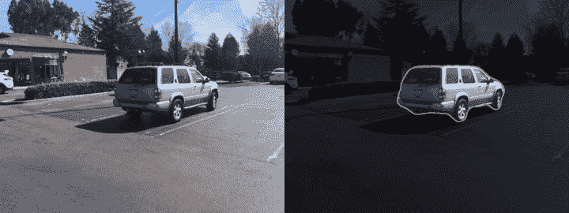
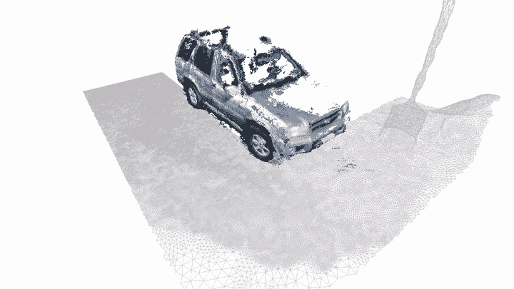
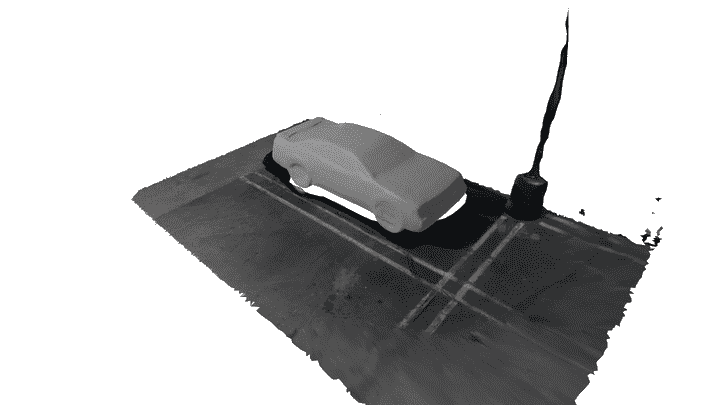
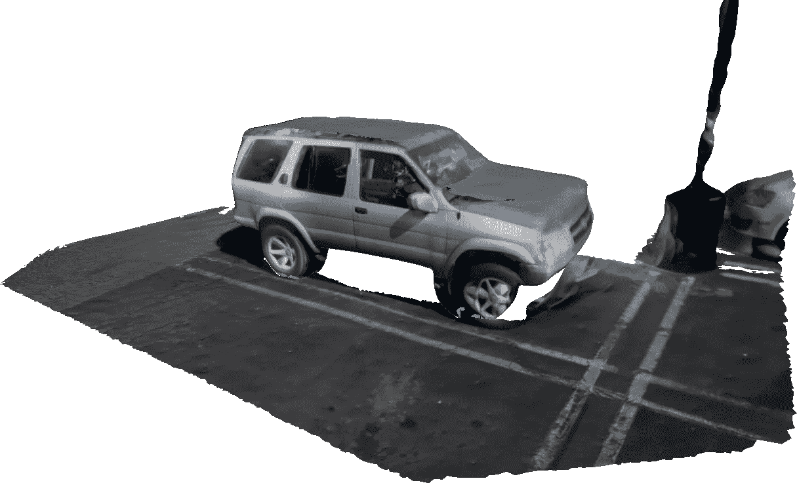

# 覆盖现实

> 原文：<https://towardsdatascience.com/overwriting-reality-7a0631728997?source=collection_archive---------35----------------------->

## 为引人注目的 AR 内容整合已有经验

增强现实(AR)体验的一个关键部分是数字内容的质量和丰富程度。在[之前的一篇](/the-future-of-mapping-is-learned-e13e93c03e22)文章中，我们探索了构建以对象为中心的通用 3d 模型，使用了传统的基于运动的结构( **SfM** )技术以及用于深度推断和姿态估计的已有架构。这里的重点是采用更好的方法来使用深度学习推断场景深度，以解决难以绘制地图的区域。

在本文中，我们考虑了从真实世界捕获构建高质量模型的一些其他挑战。例如，考虑从以下视频构建表示的任务:

目标；建立一个精确的，视觉上吸引人的日产探路者模型

这里的目标显然是从一个短视频中创建一个吸引人的 3d 车辆模型。传统的流水线相对简单:

1.  估计摄像机的轨迹和它的内在参数
2.  在多视图立体管道中使用该估计轨迹来提供密集的点云
3.  从估计的立体点构建平滑的网格，并使用视频数据对其进行纹理处理

然而，闪亮的金属表面往往对多视图立体方法反应不佳(尽管我们可以利用更复杂的深度恢复方法，如前[所述](/the-future-of-mapping-is-learned-e13e93c03e22))。我们还遇到了另一个更难解决的问题:重建只能和场景覆盖一样好。下图说明了这一点:

从上面的视频轨迹恢复的场景结构。注意车辆后面未被观察到的大片区域。

从上面的重建中可以清楚地看到，相机没有完全探索场景，因此场景是不完整的——几个大区域丢失了。这是我们寻求补救的典型问题；即使没有一个完全探索过的场景，我们也应该能够对目标的几何形状和外观做出有根据的猜测。

这篇文章的核心论点是，我们对正在讨论的对象的内在属性有一个很好的想法，一辆 2000 年初的日产探路者。如果我们有一个现有的 3d 模型，我们可以直接用我们的先验模型替换推断的模型，只要定位、比例和纹理与视频紧密匹配。

我们的第一个任务是将场景分成前景/背景；使用现代[全景分割](https://arxiv.org/abs/1801.00868)方法，这是微不足道的:

场景的每帧实例遮罩。

给定上面的密集(每像素)每帧分割，我们可以轻松地将场景几何和纹理划分为前景和背景组件，如下所示:

稀疏的相机点云，与重建的网格形成对比。(为清晰起见，省略了部分网格)

上面的模型被渲染为背景网格和前景点云。虽然立体点不够密集，无法完全恢复汽车本身，但它们对于提供关于汽车的**汇总统计数据**很有用:位置、方向、比例。

给定背景分割和要插入的新内容的类别、位置和比例，我们如何着手生成实际的 3d 输入？一种方法是利用部分重建的网格并执行形状完成(例如，[ [1](https://arxiv.org/pdf/1805.07290v2.pdf) ，[ [2](https://arxiv.org/pdf/1808.00671v3.pdf) ，[ [3](https://arxiv.org/pdf/1612.00101v2.pdf) )。或者，我们可以从图像中合成完整的 3d 形状，例如[ [1](https://arxiv.org/pdf/1901.05103.pdf) 、[ [2](https://arxiv.org/pdf/1711.10669v1.pdf) 、[ [3](https://arxiv.org/pdf/1812.03828v2.pdf) 、[ [4](https://arxiv.org/pdf/1906.06543v3.pdf) 以获得清晰的概览]。在本文中，我们将探讨后者。

在这种情况下，形状合成是从 2d 图像推断完全 3d 结构。作为一个例子， [IM-NET](https://arxiv.org/abs/1812.02822) 是一种用于生成形状建模的学习隐式场方法，其对于单视图 3d 重建特别有用。下面的动画展示了形状生成模块 IM-GAN 的示例:

IM-GAN 的样车模型。注意多样性和质量。

通过将估计的比例、平移和旋转应用于来自网络的采样 3d 输出，我们可以将合成的内容直接插入到场景中，如上所示。

使用来自单视图重建(SVR)模块对来自我们数据集的分割图像的预测输出，我们可以产生精确平滑的合成模型(合成模型与估计位置和比例的融合),这是我们对象的近似。然后使用原始视频中的图像进行纹理处理:

IM-SVR 的预测输出，使用原始视频图像进行纹理处理。未观察到/观察不到的组件以灰色呈现。

尽管上面有一些可见的伪像(车辆的车轮与估计的模型不完全匹配，并且由于可见性问题，一些区域没有纹理)，但结果是令人信服的——我们不需要为我们(先验地)非常了解的对象建立繁重的数据收集例程。对于以可扩展的方式为已知对象生成准确、相关的模型，这是一种很有前途的方法。