# 2020 年牛津(真实)农业会议

> 原文：<https://towardsdatascience.com/oxford-real-farming-conference-2020-28f48bd47bda?source=collection_archive---------37----------------------->

## NLP:3，8K tweets 的情感分析、单词嵌入和主题建模

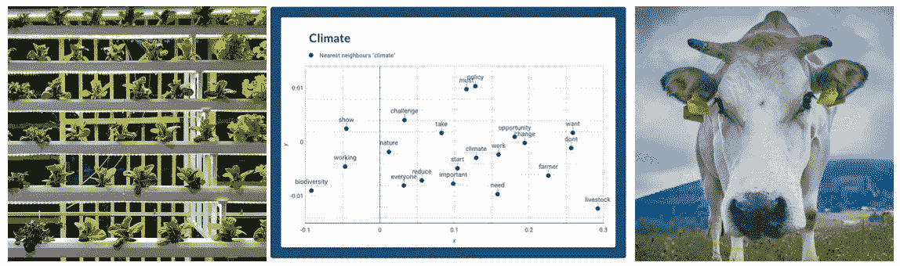

# 介绍

上周，1 月 7 日至 9 日，牛津主办了历史悠久、传统而又务实的 [**牛津农业会议**](https://www.ofc.org.uk/)**【OFC】**及其解药 [**牛津真正的农业会议**](https://orfc.org.uk/)**【ORFC】**。两者都旨在将农业和食品部门的参与者联系起来，以应对当今农业的挑战。

过去三个月，我在世界可持续发展工商理事会为即将发表的论文“蛋白质途径:通过商业创新加速可持续食品体系转型”工作，该论文将在 2020 年达沃斯世界经济论坛上发布，我发现有必要看看该领域的最新讨论。

OFC 和 ORFC 为我提供了一个独特的机会。这些会议讨论了英国以及世界在农业方面面临的诸多挑战:应对粮食安全的必要性、保护自然生态系统的责任以及减少温室气体排放的必要性。

本文的目的是总结在 OFC 和 ORFC 期间发生的讨论，并获得英国农业食品部门最突出的参与者的概况。

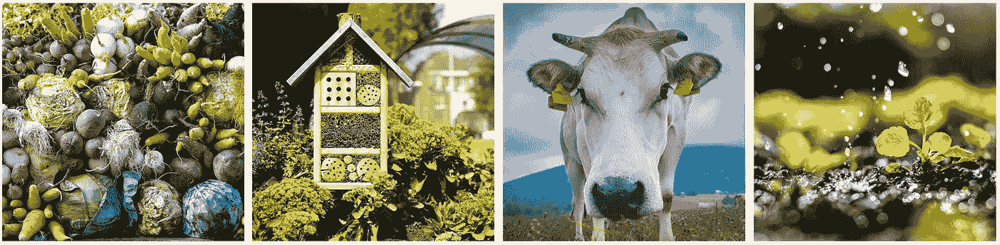

粮农组织[拍摄的图片](https://www.instagram.com/fao/)

# 数据和方法

这篇博文的数据是使用 Twitter API 收集的。OFC 于 1 月 7 日至 9 日举行，ORFC 于 1 月 8 日至 9 日举行。我提前 5 天(2 日)开始收集推文，并在会议结束后一天(10 日)停止收集。总共记录了 3671 条推文，使用的标签是#OFC20、#OFC2020、#ORFC2020。

一旦收集了推文，我就使用自然语言处理(NLP)技术，即**情感分析、词语嵌入**和**主题建模**。

# 推文分析

以下图表说明了为更好地理解牛津(Real)农业会议的讨论而进行的分析。

菜单如下所示:

*   **探索性数据分析:**每日和每小时的推文频率，按推文数量排名前 10 的推文，按点赞、转发和回复数量排名前 10 的推文。
*   **情绪分析:**每日情绪得分，前 5 条最正面推文，前 5 条最负面推文
*   **语义分析:**前 10 个单词，前 10 个标签，与“耕作”、“农业”和“食品”最接近的单词，推文中的主题

## 探索性数据分析

下面的线形图显示了从 OFC 和 ORFC 2020 开始前一周到两场会议结束后一天每天的推文数量和每小时的平均推文数量。最活跃的一天是 1 月 8 日，ORFC 的第一天和 OFC 的第二天，累积到近 2k 条推文。推文的每小时频率显示两个峰值，第一个在早上，上午 11 点，第二个在下午 3 点。这突出了会议与会者使用 Twitter 直接分享和评论正在进行的会谈。

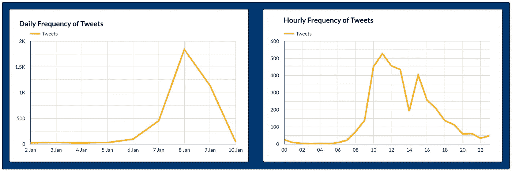

左边的线形图显示了两次会议之前、期间和之后每天的推文数量，右边的线形图显示了每小时的平均推文数量。

看看以#OFC20 和#OFC2020 或#ORFC20 和#ORFC2020 为标签的十个最受欢迎的推特账户，就可以了解事件的主要参与者。下图显示了 OFC 和 ORFC 推特数量最多的十个推特账户。

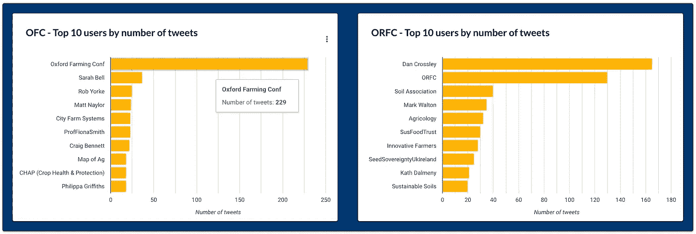

左边的条形图显示了牛津农业会议的推文数量排名靠前的推文，右边的条形图显示了牛津真实农业会议的推文数量排名靠前的推文。推文的时间线是从 2020 年 1 月 2 日到 10 日。

在 OFC，最高职位大多由发人深省的演讲者占据，这与 ORFC 形成鲜明对比，后者由知名慈善机构和农民协会走在前面。

一些最活跃的 OFC 和 ORFC 参与者的快速事实！

莎拉·贝尔(Sarah Bell)是农业数字领导主题的一位有影响力的演讲者，罗布·约克(Rob Yorke)是农业主题的著名评论员，并促进了讨论:“如何资助“农业生态农业”？菲奥娜·史密斯教授是国际贸易教授，并在英国退出欧盟会议后讨论了英国农业食品贸易，马特·奈洛尔是 2017 年至 2020 年 OFC 的主任，也是“agrespect”的创始人，在农村促进和支持多样性、包容性和赋能。

土壤协会、农业生态学、可持续食品信托、创新农民、盖亚基金会(英国和爱尔兰种子主权)或可持续土壤与许多农民合作，并为可持续食品和耕作系统开展活动。食品伦理委员会的现任主任丹·克罗斯利毫无争议地赢得了推特发布数量的冠军。

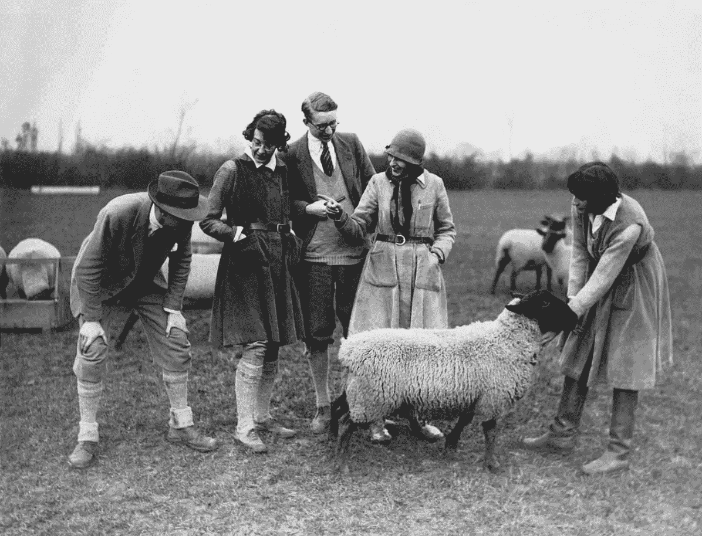

图片来自[土壤协会](https://www.instagram.com/soilassociation/)

下表显示了十条最受欢迎的推文，包括赞和转发。特别看看这些推文，可以深入了解最受欢迎的对话。气候变化、工业化植物汉堡的营养价值、英国农业食品贸易、[泥炭地](https://www.iucn.org/resources/issues-briefs/peatlands-and-climate-change)燃烧、种族主义、[农林](https://www.soilassociation.org/our-campaigns/agroforestry/what-is-agroforestry/)、[农业生态](https://www.soilassociation.org/what-we-do/better-food-for-all/transforming-the-way-we-all-farm/an-introduction-to-agroecology/)以及[牲畜对土壤肥力](http://www.regenerateland.com/why-livestock-are-necessary-for-food-production-to-be-sustainable/)是热门推文中的主要话题。

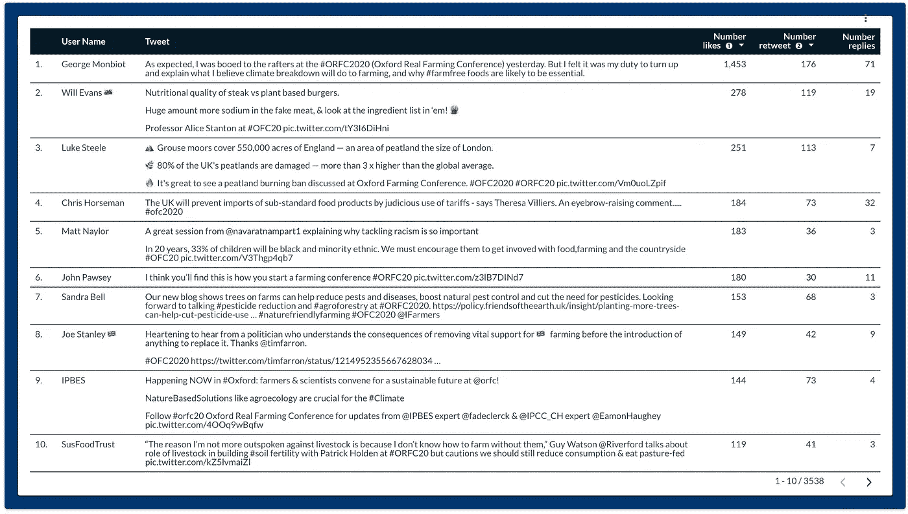

该表显示了当时最受欢迎的推文(按点赞数、转发数)。请点击此链接进行交互式可视化。

同样有趣的是查看回复最多的推文。与上面的相比，这些推文显示了哪些话题引起了主要的讨论和辩论。

仔细看看内容，可以发现严肃的问题和有趣的评论很好地结合在一起！你想知道“如何开始一个农业会议”的答案是什么吗？!"？如果有，那就在这里[看一下](https://twitter.com/hanslope/status/1214845611155038210?s=20)！

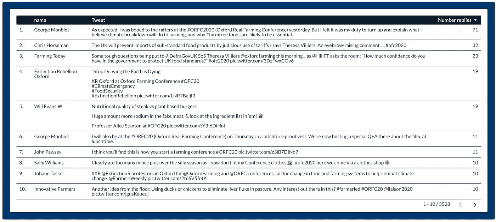

下表显示了当时最受欢迎的推文(根据回复数量)。请点击此链接进行交互式可视化。

## 情感分析

这种技术用于发现文本中表达的潜在情绪(积极、中性、消极)。已经为这项任务开发了几种工具。在这里，我使用了 VADER 图书馆，它是专门为理解社交媒体上表达的情绪而开发的。 [Parul Pandey](https://medium.com/u/7053de462a28?source=post_page-----28f48bd47bda--------------------------------) [文章](https://medium.com/analytics-vidhya/simplifying-social-media-sentiment-analysis-using-vader-in-python-f9e6ec6fc52f)或 [GitHub 资源库](https://github.com/cjhutto/vaderSentiment)是更好地了解 VADER 的绝佳资源。

下面的线形图显示了 OFC 和 ORFC 的平均情绪，其中+1 表示非常积极，-1 表示非常消极。

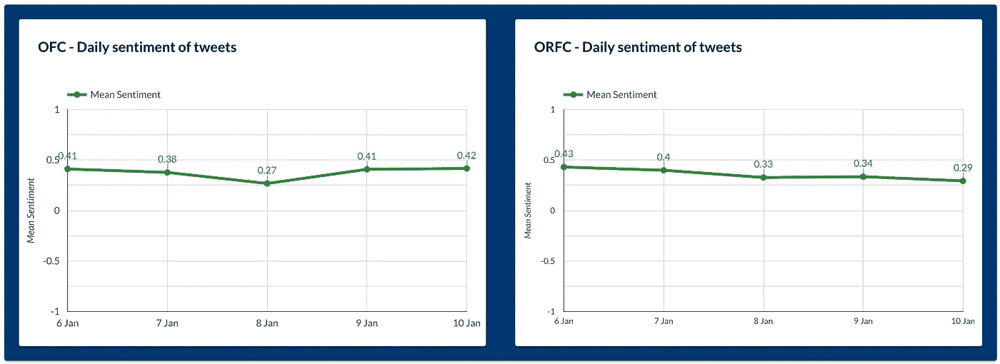

左边的线形图显示了 OFC 每天的平均情绪，右边的线形图显示了 ORFC 每天的平均情绪。

在会议开始的前一天，人们对会议的看法相对积极，但在会议开始后，这种看法略有下降。虽然 OFC 情绪在会议结束时再次上升，但 ORFC 情绪继续下降。

看起来 OFC 最终比 ORFC 发出了更加积极的信号！

如果你想知道这两次会议上最积极和最消极的推文是什么，看看下表吧！

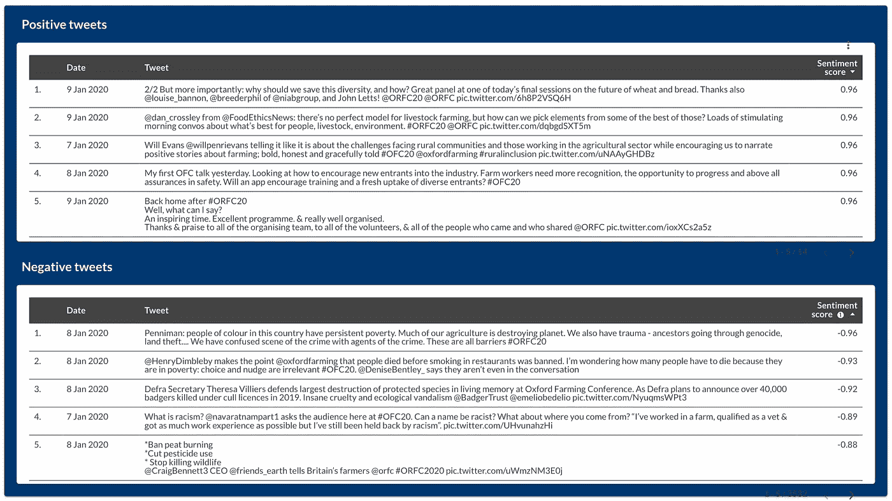

这些表格显示了 OFC 和 ORFC 2020 年最积极和最消极的五条推文。

## 语义分析

为了从 tweets 中获得更细粒度的文本理解，我使用来自 [gensim 库](https://radimrehurek.com/gensim/models/word2vec.html)的 Word2Vec 模型创建了单词嵌入。这种技术可以很方便地找出哪些单词彼此关系更密切。对于 Word2Vec 模型背后的数学原理，请看一下[托马斯·米科洛夫团队](https://arxiv.org/pdf/1301.3781.pdf)的原始研究论文。或者你可能更喜欢[卡维塔·加内桑](https://medium.com/free-code-camp/how-to-get-started-with-word2vec-and-then-how-to-make-it-work-d0a2fca9dad3)的更简化的文章或者[维沙尔·库马尔](https://medium.com/u/2390882c92aa?source=post_page-----28f48bd47bda--------------------------------)的[精彩应用](/welcome-to-the-forest-london-borough-of-culture-2019-twitter-analysis-9ea25cf4f033?source=---------5------------------)。

但首先，让我们来看看最流行的词和标签在推文中的出现频率。

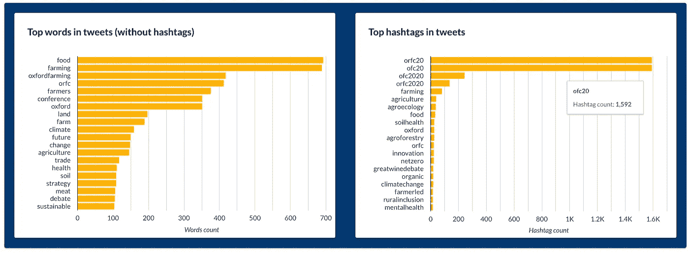

左边的线形图显示了 OFC 每天的平均情绪，右边的线形图显示了 ORFC 每天的平均情绪。

有趣的词是*未来、变化和战略，*指出农业系统需要规划和适应明天的气候。有趣的标签有“*农业生态学”、“土壤健康”和“农林学”，*以及*“农场化”、“农村包容”和“精神健康”。*第一组代表促进可持续农业的耕作方法，例如保护自然资源和确保粮食安全。第二组确定了当今农业系统中人们面临的主要挑战:精神压力和排斥。

**词语嵌入**

下面的四个散点图显示了与“*牲畜”、“土壤”、“气候”和“生物多样性”*实体更密切相关的词。

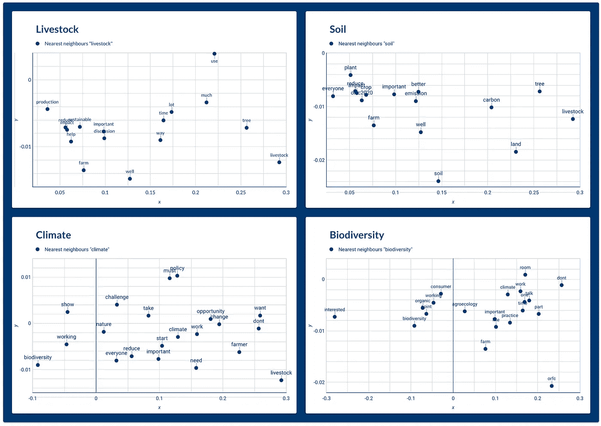

这四张图显示了与关键词牲畜、土壤、气候和生物多样性相关的最近的词(最近的邻居)。

**牲畜**

有意思的是“*养畜*”被收为“*助养*”、“*减养*”、“*影响*”、*、*、*可持续*”，即指“重要的*”、*、*讨论“*围绕着养畜*、*生产的部门。更具体地说，对于这个问题:**有哪些可能的可持续措施可以用来帮助畜牧业减少排放？**毫不奇怪，饲料质量、饲料添加剂、动物健康、厌氧消化器或放牧管理等词也与*家畜*相近，因为这些实体说明了农业食品专家提到的缓解选项。

*树*也接近于*“牲畜】、*并指向在 ORFC 讨论**森林的会议**。这种耕作方式将树木和牧场整合成一个单一的畜牧系统，有利于减缓气候变化、动物福利和饲料供应。

**土壤**

“*土*”显示与“*畜*”有一些相似的词语。这里重要的是“*碳*一词，即可能指 [**土壤固碳**](https://ec.europa.eu/jrc/en/science-update/how-soil-organic-matter-composition-affects-carbon-sequestration) 。这个想法是通过更好的 T42 土地管理措施，可以显著提高土壤质量和土壤吸收有机碳的能力。

**气候**

看着密切相关的实体为“*气候*”、“*必须*”、“*政策*”、“*人人*”和“*工作*”有趣地指出。也许你正在思考格里塔·图恩伯格在 2019 年 9 月美国国会呼吁采取行动应对气候变化时所说的话:“你必须采取行动。你必须做不可能的事。”。或者是关于***【每个人*【行动**、协作*工作*“应对气候变化的需要”*政策、*企业领导的需要**、可持续发展的农民和负责任的消费者**。

**生物多样性**

重要的是，与“*生物多样性*”接近的词有“*农业生态学*”、“*实践*”、“*有机*、*消费者*”。这说明了对有助于**保护自然栖息地**而不是破坏自然栖息地的农业实践的需求，也说明了消费者需要采用[健康、均衡和可持续的饮食](https://www.nutrition.org.uk/nutritionscience/sustainability/sustainability.html?limitstart=0)。

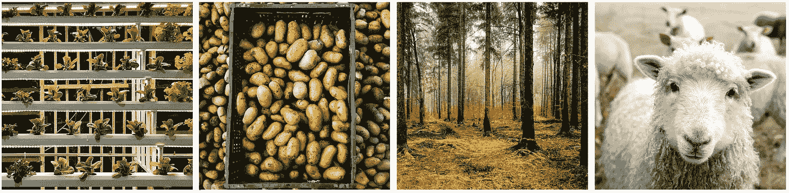

粮农组织[提供的图片](https://www.instagram.com/fao/)

## 结论

给你！虽然我错过了会议、鼓舞人心的演讲和人们，但我还是能瞥见辩论！当然，仍然有巨大的潜力来进一步挖掘推文，但这不会是今天。

你可以在这里找到交互式仪表盘可视化！

感谢阅读！

奥德

Ps:我有兴趣做社交网络分析！如果你碰到了什么好的文章或者 python 教程，请告诉我！

*我是* [*数据和植物学家*](http://www.audevuilli.com) *在* [*垂直未来*](https://www.verticalfuture.co.uk/) *，以前在*[*WBC SD*](https://www.wbcsd.org/)*。理学硕士。在城市分析和智能城市方面，来自 UCL 的 Bartlett* [*伦敦的 CASA*](https://www.ucl.ac.uk/bartlett/casa/) *和 BSc。在食品科学方面来自* [*苏黎世联邦理工学院*](https://ethz.ch/en.html) *。对城市、美食、健康充满热情通过*[*Twitter*](https://twitter.com/audevuilli)*或*[*LinkedIn*](https://www.linkedin.com/in/aude-vuilliomenet-69248711a/)*取得联系。*